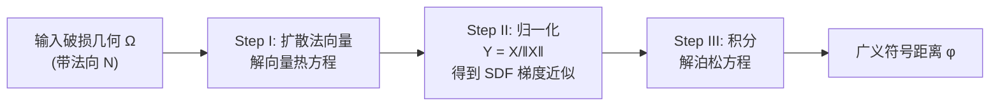

## 一句话总结

本文提出**符号热方法（Signed Heat Method, SHM）**，通过"扩散法向量"而非扩散标量分布，从带有孔洞、噪声、自交等缺陷的破损几何中直接近似计算**广义符号距离函数（GSD）**，既能像广义绕数（GWN）一样鲁棒判定内外，又能提供真正的距离信息，且适用于任意维度与任意空间离散化。

## 研究背景

符号距离函数（SDF）返回查询点到形状边界最近点的距离，并用符号表示该点在形状内部还是外部。它是几何建模、物理仿真、渲染、路径规划、几何学习与计算机视觉等众多算法的基本构件。

然而现实中的几何常因建模或采集误差而存在严重缺陷（孔洞、自交、噪声、方向不一致）。此时"内部/外部"的定义本身就不明确，符号距离也随之失去意义。现有方法各有短板：

- **传统 SDF 算法**假设边界是"完美的"水密描述，依赖良定义的内外来确定符号，对破损几何束手无策。
- **鲁棒的内外判定方法**（如伪法向测试、广义绕数 GWN）虽能处理破损几何，但只给出内外分类或光滑的隐式指示函数，并不提供有用的距离近似。GWN 定义的是一个调和函数而非 SDF。
- **简单地给无符号距离加符号**：除非缝隙极小，否则得到的函数与真实 SDF 差别很大（论文 Figure 6）。
- **波前传播类方法**（快速行进 fast marching）在破损几何上会把方向误差不断向外传播，产生显著伪影。

更关键的是，几乎没有方法能处理**曲面上的破损曲线**，或更一般的**弯曲域上的子流形**的鲁棒符号距离。本文正是要提供"两全其美"的方案：既有内外分类，又有距离信息，还能在任意域上工作。

## 核心方法

作者的出发点是几何距离计算中经典的**热方法（Heat Method）**，但做了一个关键改动：不再扩散一个集中在源点上的标量分布，而是扩散源几何的**法向量**。整个算法只需求解两个稀疏线性系统，分三步：

### 为什么扩散法向量能得到 SDF 梯度

这是全文最核心的洞察。算法第一步求解向量值扩散方程，把源几何 $\Omega$ 的法向 $N$ 向整个域 $M$ 扩散一小段时间 $t>0$：

$$\frac{\mathrm{d}}{\mathrm{d}t}X_t = \Delta^{\nabla} X_t,\quad t>0,\qquad X_0 = N\mu_{\Omega}$$

其中 $\Delta^{\nabla}$ 是联络拉普拉斯算子（connection Laplacian），$\mu_{\Omega}$ 是集中在 $\Omega$ 上的测度。这里依赖微分几何的一个重要事实 [Berline et al. 1992, Thm. 2.30]：**当 $t\to 0$ 时，每个点 $x$ 处的扩散向量 $X_t(x)$ 会平行于最近点 $\bar{x}\in\Omega$ 处法向 $N(\bar{x})$ 沿最短测地线的平行移动结果**。

由于沿测地线的平行移动保持相切性，该向量必然与测地线相切；而沿测地线返回 $\Omega$ 是最快路径，所以它必然平行于（无符号）距离梯度 $\nabla\phi$。又因为扩散的是**带方向的法向量**，符号也是对的。于是归一化 $X_t$ 就得到符号距离梯度的近似：

$$Y_t := X_t / \lVert X_t \rVert$$

这个思路借鉴了 Sharp 等人的**向量热方法（Vector Heat Method, VHM）**利用短时向量扩散计算平行移动的做法，但作者首次认识到它对**符号距离**计算的意义。相对无符号热方法（UHM），SHM 只改了第一步（扩散法向而非标量）；相对 VHM，SHM 改了后三步（把归一化向量积分成距离）。

对破损几何，故事基本不变：扩散会自动**把邻近点的法向平均/插值**到一起，从而在缝隙、孔洞处得到平滑良好的梯度——这正是鲁棒性的来源。

### 从梯度积分出距离

$Y_t$ 一般不是任何 SDF 的精确梯度（因为扩散近似与输入误差），所以作者用最小二乘寻找梯度最接近 $Y_t$ 的函数 $\phi$：

$$\min_{\phi:M\to\mathbb{R}} \int_M \lVert \nabla\phi - Y_t \rVert^2$$

分部积分可知最小值满足泊松方程（解在相差一个常数意义下唯一）：

$$\Delta\phi = \nabla\cdot Y_t \ \text{on}\ M,\qquad \frac{\partial\phi}{\partial n} = n\cdot Y_t \ \text{on}\ \partial M$$

### 边界行为的天然正确性

一个亮点是：与 UHM 不同，SHM **无需任何特殊边界处理**就能得到正确的边界行为（Figure 8）。原因在于 UHM 把向量场取作某个满足零 Dirichlet 或零 Neumann 边界条件的标量热分布的梯度，这样的梯度方向在边界上必然要么纯法向、要么纯切向，都不对；而 SHM 的向量扩散步骤直接在边界处给出最近点法向，恰好等于真实 SDF 的梯度。离散联络拉普拉斯本身就对向量场编码了零 Neumann 条件。

## 技术细节

### 三角网格上的离散化

作者在三角网格上用**基于边的算子**做向量扩散步（便于离散化曲线源），再用标准**基于顶点的算子**做泊松求解（SDF 存储在顶点）：

- **Crouzeix-Raviart（CR）边基函数**：把切向量与复数对应，用复数编码联络拉普拉斯，相比实值版本节省一半存储/带宽（每个 2×2 实块变成一个复数）。
- **边基拉普拉斯 / 质量矩阵 / 联络拉普拉斯**：给出显式的 cotangent 权重表达式；联络拉普拉斯通过给 $L$ 的非对角项乘以编码平行移动的旋转 $r_{ij\to jk}$ 得到，矩阵是 Hermitian 且半正定。
- **源项离散化**：对落在某个三角形内的曲线段 $\gamma$，其对边 $ij$ 初值的贡献是把连续测度 $N\mu_{\gamma}$ 投影到 CR 基上（利用 CR 基正交性，只需沿段做 Hermitian 内积）。经验上省去某个缩放因子 $\varphi_{ij}(m_\gamma)$ 结果更准。

最终离散算法就是解两个稀疏线性系统：向量热方程 $(M+tL^{\nabla})X = X_0$，以及泊松方程 $C\phi = b$。扩散时间取 $t=h^2$（$h$ 为节点平均间距）。

### 可选扩展

- **保持水平集（7.1）**：泊松解只确定到常数平移。可加线性约束让 $\phi$ 在 $\Omega$ 上取常值（解一个鞍点系统），或用软惩罚项。还能同时拟合多个未知取值的部分水平集，对每个连通分量分别约束为常值（Figure 10）。
- **非边界环路与不连续距离（7.2）**：当 $\Omega$ 不围成区域时，$Y_t$ 可能不切向连续、无法被全局连续函数积分。作者改用 $L^1$ 问题，通过基于边的 curl 度量不可积性，用指数权重在不可积处降低惩罚，得到**分段连续**的 SDF。可处理不一致定向的曲线，甚至不可定向域（如 Möbius 带）。
- **距离锐化（7.3）**：把符号距离作为 warm start，用凸优化（推广自 Belyaev & Fayolle 的 ADMM 公式）"锐化"结果，在保持内外分类的同时提升距离精度。

### 适配任意离散化

只要能提供拉普拉斯、联络拉普拉斯、散度这三类稀疏矩阵，SHM 就能用于：**四面体网格**（用 CR 有限元，把曲面处理任务扩展到体域）、**规则网格**（用 Yukawa 势的基本解直接近似 $X_t$，避开求解线性系统，可用 Barnes-Hut 加速）、**多边形网格**、**点云**、**体素化数字表面**。方法在任意维度、任意离散化下都适用。

## 实验结果

作者的关注点不在速度或精度竞赛，而在**鲁棒性与通用性**，但方法在速度精度上依然有竞争力（几十万三角形的网格只需几百毫秒，随网格细化呈线性收敛）。

- **鲁棒性（Figure 17, 23）**：面对显著的拓扑错误、几何错误、方向错误都能"优雅失败"，仍给出合理的距离近似。对非流形、不可定向、仅浸入（非嵌入）的网格开箱即用；配合内蕴 Delaunay 细化还能进一步提升质量。
- **形态学操作（Figure 19, 20, 26）**：可对破损几何做等距偏移、膨胀/腐蚀，把破损、噪声、非流形输入转成封闭、规整、流形的表面与均匀间隔的偏移面——对 3D 打印等下游任务很有用。
- **曲面上的插画（Figure 18, 21）**：可把随手画在曲面上的破损曲线补全成封闭格式，用扩散时间控制补全的圆角/尖角风格（类似 2D 矢量图的 line join）。
- **精度对比（Figure 24, 25）**：与无符号热方法（UHM）相比略慢但略准；比凸优化方法 BF 精度稍低，但**快约一个数量级**（BF 只能算无符号距离）。在 44 个网格的封闭曲线基准上呈近似线性收敛。
- **破损曲线的端到端对比（9.5.3, Figure 28）**：与"修复几何→算无符号距离→加符号"的流水线相比（用绕数轮廓化 + MMP 精确距离），后者对轮廓化误差极其敏感，在 220 个样例中约 12% 出现 >50% 面积误分类；SHM 通过在全域平均法向获得更强鲁棒性，平均距离精度约高 3 倍（$L^2$ 误差 0.04 vs 0.11），且整体流水线成本约低 10 倍。
- **表面补全（Figure 27）**：相比 GWN 用鞍形调和补片填洞（法向连续性差），向量扩散直接插值观测法向，补全的孔洞更贴合周围曲率、更合理。

## 贡献与局限

**贡献**：
- 提出符号热方法，首次把"扩散法向量"与短时向量扩散的平行移动理论用于符号距离计算，从破损几何直接得到广义符号距离——既有内外分类又有距离。
- 提供了经典距离算法所不具备的能力：同时拟合多个水平集、对不围成区域的几何定义距离、混合有符号与无符号距离。
- 方法无关于具体离散化与维度，可用于三角网格、四面体网格、点云、多边形网格、体素表面、规则网格等，并天然处理非流形、不可定向、自交的输入。
- 边界条件天然正确，无需 UHM 那样的特殊启发式处理。

**局限**：
- 与所有热方法一样，扩散时间不能任意取小：当 $t\to 0$ 时经验上 GSD 表现得像图距离（graph distance），实践中取 $t=h^2$ 稳定给出准确近似。
- 处理拓扑非边界与不可定向曲线的 $L^1$ 问题更昂贵，且小的逐边不连续的缓解仍待更细致研究。
- 作为基于有限元（FEM）的方法，继承了 FEM 的通病：需要高质量网格、需求解可能很大的全局耦合系统（这对密集查询有良好的摊销性能，但对孤立点查询不如输出敏感型算法高效）。
- 假设输入方向大体一致；虽对方向误差较鲁棒，但探索扩散更一般的线场以摆脱法向定向、以及引入距离值的"置信度"概念，都是未来方向。

## 延伸思考

这项工作把"用短时热扩散近似几何量"的范式从标量（UHM）、切向量（VHM）推进到了**带方向的法向量**，并借此打通了"鲁棒内外判定"与"真实距离"之间长期存在的鸿沟。其变分、PDE 化的表述带来的通用性尤为可贵——同一套算子接口即可覆盖几乎所有几何数据结构。作者后续的 Points as Tori (PAT) 工作正是针对 SHM 需要求解全局系统、需离散化域这一局限，提出了更局部化、可逐点查询的替代方案，二者形成互补：SHM 在大孔洞/强噪声下"平均更好看"，PAT 在稀疏点云上更合理。对于需要对破损、非水密几何做距离查询的建模、仿真、重建与几何学习管线，SHM 提供了一个鲁棒、通用且易于集成的基础工具。
