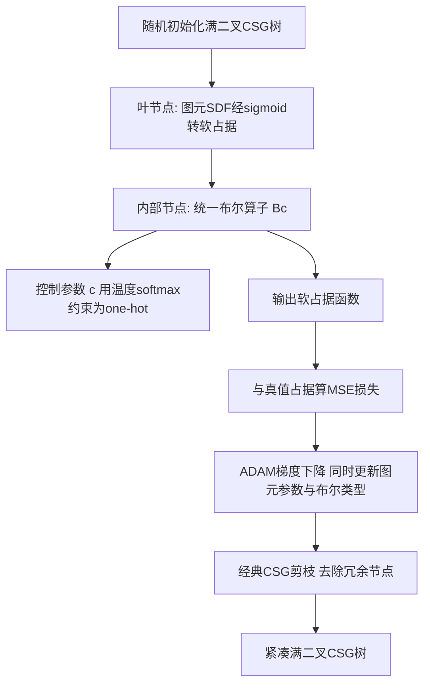

## 一句话总结

借助模糊逻辑（fuzzy logic）设计出一个既对输入连续可微、又对"布尔操作类型"本身可微的统一布尔算子，从而让 CSG（构造实体几何）中的图元参数与布尔操作可以一起用梯度下降连续优化。

## 研究背景

CSG 是计算机图形学中经典的实体建模范式：用一组参数化图元（球、立方体、圆柱等），通过交、并、差三种布尔操作组合成复杂形状，得到精确且层级化的表示。它的逆问题——给定一个 3D 模型，反求出对应的 CSG 树——一直很难，因为优化同时包含离散变量（每个内部节点的布尔操作类型、图元数量与类型）和连续变量（图元的半径、宽度等参数），而且自由度随树的复杂度指数增长，优化地形极其崎岖。

传统做法要么直接用进化算法去搜索离散空间，要么把部分离散变量松弛为连续变量以缩小搜索空间。常见的松弛是把"选哪种图元"放到一个连续参数化的图元族（如二次曲面）上优化，但这只松弛了图元类型，布尔操作类型与图元数量仍是离散的，因此这类方法通常预先固定整棵树的结构，只优化图元参数。也有工作用暴力枚举所有布尔组合，但组合数随树深指数爆炸，扩展性差。

传统 CSG 用 $\min$、$\max$ 算子实现交并操作，但它们在两输入相等处梯度病态、且对"操作类型"的选择是离散的，这正是阻碍连续优化的根源。作者要造的，是一个同时解决"输出可微"和"对操作类型可微"两个问题的统一算子。

## 方法

### 整体框架

作者把用软占据函数（soft occupancy function）表示的实体形状看作一个模糊集 $X=(P,f_X)$，其中 $f_X:P\to[0,1]$ 表示点落在形状内部的概率。这样就能把模糊逻辑里的布尔操作直接搬到 CSG 上。整体分三步：先为交、并、补各挑选合适的、可微且梯度不消失的模糊算子；再用四面体重心插值把它们统一成一个对操作类型可微的算子 $B_c$；最后把这个统一算子装进一棵满二叉 CSG 树，用梯度下降同时优化布尔节点和图元参数。

### 关键设计

模糊逻辑里，有效的交（t-norm $\top$）、并（t-conorm $\bot$）、补（complement $C$）算子需满足边界条件、单调性、交换律、结合律等公理，以保证当占据值为二值时退化回经典布尔逻辑。作者出于"可微且梯度不消失"的目标，选用了乘积模糊逻辑（product fuzzy logic）：

$$f_{X\cap Y}=\top(x,y)=xy,\qquad f_{X\cup Y}=\bot(x,y)=x+y-xy,\qquad f_{\neg X}=C(x)=1-x,$$

其中 $x=f_X(p)$、$y=f_Y(p)\in[0,1]$。它们满足全部公理，也满足德摩根律，从而差集可导出为

$$f_{X\setminus Y}=x-xy,\qquad f_{Y\setminus X}=y-xy.$$

相比 Gödel 的 $\min/\max$ 在奇点处不可微、且在一侧输入较大时梯度为零（导致图元在优化中"卡住不动"），乘积逻辑对 $x$、$y$ 都保持非零梯度，避免了能量地形上的平台区。

统一算子的核心是把四种操作（交、并、两种差）当作一个四面体的四个顶点，用重心插值得到

$$B_c(x,y)=(c_1+c_2)\,x+(c_1+c_3)\,y+(c_0-c_1-c_2-c_3)\,xy,$$

其中重心坐标满足 $0\le c_i\le 1$ 且 $c_0+c_1+c_2+c_3=1$。当 $c$ 取 one-hot 时，$B_c$ 精确复现四种乘积逻辑操作（如 $B_{1,0,0,0}=xy=f_{X\cap Y}$）。这样 $B_c$ 对输入 $x,y$ 和控制参数 $c_i$ 都天然连续可微；而且因为沿四面体棱的插值等价于一维凸组合，插值是单调的，避免了朴素双线性插值引入的额外局部极小（双线性会强行让 $f_{X\cup Y},f_{Y\setminus X}$ 的均值等于 $f_{X\cap Y},f_{X\setminus Y}$ 的均值，从而破坏单调性）。

在逆 CSG 中，方法从一棵随机初始化的满二叉树出发，用 ADAM 最小化输出占据与真值占据的均方误差；为让每个布尔节点最终收敛到某一种确定操作，用带温度的 softmax 约束控制参数趋向 one-hot。优化后再用经典 CSG 剪枝去掉冗余节点得到紧凑树。方法与图元族无关，可用球、平面、二次曲面，甚至微型神经隐式网络作为图元。此外，若图元本身是二值占据就得到经典的锐利结果，若是软占据则输出光滑有机形状，软硬程度可在图元级用 sigmoid 温度参数 $t$ 自适应控制——同一框架既能建模带锐边的机械件，也能建模光滑有机体。

## 实验结果

作者展示了三类应用：单形状逆 CSG 拟合（可从 128 个图元剪枝到 13 个）、光滑形状建模（与 Quilez 的软 min/max 视觉上不可区分，但因为算子在占据函数上封闭，避免了"漂浮孤岛"等因输入输出不一致产生的伪影），以及改进 CSG 生成模型。在生成模型实验中，作者把 Ren 等人（2021）超网络解码器中预定义布尔操作的 CSG 树结构换成本文的模糊布尔树，在 ShapeNet 上评测。结果如下：

| 方法 | MSE | 准确率 | F-score | 总节点数 |
| --- | --- | --- | --- | --- |
| Ren et al. 2021 | 0.049 | 0.912 | 0.938 | 256+65792 |
| Ours | 0.018 | 0.982 | 0.978 | 512+511 |

在图元数更少、树更紧凑的情况下，本文方法在均方误差、分类准确率、F-score 三项指标上均更优。此外在单形状拟合对比中，能优化布尔类型的完整方法（蓝）优于固定随机布尔操作的乘积逻辑（绿）与 Gödel 逻辑（红）。

## 亮点与局限

亮点：首次让 CSG 树中每个内部节点的布尔操作类型成为连续可优化变量，把逆 CSG 从"预设结构只调图元"推进到"图元与操作类型联合梯度优化"；借模糊逻辑给出既输出连续函数又对操作类型可微的统一算子，且满足布尔算子公理（作者指出常用的 R-function 违反边界条件，多次与全集求交会退化成近乎空集，本方法则忠实匹配经典布尔行为）；乘积逻辑避免梯度消失，四面体重心插值保证单调、避免多余局部极小；算子在占据函数上封闭，光滑建模无伪影，且与图元族无关。

局限：优化过程中树结构固定不变，拟合虽好但即使剪枝后树仍常偏复杂；一个形状可由无穷多 CSG 树表示，方法只找到其中一棵，不保证是最紧凑的；只评估了对应经典 CSG 的交并差，未纳入更一般的模糊聚合算子；当前实现未做优化，速度较慢，尚未硬件加速到实时。

## 延伸思考

这项工作真正打开的口子，是把"离散决策连续化"的思路从图元类型推广到了操作类型。顺着作者指出的方向，最诱人的一步是让树结构本身也可优化——何时生长、剪枝、旋转节点，若能与本文的可微算子结合，或许能直接优化出既拟合又紧凑（甚至可编辑）的树。引入模糊聚合算子把二元布尔推广到对一组图元的操作，也可能天然地承担"选择用哪些图元"的功能，把图元数量这个离散维度也松弛掉。更宽的想象是模糊逻辑与图形学其它场景（图像/体积合成）的联系——统一可微算子的构造范式或许不止适用于 CSG。
