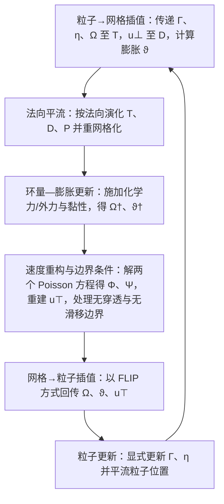

## 一句话总结

提出首个面向薄膜（肥皂膜/气泡）的物理涡量流体模型：把薄膜切向速度分解为环量（circulation）与膨胀（dilatation）两个分量，用混合粒子—网格方法演化，从而在形变曲面上生成并保持多尺度级联涡结构，同时统一整合表面活性剂、厚度与外力等三维物理交互。

## 研究背景

薄膜流体（带边界的膜、肥皂泡）的动力学通常由降维后的三维 Navier-Stokes 方程刻画，其最迷人的视觉特征是形变曲面上级联的涡结构，以及由厚度演化产生的干涉色彩，且这些都与重力、Marangoni 力、表面活性剂动力学、固体边界等三维环境强耦合。

已有的第一性原理薄膜求解器（网格法、粒子法）大多基于速度形式，对数值黏性敏感，难以在近乎无黏、强涡量的薄膜上准确表示、捕捉并演化多尺度涡结构。经典涡方法（涡粒子、涡丝、涡片等）主要针对体积流；而基于微分几何的曲面环量守恒求解器更像是投影到流形上的二维不可压 Navier-Stokes 求解器，无法处理表面活性剂、厚度、形变与外力协同演化的完整三维薄膜系统。本文的目标即是在切向涡量动力学框架下弥合这一空缺。

## 方法

整体框架：从润滑近似下的三维 Navier-Stokes 方程出发，采用切向—法向解耦；核心创新在于对切向方程的处理——基于二维流形上的 Helmholtz-Hodge 分解，将切向速度 $$u_{\top} = \nabla_s \Phi + J \nabla_s \Psi + h$$ 分解为无旋分量（对应膨胀 $$\vartheta = \nabla_s \cdot u_{\top}$$）与旋转分量（对应环量 $$\Omega$$），并忽略单连通域上的谐波分量 $$h$$。

关键设计：

- 环量 $$\Omega$$ 作为主追踪变量。它是速度沿闭合路径的线积分，$$\Omega = \oint_{\varphi} u \cdot dl = \iint_{S_\varphi} (\nabla_s \cdot J u_{\top}) \cdot dS$$，借助 Stokes 定理与涡量直接相关，从而无需在流形上定义 curl 算子即可保持涡量、抵抗数值扩散。其演化满足 $$\frac{D\Omega}{Dt} = -\frac{2RT}{\rho} \oint_{\varphi} \frac{\nabla_s \Gamma}{\eta} \cdot dl + \nu \nabla_s^2 \Omega$$，无黏且无表面活性剂梯度时退化为 Kelvin 环量定理。
- 膨胀 $$\vartheta$$ 补全无旋（散度）分量。薄膜虽建模为不可压流体，但从切向域看因可增厚/变薄而表现出可压缩性，故散度分量非零。对速度方程取散度得到膨胀的演化方程，并将其与表面活性剂 $$\frac{D\Gamma}{Dt} = -\Gamma \vartheta$$、厚度 $$\frac{D\eta}{Dt} = -\eta \vartheta$$ 动力学耦合。
- 速度重构。由 $$\Omega$$ 与 $$\vartheta$$ 求解两个联立 Poisson 方程 $$\nabla_s^2 \Phi = \nabla_s \cdot u_{\top}$$、$$\nabla_s^2 \Psi = -\nabla_s \cdot J u_{\top}$$，再经分解式重建完整三维切向速度。
- 涡粒子在网格上（vortex particle-on-mesh）的离散：几何由拉格朗日粒子 $$P$$、三角网格 $$T$$ 及其对偶（Voronoi）网格 $$D$$ 三者组成。粒子携带并平流环量、速度、表面活性剂浓度与厚度；三角网格顶点存储 $$\Omega$$ 与 $$\vartheta$$ 并作为施加化学力/外力的稳定计算模板；对偶网格顶点存储切向速度 $$u_{\top}$$。粒子—网格传递采用 SPH 核插值，网格到粒子采用 FLIP 式传递环量增量以减少数值耗散。
- 时间积分为每步六个顺序阶段。

- 边界条件：无穿透 Neumann 边界通过令 $$n \cdot \nabla_s \Phi = 0$$、$$n \cdot J \nabla_s \Psi = 0$$ 实现；无滑移 Dirichlet 边界采用浸入边界法，通过调整边上的速度分量 $$v_{ij}$$、$$w_{ij}$$ 一并修正环量与膨胀。
- 非流形扩展：将泡沫视为多个流形分量的集合，各分量分别建立网格、对偶网格与粒子组，并通过概率性粒子迁移实现共享面上的物质交换。

## 实验结果

在验证实验中，重力排液（gravity drainage）达到的稳态厚度剖面与解析解高度吻合，并复现牛顿干涉条纹；卡门涡街实验验证了固体耦合处无滑移边界的正确性。与已有薄膜/涡方法的对比在同一底层网格（或匹配自由度）下进行，主要计时如下：

| 场景（方法） | 顶点数 V | 面数 F | 粒子数 N | 计算耗时 |
| --- | --- | --- | --- | --- |
| Taylor vortex（Ishida 2020） | 4225 | 8192 | - | 96 s（5 秒动画） |
| Taylor vortex（Deng 2022） | - | - | 4096E+84100L | 195 s（5 秒动画） |
| Taylor vortex（本文） | 4225 | 8192 | 81920 | 325 s（5 秒动画） |
| 对比 Azencot 2014（匹配分辨率） | 4225 | 8192 | - | 0.19 s/步 |
| 对比 Azencot 2014（顶点数≈本文粒子数） | 66049 | 131072 | - | 16.6 s/步 |
| 对比 Azencot 2014（本文） | 4225 | 8192 | 81920 | 0.65 s/步 |

在 Taylor 涡分离与 Leapfrog 保涡测试中，只有本文方法能成功让两涡分离、并更长时间保持点涡结构；与涡量—流函数求解器相比，在相同分辨率下视觉效果更优，在相当自由度下计算效率更高。系统还展示了形变半球泡、巨型气泡、形变矩形膜、Rayleigh-Taylor 不稳定性、搅动棒、水黾机器人、双气泡等多个高分辨率算例（最大约 327 万粒子）。

## 亮点与局限

亮点：

- 首个面向形变薄膜、能生成并演化级联涡结构的物理涡量流体模型。
- 以环量与膨胀作为切向速度的新表示，规避了流形 curl 算子，天然抵抗涡量的数值扩散。
- 膨胀动力学模型是关键创新，使得在切向涡量框架下能表现牛顿干涉条纹、Rayleigh-Taylor 不稳定等此前环量守恒模型无法实现的三维力驱动现象。

局限：

- 难以处理薄膜的拓扑演化（合并/破裂），需改用更灵活的几何表示并重新推导演化模型。
- 固体边界仅采用运动学条件，尚未实现薄膜涡量与轻质物体的双向耦合。
- 数值稳定性依赖高网格质量与大量粒子，以避免顶点厚度插值后归零。
- 依赖三维欧氏距离与零谐波分量假设，仅适用于曲率较小的单连通域。

## 延伸思考

将切向流拆成"旋转（环量）+ 散度（膨胀）"的思路，本质上是把不可压体积流的涡量方法迁移到"可在切向表现压缩性"的余维一流形上，膨胀恰好承接了厚度与表面活性剂的质量输运，这也是它区别于纯二维不可压曲面求解器的根本。若要突破单连通与小曲率限制，谐波分量的动力学与曲面上精确测地距离的引入会是关键，也可能进一步与点集曲面等自适应几何表示结合来支持拓扑变化。粒子—网格混合与 FLIP 式回传在这里同时服务于"保涡"和"低耗散物质输运"，是该框架在细节表现上的核心机制。
