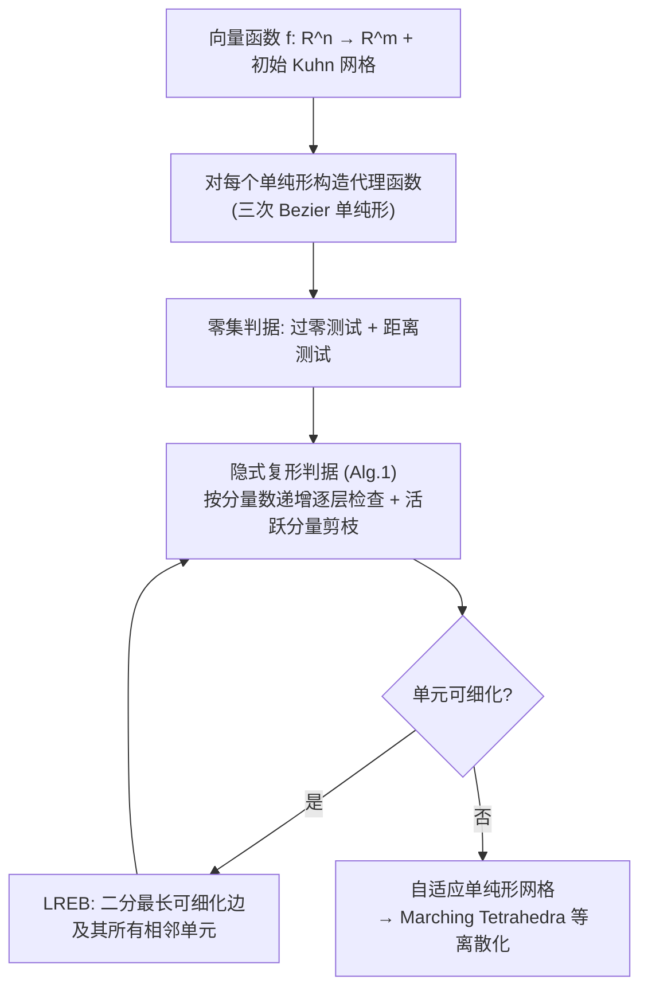

## 一句话总结

给隐式复形（多个隐式曲面的排布、CSG、材质界面、曲线网络等由向量函数定义的形状）生成自适应单纯形网格，关键在于让网格不仅贴合曲面本身，还贴合曲面之间的低维交集（交线、交点），并且不依赖区间分析、可用于任意可查询值与梯度的函数。

## 研究背景

隐式表示在图形学里无处不在：3D 中的光滑流形曲面可写成标量函数 $f:\mathbb{R}^3\to\mathbb{R}$ 的水平集。但很多有用的形状超出了"光滑流形"的范畴——CSG 实体、非流形的曲面网络、多个曲面的交线等——它们需要用向量函数 $f:\mathbb{R}^3\to\mathbb{R}^m$（$m>1$）来定义。作者把这类由向量函数隐式定义的形状统称为**隐式复形（implicit complex）**，它是隐式曲面的推广，能表示非光滑、非流形结构。

要用于下游应用，隐式形状必须被离散化。Marching Cubes、Marching Tetrahedra 等方法都在一张空间网格上工作，网格结构直接决定了性能。理想的网格应当是**自适应**的：只在需要高精度的地方（几何或拓扑非平凡处）才细化。针对隐式曲面的自适应网格生成已被研究得很透，但针对隐式复形的方法很少。

核心难点在于：如何让网格结构准确离散化**多个隐式曲面的交集**。这些交集构成了复形里的低维元素——CSG 的锐边和角、非流形网络的连接图。交集的几何往往比曲面本身更复杂（论文 Fig. 2：两个近乎平坦的曲面，交线却远非平坦）。只贴合曲面的网格要么在交集处分辨率不足，要么为了照顾交集而在别处过度细化。现有能捕获交集的方法要么局限于低次多项式，要么依赖区间分析——而对于一般函数（尤其是神经网络这类黑盒），紧的区间往往难以甚至无法获得。

## 核心方法

方法自顶向下细化一张单纯形网格。整体分三层：先给标量/向量零集设计一对"是否需要细化"的判据（细化判据的构建块），再把这些判据组装成针对各类隐式复形的判据（含"活跃分量"以避免过度细化），最后用一套改良的最长边二分法执行细化。

### 零集的细化判据（第一贡献）

给定函数 $f:\mathbb{R}^n\to\mathbb{R}^m$（$m\in[1,n]$）和一个 $n$-单纯形 $t$，判断是否需要细化以更好离散化零集 $f^{-1}$。沿用隐式曲面的老原则：如果 $t$ 不含任何 $f^{-1}$、或者 $f^{-1}$ 已足够接近离散化，就不需要细化。设 $\bar f$ 是 $f$ 在 $t$ 内顶点值的重心插值（线性近似），把 $\bar f^{-1}$ 当作 $f^{-1}$ 的离散化。当 $t$ 同时通过两个测试时判为可细化：

$$\text{过零测试：}\quad f^{-1}\cap t\neq\varnothing$$

$$\text{距离测试：}\quad d_H(f^{-1}\cap t,\ \bar f^{-1})>\epsilon$$

其中 $d_H$ 是单侧 Hausdorff 距离，$\epsilon$ 是用户阈值。

关键创新在于**不用区间分析**也能高效算出这两个测试，做法是引入**代理函数（proxy）** $\tilde f$：一类"带线性精度的凸组合"函数（作者实现选用**三次 Bezier 单纯形**，控制点为顶点、每条边的两个三等分点、每个三角面的重心，控制值由顶点处的 $f$ 值和梯度得到）。凸组合性质保证 $\tilde f(x)$ 落在控制值 $b$ 的凸包内：

- **过零测试**转化为：原点 $O$ 是否在控制值凸包内，$O\in CH(b)$。这是曲面情形（$m=1$，即"控制值范围是否包住 0"）向多分量的推广，本质是检查 $O$ 是否是点集 $O\cup b$ 的极点，可用线性规划或（低维时）暴力枚举求解。
- **距离测试**：作者证明单侧 Hausdorff 距离有一个可解析化的上界。对 $m>1$，点 $x$ 到向量水平集的距离是 $m$ 个标量水平集（各正交于梯度 $g_i$）交集的距离，可写成 $|M(\tilde f(x)-\bar f(x))|$，其中 $M=g(g^Tg)^{-1}$。由于最大距离必在凸包顶点取得，测试化简为只用控制值即可判定：

$$\max_{i=1,\dots,l}\ \big|M(b_i-\bar b_i)\big|>\epsilon$$

$m=1$ 时它退化为 $|b_i-\bar b_i|/|g|$，与前人基于梯度归一化的测试一致；但本测试对任意向量零集（$m>1$）都适用。为应对 $t$ 退化或梯度共线导致的矩阵奇异，作者给出了免求逆的等价形式（附录 B），既鲁棒又数值精度更好。

### 隐式复形的细化判据 + 活跃分量

在零集判据之上，作者为四类隐式复形建立统一判据（Algorithm 1）：**隐式排布 IA**、**CSG**、**材质界面 MI**、以及它们的**低维元素**。直接对"构成复形的每个零集"逐一判定会导致过度细化——因为 CSG、MI 里包含的是被裁剪掉的**部分零集**。为此引入**活跃分量（active component）**：只有真正贡献到 $t$ 内复形部分的分量才被视为活跃，仅对涉及活跃分量的零集判定可细化性。

- **IA**：分量 $f_i$ 的标量零集与 $t$ 相交（即 $0\in r_i$，$r_i$ 为控制值范围）即为活跃。
- **CSG**：利用 CSG 表达式 $\pi$（min/max/取反组合）的层次结构，递归估计 $\pi\circ f$ 的范围，再递归收集活跃分量列表——某算子范围含 0 才继续下探其操作数。
- **MI**：分量 $f_i$ 在 $t$ 内某点支配其余分量才活跃，等价于"没有别的范围严格高于 $r_i$"，两趟扫描即可高效求出。

为提高效率，算法按分量数递增（$d=1,2,\dots$）逐层检查：只有当 $h$ 的所有 $(d-1)$-分量子函数都通过过零测试时，才检查 $d$-分量子函数。这还允许对不同维度设置独立阈值 $\epsilon_d$——例如只为离散化低维元素（CSG 锐边、MI 连接图）而细化，把 $\epsilon_i=\infty$ 设给不关心的高维零集。

### 最长可细化边二分（LREB，第二贡献）

经典最长边二分（LEB）虽生成高质量、尺寸平滑变化的单元，但对单个隐式形状而言网格常常过密（远离形状处也被迫细化）。作者的改良思路是**放弃"每个单元都必须沿自己最长边二分"的要求**：对任选的一条边 $e$，把所有与 $e$ 相邻的单元都在 $e$ 中点处二分，无论 $e$ 是否是该单元的最长边——这天然保持网格的协调性（无悬挂节点），省去了 LEB 的局部修补。每轮迭代二分当前网格中**最长的可细化边**（其任一相邻单元被判可细化），故称 LREB。用优先队列按最长边长度维护可细化单元，直到队列为空或最长可细化边短于阈值 $L$。

## 实验结果

作者在 2D/3D 上验证了各组件：

- **两个测试的必要性**：只做过零测试会在曲线沿线过度细化；只做距离测试会在整个域过度细化（因为它考虑所有水平集而非仅零集）；两者结合才在曲线附近得到形状好、自适应的单元，同时远处不过度细化。对向量零集（2 分量交线、3 分量交点）同样：只查各曲面会漏掉高曲率交线/交点，加上交集上的两个测试后才精准定位细化。
- **距离测试的正确性**：在球（标量）、交线（2 分量）、交点（3 分量）上测量解析零集与离散结果之间的双侧 Hausdorff 距离，均**始终低于所用阈值**。
- **活跃分量**：三球的 Voronoi 图（MI）与"立方体减截球"的 CSG 上，不用活跃分量会在裁剪掉的延伸部分过度细化，用了之后避免。
- **LREB vs LEB**：相同阈值下 LREB 的单元总数约为 LEB 的**三分之一**；代价是远离形状处单元质量变差，但形状附近单元质量（内接/外接半径比）在所有 3D 例子、各阈值下最差约 0.03，且曲线随 $\epsilon$ 减小呈振荡而非下降，暗示存在下界。
- **性能与规模**：C++ 实现（$n=2,3$），无并行、无第三方库。运行时间主要花在函数值/梯度求值和判据检查上，随分量数与单元数近似线性。对昂贵函数收益显著：1000 点的 Hermite RBF（Max Planck 模型），均匀 $100^3$ 网格求值 27.76 秒，本方法仅 1.19 秒生成 21286 点的网格，且更好地保留眼睛、耳朵等细节。多尺度压力测试（三层嵌套 key 的 SDF）和多个 CSG 例子（环面减三圆柱、20 个环面随机布尔、两个偏移狗头曲面的布尔）都表明：贴合交线能忠实捕获窄带、锐边并产生更光滑的交线，只贴合曲面则在窄处出现伪影。

## 贡献与局限

**贡献**：(1) 一套可判断单纯形是否需细化的判据，其核心是能在任意维度 $n$、任意 $m\le n$ 下高效鲁棒地（近似）检查 $n$-单纯形是否含 $m$ 个隐式曲面的交集、以及该交集能否被线性插值良好近似——且**无需区间分析**，适用于任何可查询值与梯度的函数；配合活跃分量机制避免对 CSG/MI 中被裁剪部分的过度细化。(2) LREB 细化方法，比经典 LEB 更紧凑、更自适应。首次给出考虑复形中低维元素（交线、交点）近似质量的免区间细化判据。

**局限**：方法效果取决于代理函数在单纯形内对输入函数的近似好坏。三次 Bezier 单纯形可能无法充分刻画高次/振荡函数——既可能欠细化（高次玫瑰曲线在小域中因初始三角形未通过过零测试而漏掉曲线），也可能过细化（振荡函数使代理高估函数范围，在远离零集处过度细化）；用更高阶代理可缓解，但终极可能仍需区间分析。LREB 远离几何处单元质量显著变差，不适合需要全域良好单元的 FEA、可视化；且需显式存储顶点坐标与连接关系，无法像 LEB 那样用隐式紧凑数据结构。

## 延伸思考

这项工作的巧妙之处在于把"是否含交集、交集是否近似得好"这一几何判定，通过 Bezier 代理的凸包性质，化简成只对控制值做的代数测试，从而绕开了区间分析对一般函数的适用性障碍。作者指出的延伸方向很有想象空间：代理构造目前需要梯度，可改用控制点处的值构造 Lagrange 插值再转 Bezier 形式来免梯度；把判据推广到 F-rep、无符号函数的脊/谷等极值特征、标量/向量场的拓扑特征（分界线）；以及扩展到高阶（曲）网格——曲单纯形与本文代理都可用 Bezier 单纯形表示，这一共同表示或许是打通两者的天然桥梁。
