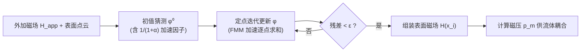

## 一句话总结

本文提出一种基于单层位势的 Induce-on-Boundary（IoB）磁静力求解器，只用物体表面点云、通过定点迭代即可轻量、快速、精确地求解铁磁流体的磁场，无需复杂线性求解器，并能作为即插即用模块无缝接入网格流体仿真管线。

## 研究背景

铁磁流体是纳米级磁性颗粒的胶体溶液，在材料、机器人与艺术创作中都有应用。在计算机图形学中，铁磁流体仿真需要同时处理重力、磁力与表面张力三种力的相互作用，才能复现出特征性的尖峰结构（即所谓的正常场不稳定性，normal-field instability）。

要驱动这类仿真，核心是反复求解磁静力控制方程，得到流体表面的磁场与磁压。然而已有方法存在两大短板。其一，普遍依赖复杂的线性系统求解器（如 GMGPCG、预条件 GMRES），实现负担重。其二，受限于建模与离散化方式，可扩展性不足：体积力模型、变量数量庞大、或不可避免地引入稠密矩阵，都会显著推高计算与存储成本。此外，部分方法还存在物理精度问题，例如液气界面被抹平、无穷远处边界条件不满足、以及忽略流体涡量等。这些障碍使得磁静力模块难以像"即插即用"组件那样融入常规流体仿真管线。

本文的目标就是设计一个轻量、快速、精确、且天然适配 FMM 加速的磁静力求解器，直接在流体表面上完成磁场计算，并能干净地耦合进网格流体仿真。

## 方法

### 整体框架

在零电流假设下，铁磁流体的诱导磁场 $\boldsymbol{H}_{\text{ind}}$ 由麦克斯韦方程的一个特例决定。由于诱导场无旋，可引入标量位势 $\psi$ 使 $\boldsymbol{H}_{\text{ind}} = -\nabla\psi$，从而把问题化为一个带界面跳变条件与无穷远衰减条件的拉普拉斯方程：

$$\nabla^2 \psi = 0,\ \boldsymbol{x}\notin\partial\Omega; \qquad \psi\to 0,\ \lVert\boldsymbol{x}\rVert\to\infty$$

界面上磁化率 $\chi$ 引入的法向导数跳变条件，使得 $\boldsymbol{H}$ 的法向分量在流体表面 $\partial\Omega$ 处不连续。IoB 的思路是把这个边值问题改写为边界积分方程（BIE）并只在表面点云上离散求解。

### 关键设计

单层位势表示。作者用一个未知密度 $\phi$ 的单层位势表示 $\psi$：

$$\psi(\boldsymbol{x}) = \iint_{\partial\Omega} G(\boldsymbol{x},\boldsymbol{y})\,\phi(\boldsymbol{y})\,\mathrm{d}A_y$$

其中 $G(\boldsymbol{x},\boldsymbol{y}) = 1/(4\pi\lVert\boldsymbol{x}-\boldsymbol{y}\rVert)$ 是泊松方程的格林函数。这一形式的关键好处是：无穷远处的边界条件被格林函数自然满足，无需像网格法那样用"磁屏蔽"去近似。代入界面跳变条件后，得到关于表面密度 $\phi$ 的第二类 Fredholm 积分方程：

$$\frac{\phi(\boldsymbol{x})}{2\alpha} = -\iint_{\partial\Omega} \frac{\partial G}{\partial n_x}(\boldsymbol{x},\boldsymbol{y})\,\phi(\boldsymbol{y})\,\mathrm{d}A_y + \boldsymbol{H}_{\text{app}}(\boldsymbol{x})\cdot\boldsymbol{n}$$

其中 $\alpha = \chi/(2+\chi)$ 称为约化磁导率。求得 $\phi$ 后，可直接得到界面处磁场的法向分量 $\boldsymbol{H}\cdot\boldsymbol{n} = \phi/\chi$，进而组装出完整的表面磁场。

点云离散与定点迭代。表面用点云表示，每个点带位置、法向与控制面积，并额外赋予密度 $\phi_i$。由于核 $\boldsymbol{n}_x\cdot\nabla_x G$ 在 $\boldsymbol{y}\to\boldsymbol{x}$ 时趋于零，积分非奇异，可直接离散为逐点求和。作者用定点迭代求解，并给出"感应于边界"的物理直觉：类比光线追踪中光每多弹射一次就对应 Neumann 级数中一个更高阶项，IoB 每一次迭代都把当前诱导场当作虚拟外加场，材料被其再次磁化并诱导出更高阶的磁场，如此在无穷小时间间隔内不断"磁化—感应"直至平衡。

收敛性分析与加速。作者证明该级数收敛的充分条件为 $\lvert\alpha\rvert < 1$，只要磁化率 $\chi$ 为正即成立；数值格式的收敛速率线性依赖于谱半径 $\alpha = \chi/(\chi+2)$。进一步，通过重写级数消去主特征值 $\lambda_1 = -1/\alpha$，收敛速率提升到由 $\lambda_2$ 决定，这在算法上仅体现为初值猜测里乘上一个 $1/(1+\alpha)$ 的因子。

FMM 加速与复杂度。密度求解 $\phi$ 与磁场组装都可写成 N-body 求和，核仅依赖源点位置，天然契合快速多极子方法（FMM）。加速后时间复杂度约为 $O(N)$、空间复杂度 $O(N)$（$N$ 为界面离散点数），在几类主流磁静力求解器里时间与空间复杂度均最低。

与网格流体的耦合。IoB 对底层流体框架无侵入。作者以网格法为例：用 level-set 追踪表面，marching cubes 抽取的三角网格顶点正好可作为 IoB 的输入点云（顶点间距小于 $\sqrt{3}\Delta x$、位置与 ghost fluid 界面点对齐、局部面积易估计）；磁压 $p_m$ 像毛细压一样通过 ghost fluid 方法进入自由表面边界条件。整个网格铁磁流体管线相比常规流体仿真只需新增一步（生成点云并跑 IoB）并微调自由表面边界条件。

## 实验结果

作者先做磁静力场基准测试，再把 IoB 集成进网格流体管线仿真铁磁流体。精度、可扩展性与收敛性对比要点如下：

| 实验 | 对比对象 | 关键结果 |
| --- | --- | --- |
| 2D 精度（磁化圆盘，$1024^2$ 网格） | 网格法 vs IoB | 网格法最大绝对误差约 0.1222；IoB 约 0.0014，低两个数量级 |
| 3D 精度（磁化球面磁压，$128^3$） | 网格法 / 表面法 / IoB | 最大相对误差：网格法约 8.39%，表面法约 1.80%，IoB 约 2.44% |
| 性能扩展性（$32^3\sim512^3$） | 三种求解器 | 表面法因稠密矩阵内存受限于约 $136^3$；IoB 可扩展到 $512^3$，复杂度最低 |
| 收敛性（约 $10^5$ 顶点网格） | IoB 自身 | 收敛速率线性依赖 $\alpha$；$\chi<5$ 时约 10 次迭代即把残差降到很低 |
| 求解器消融 | BiCGSTAB / GMRES vs IoB | $\chi<50$ 时 IoB 在各离散尺度下性能更优，契合大规模铁磁流体需求 |

在综合复杂度对比（时间 / 空间）中，IoB 相较 SPH 体积力法、网格法、表面法均为最低：时间 $O(KN)$、空间 $O(N)$（$K$ 为迭代次数，约 10 次量级）。仿真层面，作者复现了正常场不稳定性（均匀场尖峰、偶极子源放射状尖峰、高磁化率铁球吸附、四阶段抬升铁磁流体）与迷宫不稳定性（浮雕与阴刻两类迷宫图案），并通过接入 Bullet Physics 让磁体稳定吸附 243 颗铁球，展示了对固体仿真的可扩展性（$\chi=50$ 时残差 20 次迭代从 $10^4$ 降到 $10^{-5}$）。

## 亮点与局限

亮点在于把铁磁流体磁静力问题化归为单层位势的第二类 Fredholm 积分方程，仅凭表面点云与定点迭代即可求解，既自然满足无穷远边界条件、又无需装配稠密矩阵或调用复杂线性求解器；方程形式与 N-body 求和一致，可用 FMM 把时间/空间复杂度压到 $O(N)$，从而扩展到大规模场景；求解器与底层框架解耦，能以最小改动接入网格流体乃至刚体仿真管线，并有理论收敛性保证。

局限方面：仿真结果存在轻微抖动，作者归因于单层位势与点云离散的固有缺陷，以及显式表面张力格式与 level-set 的体积损失；相较双层位势，单层位势精度略逊（3D 磁压相对误差高于表面法）；目前仅在全欧拉框架下验证，尚未接入 PIC/FLIP 等混合框架，耦合方法（marching-cubes 网格、时间相干性利用）也仍有优化空间。

## 延伸思考

IoB 揭示了一条把渲染方程思想迁移到物理仿真的路径：第二类 Fredholm 积分方程、Neumann 级数、以源点而非场点为出发点的伴随式求和，都与辐射度、点基全局光照乃至 Walk-on-Spheres / Walk-on-Boundary 一脉相承。这提示"边界积分 + 定点/随机迭代"可能成为一类通用的场求解范式，在需要满足无穷远条件、又想避免体离散与大型线性求解的问题上尤具吸引力。若能进一步引入双层位势的精度、隐式表面张力与鲁棒黏性求解，以及把点基磁力与 IPC、隐式弹性结合，或可催生一套统一、可扩展、能处理流体与磁性固体多物理耦合的仿真工具链。
