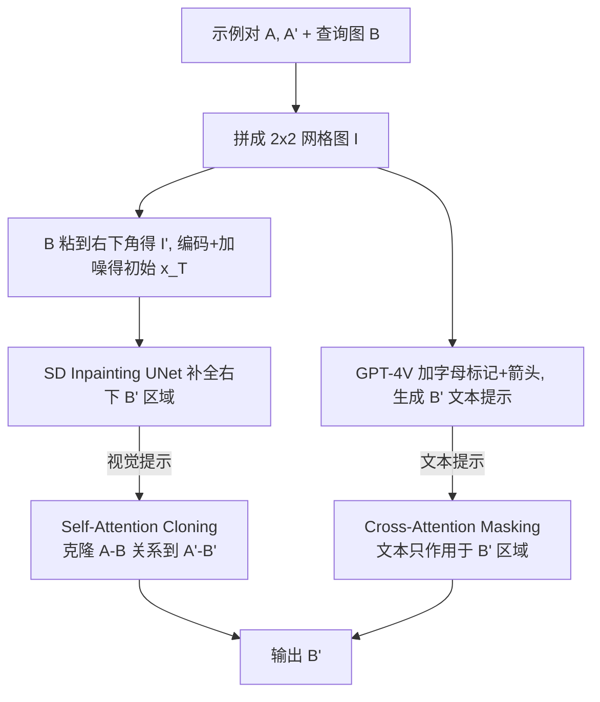

## 一句话总结

Analogist 是一个「开箱即用」的视觉上下文学习（Visual ICL）方法：把示例对 $A\to A'$ 与查询图 $B$ 排成 $2\times2$ 网格，用预训练的 Stable Diffusion 图像修复模型去补全缺失的 $B'$，并通过自注意力克隆（SAC）注入结构级视觉提示、借 GPT-4V + 交叉注意力掩码（CAM）注入语义级文本提示，无需任何微调或优化就能完成上色、去噪、编辑、风格迁移等多种任务。

## 研究背景

上下文学习（In-Context Learning, ICL）源自 NLP：大语言模型仅凭少量演示示例就能学会新任务，无需参数更新。把这一范式迁移到视觉领域，就变成了经典的图像类比问题（image analogies）——给定一对示例 $A:A'$ 说明某种变换，再给一张查询图 $B$，要生成保持同一变换模式的 $B'$，即 $A:A'::B:B'$。这种能力在图形与视觉任务里潜力巨大，一对示例就能覆盖上色、去模糊、去噪、低光增强等低层任务，以及编辑、翻译、运动迁移等高层任务。

现有视觉 ICL 分两类，各有短板：

- 训练式（training-based）方法在多种上下文任务上训练/微调模型（如 Painter、PromptDiffusion、ImageBrush），但只擅长与训练任务相似的场景，对未见任务泛化差，而且构造多样化任务数据集耗时费力。
- 推理式（inference-based）方法在推理阶段通过提示引导模型（如 VISII、DIA），泛化性更好，但普遍把图像示例转成文本提示，存在两大缺陷：其一，文本提示粒度太粗，无法覆盖图像示例中的细粒度信息；其二，从图像反演出文本（textual inversion）需要迭代优化，非常耗时（VISII 单次约 685 秒，DIA 约 258 秒）。

Analogist 属于推理式，但同时利用视觉提示与文本提示，分别提供结构级（细粒度）与语义级（粗粒度）的上下文信息，并且完全免优化。

## 核心方法

整体框架建立在预训练的 Stable Diffusion 图像修复（inpainting）模型之上，从视觉与文本两条互补的路径给出上下文引导。

**1. 2×2 网格提示（视觉提示的载体）。** 图像修复模型本就是「根据已知区域补全未知区域」，天然契合 ICL。作者把 $A$、$A'$、$B$ 摆进一张 $2\times2$ 网格图 $I$，其中 $B$ 粘到右下角得到 $I'$，右下角（$B'$ 位置）用全 1 掩码、其余全 0 表示待修复区域。对 $E(I')$ 做扩散前向加噪得到初始 $x_T$，每个时间步把潜变量、掩码图特征与掩码拼接送入 UNet，让模型依据上下文区域（$A,A',B$）补全 $B'$。输入图统一 resize 到 $256\times256$，拼成 $512\times512$。

**2. 自注意力克隆 SAC（结构级引导）。** 作者观察到扩散模型的自注意力能准确建立图像不同位置间的关联（可视化显示 $A$ 上关键语义点与 $B$ 全图的注意力对应关系相当精准），比抽象文本更能表达结构关系。于是把 $A$ 与 $B$ 之间的子注意力图克隆给 $A'$ 与 $B'$ 之间：

$$\mathcal{M}_s(A', B') := \mathcal{M}_s(A, B)\cdot s$$

其中 $\mathcal{M}_s\in\mathbb{R}^{hw\times hw}$ 是完整自注意力图，$\mathcal{M}_s(A,B)\in\mathbb{R}^{\frac{hw}{4}\times\frac{hw}{4}}$ 是对应子块，系数 $s$ 平衡「保留 $B$ 的结构」与「施加变换」的程度。这一克隆操作在 softmax 之前执行，避免过度干扰原始注意力结果。消融显示，方向必须是 $\mathcal{M}_s(A',B'):=\mathcal{M}_s(A,B)$（保持 $A$-$B$ 结构关系在变换后仍一致），而非反过来的 $\mathcal{M}_s(B,B'):=\mathcal{M}_s(A,A')$。

**3. GPT-4V 文本提示（语义级引导）。** 不做耗时的文本反演，而是把整张 $2\times2$ 网格图直接喂给 GPT-4V。为便于理解任务，作者设计了两种图形化指令：在每个格子左上角标注字母（$A,A',B,B'$），并在 $A\to A'$、$B\to B'$ 之间画醒目箭头。再让 GPT-4V 输出对 $B'$ 的不超过 5 个词的文本描述作为正向提示；同时用一组负向提示（Messy、Disordered、Chaotic 等）抑制杂乱无逻辑的生成。消融（图 10）表明，去掉字母与箭头，GPT-4V 往往无法理解图间对应关系而给不出合适提示。

**4. 交叉注意力掩码 CAM（让文本精准作用）。** GPT-4V 的提示是为 $B'$ 定制的，但交叉注意力会让文本影响整张图。CAM 在交叉注意力层把文本与 $B'$ 以外区域的注意力值置零：

$$\mathcal{M}_c(A):=0;\quad \mathcal{M}_c(A'):=0;\quad \mathcal{M}_c(B):=0$$

与 SAC 在 softmax 前操作不同，CAM 在 softmax 之后操作，以彻底切断文本与非 $B'$ 区域的关系。由于各图位置固定，SAC 与 CAM 所需的子注意力图索引都可预先计算，流程简洁高效。

## 技术细节

- 基座模型：公开的 runwayml/stable-diffusion-inpainting（由 SD1.2 初始化并在修复任务上训练）。UNet 含 16 个 block，每个 block 有一个交叉注意力和一个自注意力。
- SAC 与 CAM 在第 3 到 10 层、所有时间步执行；消融表明必须在编码器和解码器同时执行，且在 UNet 中间层（$16\times16$ 分辨率）操作最能平衡「结构保持」与「变换施加」——浅层只会复制颜色和粗纹理，深层则过度压缩使结果趋近原图 $B$。
- classifier-free guidance 尺度设为 15；SAC 系数 $s=1.3$（skeleton-to-image 用 $1.4$）。$s$ 越小结果越像 $B$，越大越像 $A'$，但过大（$s=1.8$）会使注意力图失衡、质量下降。
- 所有实验在单张 RTX 3090 上完成，单次推理约 4 秒，与 PromptDiffusion 相当，远快于 DIA（258 秒）和 VISII（685 秒）。

**扩展应用。** 针对不同对齐情形做了适配：(a) $A$ 与 $A'$ 对齐（如照片转漫画、素描转肖像、法线图转 RGB、图标转图像）直接用原流程；(b) $A$ 与 $B$ 对齐（如物体增殖、运动迁移）通过交换网格中 $A'$ 与 $B$ 的位置，把问题重新化归为对齐任务；(c) $A,A',B$ 全不对齐（如形状变化、数字/字母外推）则关闭 SAC、仅用 CAM，结果仍优于 MAEVQGAN。

## 实验结果

评测覆盖三大类共十个任务：低层任务（上色、去模糊、去噪、增强）、操作任务（编辑、翻译、风格迁移）、更具挑战的视觉任务（骨架转图、掩码转图、图像修复）。基线为 MAEVQGAN、PromptDiffusion、DIA、VISII。

CLIP 方向相似度（衡量 $B\to B'$ 与 $A\to A'$ 变换方向是否一致，越高越好）：

| 类别 | 任务 | MAEVQGAN | PromptDiffusion | DIA | VISII | Analogist |
| --- | --- | --- | --- | --- | --- | --- |
| 低层 | Colorization | 0.0558 | 0.1283 | 0.0066 | 0.1061 | **0.1797** |
| 低层 | Denoise | -0.0389 | 0.1612 | 0.1212 | 0.1098 | **0.2391** |
| 操作 | Image Translation | 0.2526 | 0.2426 | 0.1617 | 0.2965 | **0.3136** |
| 视觉 | Skeleton-to-image | 0.4452 | 0.6150 | 0.2874 | 0.5201 | **0.7334** |
| 视觉 | Mask-to-image | 0.4467 | 0.3984 | 0.1590 | 0.3071 | **0.5531** |
| — | **Average** | 0.1529 | 0.2137 | 0.0650 | 0.2104 | **0.2832** |

平均相似度 0.2832，全面领先（个别任务如 Image Editing、Style Transfer 上 VISII 略优，因其基座 InstructPix2Pix 恰好在同一数据集上预训练）。

FID（生成 $B'$ 与真值的分布距离，越低越好）：

| 方法 | Low-level | Manipulation | Vision |
| --- | --- | --- | --- |
| MAEVQGAN | 181.48 | 143.19 | 169.74 |
| PromptDiffusion | 180.39 | 111.79 | 159.02 |
| DIA | 173.10 | 103.39 | 191.51 |
| VISII | 140.39 | 88.36 | 138.44 |
| **Analogist** | **114.15** | **85.67** | **96.67** |

三大类别 FID 全部最优。用户研究（42 人、50 题）中，Analogist 在三类任务的选择率分别为 66.10%、59.95%、74.03%，远超其余方法。此外，固定 $A$、$B$ 而改变 $A'$（用 MasaCtrl 生成狮/虎/狗/熊猫等不同 $A'$），Analogist 能相应识别 $A\to A'$ 的变换并在 $B'$ 生成对应动物，验证了真正的上下文推理能力。

## 贡献与局限

**贡献：**

- 提出 Analogist，一个开箱即用的视觉 ICL 方法，用预训练扩散修复模型配合视觉+文本双重提示，无需训练或优化。
- 视觉提示上提出自注意力克隆 SAC，利用 $2\times2$ 网格中的细粒度上下文提供结构级引导。
- 文本提示上用 GPT-4V 高效生成描述，并用交叉注意力掩码 CAM 把语义引导精确限定在目标区域，提升准确性。

**局限：**

- 文本可能误导：当 $A\to A'$ 变换细微（如新增小物体）或类别模糊时，GPT-4V 会给出错误提示（把大象认成狮子等）；作者建议留出让用户实时监控/自定义提示的接口。
- 罕见数据难生成：基座模型主要见过自然 RGB 图，对法线图、线稿图标等「非自然」图像即使给对提示也难以生成，这也解释了在视觉任务上不及专门微调的 ImageBrush。
- SAC 依赖对齐：当 $A,A',B$ 全部不对齐时结构级信息不适用，只能退而依赖语义级信息；长序列字母/文本生成质量仍有限（扩散模型固有的文字生成弱点）。
