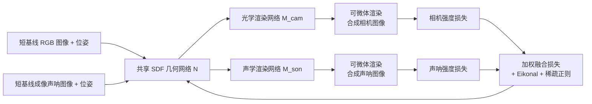

## 一句话总结

面向水下受限基线下的三维重建难题，AONeuS 用一个共享的符号距离函数几何表示搭配声学、光学两套模态专属的渲染网络，把高分辨率 RGB 图像与低分辨率成像声呐测量在物理可微渲染框架里融合，借助两种模态在深度与俯仰方向上的互补歧义，在极短基线下重建出高保真三维表面。

## 研究背景

水下三维重建在工程施工、海洋考古、环境监测与安防等领域应用广泛。但水下机器人常受制于狭窄空间、脆弱环境与有限的导航控制，只能在很短的基线内采集测量。而基线越小，三维重建越困难。

水下机器人通常同时携带成像声呐与光学相机，二者信息互补但各有致命短板：

- 成像声呐通过波束成形恢复目标的距离与方位，却丢失俯仰信息——同一条俯仰弧上的所有点映射到同一像素。它对散射与弱光鲁棒，但空间分辨率低，图像常常缺乏纹理、难以辨认，还受多径反射与声速不均带来的复杂伪影困扰。
- 光学相机空间分辨率高、能刻画外观细节，但在浑浊水体中受散射与吸收严重限制；且被动相机要恢复深度依赖较大的位移基线，在受限环境中往往无法获得。

已有的声光融合思路要么依赖轮廓匹配、需要目标 $360$ 度环视（不适用小基线），要么把声学、光学各自独立重建再简单拼合（相比纯相机方法收益有限）。本文提出在物理可微渲染框架下做声光融合，能在极短基线下从相机与声呐测量恢复稠密三维表面。

## 方法

### 整体框架

输入两套带位姿的数据集：相机数据 $\mathcal{D}_{cam}$ 与声呐数据 $\mathcal{D}_{son}$。核心洞察在于：两个短基线 RGB 测量难以沿深度轴定位一点，两个短基线声呐测量难以沿 $x$ 轴定位一点——二者的歧义方向正交，因此高度互补。AONeuS 用统一几何表示同时吸收两种约束，输出重建网格。

### 关键设计

统一几何、分离外观。目标表面用符号距离函数 $\mathcal{N}(\mathbf{x})$ 表示，输出任意三维点 $\mathbf{x}=(X,Y,Z)$ 到最近表面的距离。与既往单模态工作不同，AONeuS 用两个独立的渲染网络 $\mathcal{M}_{cam}$ 与 $\mathcal{M}_{son}$ 分别近似每个空间点的光学与声学出射辐射。这一设计源于材料的声学与光学反射特性不同：玻璃对相机不可见却能被声呐看到，PVC 对声呐不可见却能被相机看到。共享 SDF 保证几何一致，分离渲染器容纳模态差异。

双模态可微渲染。沿声学弧与光学射线采样求和，离散近似两种成像积分。声呐与相机的渲染函数分别为：

$$\hat{I}_{son}(r,\theta) = \sum_{\mathbf{x}\in \mathcal{A}_{p_{son}}} \frac{1}{r(\mathbf{x})} T[\mathbf{x}]\,\alpha[\mathbf{x}]\,\mathcal{M}_{son}(\mathbf{x})$$

$$\hat{I}_{cam}(x,y) = \sum_{\mathbf{x}\in \mathcal{R}_{p_{cam}}} T[\mathbf{x}]\,\alpha[\mathbf{x}]\,\mathcal{M}_{cam}(\mathbf{x})$$

其中 $\mathcal{A}_{p_{son}}$ 是像素 $p_{son}$ 处声学弧上的采样点集合，$\mathcal{R}_{p_{cam}}$ 是像素 $p_{cam}$ 处光学射线上的采样点集合。任意采样点 $\mathbf{x}_s$ 的离散不透明度由相邻点的 SDF 经 Sigmoid 变换给出：

$$\alpha[\mathbf{x}_s] = \max\!\left(\frac{\Phi_q(\mathcal{N}(\mathbf{x}_s)) - \Phi_q(\mathcal{N}(\mathbf{x}_{s+1}))}{\Phi_q(\mathcal{N}(\mathbf{x}_s))},\; 0\right)$$

其中 $\Phi_q(x)=(1+e^{-qx})^{-1}$，$q$ 为可训练参数；透射率 $T[\mathbf{x}_s]=\prod_{\mathbf{x}_r \mid r<s}(1-\alpha[\mathbf{x}_r])$。

损失函数。由声呐与相机强度损失（均为 $L_1$）、Eikonal 正则与稀疏正则组成。Eikonal 项约束 SDF 梯度模长为 $1$ 以鼓励平滑重建：

$$\mathcal{L}_{eik} = \frac{1}{\lvert \mathcal{X}\rvert}\sum_{\mathbf{x}\in \mathcal{X}} \left(\lVert \nabla \mathcal{N}(\mathbf{x})\rVert_2 - 1\right)^2$$

稀疏正则 $\mathcal{L}_{reg}$ 对不透明度施加 $L_1$ 惩罚，偏向最小化场景总不透明度（适用于目标只有部分侧面可成像的情形，如置于海床）。总损失按时间加权融合：

$$\mathcal{L} = \alpha(t)\,\mathcal{L}_{int}^{son} + (1-\alpha(t))\,\mathcal{L}_{int}^{cam} + \lambda_{eik}\mathcal{L}_{eik} + \lambda_{reg}\mathcal{L}_{reg}$$

两阶段权重调度。$\alpha(t)$ 采用两段式：早期迭代（$t<E_t$）令 $\alpha=1$，只用声呐测量为目标"打掩膜"，把 SDF 网络的几何在深度方向上约束好，作为后续初始化；后期迭代（$E_t<t<E_e$）令 $\alpha=\lambda$，更强调相机测量以约束 $x$、$y$ 方向、化解声呐固有的俯仰歧义，此时声呐降权充当深度正则。网络用 ADAM 优化。

理论支撑。作者从系统条件数角度分析声光融合的优势：给定测量间的点对应，用多模态声光测量三角化一个三维点，比纯相机或纯声呐更易求解。声光传感器从两个位置共记录 $8$ 个测量（含相机的 $x_c,y_c$、声呐的距离 $R$ 与方位 $\theta$ 及其在第二位姿下的对应量），相机的立体测量为前向模型引入了额外的线性约束，使三角化问题更良态、更易求逆。

## 实验结果

在合成 turtle 场景上，作者以 Chamfer $L_1$ 距离、精度、召回评估，每种方法用随机种子跑 $9$ 次；NeuS 额外提供了目标掩膜，NeuSIS 与 AONeuS 则不需要。下表节选最长与最短两个基线（Chamfer 越低越好，精度、召回越高越好）：

| 基线 | 指标 | NeuS（纯相机） | NeuSIS（纯声呐） | AONeuS（融合） |
|------|------|------|------|------|
| 1.2m | Chamfer ↓ | 0.123 | 0.130 | 0.075 |
| 1.2m | 精度 ↑ | 0.653 | 0.566 | 0.862 |
| 1.2m | 召回 ↑ | 0.526 | 0.836 | 0.825 |
| 0.24m | Chamfer ↓ | 0.406 | 0.146 | 0.111 |
| 0.24m | 精度 ↑ | 0.223 | 0.450 | 0.690 |
| 0.24m | 召回 ↑ | 0.107 | 0.587 | 0.679 |

随着基线缩短，NeuS 的深度轴（$Z$ 轴）重建迅速恶化（Chamfer 从 $0.123$ 涨到 $0.406$），海龟后腿逐渐丢失；NeuSIS 在各基线下俯仰轴歧义显著，龟壳难以约束；AONeuS 融合两种正交信息，在所有基线下都能清晰恢复龟壳与后腿，且 Chamfer 与精度全面领先。文中说明 NeuSIS 的召回偶尔略高，是因为它生成了覆盖大部分目标的"团块"。

实物实验在水箱中对一块覆盖隔热泡沫的胶合板目标进行：用装在 Bluefin HAUV 上的 DIDSON 成像声呐（$14^\circ$ 与 $28^\circ$ 两种俯仰孔径）采集声呐数据，用 FLIR Blackfly 相机（位姿由 COLMAP 求得）异步采集光学图像，沿约 $1.2$ 米非退化直线轨迹采集约 $120$ 组测量并子采样成 $5$ 个基线。对比 Kim 等人的 COLMAP 融合法、NeuS 与 NeuSIS，AONeuS 在低至 $24$ 厘米的基线下仍输出更完整的形状（孔洞、两条腿、横杆均清晰可辨），且 Chamfer 距离在不同随机种子下的标准差更小，重建对随机性更鲁棒。逐轴误差直方图进一步显示：NeuS 在 $Z$ 轴偏差大、NeuSIS 在 $X$ 轴偏差大，而 AONeuS 在三个轴上偏差都低。

## 亮点与局限

亮点：

- 首个用神经渲染做声光传感器融合的工作，抓住相机（深度歧义）与声呐（俯仰歧义）正交互补这一核心，在极短基线下实现高保真稠密重建。
- 共享几何、分离外观的表示既保证几何一致，又尊重不同材料的声学、光学反射差异；两阶段权重调度先用声呐建立深度初始化、再用相机化解俯仰歧义，工程上简洁有效。
- 不仅有合成与实物双重实验，还从条件数角度给出理论解释，并开源了数据集与实现。

局限：

- 受限于共享测试水池无法引入浑浊度，工作聚焦清水场景；前向模型未建模光散射，在真实浑浊水体中的表现有待提升。
- 假设目标声学漫反射，镜面反射的影响需另作分析。
- 仍依赖声呐与相机位姿的事后对齐，且实验目标以单一物体为主。

## 延伸思考

AONeuS 把"多传感器物理成像模型统一进可微渲染"的范式从单模态推向声光跨模态，其"共享 SDF + 模态专属渲染器 + 时间加权调度"的结构，为其他歧义互补的传感器组合（如雷达与相机、飞行时间与 RGB）提供了可迁移的模板。若进一步把水体散射、镜面反射等效应纳入前向模型，并放宽对精确位姿与单目标场景的依赖，这套框架有望从受控水箱走向真实浑浊、复杂的水下作业环境。
