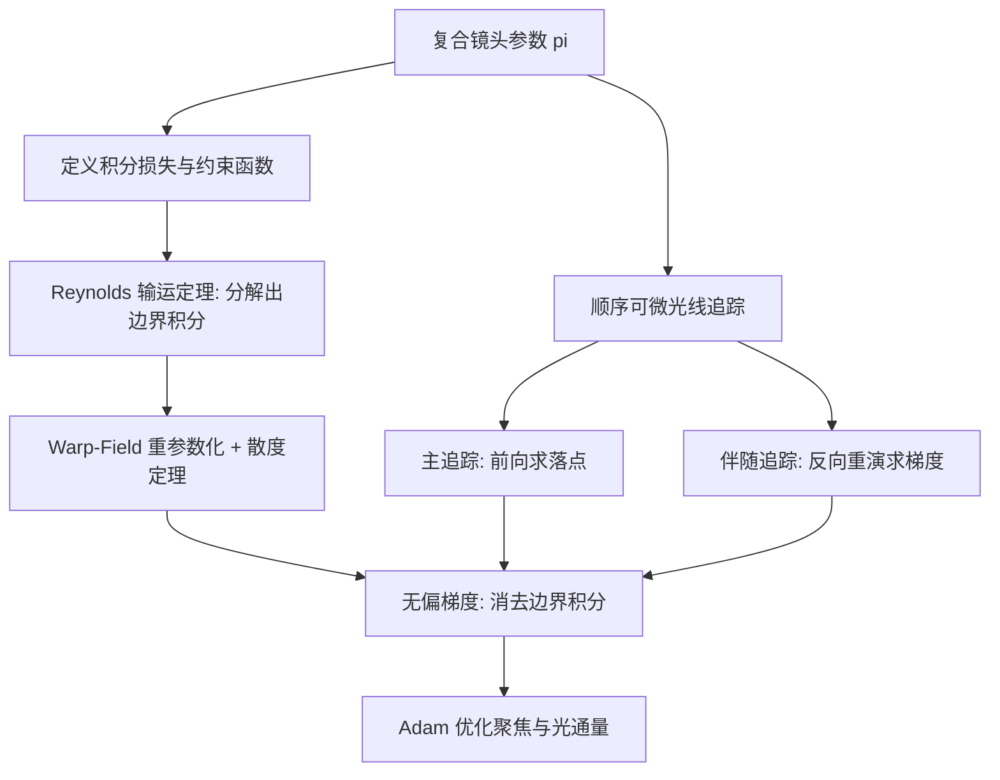

## 一句话总结

提出一种"光瞳感知"的可微渲染方法，能对复合镜头同时求取关于聚焦（清晰度）与光通量（进光量）的无偏梯度，从而首次实现对镜头光效率的显式优化。

## 研究背景

相机的成像质量高度依赖镜头设计，而复合镜头（由多片折射镜片与光阑堆叠而成）的设计空间历来难以搜索，通常需要 Zemax、CODE V 等仿真软件辅助。近年可微渲染技术让梯度计算更高效，但存在一个关键短板：它们只能优化聚焦相关目标，无法优化光通量。

光通量（进光量）在许多场景中至关重要，例如需要快门速度极快的运动摄影，或可用光有限的夜景。现有工具只能量化镜头的光效率（如计算 f 数），却无法把它当作优化目标直接优化。

问题的根源在于：光阑尺寸这类参数改变的是"哪些光线能通过镜头"这一积分域，而不是单条光线的落点或强度。传统可微渲染（如 DiffOptics）假设积分域固定，因此对光阑尺寸求导恒为零——例如优化光阑半径以最小化模糊时，几何光学期望结果应收敛到针孔相机，但有偏梯度会让设计原地不动。

## 方法

### 整体框架

作者把镜头性能表达为一个定义在动态积分域上的积分损失：

$$L(\pi) = \int_{\Omega(\pi)} f(x_{N+1}(\omega, \pi), \pi)\, d\omega$$

其中 $\pi$ 是镜头参数，$\omega = \lbrace x_0, v_0 \rbrace$ 表示一条入射光线的初始位置与方向，$f$ 是每条光线的代价（如落点到目标焦点的平方距离），$\Omega(\pi)$ 是所有"有效光线"构成的入瞳集合。关键在于 $\Omega$ 本身依赖于镜头参数 $\pi$（镜片与光阑尺寸决定了入瞳），因此对 $\pi$ 求导必须考虑积分域的变化。

### 关键设计

顺序可微光线追踪。作者只考虑几何光学下的"有效光线"——从发射面出发、按顺序依次穿过所有镜面、最终到达传感器的光线。光线追踪在每个镜面交替应用传播算子 $P$（更新位置到下一镜面交点）与透射算子 $T$（按 Snell 定律或自由透射更新方向）。由于 $P$ 与 $T$ 都是双射操作，可以从终点反向重演光路，从而用"主追踪 + 伴随追踪"两阶段在常数内存下计算梯度，$T$ 用自动微分、$P$ 用隐函数微分。

约束函数刻画积分域边界。一条光线可能因两种原因无法透射：偏离光轴过远超出镜片物理边界（gsemi 约束），或以超临界角入射发生全内反射（gTIR 约束）。作者用可微的隐式约束函数 $g_i$ 表示这些条件，约束满足时为负、失效时为正，$\Omega(\pi)$ 即满足所有约束的光线集合。

无偏梯度推导。当积分域依赖参数时，直接对被积函数求导得到的是有偏梯度。作者用 Reynolds 输运定理把真实梯度写成一个域内积分加一个入瞳边界积分：

$$\frac{dL}{d\pi} = \int_{\Omega} \frac{df}{d\pi}\, d\omega - \int_{\partial\Omega(\pi)} f\, \frac{dg^{*}}{d\pi}\, dl(\omega)$$

边界积分正是有偏方法遗漏的部分。

Warp-Field 重参数化。入瞳边界 $\partial\Omega(\pi)$ 难以解析刻画或采样（对离轴光源甚至严重畸变），直接算边界积分很困难。作者借助 warp-field 重参数化，配合散度定理把边界积分转成域内积分，最终把梯度整体写成一个可在入瞳内采样的无偏蒙特卡洛估计：

$$\frac{dL}{d\pi} = \int_{\Omega(\pi)} \frac{df}{d\pi} - \operatorname{div}(f\mathbf{V})\, d\omega$$

与既有工作在每次随机折射事件都需一个 warp field 不同，本方法针对纯镜面（确定性）折射路径，用初始条件 $\omega$ 参数化整条多次折射路径，因此对整条光路只需定义单一 warp field，可在低维镜面路径流形上做可微渲染。

优化目标。作者定义两个目标：点斑目标 $L_{\text{spot}}$ 鼓励清晰度，通量目标 $L_{\text{throughput}}$（入瞳面积取负号）鼓励光效率，用权重 $\lambda$ 组合成复合目标：

$$L(\pi) = L_{\text{spot}}(\pi) + \lambda L_{\text{throughput}}(\pi)$$

其中通量目标的有偏梯度恒为零，因此这一探索只有靠无偏 warp-field 方法才可能实现。实现基于 JAX，用 Adam 迭代 10000 步，每个实验约 10 分钟。

## 实验结果

梯度正确性上，方法对光阑半径与镜面曲率求得的前向梯度图与有限差分一致，而 DiffOptics 对光阑尺寸的梯度图恒为零。在 50 mm double-Gauss 镜头上扫描不同 $\lambda$，得到一条清晰度与光效率的权衡曲线：在相当的点斑大小下本方法通量更高，也能以牺牲部分通量换取更小点斑。

| 场景 | 对比设置 | 主要结论 |
| --- | --- | --- |
| 权衡曲线 | 本方法 vs DiffOptics / Zemax | 相当点斑下通量更高，且可覆盖多种权衡点 |
| 低光（烛光场景） | 高通量 vs 低通量镜头 | 高通量镜头图像更亮、信噪比更高，代价是略降清晰度 |
| 运动模糊（移动 USAF 靶） | 高通量 vs 小点斑镜头 | 高通量镜头达到同亮度所需曝光约为四分之一，运动模糊显著减少 |
| 渐晕（白平衡靶） | 本方法 vs Zemax | Zemax 有偏梯度无法优化离轴通量导致明显渐晕，本方法大幅减轻 |
| 变焦镜头 | 优化前 vs 优化后 | 在 28/45/75 mm 多焦距下整体清晰度与光效率均有提升 |

## 亮点与局限

亮点。首次把光通量作为可显式优化的目标纳入可微镜头设计；通过 Reynolds 输运定理与 warp-field 重参数化，给出考虑动态积分域的无偏梯度，从理论上补齐了有偏方法的缺口；针对纯镜面路径只需单一 warp field，比既有逐事件 warp 更简洁高效；在低光、运动模糊、渐晕、变焦等多种实际应用中都验证了效果。

局限。优化目标高度非凸，梯度法易陷入局部极小，需要退火或数据驱动初始化缓解；方法不支持增删镜片这类改变设计维度的离散操作，需要结合镜头变异技术；只建模几何光学，不支持衍射光学元件、超透镜等本质依赖波动光学的元件；也未考虑镜头内部互反射带来的眩光与鬼影。

## 延伸思考

这项工作把可微渲染中"处理参数依赖的积分域不连续性"这一通用难题，精准迁移到了镜头设计场景，核心贡献不只是一个更好的镜头优化器，更是揭示了镜面路径流形上无偏微分的一般框架。作者指出该理论天然可扩展到反射式、折反射式系统，也适用于 AR/VR 目镜与非成像光学等追求高光通量的领域。一个值得关注的方向是与镜片增删的离散优化、多目标 Pareto 优化相结合，让"自动探索镜头结构 + 连续参数精修"形成闭环——这也正是作者后续把离散连续联合优化引入镜头设计的自然延续。
