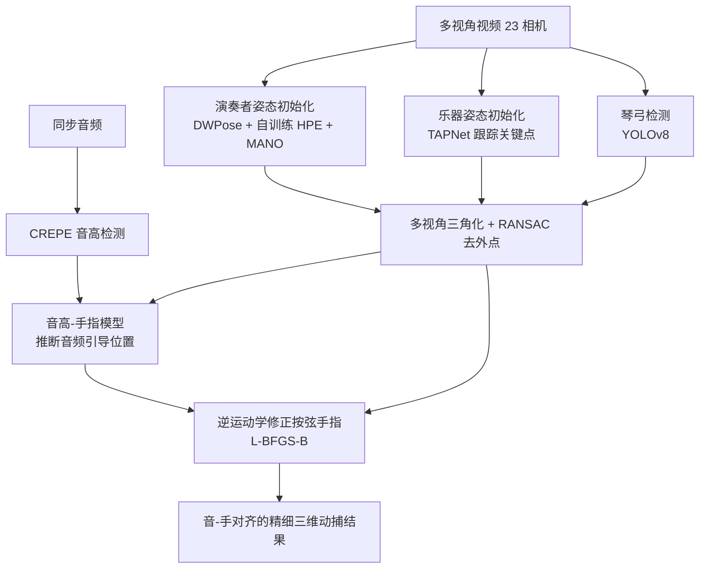

## 一句话总结

面向弦乐演奏这一极精细的手指运动捕捉难题，本文提出了首个大规模多模态无标记弦乐演奏数据集 SPD，并设计了一套"音频引导"的多模态动捕框架：从音频里提取音高，反推出手指该按在指板哪个位置，再用逆运动学把纯视觉估计的按弦手指"拉"到这个音频引导位置，从而在完全无标记、不干扰演奏者的前提下恢复出微妙的手指-琴弦接触与运指细节。

## 研究背景

乐器演奏是人类精细动作的极致体现，而弦乐（大提琴、小提琴）因为没有钢琴、铜管那样的固定琴键，演奏者的手指有极高的自由度，传统录像很难还原这些细节。要研究、教学、做虚拟音乐会或动画，就需要高质量的运动捕捉数据，但这个领域长期面临两大痛点：

- **数据稀缺**。已有的乐器演奏数据集要么规模小、视角少、分辨率低，要么只有原始视频没有运动标注。真正带精细手部标注的多模态大规模数据集此前并不存在。
- **两类动捕方法各有硬伤**。基于标记（marker-based）的方法（红外、电磁、惯性传感器）定位精确，但贴在手指、躯干上的标记本身会妨碍演奏，尤其无法在每个手指关节上贴标记，恰恰丢失了最关键的发声运指动作；而无标记（markerless）方法不干扰演奏、能观测任意多的点，却精度没有保证——现有姿态估计器都在通用数据上训练，面对弦乐这种复杂的人-物遮挡与交互时表现不佳。

更关键的是，无论哪种方法，都**难以捕捉手指与琴弦之间的接触关系**，而这个接触正是演奏动捕与动作生成的核心信号。作者的核心洞察是：弦乐是视听交融的艺术，演奏动作是音乐产生的物理基础，动作与声音之间存在"模糊但必然"的关联。因此可以反过来利用音频里蕴含的信息，去补足视觉方法看不清的手指细节。

## 核心方法

整体思路是：先用纯视觉多视角方法得到演奏者、乐器、琴弓的初始三维姿态，再用音频提取的音高信息，通过"音高-手指模型"推断按弦手指应处的位置，最后用逆运动学修正视觉估计中不准确的按弦手指。

### String Performance Dataset (SPD)

数据采集在一个多视角系统中完成：最多 23 台 FLIR 相机（分辨率 2656×2300、30 fps、输入输出同步）分布在演奏者周围 12 根立杆上，覆盖直径约 4 米的圆柱空间；大提琴用 20 台、小提琴用 23 台（小提琴目标更小、指板朝向多变，需在前方加相机）。音频用一支 Sony 麦克风录制，每次录制前用一次手拍（clap）来对齐音视频。数据集包含 9 位从业余到专业的演奏者、120 首曲目、累计超 3 小时，涵盖音阶、练习曲、古典与流行曲目，调音以 A4=440 Hz 为准。SPD 是首个覆盖精细手部细节、带有身体/手/乐器/琴弓完整三维标注的多模态大规模乐器演奏数据集。

### 姿态初始化（纯视觉）

- **演奏者**：用开源全身姿态估计器 DWPose 提取 133 个关键点。但 DWPose 对手部容易产生不符合人体工学的畸变，而弦乐左手常出现日常罕见的极端指位。为此作者专门训练了一个手部姿态估计器 HPE，基于 InterNet 骨干，融合 InterHand2.6M、DARTset、BlurHand、HanCo 等数据集。关键改动是把输出层从预测关节位置改为预测 3D 关节旋转的 **6D 表示**，并用 **MANO 模型**约束。这样做有三重好处：引入人手的人体工学先验、提供从手腕到指尖的完整运动链（为后续逆运动学修正打基础）、6D 连续表示比四元数/欧拉角更利于网络收敛。多视角推理时把各视角的 6D 结果转成四元数按相机相对朝向加权插值，优先信任能看清左手的视角。最后通过对齐手腕、用逆运动学把 HPE 的手部预测"嫁接"到 DWPose 的身体预测上：

$$(\theta^*_w, T^*) = \arg\min_{\theta_w, T} \sum \lVert J_{HPE}(\theta_w, T) - J_{DWPose} \rVert$$

- **乐器**：利用乐器刚性结构，用 Google 的 TAPNet 跟踪少数关键点（首帧指定、后续帧自动跟踪），定位琴枕（nut）与琴桥（bridge）后，即可依据几何关系推断出各条琴弦的位置（琴弦本身在图像中不明显，不直接定位）。
- **琴弓**：琴弓运动幅度大、速度快，TAPNet 不稳健，因此单独用 YOLOv8 训练检测器识别弓根（frog）与弓尖（tip plate）。

随后对多视角同步帧的关键点做三角化，并用 RANSAC 剔除遮挡造成的外点，得到三维空间信息。

### 音频引导的多模态修正

这是本文的核心创新。

**音高检测**：弦乐波形规则、音高清晰，且演奏动作与音高的映射远比音色、时值、强度清晰。作者用 CREPE 音高跟踪器（在 25 音分阈值下单音检测准确率达 99.9%）逐帧提取音高，并让音高估计频率与视频帧率（30 fps）一一对应。

**音高-手指模型**：琴弦的振动长度 $L_{vib}$ 决定音高 $P$，二者关系为：

$$P = \frac{F \cdot L_{fund}}{L_{vib}}$$

其中 $L_{fund}$ 是琴弦全长（基频长度），$F$ 是沿全长振动的基频。给定高于某弦基频的音，就能唯一确定该弦上的振动长度，进而得到按弦位置——称为"音频引导位置"。难点在于弦乐通常有四根弦、音域有重叠，同一个音高可能对应不同弦上的多个指位，产生歧义。作者用视觉得到的左手初始结果（尤其手腕位置）来消歧：先按音高列出所有可能指位，再用手腕位置筛出实际指位，最后把音频引导位置绑定到最近的指尖，形成"目标-待修正指尖"配对。

针对**揉弦（vibrato）**这一特殊技巧（音高快速小幅波动、但按弦手指不变、物理上是整只左手快速颤动），作者加入领域知识：若连续帧音高变化在 ±30 音分内（一个半音为 100 音分），则判定为揉弦，从揉弦起点到终点保持绑定关系不变，避免颤动改变绑定。

**逆运动学修正**：指板对左手施加外力会导致关节形变，而 HPE 训练数据里的手不受外力，因此预测有偏差。作者用逆运动学把按弦指尖引向音频引导位置，以指尖 $J_{tip}$ 与音频引导位置 $J_{audio\text{-}guided}$ 的距离为代价，用 L-BFGS-B 微调近端指间关节与远端指间关节的旋转角 $(\theta_d, \theta_p)$：

$$(\theta^*_d, \theta^*_p) = \arg\min_{\theta_d, \theta_p} \lVert J_{tip}(\theta_d, \theta_p) - J_{audio\text{-}guided} \rVert$$

尽管理论上可能有多解，但音频引导位置的强约束加上初始结果已接近最优，再配合较小的优化步长，就能在有限解空间里稳定得到符合人体工学的手型。

## 实验结果

作者用平均每关节位置误差（MPJPE，单位毫米，对齐手腕根关节后计算）评估整只左手和按弦手指，另用"接触偏差"（按弦指尖估计位置与音高反推的理论指位之间的欧氏距离）衡量接触关系的重建质量。测试集共 200 帧，每帧对应 4 个视角、由具备弦乐演奏经验的标注者手工标注后三角化得到三维真值，覆盖大提琴与小提琴的各种持位。

| 方法 | MPJPE（整手） | MPJPE（按弦手指） | 接触偏差 |
|------|------|------|------|
| DWPose（视觉 SOTA） | 17.00 | 16.14 | 22.40 |
| HPE（无音频引导） | 15.27（↓10.2%） | 14.95（↓7.4%） | 16.06（↓28.3%） |
| HPE + 音频引导（完整） | 14.93（↓12.2%） | 13.27（↓17.8%） | **5.19（↓76.8%）** |

结论很清晰：自训练的 HPE 模型已优于 DWPose；加入音频引导后进一步提升，尤其在**按弦手指**（MPJPE 相对基线降 17.8%）和**接触偏差**（大幅降 76.8%）上效果最显著——这正说明音频引导极大地澄清了手指按弦的接触关系。定性上，重投影叠加原图与多视角三维可视化都表明大小提琴演奏都能得到合理重建，特写对比也印证了逐步优化带来的手型改善。

## 贡献与局限

**贡献**：

- 提出首个大规模多模态无标记弦乐演奏动捕数据集 SPD（大/小提琴、120 曲、3 小时、最多 23 视角，含身体/手/乐器/琴弓的精细、音-手对齐标注），有效缓解领域数据稀缺。
- 提出音频引导的多模态动捕框架，把音频里的音高线索显式转化为按弦手指的位置约束，在完全无标记、不干扰演奏者的前提下恢复微妙的手指-琴弦接触，成为弦乐演奏捕捉的基线方法。
- 验证了"用音频模态增强视觉动捕"的可行性，思路可迁移到运动、舞蹈等动作与声音强相关的场景，一定程度突破相机动捕固有的视线遮挡限制。

**局限**：

- 目前只处理单音演奏；多音（同时触发多弦）场景因复音音高检测不可靠而被排除，否则会误标按弦手指。
- 音频引导主要用于左手；对右手（持弓手）以及音量、时值等其他音频要素的利用尚未展开。
- 录制帧率 30 fps 限制了快速动作的捕捉上限。
- 覆盖乐器仅大/小提琴，中提琴、低音提琴等尚待扩展；单目动捕、更泛化的设置留待后续研究。
