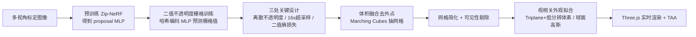

## 一句话总结

用「离散不透明度栅格 + 每像素多光线超采样 + 二值熵正则」把体积辐射场逐步"锐化"成硬表面，训练收敛时不透明度自然二值化，从而能抽取出保留细枝末叶等亚像素细节的紧凑三角网格，并在手机上实时渲染，显著缩小了基于表面与基于体积的新视角合成之间的质量鸿沟。

## 研究背景

新视角合成的两条主流路线各有取舍：

- 体积渲染路线（NeRF、Zip-NeRF、3DGS）质量最高，擅长重建细几何，但它们即便对坚硬表面也倾向用"模糊"的半透明体积来表示，导致渲染成本高、表面难以精确定位。即便加上促进表面的正则项，硬表面仍会被表示成半透明体。
- 表面渲染路线（如 BakedSDF）计算量低、可用硬件光栅化实时渲染，但难以恢复细几何。根本原因在于当前主流的 SDF 重建范式：训练时把 SDF 软转换为模糊密度体，让模型得以用"模糊"方式偷懒表示薄结构，抽网格（baking）时这些薄结构常常消失；而维持 SDF 有效性的 Eikonal 损失又充当平滑先验，进一步抹除细节。

本文的目标是在不用 Eikonal 损失、不做软密度转换的前提下，让体积表示在训练中逐步收敛到表面，既保留重建薄结构的能力，又能精确定位表面以抽取网格。

## 核心方法

方法在一个 SOTA 辐射场模型（Zip-NeRF）基础上做三处关键修改，再配一套网格转换与外观拟合流程。

### 三处关键设计

离散不透明度栅格。用一个 $R \times R \times R$ 体素栅格表示场景，每个体素带不透明度 $\alpha \in [0,1]$ 与视相关颜色 $\mathbf{c}$。渲染时从相机沿光线与路径上所有体素求交，按前到后 alpha 合成：

$$C = \sum_{k} \alpha_k \left( \prod_{j=1}^{k-1} \alpha_j \right) \mathbf{c}_k$$

与 NeRF 把密度按采样间距转换为不透明度不同，这里直接参数化 $[0,1]$ 的不透明度（沿用 MobileNeRF），合成是有限求和、无任何近似。其关键优势在于：当所有不透明度都二值时，表面必然位于光线上第一个 $\alpha=1$ 的体素处。

二值熵损失。仅优化不透明度不会自然二值化，作者加一个熵损失，把 $<0.5$ 的值拉向 0、$>0.5$ 的拉向 1：

$$\mathcal{L}_\text{ent} = \frac{1}{k} \sum_{k} H(\alpha_k), \qquad H(p) = -p\log_2 p - (1-p)\log_2(1-p)$$

训练收敛时不透明度普遍二值化，使得优化几何与抽取几何高度一致，避免了 SDF 方法"训练时模糊、baking 时消失"的问题。

每像素多光线超采样。经过正确抗锯齿的照片中，每个像素是其视锥内所有光线的积分。对遮挡边界的"混合像素"，体积方法靠半透明前景来同时纳入前后景贡献；但这违反了二值假设——单条穿过像素中心的光线只会命中前景或背景其一，产生锯齿与错误强度。为此训练时对每个像素在其足迹内均匀采样 16 条子光线，取算术平均作为像素值。超采样对薄结构（常覆盖不足一个像素）的重建质量提升显著。

### 高分辨率的可行性技巧

薄结构需要约 $2^{13}$ 量级的分辨率 $R$，直接存不透明度需 >2 TB 内存。作者用带多分辨率哈希编码的 MLP 预测栅格值（仅在量化位置查询，整体仍是离散表示）。又因高分辨率下逐体素查询不可行、而不透明度渲染忽略采样间距导致随机采样估计不准，作者先训一个 Zip-NeRF 得到收敛的 proposal MLP（权重冻结），只在其预测分布的固定数量采样点上查询，保证有限求和被准确计算；落入同一体素的多个采样点只取第一个，确保每体素至多贡献一次。

### 网格转换

- 体积融合去外点：自由空间与遮挡内部的体素从未被监督，不透明度任意，朴素抽网格会产生大量漂浮伪影与内部废几何。即便借助 proposal MLP 只在被采样体素附近实例化表面，仍有采样不一致的体素被误判为 $\alpha=1$。作者对模型渲染的深度图做体积融合（Curless & Levoy 1996）过滤这些假阳性，同时完整保留薄结构；融合还输出稠密隐式表示，经 $\sigma=1$ 高斯模糊去噪后用 Marching Cubes 转为无洞网格。
- 简化与可见性剔除：用二次误差边坍缩简化（对远处更激进），再剔除训练相机不可见的三角形。为避免新视角出现空洞，用训练相机位姿加随机偏移/旋转扩充可见性估计的位姿集。剔除必须在简化之后做，否则简化算法难以应对剔除引入的大量小洞。

### 网格外观模型

针对高细节网格系统比较了多种外观表示：UV 贴图（现有工具难以处理如此复杂网格）、顶点属性（要求顶点密度高于纹理密度，导致网格过大）、体纹理（质量最高但显存高达 4513 MB）、以及 Triplane + 低分辨率体素（缓存友好、随机访问快）。最终选 Triplane + 低分辨体素，质量接近体纹理但更紧凑、渲染最快（477 FPS）。视相关编码上，球面高斯优于球谐与神经特征向量（24 字节/纹素，质量最佳）。实时端基于 Three.js，用时序抗锯齿（TAA）替代昂贵的超采样抗锯齿（SSAA），每帧每像素单采样即可达到与 SSAA 相当的质量。

## 实验结果

在 Mip-NeRF 360 室内外场景上评估。

新视角合成质量（户外/室内 PSNR，分体积类与表面类对比）：

| 方法 | 类型 | 户外 PSNR | 室内 PSNR |
|------|------|-----------|-----------|
| Zip-NeRF | 体积 | 25.68 | 32.65 |
| 3DGS | 体积 | 24.64 | 30.41 |
| SMERF | 体积 | 25.32 | 31.32 |
| BakedSDF | 表面 | 22.47 | 27.06 |
| Mobile-NeRF | 表面 | 21.95 | – |
| 本文 (SSAA) | 表面 | 23.94 | 27.71 |

在表面类方法中本文户外 PSNR 最高，缩小了与体积方法的差距，尤其在薄结构重建上。

渲染速度（FPS）：本文是唯一能在测试手机上实时渲染的方法。手机 400×750 达 67 FPS，笔记本 1280×720 达 448 FPS，桌面 1920×1080 达 927 FPS，全面快于 MERF、3DGS、BakedSDF。

与 BakedSDF 直接对比（户外，为公平将本文外观模型也拟合到 BakedSDF 网格得 BakedSDF++）：本文 PSNR 23.94 对 BakedSDF++ 的 22.50，且面数仅 13M 对 40M（网格紧凑约 3 倍）。

消融（户外）：去掉超采样（PSNR 降到 23.38）、去掉熵损失（23.21）、把分辨率从 8192 降到 2048（22.44）都会明显损害薄结构重建，说明三要素缺一不可。存储分析显示原始网格可达数十亿面、>20 GiB，经简化与剔除可压缩约 100 倍至约 200 MiB，此后总体积主要由外观模型主导（约 76%）。

## 贡献与局限

贡献：

- 首个能重现输入图像中亚像素结构的基于网格的新视角合成方法，靠高分辨率不透明度栅格 + 超采样 + 二值熵损失实现表面收敛。
- 摆脱 SDF 范式的 Eikonal 损失与软密度转换，使优化几何与抽取几何高度一致，薄结构不再在 baking 时消失。
- 一套可扩展的融合式网格化 + 简化 + 剔除流程，以及对网格外观表示的系统评估（Triplane+体素 / 球面高斯 / TAA），产出可在手机实时渲染的紧凑网格；相较 BakedSDF 网格紧凑约 3 倍、户外 PSNR 高 1.46 dB。

局限：

- 训练期超采样带来很大计算开销。
- 欠约束的背景区域重建噪声大，显著增大网格体积，或可用平滑正则缓解。
- 室内场景与体积方法的差距更大，作者归因于图像间光照（如阴影）变化难以被低容量视相关模型在表面上捕捉；大型离线视相关网络能明显提升质量，SMERF 式可插值视相关网络是有前景的实时替代。
- 外观模型仍占主导存储；结合面向高细节网格的 UV 映射（如同期 Nuvo）与更紧凑网格有望进一步提速省内存。

## 延伸思考

本文的核心洞见是：与其"事后"把模糊体积转成表面（SDF baking 范式的通病），不如在训练中就用离散不透明度 + 熵正则强制几何二值化，让"优化的东西"直接等于"抽取的东西"。超采样则巧妙化解了二值假设与抗锯齿混合像素之间的根本矛盾——把亚像素信息塞进多光线平均而非半透明体素。这为薄结构的表面化重建提供了一条不依赖 SDF 的清晰路径，也提示后续工作可在背景平滑正则、高细节网格 UV 参数化、以及更强但仍可实时的视相关外观模型上继续推进，进一步弥合表面与体积方法的质量鸿沟。
