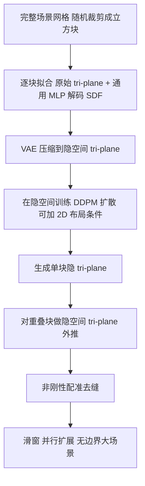

## 一句话总结

BlockFusion 把 3D 场景表示为可拼接的立方块，在压缩后的隐空间 tri-plane 上训练扩散模型生成高质量块，并通过对重叠 tri-plane 的隐空间外推（extrapolation）无缝扩展出无边界的大型室内外 3D 场景。

## 研究背景

高质量 3D 内容对游戏、影视、AR／VR 至关重要，而 2D 扩散模型的成功也激发了 3D 生成研究的热潮。但已有方法大多聚焦于固定空间尺度的内容（如有限大小的单个物体），对「可扩展（进而无限）的 3D 场景」这一逐渐重要的任务关注不足。开放世界游戏尤其需要用户能自由探索、不被预设世界边界限制的场景，而当前实践仍高度依赖美术师的手工搭建，耗时且昂贵。

用扩散模型生成可扩展 3D 场景面临两大挑战：其一，场景级的高保真 3D 形状生成本身很难，场景的方差比单个物体大若干数量级，物体的排列组合近乎无限，难以用扩散概率模型逼近其分布；其二，从已有场景向更大场景的扩展并不平凡，新旧场景之间的过渡区域需要在语义与几何上都协调一致。

最接近的工作 Text2Room 用预训练 2D 扩散模型生成图像再借深度提升到 3D，纹理效果出色，但依赖单目深度预测，几何易失真，且靠移动透视相机扩展场景，遇到遮挡（如相机穿墙）会破坏连续性，难以突破房间尺度。另一条路线是直接在 3D 数据上学习，用 tri-plane 加 MLP 解码器的混合神经场表示；但 tri-plane 扩散因维度高、冗余大，此前只在小方差数据（规范化人体、单类别 ShapeNet 物体）上成功。BlockFusion 沿此路线，但引入隐空间 tri-plane 压缩，首次在场景级实现高质量、多样的形状生成。

## 方法

整体框架：训练分三步。首先把完整 3D 场景网格随机裁剪成固定大小的立方块，逐块拟合成「原始 tri-plane」（raw tri-plane，含几何特征）加一个通用 MLP 解码 SDF；然后用变分自编码器（VAE）把原始 tri-plane 压缩到分辨率与通道都更低的「隐空间 tri-plane」；最后在隐空间 tri-plane 上训练 DDPM 扩散模型，可选地融入 2D 布局条件。推理时逐块生成，并通过对重叠块隐空间 tri-plane 的外推实现滑窗式场景扩展。

关键设计：

- 混合神经 SDF 与原始 tri-plane 拟合：用有符号距离场表示形状，tri-plane 把稠密 3D 体素网格分解到 XY、YZ、XZ 三个轴对齐平面。给定查询点 $$p$$，通过正交投影、双线性插值查特征并逐特征维相加，再送入 MLP 解码 SDF：
$$\Phi(p)=\mathrm{MLP}_{\theta}\left(\bigoplus_{i\in\{1,2,3\}}\mathrm{Interp}_{x^{(i)}}(\mathrm{Proj}_{x^{(i)}}(p))\right)$$
拟合时联合优化 tri-plane 与 MLP，几何损失由 SDF 项、法向项与 Eikonal 项组成，并采用球面几何初始化与由粗到细的分辨率提升以稳定收敛。最终 tri-plane 尺寸为 $$3\times128^2\times32$$。

- 压缩到隐空间 tri-plane：直接在原始 tri-plane 上训练扩散会因高冗余与大形状方差而坍塌。受 Stable Diffusion 启发，用自编码器将原始 tri-plane 压缩为保持 tri-plane 结构的隐编码 $$z$$（分辨率 $$32^2$$，通道 $$c\in\{2,16\}$$）。自编码器损失为重建 $$L_1$$、很小权重的 KL 项与几何损失之和，以几何损失为主：
$$\mathcal{L}_{AE}=\mathcal{L}_{rec}(x,\mathcal{D}(\mathcal{E}(x)))+\mathcal{L}_{KL}(x,\mathcal{D},\mathcal{E})+\mathcal{L}_{geo}$$

- 隐空间 tri-plane 扩散与 3D 感知 U-Net：扩散网络 $$\Psi$$ 直接预测 $$z_0$$，目标为
$$\mathcal{L}_{LTD}=\lVert\Psi(z_t,\gamma(t))-z_0\rVert^2$$
骨干为时间条件 U-Net：把 tri-plane 展开成三个独立平面做下采样卷积，展平成 1D token 拼接后经 $$K=6$$ 组自注意力与残差块实现跨平面通信，再重组回 tri-plane。相比 Rodin 用 max-pooling 的 3D 感知卷积，注意力机制避免了信息丢失。

- 2D 布局条件：把物体地面投影按类别做成二值特征图 $$l$$，与 $$z_t$$ 三个平面直接拼接，损失为
$$\mathcal{L}_{c\text{-}LTD}=\lVert\Psi(z_t,\gamma(t),l)-z_0\rVert^2$$
布局能控制元素的整体摆放，但不锁死细节形状，同一布局下可生成多样结果。

- 隐空间 tri-plane 外推：受 Repaint 启发，给定已知块 $$P$$ 的隐编码作为条件、与之部分重叠的空块 $$Q$$，在去噪过程中用已知块加噪版本同步未知块的重叠区域。外推被分解到三个 2D 平面分别进行：对第 $$i$$ 个平面，用重叠掩码 $$O_i$$ 做同步
$$z^{Q}_{t-1}(i)\leftarrow\mathrm{Cat}(z^{P}_{t-1}(i)\in O_i,\ z^{Q}_{t-1}(i)\notin O_i)$$
当 $$i=3$$ 两平面平行无显式重叠时，只对平面 $$\{1,2\}$$ 同步，靠自注意力把信息传播到第三平面。为保证语义与几何一致，采用 Repaint 的 resampling 策略（回退步 $$J=100$$、重采样次数 $$R$$），回滚重新加噪多次以协调重叠区与新生成区。

- 去缝与并行扩展：隐空间同步只保证语义对齐，抽掉高频细节后仍有细缝。方法对提取出的表面网格做基于 NDP 的非刚性配准，用 Chamfer Distance 让外推网格在重叠区贴合条件网格、在非重叠区保持自身结构。构建大场景时，先并行生成互不重叠的种子块，再并行外推其余空块，避免纯串行的高耗时。

## 实验结果

在 3D-Front／3D-FUTURE 室内、以及美术师设计的城市、乡村场景上测试。单块无条件生成以同为 tri-plane 扩散的 NFD 为基线（NFD 用占据值、本文用 SDF），隐空间 tri-plane 扩散在 Coverage 上大幅领先（CD／EMD 各提升约 27.84％／25.83％），而原始 tri-plane 扩散无法产生合理结果。室内场景生成以 Text2Room 为基线，做 48 人用户研究，按感知质量（PQ）与结构完整度（SC）在纯几何（G-）与带纹理（T-）两种模式 1∼5 分打分。

| 指标（1∼5 分） | Text2Room | BlockFusion |
| --- | --- | --- |
| 几何感知质量 GPQ↑ | 1.92 | 4.44 |
| 几何结构完整度 GSC↑ | 1.92 | 4.58 |
| 纹理感知质量 TPQ↑ | 2.27 | 4.08（+Meshy） |
| 纹理结构完整度 TSC↑ | 2.29 | 4.17（+Meshy） |

无条件室内块生成的 MMD／COV／1-NN 指标显示，隐空间 tri-plane 扩散（$$z_0$$ 目标）相较 NFD 全面更优：

| 方法 | MMD-CD↓ | COV-CD↑ | 1-NN-CD↓ |
| --- | --- | --- | --- |
| NFD | 0.0445 | 22.66 | 89.08 |
| 原始 tri-plane 扩散（Ours） | 0.0544 | 23.99 | 89.91 |
| 隐空间 tri-plane 扩散（Ours） | 0.0324 | 51.83 | 70.66 |

消融显示：隐空间 tri-plane 用约 99.6％ 的压缩率仍保留可用的形状表达力，而同等压缩率的 4096 维隐向量无法表示 3D 场景；resampling 次数增加会让重叠区 Chamfer Distance 稳步下降并在 3 次后收敛，$$R=0$$（不同步）时几何一致性极差；非刚性配准后处理能有效消除细缝。单次布局条件下的 tri-plane 外推约需 6 分钟，生成图示大型室内场景约 3 小时。

## 亮点与局限

亮点：提出可泛化的高质量隐空间 tri-plane 扩散模型，首次把 tri-plane 扩散推到大方差的场景级；隐空间 tri-plane 外推让场景在语义与几何上无缝扩展，理论上可无边界延展；2D 布局条件提供对元素摆放的精确控制；并行种子块加外推的策略缓解了串行扩展的耗时。

局限：训练成本高（3D-Front 57K 块的拟合、VAE、扩散分别约 4750／768／384 GPU 小时），单次外推与整场景生成仍耗时较长；本身只生成几何，纹理依赖外部工具（Meshy）；隐空间抽掉高频细节导致外推处出现细缝，需额外非刚性配准修补；论文主要考虑沿单轴滑动扩展的情形。

## 延伸思考

BlockFusion 的核心启示在于「把难以生成的表示压缩到更易学的隐空间，再在隐空间做扩散与外推」这一思路对 3D 场景生成的价值：原始 tri-plane 虽能忠实重建却难以直接扩散，经 VAE 压缩后反而成为更优的生成代理，这与 2D 隐扩散的经验一脉相承。它把「无边界场景生成」转化为「可拼接块的隐空间外推」，用 Repaint 式同步加 resampling 保证过渡协调，再以显式非刚性配准补齐隐空间丢失的高频细节，体现了「隐空间求语义一致、显式后处理求几何精度」的分工。其创造力来自对已有元素的新颖重排（如生成形似数字「24」的桌子），也提示这类生成更擅长组合式创新而非全新语义的凭空创造。未来若能联合生成几何与 PBR 纹理、支持多轴任意方向扩展并降低外推耗时，这套「块状隐 tri-plane + 外推」范式有望成为交互式大规模 3D 场景创作的通用底座。
