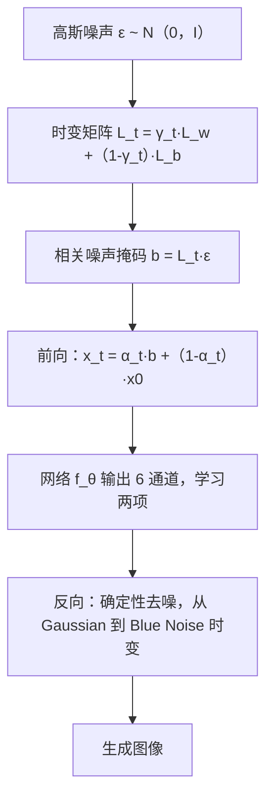

## 一句话总结

该工作在确定性扩散模型中引入「相关噪声」，通过一个从白噪声平滑过渡到高斯蓝噪声的时变噪声模型，并配合可实时生成的蓝噪声掩码，在多个数据集上以更低的 FID 提升了图像生成质量。

## 研究背景

主流扩散模型在训练和采样的所有时间步都使用高斯白噪声，其功率谱覆盖全频段。去噪网络的工作方式呈现出明显的「由粗到细」特征：早期时间步先重建低频的整体形状与结构，随着时间步减小逐步细化高频细节。这说明扩散过程与图像的频率成分之间存在隐含关系，但噪声本身的频率特性对去噪过程的影响却少有研究。

计算机图形学中，蓝噪声（高频、缺乏低频能量）被广泛用于抖动、渲染误差分布和去噪，且已知蓝噪声配合低通滤波能降低感知误差。已有一些工作尝试在扩散中引入非各向同性噪声或受热扩散启发的频率控制，但生成质量受限、难以推广。作者由此提出：把相关噪声（尤其是蓝噪声）以时变方式引入扩散过程，利用其在细节保持上的优势来改进生成。

## 方法

整体框架建立在确定性扩散模型 IADB（Iterative alpha-(de)Blending）之上，在保持其超参与特性的前提下，从两条正交的相关性轴切入：像素之间的噪声相关（蓝噪声掩码）与一个 mini-batch 内图像之间的相关（整流映射）。

关键设计一：相关噪声掩码的实时生成。蓝噪声掩码的协方差矩阵 $$\Sigma$$ 由一万张（用模拟退火按 Ulichney 目标函数预先生成的）蓝噪声掩码的相关矩阵平均得到。对 $$\Sigma$$ 做 Cholesky 分解得到下三角矩阵 $$L$$（满足 $$LL^{T}=\Sigma$$），则相关噪声可高效由

$$b = L\boldsymbol{\epsilon}$$

生成，其中 $$\boldsymbol{\epsilon}\sim\mathcal{N}(0,I)$$。对 $$64\times 64$$ 噪声，$$L$$ 尺寸为 $$64^{2}\times 64^{2}$$。为生成高分辨率掩码，作者借鉴 Kollig 与 Keller 的做法，用低维掩码平铺（padding）拼成高维掩码，使 $$256^{2}$$ 分辨率的开销可忽略，代价是拼接处出现几乎不可见的接缝。

关键设计二：时变噪声模型。用两个固定矩阵 $$L_w$$（单位阵，代表白噪声）与 $$L_b$$（蓝噪声）按系数 $$\gamma_t$$ 插值：

$$L_t = \gamma_t L_w + (1-\gamma_t) L_b$$

前向过程为

$$x_t = \alpha_t (L_t \boldsymbol{\epsilon}) + (1-\alpha_t) x_0$$

对应反向过程推导为

$$x_{t-1} = x_t + (\alpha_t-\alpha_{t-1})(x_0 - L_t\boldsymbol{\epsilon}) + (\gamma_t-\gamma_{t-1})\alpha_{t-1}(L_b\boldsymbol{\epsilon}-L_w\boldsymbol{\epsilon})$$

当 $$L_b=L_w$$ 时模型退化为 IADB。为学习反向过程的两项，网络输出改为 6 通道（两组 3 通道图像 $$f'_{\theta}$$ 与 $$f''_{\theta}$$），损失为

$$\mathcal{L}_{Ours} = \sum_t \left( (f'_{\theta}(x_t,t) - (x_0 - L_t\boldsymbol{\epsilon}))^2 + \frac{\gamma_t-\gamma_{t-1}}{\alpha_t-\alpha_{t-1}} (f''_{\theta}(x_t,t) - \alpha_{t-1}(L_b\boldsymbol{\epsilon}-L_w\boldsymbol{\epsilon}))^2 \right)$$

$$\gamma$$-调度器采用基于 sigmoid 的参数化（由 $$start$$、$$end$$、$$\tau$$ 控制），实践中固定 $$start=0$$、$$end=3$$，并按分辨率设 $$\tau$$（$$128^{2}$$ 取 0.2，$$64^{2}$$ 取 1000）。整个反向过程仍然是确定性的，从初始高斯噪声出发、中间步无需额外注入噪声。

关键设计三：整流映射（rectified mapping）。受 Rectified Flow 与 InstaFlow 启发，在 mini-batch 内对噪声-图像配对做上下文分层：计算噪声与数据两两、逐像素的距离，为每个 $$\boldsymbol{\epsilon}$$ 选取尚未被使用且距离最短的 $$x_0$$，从而缩短配对轨迹、让梯度流更平滑。

## 实验结果

在无条件图像生成上，与确定性扩散模型 DDIM、IADB 对比（使用相同初始高斯噪声），FID 结果如下：

| 数据集 | DDIM | IADB | Ours |
| --- | --- | --- | --- |
| AFHQ-Cat（$$64^{2}$$） | 9.82 | 9.19 | 7.95 |
| AFHQ-Cat（$$128^{2}$$） | 10.73 | 10.81 | 9.47 |
| CelebA（$$64^{2}$$） | 9.26 | 7.53 | 7.05 |
| CelebA（$$128^{2}$$） | 11.92 | 20.71 | 16.38 |
| LSUN-Church（$$64^{2}$$） | 16.46 | 13.12 | 10.16 |

本方法在所有数据集上都优于 IADB；仅在 CelebA（$$128^{2}$$）上被 DDIM 超过，作者归因于 DDIM 采用了不同的 $$\alpha_t$$ 表达式（IADB 在该数据集上同样表现不佳）。

消融（AFHQ-Cat $$128^{2}$$）显示噪声组合的影响：仅白噪声 FID 10.81、仅蓝噪声 17.61、白+红噪声 13.64、白+蓝噪声 9.47（Precision 0.78 / Recall 0.34），验证了高频蓝噪声在细节保持上的作用，而仅用蓝噪声因缺乏低频能量难以在后期细化。整流映射在少步数（如 4 步 FID 从 130.8 降到 118.3）时更优，步数增大后略有下降。条件生成（超分辨率）上，本方法在 SSIM、PSNR、MSE 上均优于 IADB。

## 亮点与局限

亮点：首次系统地把图形学中的蓝噪声/相关噪声引入扩散生成，揭示了噪声频率特性与去噪由粗到细过程的关系；时变噪声模型形式简洁、可退化为 IADB，且给出了可实时生成相关噪声掩码的工程方案；实验一致性强。

局限：$$\gamma$$-调度器的最优参数需额外 epoch 搜索，作者只能用固定 $$\tau$$ 的折中方案；高分辨率掩码的平铺会带来接缝；框架目前构建在 IADB 上，迁移到 DDIM 等需额外工作；仅在 2D 图像上验证。

## 延伸思考

时变噪声本质上把「什么频率的噪声在什么阶段最有利于去噪」变成了一个可学习/可调度的问题，这与噪声调度（noise scheduling）研究相呼应。将其推广到插值两种以上噪声（低通、带通）、迁移到 DDPM / DDIM / 潜空间扩散，乃至视频与 3D 网格生成，都是自然的延伸方向。此外，「数据样本相关」与「噪声相关」是正交的两条改进路径，如何更高效地设计 batch 内配对策略仍值得深入。
