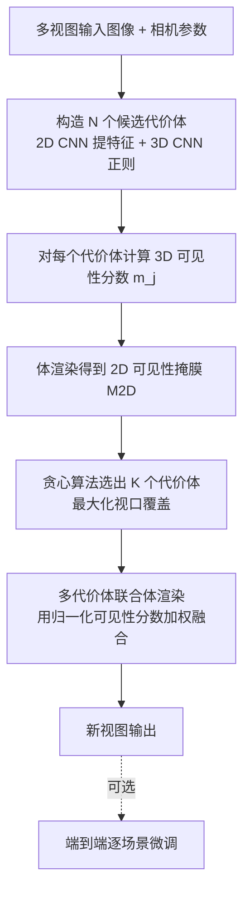

## 一句话总结

针对基于多视图立体（MVS）的 NeRF 在大场景、无界场景中单一代价体（cost volume）视口覆盖有限、易产生填充伪影与错误几何的问题，本文提出一个免训练、可即插即用于任意 MVS-based NeRF 的推理方案：用 3D 可见性分数选择并组合多个代价体做联合体渲染，从而扩大有效视口、提升渲染质量，且整条流程端到端可微、可再做逐场景微调。

## 研究背景

NeRF 类方法能实现照片级新视图合成，但需要逐场景长时间训练。可泛化 NeRF 与 MVS-based NeRF（如 MVSNeRF、ENeRF）通过 2D CNN 提特征、构造代价体、以前馈方式合成新视图，大幅降低了对逐场景训练的依赖，但通常以牺牲质量为代价。

其核心瓶颈在于：这些方法只用少量（如 3 张）输入视图构造单一代价体，导致

- 视口覆盖受限：新视图边界出现填充伪影；
- 输入视图不足：遮挡消解（disocclusion）区域出现错误几何与伪影。

作者指出，这些缺陷即使做逐场景微调也难以消除。一个朴素思路是训练一个吃更多输入视图的新模型，但会带来更大的显存开销，且推理时输入视图仍可能不够。因此本文转向"渲染时同时考虑多个代价体"的方向。

## 方法

### 整体框架

给定无界场景的多视图图像，目标是在不做逐场景训练的前提下合成新视图。方法分四步：为代价体中每个采样 3D 点计算 3D 可见性分数；将其体渲染为 2D 可见性掩膜；在一个支撑集内组合多个代价体做联合渲染；用贪心算法迭代选择代价体以最大化视口覆盖。整条流程端到端可微，可选做逐场景微调。

### 关键设计

MVS-based NeRF 基础。沿用 MVSNet 的思路，把输入特征 warp 到目标视图构造特征体，计算多视图特征方差得到编码体，再用 3D CNN 正则化得到代价体 $CV$。给定新视点，用 MLP 查询颜色与密度：

$$(c, \sigma) = \mathrm{MLP}_\theta\!\left(p,\, v,\, CV(p),\, C_{in}\right)$$

再沿光线做体渲染。标准体渲染公式为：

$$C(\mathbf{r}) = \sum_{j=1}^{J} T(j)\,\alpha(\sigma_j \delta_j)\,c_j$$

其中 $T(j) = \exp\!\left(-\sum_{s=1}^{j-1}\sigma_s\delta_s\right)$ 为累积透射率，$\alpha(x)=1-\exp(-x)$ 为不透明度，$\delta_j = u_{j+1}-u_j$ 为相邻采样点间距。

3D 可见性分数与 2D 可见性掩膜。用 $\mathbb{1}_i(p)$ 表示采样点 $p$ 是否落在参考视图 $i$ 的视口内，$I$ 为参考视图总数，则该点的 3D 可见性分数为：

$$m_j = \frac{\sum_{i=1}^{I} \mathbb{1}_i(p)}{I}$$

取值范围 $[0,1]$，越大表示该点被越多参考视图观测、信息置信度越高，可作为该代价体上点特征的权重。将 3D 分数沿光线体渲染即得 2D 可见性掩膜：

$$M_{2D}(\mathbf{r}) = \sum_{j=1}^{J} T'(j)\,\alpha(m_j \delta_j)\,m_j$$

其中 $T'(j) = \exp\!\left(-\sum_{s=1}^{j-1} m_s\delta_s\right)$。该掩膜刻画了每个代价体对目标新视图的贡献，用于后续选择。

多代价体联合渲染。先看单代价体情形，把可见性分数并入渲染：

$$C_{single}(\mathbf{r}) = \sum_{j=1}^{J} T_{single}(j)\,\alpha(\sigma_j\delta_j)\,m_j\,c_j$$

$$T_{single}(j) = \exp\!\left(-\sum_{s=1}^{j-1}\left(\sigma_s\delta_s - \ln m_s\right)\right)$$

再推广到组合 $K$ 个选定代价体：

$$C(\mathbf{r}) = \sum_{k=1}^{K}\sum_{j=1}^{J} T_{combined}(j)\,\alpha\!\left(\sigma_j^k \delta_j\right) M_j^k\, c_j^k$$

$$T_{combined}(j) = \sum_{k=1}^{K}\exp\!\left(-\sum_{s=1}^{j-1}\left(\sigma_s^k \delta_s - \ln M_s^k\right)\right)$$

其中 $M_j^k = \dfrac{m_j^k}{\sum_{k=1}^{K} m_j^k}$ 为归一化后的 3D 可见性分数，保证所选代价体上的分数之和为 1。把多个代价体 warp 到新视图视锥后按可见性加权融合，能扩大视口覆盖、用更一致的几何缓解伪影。

支撑代价体集选择。取 $I$ 个参考视图构造单个代价体时，候选代价体总数为组合数 $\binom{N}{I}$；全部使用会带来高显存与低效率。因此只选 $K$ 个组合渲染。最大化覆盖是 NP-hard 的最大覆盖问题，作者用贪心算法在多项式时间内构造 $K$ 个代价体的支撑集 $S$：每轮从剩余代价体中选出与当前未覆盖区域 $P_{i-1}$ 乘积之和最大的那个（即对覆盖增益最大），加入 $S$ 并更新覆盖 $P_i \leftarrow P_{i-1}\cdot(1 - M^{2D}_{best})$，直到选满 $K$ 个。作者援引 Nemhauser 等人的结论说明该贪心在多项式时间内最优。随着迭代加入更多代价体，新视图有效区域逐步扩大、质量单调提升。

端到端微调。整条流程可微，可在新场景上做逐场景微调，进一步精修代价体内的几何与颜色一致性、消除填充伪影，从而增强 ENeRF、MVSNeRF 等骨干的表现。

## 实验结果

在 Free（无界、自由相机轨迹的户外场景）与 ScanNet（大规模室内场景）两个数据集上评估，以 PSNR / SSIM / LPIPS 与 FPS 衡量。默认骨干为 ENeRF，取 $N=6,\ I=3,\ K=4$。所有实验在单张 RTX 4090 上完成。

Free 数据集主要结果：

| 方法 | 设定 | PSNR ↑ | SSIM ↑ | LPIPS ↓ |
|------|------|--------|--------|---------|
| ENeRF | 免逐场景优化 | 23.24 | 0.844 | 0.225 |
| ENeRF + Ours | 免逐场景优化 | 24.21 | 0.862 | 0.218 |
| MVSNeRF | 免逐场景优化 | 20.06 | 0.721 | 0.469 |
| MVSNeRF + Ours | 免逐场景优化 | 20.52 | 0.722 | 0.470 |
| ENeRF（微调） | 逐场景优化 | 25.19 | 0.880 | 0.180 |
| ENeRF + Ours（微调） | 逐场景优化 | 26.14 | 0.894 | 0.171 |

在 Free 数据集上集成本方法可为 MVS-based NeRF 带来约 0.5~1.0 dB 的 PSNR 提升且无需额外训练；再做微调可进一步改善。

ScanNet 数据集上，免逐场景优化时本方法（骨干 ENeRF，PSNR 约 31.7 dB）显著优于同为无训练设定的 SurfelNeRF（19.28 dB）；微调后 ENeRF + Ours 达 32.87 dB。在与 MVSNeRF、ENeRF 的对比中，本方法在无优化设定下的 SSIM 与微调设定下的 PSNR、LPIPS 上取得更好结果。

代价体选择策略消融（Free 全场景）：与 ENeRF 基于位姿距离的选择（PSNR 24.09）、直接选 2D 可见性最大者（24.19）相比，本文最大化视口覆盖的贪心策略取得最佳 PSNR 24.21。

## 亮点与局限

亮点：

- 免训练、模型无关，可前馈式即插即用于任意 MVS-based NeRF，直接换取质量提升。
- 用 3D 可见性分数统一了"代价体贡献度量、多代价体加权融合、贪心视图选择"三件事，思路自洽。
- 整条流程端到端可微，保留了逐场景微调进一步提质的能力。
- 针对大场景与无界户外这类最贴近真实应用的困难场景，改进尤为明显。

局限：

- 组合多个代价体会增加计算量：FPS 相比单代价体基线明显下降（如 Free 上 ENeRF 9.90 降至 5.51）。
- 质量上限仍受限于骨干 MVS-based NeRF 本身；在 ScanNet 免优化设定下 ENeRF + Ours 的 PSNR 略低于原始 ENeRF，说明融合并非在所有指标上都单调更优。
- 参考视图数量、$K$ 值等需按效率与质量折中调参。

## 延伸思考

本文的核心洞见是"单一代价体的视口覆盖不足"，并用可见性驱动的多体融合去补齐——这与 NeRFusion、SurfelNeRF 等"场景级融合"路线的目标相近，但本方法不改动骨干、不需训练，更像一个通用增强工具。沿此思路，可见性分数是否可进一步用于自适应决定每条光线所需的代价体数量（而非全局固定 $K$），从而在质量与 FPS 之间做逐像素权衡，是值得探索的方向。此外，把这套"选择并组合多个局部几何证据"的框架迁移到基于代价体的其他任务（如可泛化的 3D 高斯重建）也具有潜力。
