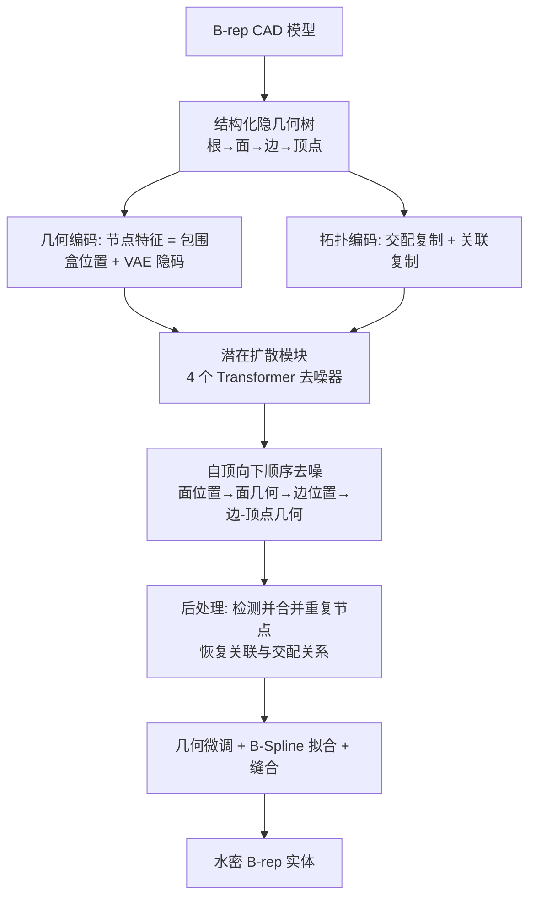

## 一句话总结

BrepGen 把 CAD 的边界表示（B-rep）编码成一棵「结构化隐几何树」，用 Transformer 扩散模型自顶向下（面→边→顶点）逐级去噪节点特征，靠节点复制隐式编码拓扑，去噪后再合并重复节点恢复拓扑，从而首次用扩散模型直接生成含自由曲面、双曲面的水密 B-rep CAD 模型。

## 研究背景

几乎每个人造物都始于 CAD 模型，而 B-rep（Boundary Representation，边界表示）是描述 CAD 形状的主流格式，广泛用于自由曲面建模。一个 B-rep 由相互连接的面（face）、边（edge）、顶点（vertex）组成：面是参数曲面的可见区域，被相邻边围成的闭环裁剪；边是参数曲线被起止顶点裁剪的可见段；邻接关系被完整记录，共同描述最终实体。能直接生成 B-rep 的系统将极大简化 CAD 设计流程，减少对专业设计师和 CAD 软件的依赖。

但直接生成 B-rep 非常困难，主要有两点：其一，与三角网格不同，B-rep 含多种参数曲面与曲线类型（平面、圆柱、圆锥、球、圆环、Bezier、NURBS 等），每种几何有各自的定义和参数，难以统一生成；其二，所有几何之间的拓扑关系必须正确，才能构成水密（water-tight）实体。因此已有 CAD 生成模型大多绕开 B-rep，转而生成「草图 + 拉伸」（sketch and extrude）操作序列，但这只能表达有限范围的 3D 形状（线、弧、圆加拉伸）。少数能直接生成 B-rep 的方法如 SolidGen，也被局限于高度简化的棱柱形、非自由曲面。BrepGen 的目标就是用扩散模型无条件地同时生成正确的几何与拓扑，突破到自由曲面。

## 核心方法

BrepGen 的关键是把任意 B-rep 转成一棵固定图拓扑的层次树（结构化隐几何），其中节点特征编码几何、复制节点隐式编码拓扑；再训练 Transformer 扩散模型自顶向下顺序去噪，去噪后检测并合并「近似重复」的节点来显式恢复拓扑，最终输出 B-rep 实体。

核心设计分三块：结构化隐几何树、潜在扩散模块、B-rep 后处理。

## 技术细节

### 结构化隐几何：几何编码

树有三层（面、边、顶点），根节点代表整个 CAD 实体。每个节点特征由「全局位置」和「局部形状隐码」组成：

- 面 $$F$$：底层是参数曲面 $$S(u,v):\mathbb{R}^2\rightarrow\mathbb{R}^3$$。仿照 UV-Net，在 UV 域上按 $$N\times N$$ 均匀网格采样 3D 点得到形状特征 $$F_s\in\mathbb{R}^{N\times N\times 3}$$；位置特征 $$F_p=[x_1,y_1,z_1,x_2,y_2,z_2]$$ 是轴对齐包围盒的两个角点。把点归一化到规范立方体 $$[-1,1]^3$$ 后，用一个 UNet 骨干的 VAE 把 $$F_s$$ 压成隐码 $$F_z$$，面节点特征即 $$F=[F_p,F_z]$$。注意该特征不含裁剪边界与内孔，这些由关联的边给出。
- 边 $$E$$：底层是参数曲线 $$C(u):\mathbb{R}\rightarrow\mathbb{R}^3$$，沿曲线采样得 $$E_s\in\mathbb{R}^{N\times 3}$$，同样用包围盒 $$E_p$$ 与 VAE 隐码 $$E_z$$，得 $$E=[E_p,E_z]$$。
- 顶点 $$V$$：就是一个 3D 坐标 $$V=(x,y,z)$$。

### 结构化隐几何：拓扑编码（节点复制）

拓扑不是显式生成的，而是靠「节点复制」隐式编码，有两种复制方式：

- 交配复制（Mating Duplication）：编码「面-边-面」「边-顶点-边」邻接。被两个面共享的边，会在两个父面下各出现一个特征完全相同的边子节点；共享顶点在其父边下同样复制。这把 B-rep 的图结构变成树。生成后，跨不同父节点合并「几何相似」的边/顶点节点即可恢复交配关系。
- 关联复制（Association Duplication）：一个面的边数、一个实体的面数都是变化的，且推理时未知。方法为每层预设一个最大分支因子，随机复制节点直到填满到最大子节点数（duplication padding）。相比零填充，这种复制填充在推理时产生更少的缺面缺边，随机选择被复制节点还能防过拟合。生成后在同一父节点下删除几何相同的子节点即可恢复关联关系。

### 潜在扩散模块

先用两个 VAE（面用 2D 卷积 UNet、边用 1D 卷积）把形状特征压到低维隐码：设 $$N=32$$ 密采样，下采样 8 倍得 $$F_z\in\mathbb{R}^{4\times 4\times 3}$$、$$E_z\in\mathbb{R}^{4\times 3}$$，边再与两端点顶点拼成联合隐码 $$E_{zv}\in\mathbb{R}^{4\times 3+6}$$。VAE 用 MSE 重建损失加 KL 正则训练。

扩散遵循 DDPM，前向过程给所有节点加噪：

$$q(\mathbf{x}_t|\mathbf{x}_0)=\mathcal{N}(\mathbf{x}_t;\sqrt{\bar{\alpha}_t}\mathbf{x}_0,(1-\bar{\alpha}_t)\mathbf{I}),\quad \mathbf{x}_t=\sqrt{\bar{\alpha}_t}\mathbf{x}_0+\sqrt{1-\bar{\alpha}_t}\boldsymbol{\epsilon}_t$$

加噪后编码的几何与拓扑都被破坏（重复节点特征不再相同）。生成时不一次性生成全部几何，而是把节点分布分解为一串条件分布，自顶向下顺序去噪：

$$p(\mathbf{x})=p(F,E,V)=p(E_{zv}|E_p,F)\,p(E_p|F)\,p(F_z|F_p)\,p(F_p|\varnothing)$$

即边以面为条件、局部几何以全局位置为条件。四个去噪器共享 Transformer 骨干（12 层自注意力、12 头、隐藏维 1024），损失为标准 DDPM 的噪声回归项：

$$L=\mathbb{E}_{t,\mathbf{x}_0,\boldsymbol{\epsilon}_t}\left[\lVert\boldsymbol{\epsilon}_t-\boldsymbol{\epsilon}_\theta(\sqrt{\bar{\alpha}_t}\mathbf{x}_0+\sqrt{1-\bar{\alpha}_t}\boldsymbol{\epsilon}_t,t)\rVert^2\right]$$

条件注入不用 cross-attention，而是利用树中预定义的父子关系直接做 token 相加：设边 $$j$$ 是面 $$i$$ 的子节点，则

$$\hat{\mathbf{E}}_{p,j}\leftarrow\mathbf{E}_{p,j}+\mathbf{F}_i$$

其中 $$\mathbf{F}=\mathrm{MLP}(W_p F_p)+\mathrm{MLP}(W_z F_z)$$。方法不用可学习位置编码，配合训练时随机打乱使模型对 token 排列不变。

### B-rep 后处理

用一组启发式规则找出重复节点并显式解码拓扑：面包围盒角点欧氏距离 < 0.08 且解码点逐点平均差 < 0.2 判为重复面并删除；同法在每个父面下合并唯一边；再从叶到根遍历找不同父节点下的重复子节点（即共享边、顶点）确定交配关系。之后做几何微调：顶点位置对其重复副本取平均，边被缩放平移以对齐起止顶点（反向则翻转），面被缩放平移以最小 Chamfer 距离贴合所有关联边。最后用 OpenCascade 的 `GeomAPI_PointsToBSplineSurface`/`GeomAPI_PointsToBSpline` 把点拟合成 B-Spline 曲面与曲线，闭环裁剪面并缝合成最终实体。在 RTX A5000 上，DeepCAD 数据平均约 5 秒生成一个 B-rep，家具/ABC 复杂数据约 10 秒。

### 家具 B-rep 数据集

作者与 Onshape（PTC）合作，从其公开设计库导出并人工清洗，构建了包含 6,171 个 B-rep、覆盖 10 个常见家具类别的 Furniture B-rep Dataset。据称这是首个既含自由曲面、又带规范类别标签的 B-rep 3D 模型数据集。

## 实验结果

在三个数据集评测：DeepCAD（草图拉伸得到的机械件）、Furniture B-rep（更复杂的家具）、ABC（工业设计的多样部件）。指标分两类：分布指标（Coverage 覆盖率、MMD 最小匹配距离、JSD）与 CAD 指标（Novel 新颖、Unique 唯一、Valid 水密有效比例）。

DeepCAD 无条件生成上，BrepGen 全面超过 DeepCAD 与 SolidGen：

| 方法 | COV % ↑ | MMD ↓ | JSD ↓ | Novel % ↑ | Unique % ↑ | Valid % ↑ |
| --- | --- | --- | --- | --- | --- | --- |
| DeepCAD | 65.46 | 1.29 | 1.67 | 87.4 | 89.3 | 46.1 |
| SolidGen | 71.03 | 1.08 | 1.31 | 99.1 | 96.2 | 60.3 |
| BrepGen | 73.87 | 1.04 | 1.28 | 99.8 | 99.7 | 62.9 |
| BrepGen (ABC) | 57.92 | 1.35 | 3.69 | 99.7 | 99.4 | 48.2 |

（MMD、JSD 均已乘 $$10^2$$。）BrepGen 在覆盖率、MMD、JSD 上都更优，生成结构更复杂、开放/自交区域更少，且新颖唯一比例高，说明生成结果并非训练集复制。新颖性分析（用 LFD、Chamfer 距离检索最相似训练形状）显示生成形状真实又区别于训练数据。

可控生成方面展示了三个应用：类别条件生成（用 classifier-free guidance 在家具数据上按类生成，能产出 SolidGen 做不到的自由曲面）；CAD 自动补全（受 RePaint 启发，给定部分面自动补全整体，把离散部件连成水密实体，还能微调用户输入使其连接）；设计插值（拼接两模型的面 token、扩散 150 步后逐步替换，实现从源到目标平滑的几何+拓扑变化，直接以 B-rep 输出）。

消融研究：（1）两阶段 vs 统一生成——若先用多项式扩散单独生成拓扑（把面-边、边-顶点邻接矩阵当作 $$128\times128$$ 二值图生成），有效率仅 6.2%，说明无条件生成正确邻接矩阵极难；而给定真值拓扑的 BrepGen*（COV 78.16、Valid 79.8）明显更好，印证「统一几何+拓扑联合生成」优于分两阶段。（2）后处理阈值网格搜索显示，包围盒阈值在 0.06~0.1、形状特征阈值约 0.2 时水密率最佳。失败案例分三类：缺面导致非水密、边/面自交导致裁剪后破损、解码点噪声导致几何抖动破碎。

## 贡献与局限

贡献：提出结构化隐几何表示，用层次树 + 节点复制把 B-rep 的几何与拓扑统一进一种格式，让连续几何回归隐式恢复离散拓扑；提出可生成自由曲面与裁剪曲线的潜在扩散模块；发布首个含自由曲面且带类别标签的家具 B-rep 数据集；在多个基准上达到直接 B-rep 生成的 SOTA，并首次生成自由曲面、双曲面 B-rep。

局限：只支持单体实体，多体装配模型留待future work；过近（归一化到 $$[-3,3]$$ 后阈值 0.05，约 7 bit 量化 1 格）的面或边会被误合并；不保证水密，去噪收敛慢可能留小缝或整面缺失；启发式后处理虽快且能处理复杂数据，但学习式后处理可能更鲁棒。

## 延伸思考

BrepGen 最巧妙之处在于「用节点复制把图拓扑塞进固定树、再用几何相似度反向恢复拓扑」这一转换：它把「离散拓扑生成」这个扩散模型不擅长的组合问题，改造成「连续几何回归 + 后处理去重」，从而绕开了直接生成邻接矩阵的极低有效率（消融里仅 6.2%）。这种「让几何相似性隐式承载拓扑」的思路，本质上是把结构约束下沉到几何空间，用连续域的扩散优势去覆盖离散域的组合难题，对其他「几何 + 拓扑」耦合的生成任务（如线框、网格、场景图）都有借鉴价值。同时它也暴露了该范式的软肋——阈值合并带来最小间距限制、去重不保证水密，这些都指向一个方向：把目前的启发式后处理换成可学习、可保证有效性的模块，可能是这类结构化几何扩散走向工程可用的关键一步。
