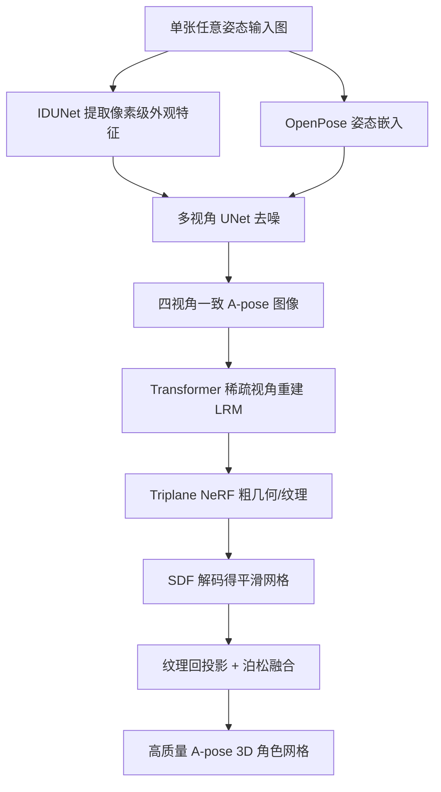

## 一句话总结

CharacterGen 用一个图像条件的多视角扩散模型，把任意姿态的单张角色图同时「转正」成标准 A-pose 并生成四视角一致图像，再经 transformer 稀疏视角重建与纹理回投影，在一分钟内产出可直接绑定动画的高质量 3D 角色网格。

## 研究背景

从单张图像生成高质量 3D 内容能大幅降低影视、游戏、直播、VR 等领域的建模门槛。但 3D 角色比普通物体更棘手：角色关节复杂，2D 图像里经常出现自遮挡；姿态千变万化，其中不乏罕见且难以准确解读的姿势，导致训练数据分布多样却不均衡。这些因素让通用的 text-to-3D 方法和单视角重建方法都难以给出理想结果。

已有工作常借助 SMPL、SMPL-X 等参数化人体模型作为 3D 先验，但它们主要面向写实的人体比例和贴身衣物，对夸张身材比例、复杂服装设计的风格化（如二次元）角色适应性差。另一方面，稀疏视角重建本身在角色上就容易失败，加上多视角生成常见的多面「Janus」问题，使得直接生成能用于绑定和动画的干净角色网格非常困难。

作者提出 CharacterGen，核心思路是在生成过程中同时做两件事：把输入姿态规范化为 3D 建模常用的 A-pose，并保证多视角图像一致。选择 A-pose 是因为在这一姿态下几何与纹理结构更清晰、自遮挡最小，从而显著简化后续的重建、绑定与动画。

## 核心方法

整个流程分两个紧密衔接的阶段：第一阶段把单张图「抬升」到多视角并同时姿态规范化，第二阶段用规范化后的四视角图重建 3D 角色。

关键设计：

- **IDUNet 像素级外观迁移**：为保留输入图的细节外观，作者不满足于 IP-Adapter 仅用全局 CLIP 嵌入（会丢失像素级细节导致不一致）。IDUNet 结构与多视角 UNet 相同，受 ControlNet 启发，但不是把条件特征相加，而是让隐变量 token 与条件图像 token 做交叉注意力，实现两侧所有 patch 的局部交互。由于给 IDUNet 加噪会严重损害纹理细节，作者直接用 VAE 编码无噪的输入图。

- **多视角 UNet 与姿态规范化**：对四视角带噪隐变量 $$x_{4v}\in\mathbb{R}^{B\times 4\times N\times D}$$ 同时去噪，以四个视角的相机外参作为空间引导，推理时固定方位角为 $$\{0^\circ,90^\circ,180^\circ,270^\circ\}$$、俯仰角为 $$0^\circ$$。transformer 块含空间自注意力（把 $$x_{4v}$$ reshape 成 $$(B,4N,D)$$ 做跨视角 patch 交互，保证一致性）和交叉注意力。交叉注意力的条件特征由 IDUNet 特征与 CLIP 图像特征拼接得到：
$$f_{Cond} = \mathrm{concat}(f_{ID}, f_{CLIP})$$
$$x_{4v} = \mathrm{Cross\_Attn}(x_{4v}, f_{Cond})$$
训练采用 zero-SNR（末步信噪比置零）并让 UNet 预测速度 $$v_{pred}$$ 再转噪声，优化噪声预测目标：
$$L_{4v} = \lVert \epsilon_{4v} - \epsilon_{pred}\rVert_2^2$$
为避免只训扩散网络导致布局错位、长出无关肢体，作者用 OpenPose 预测姿态嵌入并直接加到隐变量噪声上，引导模型学习关节与角色布局的关系；推理时从三组 OpenPose 中选 CLIP 分数最高者作为姿态条件。

- **粗到精的 3D 重建**：借鉴 LRM 用深层 transformer 从四视角图重建角色。先在 Objaverse 上预训练以保留通用物体处理能力，再在 Anime3D 上微调注入人体结构先验。采用两阶段微调——先用 triplane NeRF 表示建立粗几何与外观，再改解码器预测 SDF 以获得更平滑精确的表面。重建损失结合 MSE、mask（二元交叉熵）与 LPIPS：
$$L_{recon} = \lambda_1 L_{mse} + \lambda_2 L_{mask} + \lambda_3 L_{LPIPS}$$
默认 $$\lambda_1{=}1,\ \lambda_2{=}0.1,\ \lambda_3{=}0.5$$，并对提取网格做拉普拉斯平滑降噪。

- **纹理回投影精修**：用 DMTet 提取网格与粗 UV 后，因 UV 展开丢失外观细节，再用四视角高分辨率图提升纹理。为解决多 texel 投影到同一像素带来的梯度噪声，作者把图像投影到纹理空间并用深度测试剔除遮挡 texel；对轮廓处噪声，用四个正交视角方向与法线贴图的内积做筛选（内积大于 -0.2 的 texel 被丢弃）；多视角重叠时选 RGB 最接近粗纹理者，最后用泊松融合（Poisson Blending）消除接缝。

- **Anime3D 数据集**：受 PAniC3D 启发，从 VRoidHub 收集近 14,500 个二次元角色，剔除非人形后保留 13,746 个，用 three-vrm 渲染。生成 A-pose 与随机姿态图像对（A-pose 通过设定手臂 Z 轴 45°、大腿 Z 轴 6° 得到），并用 Mixamo 的 10 套骨骼动画随机取帧构造多样姿态与表情，从 $$\{0^\circ,90^\circ,180^\circ,270^\circ\}$$ 等方位角渲染，另加随机方位组增强空间理解。

## 实验结果

实现上以 Stable Diffusion 2.1 为 IDUNet 和多视角 UNet 的基座，训练用 8 张 A800，512×512 训 3 天、768×512 再训 2 天；重建网络先 NeRF 微调 50 epoch、再 SDF 微调 30 epoch（1 天）。推理无需训练，整条流程可在单 GPU 上运行。

在 Anime3D 测试集上的定量对比（2D 多视角生成用 SSIM/LPIPS/FID，3D 用 Chamfer Distance CD）：

| 方法 | SSIM↑ | LPIPS↓ | FID↓ | CD↓ |
| --- | --- | --- | --- | --- |
| CharacterGen (2D) | 0.901 | 0.086 | 0.019 | - |
| Zero123 (fine-tuned) | 0.813 | 0.175 | 1.34 | - |
| SyncDreamer (fine-tuned) | 0.822 | 0.17 | 0.37 | - |
| IP-Adapter+SDXL | 0.845 | 0.143 | 0.074 | - |
| CharacterGen (3D) | 0.898 | 0.093 | 0.032 | 0.001 |
| Magic123 | 0.873 | 0.134 | 0.116 | 0.0034 |
| ImageDream | 0.886 | 0.11 | 0.345 | 0.002 |

CharacterGen 在 2D 与 3D 指标上均领先，几何质量（CD=0.001）明显优于对手。得益于四视角重建机制，它有效避免了「Janus」问题，对未见身体部位也能借 Anime3D 的背/侧视先验给出合理外观，而其他方法常见网格面片粘连、难以绑定动画。

生成速度上优势巨大：

| 方法 | 生成单个角色耗时 |
| --- | --- |
| CharacterGen | 1 min |
| ImageDream | 45 min |
| Magic123 | 70 min |
| TeCH | 270 min |

用户研究（21 名志愿者投票）中 CharacterGen 全面领先：2D 多视角风格一致性 85.4%、多视角一致性 81.0%，3D 几何质量 78.6%、纹理质量 87.1%。CLIP score 评估外观一致性也居首（2D 83.69、3D 79.77）。

消融显示：冻结 IDUNet 无法从提示图提取足够外观、生成图相似度下降，证明联合微调 IDUNet 的必要性；去掉姿态嵌入网络会导致角色在画面中偏移、服装部件不一致，进而影响后续 3D 重建。应用上，作者用 AccuRig 自动绑定生成的 A-pose 角色，并在 Warudo 中驱动动画；对比表明非 A-pose 角色（如 ImageDream 结果）绑定后网格粘连、身体结构严重扭曲，而 A-pose 角色可顺利动画化。

## 贡献与局限

贡献：
- 提出图像条件的多视角扩散模型，能从任意输入姿态生成受控 A-pose 下多视角一致的角色图像，直面自遮挡与姿态歧义。
- 提出流水线，将该扩散模型与 transformer 重建模型结合，把单视角输入高效转为可绑定动画的详细 3D 角色，全程不到一分钟。
- 构建并开放 Anime3D 数据集（13,746 个多姿态多视角二次元角色），为 3D 角色生成研究提供资源。

局限：
- 当角色处于极端姿态或从非常见视角渲染时，四视角 A-pose 生成可能保留信息不足。
- 作者提出未来可在纹理精修阶段引入非真实感渲染（NPR）技术进一步提升纹理，并利用已训练的多视角 UNet 结合 SDS 优化以获得更高的几何质量。
