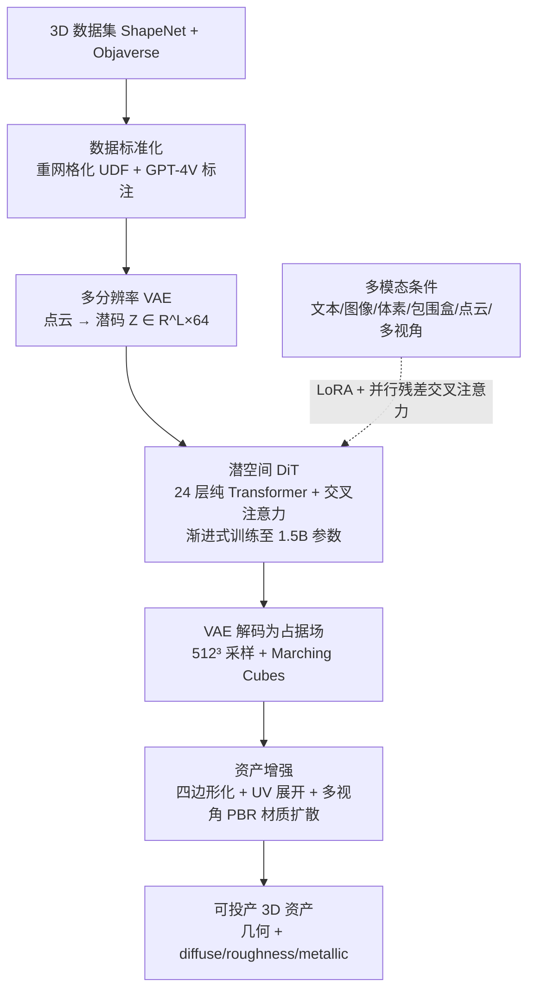

## 一句话总结

CLAY 沿用「先大规模预训练，再轻量适配」的范式，用一个多分辨率 VAE 加极简潜空间扩散 Transformer（DiT）从海量 3D 几何中直接学习几何先验，训练出 15 亿参数的 3D 原生几何生成基础模型，再配合多视角 PBR 材质扩散与多模态条件适配，让文本、图像乃至体素、包围盒、点云等 3D 原语都能可控地生成高质量、可直接投产的 3D 资产。

## 研究背景

3D 想象力让人类得以在物理构建之前就设计结构、空间与系统，但当前的 3D 创作流程仍高度依赖专业美术技能与繁琐手工，远远落后于我们的想象力。2D 生成领域（DALL·E、Imagen、Stable Diffusion）已借助大规模图像数据集、Transformer、扩散模型以及 LoRA、ControlNet 等适配手段彻底革新了创作流程，而 3D 生成尽管进展迅速，却在模型可扩展性与适配能力上远未成熟。

核心挑战有两点：一是高质量 3D 数据集规模有限，二是 3D 资产中几何与外观的固有耦合难以解开。已有工作大致分两条路线：

- **以 2D 图像为先验**：用预训练 2D 扩散模型，通过分数蒸馏（DreamFusion 的 SDS）或多视角生成（Zero-1-to-3、Wonder3D、SyncDreamer）来「提升」到 3D。这类方法外观多样，但缺乏对线条、角度、平面等的显式 3D 控制，几何保真度差，还容易出现多头「Janus」伪影，几何常残缺、缺乏细节。
- **以 3D 几何为先验 / 3D 原生**：直接在 3D 数据上训练，用点云（Point-E）、网格（PolyGen、MeshGPT）、体素（XCube）或神经场（DeepSDF、3DShape2VecSet、Michelangelo）表示。它们更能「理解」并保留几何特征，但生成能力受限于模型规模；一旦放大模型又需要更大数据集，回到了 3D 数据稀缺的老问题。

CLAY 的目标是兼取两者之长：遵循文本／图像生成中成熟的「pretrain-then-adaptation」范式，缓解 3D 数据稀缺，把 3D 原生几何生成的基础模型放大到前所未有的质量与多样性，同时生成富含多视角 PBR 材质的外观。

## 核心方法

CLAY 采用「极简主义」路线，**把几何生成与纹理生成解耦**：不借助 2D 生成来辅助几何，而是证明只要把 3D 生成模型放大、并用足够多的高质量数据训练，直接生成的几何在多样性与质量上都能大幅超越基于／辅助 2D 生成的方法。整体框架由三部分组成：大规模几何生成基础模型、资产增强（几何优化 + 材质合成）、多模态条件适配。

### 表示与模型架构

CLAY 沿用 3DShape2VecSet 的神经场设计，在压缩后的潜空间中学习去噪，类比于 2D 基础生成模型的做法，计算效率远高于直接在 3D 空间操作。

- **多分辨率 VAE**：从网格表面 $$M$$ 采样点云 $$X\in\mathbb{R}^{N\times3}$$，经可学习嵌入与交叉注意力编码为动态形状的潜码 $$Z\in\mathbb{R}^{L\times64}$$：

$$Z=\mathcal{E}(X)=\mathrm{CrossAttn}(\mathrm{PosEmb}(\tilde{X}),\,\mathrm{PosEmb}(X))$$

其中 $$\tilde{X}$$ 是 $$X$$ 的 1/4 下采样，使潜码长度 $$L$$ 缩为输入点数的四分之一。解码器由 24 层自注意力加一层交叉注意力构成，对查询点 $$p$$ 输出占据 logits：

$$\mathcal{D}(Z,p)=\mathrm{CrossAttn}(\mathrm{PosEmb}(p),\,\mathrm{SelfAttn}_{24}(Z))$$

VAE 维度 512、8 个注意力头、共 8200 万参数。关键改进是**多分辨率采样**：每次迭代随机从 2048/4096/8192 中选取采样点数，以捕捉更精细的几何细节。

- **由粗到细的 DiT**：几何生成骨干是 24 层纯 Transformer，加交叉注意力接收文本条件（CLIP-ViT-L/14 编码）。DiT 预测第 $$t$$ 步潜码 $$Z_t$$ 中的噪声：

$$\epsilon(Z_t,t,c)=\{\mathrm{CrossAttn}(\mathrm{SelfAttn}(Z_t\#\#t),\,c)\}_{24}$$

其中 $$\#\#$$ 表示拼接。训练采用**渐进式潜码长度**：从 $$L=512$$、较高学习率起步，逐步增至 1024、2048，并相应降低学习率，以更快收敛。

- **放大方案**：VAE 与 DiT 均采用 pre-normalization 与 GeLU，前馈维度为模型维度的 4 倍；噪声调度用 1000 步离散调度、cosine beta，并按最新实践实现 zero terminal SNR 与「v-prediction」目标以稳定推理。作者训练了从 227M 到 1.5B 参数的五档 DiT（Tiny/Small/Medium/Large/XL），并借鉴 Head addition、Heads expansion、Hidden dimension expansion 在训练中渐进放大模型，以提升时间效率、保留已学知识并降低陷入局部最优的风险。最大的 XL 模型在 256 张 NVIDIA A800 上训练约 15 天。推理时用 100 步去噪、$$512^3$$ 网格稠密采样，再用 Marching Cubes 提取网格。

### 数据标准化

大规模 3D 生成模型的效果取决于数据的质量与规模。作者先过滤掉复杂场景与碎片化扫描，从 ShapeNet 与 Objaverse 精选出 **527K 个物体**，再做两件事：

- **几何统一**：非水密网格难以预测占据场。现成工具（Manifold、ManifoldPlus、mesh-to-sdf、DOGN）要么平滑掉边角、要么结果不一致、要么开销过大。作者受 DOGN 启发采用**无符号距离场（UDF）**表示以便格式转换，并在提取等值面前做**基于网格的可见性计算**——当某网格点从所有角度都被遮挡时标为「内部」，从而最大化正体积、稳定 VAE 训练，同时保留锐利边缘与平面等关键特征。
- **几何标注**：借助 GPT-4V 生成精准、强调几何与风格特征的自动标注，并设计专门的 prompt 标签，让模型能按文本提示生成带有特定复杂度与风格的几何。

### 资产增强

为让生成物直接可用于 CG 管线，CLAY 增加两阶段增强：

- **网格四边形化与图集**：Marching Cubes 产生的数百万不均匀三角面难以编辑与 UV 展开，作者用现成工具将其转为四边面网格，保留锐边与平面，为纹理映射与材质合成打好基础。
- **材质合成**：目标是生成 diffuse、roughness、metallic 三类 PBR 材质。作者从 Objaverse 精选 4 万余个含高质量 PBR 材质的物体，改造 MVDream，在其 UNet 最外层卷积集成三个带跳连的分支，实现多模态并行去噪与视角一致；训练时结合 add-on 层的全参数微调与内部层的 LoRA 微调，并用 ControlNet（以各视角法线图为输入）保证几何对齐、用 IPAdapter 支持图像定制。再借 Text2Tex 的 inpainting、Real-ESRGAN 与 MultiDiffusion 超分，最终在 UV 空间生成 2K 分辨率纹理。相比传统优化方法速度大幅提升。

### 多模态条件适配

预训练后的 CLAY 是通用基础模型，天然支持在 DiT 注意力层上做 **LoRA** 风格微调（如把作品迁移到石头风格、宝可梦风格）。得益于极简架构，它能高效支持多种条件模态。作者利用 pre-normalization 把注意力结果化为残差，从而以**并行残差**方式叠加多个条件：

$$Z\leftarrow Z+\mathrm{CrossAttn}(Z,c)+\sum_{i=1}^{n}\alpha_i\,\mathrm{CrossAttn}_i(Z,c_i)$$

标量 $$\alpha_i$$ 用于直接调节每个附加条件的影响强度。对于图像／草图，用预训练 DINOv2 提取特征直接交叉注意力接入；而对体素、多视角图像、点云、包围盒、部分点云等**空间相关模态**，直接对特征做交叉注意力无法保留空间信息，作者为空间特征学习额外的**位置嵌入**：

$$\mathrm{CrossAttn}_i(Z,\,f+\mathrm{PosEmb}(p))$$

其中特征 $$f\in\mathbb{R}^{M\times C}$$ 与稀疏 3D 点 $$p\in\mathbb{R}^{M\times3}$$ 关联，采样策略按条件类型定制（体素下采样到 $$8^3$$ 特征体、包围盒 8 个角点、稀疏点云采 512 点且置 $$f=0$$、多视角图像反投影到 3D 体、部分点云拼接扩展框角点用于补全）。每个条件模块独立训练一个 $$\mathrm{CrossAttn}_i$$、冻结其余参数，各模块约训练 8 小时即可。

## 实验结果

- **模型规模趋势**：在 16K 文本-形状对验证集上，用 render-FID/KID、P-FID/KID、CLIP、ULIP-T 评估九个版本。规模越大表现越好，XL-P 相比 Tiny-base 全面领先（render-FID 从 12.22 降到 4.02，P-KID 大幅下降），更长潜码（$$L=2048$$ 的 XL-P-HD）进一步提升 P-FID/P-KID。
- **多模态条件精度**：用 CD、EMD、Voxel-IoU、F-score、ULIP-T/I 评估。单一条件即可生成高保真几何，叠加条件进一步提升细节。其中**多视角法线（MVN）条件**表现尤为突出，使 CLAY 可作为其他多视角生成模型的可靠重建后端。
- **与 SOTA 对比**：在 GPT-4 生成的 50 图 + 50 文本测试集上，CLAY 在 CLIP(N-T/I-T/N-I/I-I)、ULIP-T/I 等所有指标上均超越 Shap-E、DreamFusion、Magic3D、MVDream、RichDreamer（文本）以及 Wonder3D、One-2-3-45++、DreamCraft3D、Michelangelo（图像）。SDS 类方法有 Janus 伪影、表面不平且耗时 1.5～4 小时，CLAY 几何平滑且细节丰富。
- **运行时间**：单张 A100 上,形状潜码生成约 4 秒、解码约 1 秒、网格处理 8 秒、PBR 生成 32 秒，**总计约 45 秒**——远快于优化类方法的数小时。
- **prompt 工程与多样性**：加入「asymmetric geometry」「sharp/smooth edges」「low/high-poly」「complex geometry」「character」等标签可精确操控几何风格（甚至把消防栓变成 T-pose 角色）。CLAY 能生成数据集中不存在的新颖结构（如客机机身融合方形进气口与战斗机尾翼的飞机）。
- **PBR 材质**：在变化光照下，CLAY 的金属表面呈现随环境光一致移动的真实高光，而 MVDream 缺乏高光、RichDreamer 把高光当作固定表面纹理。
- **用户研究**：150 名志愿者投票，文本到 3D 中 CLAY 获得 67.4%（外观）与 78.9%（几何）的偏好；图像到 3D 中更达 85.4% 与 91.2%。

## 贡献与局限

**贡献**：

- 提出 CLAY 这一 15 亿参数的 3D 原生几何生成基础模型，将「预训练 + 适配」范式成功引入 3D 资产生成，几何质量、多样性与材质丰富度均达到领先水平。
- 用多分辨率 VAE 加极简潜空间 DiT 的组合，配合渐进式放大训练方案，验证了 3D 生成模型的可扩展性。
- 设计了标准化几何数据处理管线：基于 UDF 与可见性计算的重网格化协议保证水密与特征保留，GPT-4V 自动标注统一了历来格式各异、难以合训的 3D 数据集。
- 通过并行残差交叉注意力 + 可学习位置嵌入，把文本、图像、体素、包围盒、点云、多视角等多模态（含 3D 空间）条件统一接入，支持从概念草图到精细成品的可控创作，并生成可直接投产的多视角 PBR 材质。

**局限**：

- **尚非端到端**：几何与材质分阶段生成，还需重网格化、UV 展开等额外步骤；未来希望统一几何与 PBR 材质的架构，并生成拓扑一致的几何。
- **数据仍有提升空间**：相比训练 Stable Diffusion 的 2D 数据集，3D 训练数据在数量与质量上仍不足。
- **复合物体较弱**：CLAY 擅长单一物体，面对「骑摩托车的老虎」这类「组合物体」（尤其纯文本输入）时表现脆弱，主要源于组合物体训练数据不足与文本描述缺失，未来可借 text-to-image-to-3D 工作流缓解。
- **动态生成待探索**：作者指出结果可能支持将几何语义分割为可运动部件，从而扩展到动态物体生成。
- **伦理风险**：与 2D 内容一样，3D 生成可能被用于制造欺骗性内容或虚假信息，作者承诺与社区共同发展负责任的使用策略。

## 延伸思考

CLAY 最重要的启示，是它用一次「暴力但克制」的实证回答了 3D 生成社区长期的路线之争：与其绕道 2D 先验再艰难提升到 3D，不如老老实实把 3D 原生生成模型放大、喂足高质量数据——只要规模到位，直接生成的几何反而在保真度与可控性上碾压 2D 辅助方案。这背后有三块基石缺一不可：极简可扩展的 VAE+DiT 架构（借鉴 2D 潜扩散把生成搬到压缩潜空间）、渐进式放大的训练工程学、以及被长期低估的数据标准化管线（重网格化 + GPT-4V 标注把散乱的 3D 数据变成可合训的高质量语料）。尤其值得玩味的是「几何与纹理解耦」这一决定，它让几何生成不被外观数据的偏差污染，也让 PBR 材质能在变化光照下保持物理正确的高光——这正是能否投产的分水岭。而并行残差条件注入的设计，则把基础模型变成了一个「即插即用」的多模态控制底座，呼应了 2D 时代 ControlNet／LoRA 的成功经验。可以说，CLAY 把 3D 生成从「炫技 demo」推向了「生产工具」，其真正的价值不在某个模块，而在于它系统性地把 2D 基础模型的整套方法论——大模型、大数据、标准化、轻适配——完整移植到了 3D 几何这一更难的域中。
