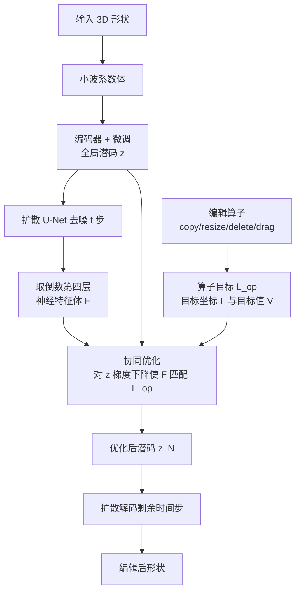

## 一句话总结

CNS-Edit 提出一种"耦合神经形状（CNS）表示"加"神经体优化"的框架，把 copy、resize、delete、drag 等 3D 编辑操作转化为在潜空间上的优化目标，通过协同优化全局潜码与三维神经特征体，实现既感知形状语义（如对称）又能改变拓扑的高保真编辑。

## 研究背景

3D 形状编辑是计算机图形学中最经典的基础问题之一，在神经几何处理时代重新受到关注。一个好的编辑方法需要同时满足三点：支持多样、直观、细粒度的编辑算子；理解形状语义以对操作产生自然合理的响应；在保证编辑质量的同时保留未编辑区域的特征。

经典方法通常依赖点、曲线、草图、骨架或包围笼等"编辑代理"，这些代理易于操作但缺乏语义理解，且大多工作在网格顶点层面。随着深度表示的发展，一类主流思路是在潜空间中做编辑：把隐式函数与几何基元耦合，或把形状潜空间与 CLIP 空间相连。然而，由于基元或文本提示过于粗糙，这些方法在细粒度编辑时往往难以保证质量。图像与视频领域的潜空间拖拽编辑（如 Drag Your GAN）已相当成功，但 3D 编辑的操作性质不同，缺乏一个能同时兼顾语义与精确空间控制的框架。基于变形的方法则普遍无法改变形状拓扑。

## 方法

### 整体框架

方法核心是耦合神经形状（CNS）表示：一个捕获全局语义的潜码 $z$ 与一个提供空间上下文的三维神经特征体 $F$。给定输入形状，先编码得到全局潜码 $z$，再把 $z$ 送入扩散 U-Net，从其中间层提取神经特征体 $F$；两者紧密耦合。编辑时，把算子转化为定义在 $F$ 上的优化目标 $\mathcal{L}_{op}$，通过对 $z$ 做梯度下降协同优化 $z$ 与 $F$，迭代 $N$ 步后解码优化后的潜码得到编辑结果。

### 关键设计

耦合神经形状表示。输入形状先按前人做法转为高分辨率截断有向距离场，再转换为小波系数体，其局部支撑特性保证小波体的局部改动只影响形状对应的局部区域。全局潜码 $z$ 来自一个预训练的扩散式自编码器，并经微调得到更忠实、语义更有意义的潜码。神经特征体 $F$ 的提取方式是：先用 U-Net 对噪声体去噪 $t$ 步（$t < T$），再把部分去噪的体与潜码 $z$ 一并送回 U-Net，取输出块倒数第四层的特征体作为 $F$。这个层次的选择很关键：更深层缺乏空间上下文，更浅层则缺乏形状语义。$F$ 之后仅经过感受野有限的卷积层，因此对 $F$ 的局部修改通常对应形状中目标区域的局部变化。$z$ 与 $F$ 双向耦合：改 $z$ 可按流程重新导出 $F$；改 $F$ 后由于其提取可微，可用损失把改动反传回 $z$，用梯度下降求更匹配的 $z_N$。

算子目标的统一形式。所有算子都被翻译成同一个目标：一组目标坐标 $\Gamma$（要在 $F$ 中被改动的区域）和一组目标特征值 $V$，最小化

$$\mathcal{L}_{op} = \lvert F_k[\Gamma] - sg(V) \rvert_1$$

其中 $F[\cdot]$ 是切片操作，非整数坐标用三线性插值取值，$sg$ 是停止梯度算子，用于鼓励 $F_k$ 的值向目标 $V$ 靠拢而非反向。

各算子的目标构造。copy 把复制区 $\Gamma_{copy}$ 的特征值作为目标，粘贴到位移后的 $\Gamma_{paste}$；resize 对选区包围盒 $B$ 按锚点与方向缩放为 $B'$，用三线性插值从 $B$ 采样目标值；delete 把选区特征值替换为形状中"空区域" $\Gamma_{empty}$ 的特征值，使删除处与周围语义连贯；drag 借鉴图像拖拽思路，沿 $A \to B$ 的直线路径分多次迭代地复制粘贴源点邻域特征，每次含"运动监督"与"点跟踪"两步，点跟踪通过在半径 $r_2$ 内寻找与原始体中源点特征最相似的位置来更新源点：

$$P_{k+1} = \arg\min_{q \in \Gamma(P_k, r_2)} \lvert F_{k+1}[q] - F_0[A] \rvert_1$$

协同优化。给定 $\mathcal{L}_{op}$ 后，从输入形状的 $z_0$ 出发计算起始神经体 $F_0$，评估目标损失并对 $z_0$ 求梯度，以学习率 $\alpha$ 走一步得到 $z_1$，如此迭代产生序列 $\{(z_0, F_0), \dots, (z_N, F_N)\}$。设有最大迭代步数，并对每个算子定义提前终止条件。这些算子是原子的，可组合出新算子，例如 copy 与 delete 组合成"剪切粘贴"。

## 实验结果

在 ShapeNet 上构建了含 25 把椅子与 25 架飞机、共 50 个编辑案例的数据集，主要评测 drag 算子。用 FID、KID 衡量视觉质量，用户研究给出质量分（QS）与匹配分（MS，操作满足度）。CNS-Edit 在全部指标上均优于对比方法：

| 方法（Chair） | FID ↓ | KID ↓ | QS ↑ | MS ↑ |
| --- | --- | --- | --- | --- |
| DeepMetaHandle | 118.2 | 0.028 | 3.40 | 1.78 |
| SLIDE | 100.4 | 0.012 | 3.65 | 1.86 |
| DualSDF | 122.9 | 0.018 | 3.02 | 2.15 |
| SPAGHETTI | 145.9 | 0.036 | 2.98 | 2.36 |
| CNS-Edit（本文） | 88.7 | 0.006 | 4.50 | 4.59 |

| 方法（Airplane） | FID ↓ | KID ↓ | QS ↑ | MS ↑ |
| --- | --- | --- | --- | --- |
| SLIDE | 127.6 | 0.043 | 3.13 | 1.71 |
| DualSDF | 152.1 | 0.063 | 2.20 | 1.56 |
| SPAGHETTI | 179.1 | 0.088 | 1.62 | 2.59 |
| CNS-Edit（本文） | 106.9 | 0.034 | 4.11 | 4.06 |

定性上，缩短飞机左翼时右翼会自动对称缩短，体现方法对语义（对称性）的理解；拖拽沙发靠垫角落到座面时能保持靠垫完整；连接椅腿则展示了变形类方法无法做到的拓扑修改能力。消融显示：用倒数第四层（$J=12$）特征最佳，过浅层（$J=15$）有丰富空间上下文但缺语义、易出伪影，过深层（$J=9$）缺空间上下文、编辑几乎不生效；若直接在小波空间做算子而不走协同优化，会丢失语义并产生伪影。相比 SPAGHETTI 仅支持 drag 与 rotate，本文支持 drag、copy、resize、delete 与 cut-paste。扩散推理约 1 分钟，CNS 优化每个算子不到 10 秒。

## 亮点与局限

亮点：用统一的"目标坐标 + 目标值"形式把四类异质编辑算子都归约为神经特征体上的 $L_1$ 目标，简洁通用；潜码与神经体的双向耦合让编辑既保留全局语义又能精确局部控制；能自然实现 copy、delete 带来的拓扑变化，这是变形类方法难以做到的；算子可原子组合。

局限：所依赖的预训练潜空间是按类别训练的，需为不同类别分别训练模型，难以直接编辑任意形状；处理时间受制于扩散重建网络，单次编辑约需一分钟；目前仅有四个原子算子，尚未支持旋转，也未研究形状混合、部件插值等跨形状融合操作。

## 延伸思考

这项工作最有启发的一点，是把"编辑"重新定义为在预训练生成模型的中间特征体上做局部目标匹配，再借由可微耦合把改动反传到全局潜码——这实际上让生成先验充当了"语义正则器"，使局部编辑自动满足对称、连通等整体约束。它与图像域的拖拽编辑共享同一思想内核，说明"运动监督 + 点跟踪"范式可跨模态迁移。未来若把类别相关的潜空间替换为在大规模 3D 数据上训练的通用重建模型，并引入更快的解码器，这套框架有望从单类别演示走向面向任意资产的实用编辑工具；而拓扑可变这一特性，也为把生成式编辑接入 CAD 与设计迭代流程提供了想象空间。
