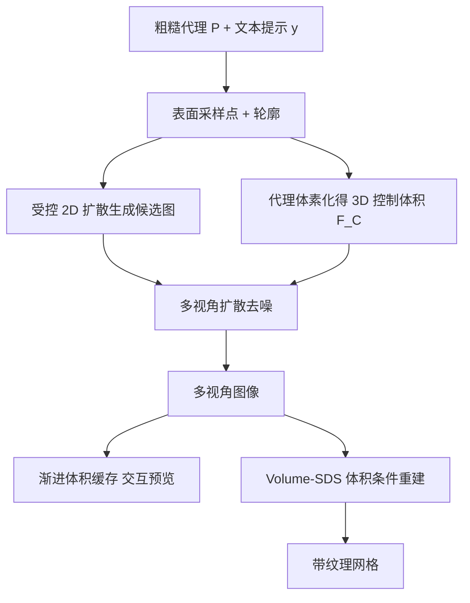

## 一句话总结

Coin3D 让用户用基本形状拼出的粗糙几何代理（proxy）作为 3D 感知条件来引导多视角扩散生成 3D 物体，并支持局部部件的精确重生成与数秒内的交互式预览。

## 研究背景

2D 扩散模型已经能用草图、深度、人体姿态等条件精确控制图像生成，并通过掩码修补实现局部编辑与再生成。然而在 3D 资产生成领域，同样的工作流仍不可用：现有方法多以文本提示或单张透视图像作为条件，无法准确表达目标 3D 形状；而生成式编辑或修补类任务在预览前往往需要长时间重建（从数十分钟到数小时），无法满足交互式建模的即时反馈需求。

作者认为一个易用的可控 3D 生成框架应具备三点性质：其一是 3D 感知可控，像小孩搭乐高一样用长方体、球、圆柱等基本形状拼出粗略引导；其二是灵活，能像图像修补那样以 3D 方式交互式地组合或调整局部区域；其三是响应迅速，编辑后能立刻从任意视角预览结果，而非等待漫长重建。围绕这三点，作者提出 Coin3D，把 3D 感知控制直接注入多视角扩散过程，用装配自基本形状的粗糙代理来引导生成。

## 方法

整体框架：给定装配自基本形状的粗糙代理 $$P$$ 和描述物体身份的文本提示 $$y$$，方法一方面在代理网格表面采样点用于 3D 感知控制，另一方面用代理的轮廓（silhouette）加提示经受控 2D 扩散生成若干 2D 候选图供交互选择。随后 3D adapter 把代理体素化后的特征与多视角图像融合体积结合成 3D 控制体积 $$F_C$$，注入 Zero123 式多视角扩散去噪；生成的多视角图像既可借体积缓存快速预览，也可经体积条件重建导出带纹理网格。

关键设计：

- 代理引导的 3D 条件与 3D adapter：为在只给基本形状而非精细 CAD 的情况下保留生成自由度（如从球形头部长出动物耳朵），方法构建体素占据网格 $$F_V$$（含点即置 1），并把去噪 UNet 各时间步产生的多视角图像反投影融合成 $$F_I^t$$。3D adapter 先对 $$F_V$$ 做 3D 卷积，将中间层输出层级式加到 $$F_I^t$$ 的 3D 卷积上，得到最终 3D 控制体积 $$F_C^t$$；再将 $$F_C^t$$ 投影对齐到各视角得到 2D 特征图，配合 CLIP 候选图特征与视角嵌入注入扩散 UNet。训练时对代理特征体积卷积使用零卷积（zero convolution）并冻结其余层，使生成时可通过调节插件权重来控制贴合代理的强弱。训练目标为噪声预测：
$$\min_{\theta}\ \mathbb{E}_{t,x_{(1:N_v)},\epsilon_{(1:N_v)}}\ \lVert \epsilon_i-\epsilon_{\theta}(x_i^t,t,c(I,F_C^t,c_i))\rVert$$

- 代理约束的部件编辑：用户可指定代理中的某个基本形状块并重生成其内容。方法采用双通道条件编辑：2D 侧把掩码代理投影到编辑视角做掩码式图到图修补，得到新的图像条件；3D 侧对掩码代理略做膨胀（dilation）构造特征掩码 $$M$$，去噪时复用缓存的原始控制体积、仅更新未掩码区域：
$$\hat{F}_C^t=(1-M)F_C^t+M\tilde{F}_C^t$$
从而在改动局部时保持其余部分不变并自然融合。

- 渐进体积缓存的交互预览：对每个时间步 $$t$$ 记忆最新的 3D 控制体积；预览时把用户在建模软件中平移的视角转为视角条件与体积投影，直接复用缓存体积而不重跑 3D adapter，逐步即时解码出预览图。

- 体积条件重建 Volume-SDS：由于视角有限，仅用多视角图像重建易出现几何异常。方法把 3D 控制体积的先验引入分数蒸馏采样的反向传播：
$$\Delta_x L_{V\text{-}SDS}=w(t)\,(\epsilon_{\theta}(x^t,t,c(I,F_C^t,c))-\epsilon)$$
使重建获得 3D 控制信号的监督，得到更干净的几何。

## 实验结果

在与图像式 3D 生成（Wonder3D、SyncDreamer）和可控 3D 生成（Fantasia3D、Latent-NeRF）的对比中，用 CLIP Score 衡量文本贴合度，用 ImageReward 与 GPTEvals3D 衡量感知质量，并请 30 名用户对 35 个测试样例按感知质量与内容匹配度排序打分（最佳 3 分、最差 1 分）。Coin3D 在两组对比中总体指标均最优。

| 方法 | CLIP Score↑ | ImageReward↑ | GPTEvals3D↑ | 匹配度↑ | 重建质量↑ |
| --- | --- | --- | --- | --- | --- |
| Wonder3D | 0.251 | -0.557 | 980 | 1.613 | 1.770 |
| SyncDreamer | 0.260 | -0.152 | 962 | 1.654 | 1.594 |
| Ours | 0.266 | 0.026 | 1035 | 2.733 | 2.634 |
| Fantasia3D | 0.212 | -1.597 | 810 | 1.267 | 1.273 |
| Latent-NeRF | 0.246 | -1.188 | 1146 | 1.930 | 1.918 |
| Ours | 0.249 | -0.749 | 1204 | 2.801 | 2.809 |

交互编辑方面，单次部件编辑约 5∼10 秒即可完成并支持即时预览。消融显示：加入 Volume-SDS 能减少漂浮物、得到更合理的几何（如椅子底部）；部件编辑若去掉代理条件会产生破碎形状（悬空火焰、扭曲身体），若去掉掩码膨胀则融合不自然（红包与身体紧贴、手部破损），完整策略才能实现无缝且不影响其余部分的编辑。

## 亮点与局限

亮点：把 3D 感知控制直接注入多视角扩散过程，而非事后加到 3D 表示上，因此在保证生成速度的同时获得可调强度的忠实形状控制；代理约束的双通道编辑实现精确、无缝的局部部件重生成；渐进体积缓存让任意视角预览缩短到数秒；Volume-SDS 用体积先验改善重建几何。

局限：工作流从合成 2D 候选图起步，需要一定提示工程才能得到无杂乱背景的干净结果；受基础扩散模型分辨率限制，难以生成毛发、褶皱等精细细节；重建的纹理网格已烘焙光照，缺乏面向现代渲染管线的 PBR 材质。

## 延伸思考

作者指出可用以物体为中心的数据微调 2D 扩散模型、引入基于大语言模型的提示增强来缓解候选图对提示工程的依赖，也可换用更强骨干或加入高分辨率细化阶段来补足细节，还可训练材质解耦的扩散模型生成带 PBR 材质的物体。更值得关注的是「用可拼装基本形状作为 3D 条件」这一交互范式，它把 3D 创作的门槛降到接近搭积木，并以数秒级预览把生成式 3D 建模真正带入可迭代的交互循环，这种「粗代理引导 + 体积缓存加速」的思路对后续可控 3D 生成与编辑工具具有借鉴意义。
