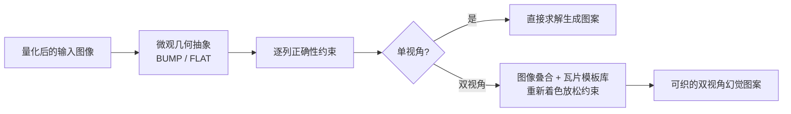

## 一句话总结

本文把"幻觉针织"（illusion knitting，正面看是噪声、侧面看浮现图案的织物）形式化为一个关于针脚高度与颜色的约束满足问题，既能自动生成传统的单视角幻觉图案，还首次做出了"左看一张图、右看另一张图"的双视角幻觉针织。

## 研究背景

- 领域现状：幻觉针织是一门民间手工艺——利用不同行针脚高低不同，当从侧面看时，高针脚会遮挡住后面矮针脚，从而在斜视角浮现出图案。传统上（如 WoollyThoughts 社区）设计者要在 Excel 里逐格上色，大图案手工排版加编织往往耗费数百小时。此前计算针织的工作主要关注形状与机器可编织性，并没有建模或利用"针脚高度差"这一维度。
- 核心痛点：一是手工设计流程极其低效、难以规模化；二是已有效果被局限在"单一侧视角浮现一张图"，无法系统性地探索更复杂的多视角幻觉。
- 本文 idea：把针织表面的微观几何抽象成逻辑单元，用一组简单约束刻画"什么样的图案能被正确织出并在侧视角显现正确图像"，再用求解器自动化设计；进而分析双视角的可行性边界，用"放松约束"的方式做出以前不可能的双视角幻觉。

## 方法

整体思路是：先建立一层介于"物理针脚"和"设计意图"之间的微观几何抽象，把幻觉的正确性写成逐列约束；单视角直接求解即可，双视角则先证明其被严重过约束、再通过系统性放松约束来获得感知上更好的结果。

关键设计分四点：

1. **微观几何（microgeometry）抽象**。作者提出用两种逻辑单元描述表面小尺度几何：BUMP（凸起，物理上对应"下一行反针 purl"，会遮挡后方）与 FLAT（平整，对应"下一行正针 knit"）。约定每个 BUMP 等高、矩形（顶面始终可见）、单一颜色，从而把"能否制造"这个物理问题与"如何设计"的逻辑问题解耦——设计时假定这些单元总能被织出来。

2. **幻觉正确性的形式化**。假设观察方向是沿着行（course）看下去，一行里前一个针脚会遮挡它后面的针脚。用颜色图 $$C$$（整数一维数组）、凸起图 $$R$$（布尔一维数组）、列号 $$i$$ 表示，每列要满足：

$$(C_i = \text{input}_i \wedge \neg R_{i-1}) \vee (C_{i-1} = \text{input}_i \wedge R_{i-1})$$

含义是：侧视角看到的颜色，要么来自当前针脚（当它前一个针脚未凸起、不遮挡时），要么来自前一个针脚（当前一个针脚凸起、遮挡了当前针脚时）。对双色单视角图像，这组约束基本足以保证能生成满足全部约束的图案；三色图像则可用两色条纹近似出中间灰。作者据此在一分钟内生成了蒙娜丽莎的单视角幻觉。

3. **双视角的可行性边界与 MaxSAT**。要"左看图 A、右看图 B"，直觉做法是同时为两侧生成约束丢进求解器。但由于所有凸起针脚从两侧都可见，两张任意图像几乎不可能同时满足。作者把它写成 MaxSAT（尽量多满足约束），结果表明对完全不同的两张输入，最优也只能做到每侧约 75% 匹配；且这种直接求解出的大图案编织很慢（约 12 小时，还得切成 8 片以适配机器内存），伪影明显。

4. **瓦片模板库做约束放松**。作者转而分析"哪些双视角效果本身是可行的"：关键洞察是可以用"条纹填充"替换输入里的某些纯色区域，在保持图像可辨认的同时把不可满足的约束系统性地放松成可满足。做法是：把两张图叠合、为每个像素标出左右应有颜色；收集所有唯一的颜色叠合组合；为每种输入颜色尝试分配新的填充类型（纯色或某色条纹）；检查每种叠合是否都有可用瓦片；最后做一次明度顺序检查。由于同一侧的某个视觉填充可由多种瓦片实现，这种冗余让系统能在一侧保持填充不变、另一侧变化，从而更好地"藏住"另一侧的图像。模板库的瓦片主要按简单性与可织性挑选（条纹在传统幻觉针织里也有成熟用法）。

## 实验结果

主实验是双视角图案生成方式的对比——直接 MaxSAT 求解 vs. 基于瓦片库的约束放松，围绕匹配质量与编织耗时展开：

| 方案 | 双视角匹配上限 | 典型编织耗时 | 感知/可控性 |
|------|----------------|--------------|-------------|
| 直接 MaxSAT 求解 | 任意两图每侧约 75% | 约 12 小时（需切 8 片） | 伪影明显，难以手动微调 |
| 瓦片库约束放松（本文） | 通过条纹填充使其可实现 | 兔子/茶壶示例约 2 小时 | 可直接编辑输入图或瓦片来调整结果 |

在此框架下作者制作了多个成功案例：EKG 脉冲/心形、SIGGRAPH 与 SIGGRAPH Asia 双 logo、双向文字 ILLUSION/KNITTING、以及用三种纱线颜色的梵高《自画像》/《向日葵》，还有斯坦福兔/犹他茶壶的双视角组合。长行条纹避免了行内频繁换色，因此织得更快。作者也展示了对同一张《呐喊》用四种量化方式（默认、Photoshop 海报化、手绘三色、Stable Diffusion 生成）得到不同风格输出，说明输入量化可自由替换、流程易于人工介入。

## 亮点与局限

- 亮点：
  - 首次把幻觉针织纳入计算设计与制造框架，提出 BUMP/FLAT 微观几何抽象，把物理可制造性与逻辑设计解耦。
  - 用简洁的逐列约束刻画"正确幻觉"，单视角设计从数百小时压缩到分钟级。
  - 首次实现双视角幻觉针织，并诚实地给出了 MaxSAT 75% 的可行性上界，再用瓦片库放松约束在感知质量与编织效率上双双改善（12 小时→2 小时）。
  - 流程保留了直接可控性：用户可编辑输入图或修改瓦片来精确调节结果。
- 局限：
  - 三视角幻觉（左/右/正面各一图）受过约束制约，正面视角只能落在两侧图像的交集内，尚缺乏好的设计指导。
  - "环绕圆柱走一圈看动画"的想法帧数有限、效果不够惊艳，作者自陈还没找到真正让该媒介出彩的动画设置。
  - 把柔性表面披覆到不规则/硬质表面（类似乐高三角面的遮挡技巧）等方向仅停留在设想，未做实现。
  - 瓦片库以条纹等简单可织图案为主，更复杂的瓦片（如棋盘格）虽可行但会显著拉长编织时间。

## 延伸思考

这项工作是"编程语言/求解器思路 × 计算制造"的一个典型样例：把一门依赖经验与手工的工艺提炼成约束模型，再借助 SAT/MaxSAT 与领域特定的放松策略求解，和该团队在木工（Carpentry Compiler）、CAD 等方向上的"求解器辅助设计"一脉相承。值得追问的是：约束放松目前靠人工设计的瓦片模板库，是否能进一步自动化地学习或搜索出更丰富的瓦片/填充，从而在可织性约束下逼近感知最优？此外，作者已指出正面视角"落在两侧交集内"可能不是最紧的约束——若能刻画更松的可行条件，三视角乃至沿曲面分布的多帧幻觉或许能真正做出令人惊艳的动态效果。
