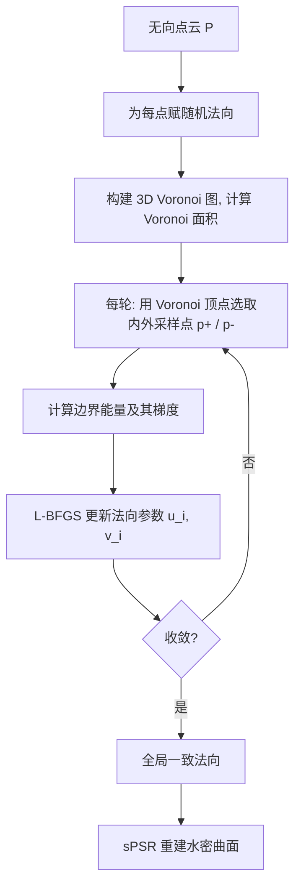

## 一句话总结

给定法向随机的点云，通过最大化广义缠绕数（GWN）场的一个边界积分能量来恢复该场的全局调和性，从而为流形曲面采样点云求出全局一致的法向。

## 研究背景

带全局一致法向的点云是点云上采样、去噪、曲面重建、分割等诸多下游任务的基础。为无向点云赋予全局一致法向长期以来是计算机图形学的难题：物体几何、拓扑复杂，且常受噪声、离群点、薄结构干扰。

传统方法多先估计与曲面垂直的法向，再通过传播翻转不一致的法向。这类传播策略高度依赖初始无向法向的分布方向，在噪声和小 reach 几何上容易失败。近年出现了基于 GWN 的方法：iPSR 迭代地把上一轮法向喂给 PSR 求解器，但在稀疏点云上会产生断裂；PGR、GCNO 用点云 GWN 做定向，但需求解稠密线性系统或依赖 Voronoi 顶点在内外均匀分布的假设，计算代价高，且在复杂拓扑、薄结构和噪声上不够鲁棒。

作者观察到两个关键因素：全局一致法向产生的 GWN 场是带跳变边界条件偏微分方程的解，具有调和性；而其 Dirichlet 能量可写成沿边界曲面的积分。由此提出仅在边界上做积分优化的新思路。

## 方法

### 整体框架

方法输入是采样自封闭可定向流形曲面 $\partial\Omega$ 的点云 $P=\{p_i\}_{i=1}^n$。先为每个点赋随机法向，再优化与 GWN 场 Dirichlet 能量相关的目标函数完成定向，最后用屏蔽泊松重建（sPSR）得到水密曲面。

### 关键设计

广义缠绕数由一致外法向生成，满足拉普拉斯方程，可用泊松核在点云上离散求得

$$w(q)=\sum_{i=1}^{n} a_i \frac{1}{4\pi}\frac{\langle n_i, p_i-q\rangle}{\lVert p_i-q\rVert^{3}},$$

其中 $a_i$ 是点 $p_i$ 的测地 Voronoi 面积。利用 Green 第一恒等式，全空间 Dirichlet 能量可转化为边界积分。作者将其推广到任意法向场 $n$，定义边界能量

$$f(n):=\int_{\partial\Omega}\left(w^{-}-w^{+}\right)\nabla_{n} w^{-}.$$

核心观察：当法向随机时边界能量趋近于零而 Dirichlet 能量很大；当法向全局一致时切向分量可忽略、法向分量很大，两种能量趋于一致。因此作者反其道而行，从随机法向出发直接最大化边界能量。

离散化上，用输入点近似边界积分，并为每个点 $p_i$ 选取一内一外两个采样点 $p_i^{+}$、$p_i^{-}$。作者不用简单的法向位移（在薄结构上会把两点都放到同侧），而是取 $p_i$ 所在 Voronoi 单元中与当前法向夹角最小、最大的两个 Voronoi 顶点，利用其对噪声的鲁棒性来区分内外。

为消解跳变边界条件的歧义（如 $w^{+}=-1,w^{-}=0$ 或 $w^{+}=1,w^{-}=2$），作者不直接施加 $0\le w\le 1$ 的 $2n$ 个不等式约束，而是把 GWN 差 $w^{-}-w^{+}$ 替换为 $\lvert w^{-}\rvert-\lvert w^{+}\rvert$（鼓励 $w\ge 0$），再加惩罚项鼓励 $w\le 1$，转化为无约束优化

$$\max \sum_{i=1}^{n} a_i\left(\lvert w(p_i^{-})\rvert-\lvert w(p_i^{+})\rvert\right)\nabla_{n_i} w(p_i)+g\!\left(w(p_i^{\pm})\right).$$

法向以 $n_i=(\cos u_i\sin v_i,\ \sin u_i\sin v_i,\ \cos v_i)^{T}$ 参数化保证单位长，用 L-BFGS 求解。每轮时间复杂度 $O(n^{2}+n+m)$，空间复杂度 $O(n+m)$（$m$ 为 Voronoi 顶点数）。

## 实验结果

在 18 个几何拓扑各异的模型上，与 Dipole、PGR、iPSR、NeuralGF、GCNO 对比。以法向与真值的角度差（均值 $\mu$、标准差 $\sigma$，单位度）和 Chamfer Distance（CD，$10^{-3}$）为指标。无噪场景下，本方法在 83%、88%、88% 的模型上分别取得最优的 $\mu$、$\sigma$、CD。下表为 18 个模型的平均结果（$\mu$/$\sigma$/CD/时间秒）：

| 方法 | $\mu$ | $\sigma$ | CD | 时间(s) |
| --- | --- | --- | --- | --- |
| Dipole | 25 | 46 | 11 | 64 |
| PGR | 19 | 25 | 0.16 | 14 |
| iPSR | 6.5 | 9.5 | 0.11 | 18 |
| NeuralGF | 22 | 35 | 8.0 | 640 |
| GCNO | 35 | 46 | 9.5 | 5100 |
| Ours | 4.6 | 7.0 | 0.11 | 690 |

本方法比 GCNO 快 5～10 倍（平均加速 7.3 倍）。GCNO 适用于约 1 万点、40K 点时 24 小时无法完成，而本方法可在约三小时内给出结果，并可扩展到约 10 万点。方法在复杂拓扑和薄结构模型上尤为有效，也表现出对低强度噪声的鲁棒性。

## 亮点与局限

亮点：把体积分转化为边界积分，避免了内部空间的高分辨率四面体离散，显著降低计算与内存开销；用 $\lvert w^{-}\rvert-\lvert w^{+}\rvert$ 加惩罚项巧妙消解跳变边界歧义，转为无约束优化；不依赖 GWN 精确值、也不依赖 Voronoi 顶点内外均匀分布假设，因而对噪声和复杂几何更鲁棒。

局限：边界能量源自 GWN 的 Dirichlet 能量，后者只度量函数振荡幅度、不显式指示非流形曲面的内外朝向，故方法仅适用于流形曲面采样的点云；受 $O(n^{2})$ 时间复杂度限制，规模上限约 10 万点，无法像 iPSR 那样处理百万级点云。

## 延伸思考

作者已指出可用快速多极子方法（FMM）把邻域查询降到 $O(\log n)$，将每轮复杂度降到 $O(n\log n)$，这是突破规模瓶颈的自然方向。此外，边界能量框架依赖 Voronoi 顶点对内外的可靠区分，在高噪声下该假设会退化，如何把噪声鲁棒的内外采样与该能量结合、或将思路推广到非流形/开放曲面，都是值得探索的问题。
