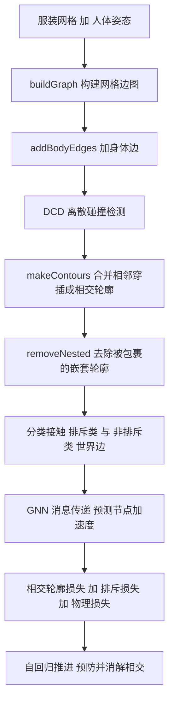

## 一句话总结

ContourCraft 把「相交轮廓最小化」重写成一个可微的损失项，嵌入基于图神经网络（GNN）的无监督布料模拟器，使神经服装模拟不再依赖无穿插的输入，而是能主动从已有穿插中恢复，从而稳健地模拟多层服装与整套多件搭配。

## 研究背景

服装模拟广泛用于游戏、动画电影、特效与时装设计。传统基于物理的方法能生成高质量结果，但高质量动画计算开销巨大；近年兴起的神经模拟方法速度快，却普遍存在一个共同短板：无法可靠地预防或处理服装之间的相交，复杂服装与多层搭配常出现大量漏检的穿插，导致画面失真、运动不合理。

传统方法的核心策略是「全程保持无穿插」：只要初始状态无穿插，就逐帧检测并消解新产生的穿插。这一策略的致命缺陷在于它高度依赖无穿插的初始状态——碰撞响应会努力维持任何被漏检或预先存在的穿插，可能毁掉整段动画。而由服装预摆放、用户交互或身体自穿插运动引入的穿插往往无法完全避免。

作者的思路是：与其不惜代价避免相交，不如设计一种从已有相交中恢复的机制。他们从 Volino 与 Magnenat-Thalmann 的相交轮廓最小化（Intersection Contour Minimization, ICM）汲取灵感，把它改写为一个可直接接入学习方法的变分形式，并结合排斥项一起工作，让 GNN 在无监督训练中学会既预防又消解布料相交。所用的神经模拟骨架是同组此前的 HOOD——一个用图神经网络、以无监督物理引导方式预测服装动态的方法，但 HOOD 本身无法建模布料自碰撞与布料间碰撞。

## 方法

整体框架：模型在 HOOD 的 GNN 基础上扩展。输入图除了服装网格的节点 $$V_G$$、边 $$E_G$$ 和连接到身体网格的「身体边」$$E_B$$ 外，还加入描述布料间近距接触的「世界边」（world edges），并按可否排斥分成排斥类 $$E^W_R$$ 与非排斥类 $$E^W_{NR}$$。网络经消息传递后解码出每个节点的加速度：
$$\hat A=f_\theta(V_G,V_B,E_G,E_B,E^W_R,E^W_{NR})$$
训练完全无监督，只需人体姿态序列（来自 AMASS）与静态服装网格，无需真值物理模拟数据。

关键设计：

- 布料接触对应关系：仿照 MeshGraphNets，检测所有「面-节点」对——要求节点沿面法向的投影落在面内、且距离小于阈值 $$\epsilon$$，为每对加一条连到最近三角顶点的世界边。投影落在面内这个条件同时限制了对应关系的数量，加速推理。

- 排斥损失：对面-节点对施加排斥，惩罚节点穿过面或靠得比织物厚度阈值 $$\xi$$（取 $$1\,\text{mm}$$）更近的情况
$$L_{repulsion}=\sum_i \max\bigl(\xi-d^{(i)}_{curr}\cdot \text{sign}(d^{(i)}_{prev}),\,0\bigr)^3$$
其中 $$d^{(i)}$$ 是节点 $$v^{(i)}$$ 与对应面 $$f^{(i)}$$ 沿法向 $$\vec n^{(i)}$$ 的带符号距离。仅用排斥项（记作 only repulsive）能预防大多数穿插，但仍会漏检、也无法从已有穿插中恢复。

- 区分排斥与非排斥接触：先用离散碰撞检测（DCD）找出所有相交三角对，把相邻穿插合并成相交轮廓；轮廓分开、闭三类。闭合轮廓会把曲面分成两块，较小的一块视为「轮廓内部」，嵌套时只保留最外层。凡是「属于开轮廓」或「位于闭轮廓内部」的节点所涉及的接触，标为非排斥——因为对已有穿插施加排斥反而会阻止其消解。

- 相交轮廓损失（Intersection Contour Loss）：这是全文核心。每个三角对相交包含两处「边-三角」交点，先解出交点在边上的相对坐标 $$s$$，再算出交点坐标，损失定义为所有相交段长度平方之和
$$L_{IC}=\sum_i \lVert p^{I_0}_i-p^{I_1}_i\rVert^2$$
最小化相交轮廓长度即等价于把穿插「拉」回消解。总目标为
$$L_{ours}=L_{HOOD}+\lambda_1 L_{repulsion}+\lambda_2 L_{IC}$$
排斥接触由排斥损失显式惩罚，非排斥接触则由相交轮廓损失隐式惩罚。

- 只用平移分量的梯度：相交长度的梯度可分解为两部分，一部分靠挤压三角形来缩短长度，另一部分靠准刚性平移来消解相交。作者发现挤压分量会压缩织物、激起强反作用力，对消解无益，故训练时只保留对应准刚性平移的偏导（消融中同时用两者记作 full gradient）。这一取舍减少了畸变伪影并整体降低了穿插数。

- 三阶段训练：第一阶段完全照搬 HOOD，忽略布料间接触、只学物理行为；第二阶段教模型预防自穿插，用 Bridson 等人的方法在训练中维持无穿插几何（仅用于保证几何，不进入损失），所有接触当作排斥，目标为 $$L_{HOOD}+L_{repulsion}$$；第三阶段教模型消解相交，从可能自穿插的几何出发、不再借助 Bridson，按排斥/非排斥分类接触，用完整目标 $$L_{HOOD}+L_{repulsion}+L_{IC}$$。

## 实验结果

在 40 段验证序列（8 段 AMASS 姿态 × 来自 BEDLAM 的 5 套多层搭配，含两件、三件与五件服装）上，以每帧平均相交三角对数量为指标，与三个消融版本对比。这些搭配在训练中未见过，且模拟从姿态序列首帧直接开始（用简单线性混合蒙皮初始化，初始几何可能带严重自穿插）。

| 方法 | 两件 | 三件 | 五件 | 全部平均 |
| --- | --- | --- | --- | --- |
| HOOD | 1347 | 5673 | 38480 | 8796 |
| only repulsive | 373.2 | 1069 | 25220 | 4424 |
| w/o IC loss | 122.2 | 268.4 | 1491 | 391 |
| full gradient | 74.9 | 163.4 | 1315 | 299 |
| ours | 55.9 | 126.6 | 481.2 | 150 |

每加入一项设计，相交数量都显著下降，完整方法把全部平均从 HOOD 的 8796 降到 150。感知实验中，用 1 到 5 分评价真实度：商业软件 CLO3D 得 4.29，ContourCraft 得 4.15，LBS 得 3.04，HOOD 得 2.78；与 CLO3D 两两对比时，ContourCraft 在 35.8% 的场景中被认为更真实，明显高于 LBS（16.5%）与 HOOD（16.9%）。此外方法还能处理服装自动改尺寸带来的穿插：用适配 SMPL-X 模板的原始几何，按随机采样的体型参数改尺寸后，模型可稳健消解由此产生的相交，无需美术手工修复。

## 亮点与局限

亮点：把经典的相交轮廓最小化改写成可微损失并首次引入学习式服装模拟，是全文最优雅之处——用一个「最小化相交段长度」的目标，让 GNN 在无监督下自行学会消解穿插。区分排斥与非排斥接触的机制很关键：它避免了「预防穿插的力同时也阻止穿插消解」这一经典矛盾。只保留平移梯度分量的工程取舍朴素而有效。三阶段训练把「学物理→学预防→学消解」拆开，逻辑清晰。方法完全无监督、无需真值模拟数据，且能自然支持自动改尺寸这类实用场景。

局限：由于相交轮廓损失的本质，某些情形难以处理——例如动态序列中口袋等小的非流形碎片可能在单帧内弹出服装外，模型会误以为这是正确构型，因为把它拉回去反而会增加轮廓长度；若初始几何中两件服装以无法推断正确层序的方式缠绕在一起，方法也会失败。

## 延伸思考

ContourCraft 最值得回味的一点，是它把一个几十年前的几何算法（ICM）翻译成了「可微损失」的语言，从而无缝接入现代学习框架。这提示我们：许多传统图形学中以迭代式局部位移求解的经典方法，都可能被重铸为可微目标项，让神经网络以无监督方式内化其求解逻辑，而不必依赖昂贵的真值数据。另一个启发是对梯度分量的取舍——并非损失的所有下降方向都对目标有益，识别并只保留「有物理意义」的那部分梯度，往往比追求名义上的损失最小化更重要。范式层面，本文把「不惜代价避免错误」换成「允许错误但学会恢复」，这种从预防到恢复的转变，对其他需要处理约束违背的物理学习任务（如自穿插、体积反转、接触突变）颇具借鉴价值。后续若能把相交轮廓损失迁移到更快的姿态驱动形变模型（如 PBNS、SNUG），有望在保持鲁棒碰撞处理的同时进一步提速。
