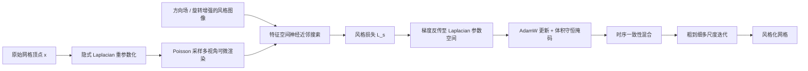

## 一句话总结

提出一套面向动态网格的神经风格迁移流水线，通过神经近邻风格损失、基于 Laplace-Beltrami 算子的隐式重参数化、由方向场引导的可控风格化，以及改进的时序一致性与体积守恒正则，把 2D 图像风格锐利且可控地迁移到静态与动态（布料、液体、角色）三维网格上。

## 研究背景

近年动画电影从写实转向更具设计语言的风格化表达，促使研究者用神经风格迁移（NST）把 2D 图像风格迁移到三维资产上。但已有工作存在明显短板：要么局限于体数据或静态网格，要么缺乏可直接融入动画与视效流水线的艺术控制；网格外观建模类方法又往往过度贴合输入表面、或只专注纹理合成而不改动几何。

具体到技术层面，作者指出三个痛点：其一，传统基于 Gram 矩阵的风格损失在合成高频细节时会陷入"洗白"式的局部极小，细节被混淆或不清晰；其二，可微渲染中的几何梯度主要来自轮廓（silhouette）修改，数值稀疏，难以驱动网格大结构的变形；其三，逐帧独立风格化会导致图案在帧间突变，缺乏时序连贯性，且薄壁区域容易发生体积塌陷与非法网格。

## 方法

### 整体框架

流水线沿用体数据与网格风格迁移的思路：用可微渲染器在一组 Poisson 采样的相机视角下渲染三维资产，得到图像空间的能量函数，并相对网格顶点位置 $x$ 最小化风格损失：

$$\hat{x} = \arg\min_{x} \sum_{\theta \sim \Theta} L_s\bigl(R_\theta(x),\, I_s\bigr)$$

其中 $R_\theta$ 是相机配置 $\theta$ 下的可微渲染器，$\Theta$ 为所有相机配置的分布，$I_s$ 为风格图像。优化以原始网格作为初始化，从而隐式约束内容不变。

### 关键设计

一、神经近邻风格损失。用神经近邻替代 Gram 矩阵：先把内容图与风格图在空间上分解为特征向量，再为每个内容特征通过最近邻搜索找到最接近的风格特征，损失定义为替换特征与被优化特征之间的余弦距离：

$$L(I, I_s)_s = \frac{1}{N} \sum_{i=1}^{N} D_{\cos}\Bigl(N\bigl(F(I_i), F(I_s)\bigr),\, F(I_i)\Bigr)$$

其中 $F$ 为零中心化的特征提取网络，$N$ 为把第 $i$ 个像素特征替换为风格图上最近邻特征的函数。这样能保留原图布局、合成更锐利无伪影的高频细节。作者发现无需原文中用内容特征锚定的稳定项也不会失稳。

二、基于 Laplacian 平滑的多级优化。为让稀疏的轮廓梯度能驱动网格大结构变形，用 Laplace-Beltrami 算子 $L$ 对顶点位置做隐式重参数化：

$$x^* = (I + \lambda L)x$$

它等效于把每步梯度改写为

$$x^* \leftarrow x^* - \eta (I - \lambda L)^{-1} \frac{\partial L}{\partial x^*}$$

从而把稀疏梯度与图像空间修改扩散到更大网格区域。$\lambda$ 越大改动越粗、越全局，$\lambda=0$ 退化为不协调噪声。配合粗到细策略：从最小尺度图像开始、逐级细化，随尺度变细减小 $\lambda$，兼顾大结构与小细节。

三、方向场引导的可控风格化。针对具有方向性的风格图，一方面把风格图旋转成多个朝向做增强，每个旋转对应一个方向向量；另一方面允许用户在网格上定义朝向向量场，映射到 RGB 后以平坦着色渲染（考虑遮挡）得到屏幕空间朝向场，与旋转风格图的方向向量做点积，生成逐像素权重来调制各朝向风格损失，实现图案方向的用户控制。

四、时序一致性。逐帧风格化不连贯，作者借鉴 EMA 思路，每步累积多帧位移并做单次对齐与平滑：

$$d_t \leftarrow (1 - \gamma_\mu(\alpha))\, d_t + \gamma_\mu(\alpha)\, T(d_{t-1}, u_{t-1})$$

其中 $d_t = \hat{x}^*_t - x^*_t$ 为位移，$u_t$ 为顶点速度。关键改进是用迭代感知函数 $\gamma_\mu(\alpha) = \max(\alpha(1 - \tfrac{m}{\mu}), 0)$ 替代常数混合权重，随迭代线性衰减以获得更锐利的图案。传输函数 $T$ 采用半拉格朗日方法，位移的空间插值用固定 50 邻域的 Shepard 插值。

五、体积守恒正则。严格散度自由约束会过约束风格化、降学习率又会削弱风格化。作者改用随机掩码：每个尺度开始时随机选定一定比例的顶点固定不动，借 Laplacian 参数化让其平滑影响邻域；粗尺度掩码比例更高，细尺度可无需掩码，从而在薄壁区域避免体积塌陷和非法网格。

## 实验结果

方法用 PyTorch 与 PyTorch3D 可微渲染器实现，采用 AdamW 优化器，实验在单张 Nvidia RTX 3090 上进行；动态布料与液体在 Houdini 中生成，最终由 Mantra 渲染。在与 Spot 模型上（星空风格）的对比中，本方法能产生更大且忠实于风格的网格变形，运行时也具竞争力：

| 方法 | 运行时 | 说明 |
| --- | --- | --- |
| Paparazzi [Liu et al. 2018] | 72s | 单尺度 Gram 损失，结构过度贴合表面 |
| Text2Mesh [Michel et al. 2021] | 755s | CLIP 嵌入难以准确表达风格图 |
| TextDeformer [Gao et al. 2023] | 741s | 受显存限制仅在 3K 顶点网格上运行 |
| 本方法 | 147s | 大变形、忠实还原输入风格 |

不同示例的参数与性能（部分）：

| 示例 | 顶点数 | 尺度数 | 运行时（秒/帧） |
| --- | --- | --- | --- |
| Manticore | 700K | 3 | 178 |
| Panda | 760K | 3 | 118 |
| Cloth（布料） | 160K | 3 | 18 |
| Liquids（液体） | 180K | 3 | 20 |
| Spot | 210K | 3 | 147 |

与液体风格迁移方法 LNST [Kim et al. 2020] 的对比显示，LNST 只能通过粒子位置间接改动网格表面、无法表达三角风格图的不连续锐利特征，而本方法直接修改界面顶点可获得锐利风格化；关闭随机掩码时薄结构会产生非法网格，启用后（两个最粗层分别掩掉 20% 与 10% 顶点）图案清晰合成。

## 亮点与局限

亮点：用神经近邻损失显著提升了细节锐度并消除 Gram 矩阵的"洗白"伪影；Laplacian 隐式重参数化配合粗到细策略，让轮廓稀疏梯度能驱动大尺度变形；方向场引导、迭代感知 EMA 时序一致性、随机掩码体积守恒等设计都面向生产流水线的可控性，能直接用于布料、液体、动画角色等动态资产。

局限：作者明确指出，色彩优化后最终网格颜色分布无法很好匹配风格图（神经近邻公式的已知问题，可考虑引入色彩匹配后处理）；随机掩码不保证严格体积守恒，固定顶点比例过高时会出现时序闪烁；风格化结果不保证网格无自穿插。

## 延伸思考

作者把扩散模型视为有前景的方向：扩散模型提取的图像特征远比预训练分类网络丰富，有望提供更强的风格化能力。可延伸思考的点包括：一是用扩散特征替换 VGG 特征、或结合注意力对齐来同时解决色彩匹配与风格表达；二是把严格的体积/无穿插约束（如四面体化后的体积守恒步骤）与优化式风格化融合，兼顾物理合理性与艺术自由度；三是隐式 Laplacian 重参数化这一"把稀疏梯度扩散到大区域"的思路，对其他基于可微渲染的逆向几何优化任务可能同样有借鉴价值。
