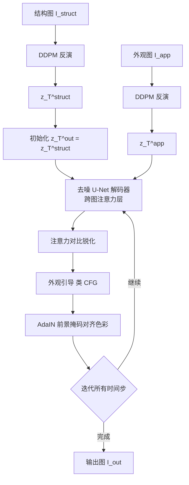

## 一句话总结

本文提出跨图注意力（Cross-Image Attention）机制，直接复用预训练扩散模型自注意力层中的查询、键、值，在结构图与外观图之间隐式建立语义对应，从而在无需训练或优化的零样本设定下，把一张图的外观迁移到另一张形状差异显著的图上。

## 研究背景

外观迁移（appearance transfer）的目标是把一张图中某个概念的视觉外观，迁移到另一张图中语义相关的概念上，例如把斑马的外观迁移到长颈鹿身上。这要求先在两个主体之间建立语义对应（腿对腿、头对头、脖子对脖子），再沿这些对应关系真实地迁移外观，同时不破坏目标结构。跨类别、跨视角、跨尺寸的对应建立是核心难点。

已有方法存在明显约束：

- 基于生成器训练的方法（如 Swapping Autoencoder）需要为每个目标域单独训练生成器并收集大规模领域数据集。
- 基于单样本的方法（如 SpliceViT）需要为每对图像训练专用生成器，单次耗时数十分钟，且主要在形状相近的物体间有效。
- 基于大规模扩散模型的方法通常在噪声潜码上施加损失来引导去噪，但依赖全局外观描述子、不考虑图像间的语义对应，因此往往只能做粗略迁移，或局限于同类别、同尺寸、同形状的物体。

本文的核心洞察是：扩散去噪网络的自注意力层已隐式编码了强语义信息，可以把自注意力机制跨图像使用，从而在无监督下自动建立语义对应。

## 方法

整体框架：给定结构图 $I_{struct}$ 与外观图 $I_{app}$，先用 edit-friendly DDPM 反演把两图反演到 Stable Diffusion 的潜空间，得到 $z_T^{struct}$ 与 $z_T^{app}$；输出潜码初始化为 $z_T^{out}=z_T^{struct}$。随后沿两条并行路径去噪，一条重建外观图，一条生成输出图。在 U-Net 解码器中把标准自注意力替换为跨图注意力，并配合三项增强机制逐步完成迁移。

关键设计：

- 跨图注意力。标准自注意力对每个查询 $q_{i,j}$ 与所有键计算相似度并加权聚合值。本文把输出图的键、值替换为外观图的键、值，公式为

$$\Delta\phi_{cross}=\mathrm{softmax}\!\left(\frac{Q_{out}\cdot K_{app}^{T}}{\sqrt{d}}\right)V_{app}.$$

作者指出查询决定每个空间位置的语义含义，键为查询提供上下文，值代表要生成的内容；用结构图的查询去匹配外观图的键，即使两主体形状差异巨大，也能让每个查询关注到外观图中语义对应的区域，再乘以外观图的值，就把对应像素迁移过来。该操作施加在解码器中输出分辨率为 $32\times32$ 与 $64\times64$ 的自注意力层。

- 注意力对比锐化。跨图注意力得到的注意力图往往稀疏、发散，一个查询会在整幅图上高激活，导致聚合了过多无关区域而产生伪影。作者对注意力图 $A_{\times}^{\ell}$ 做增大方差的对比操作：

$$A_{\times}^{\ell}\leftarrow\left(A_{\times}^{\ell}-\mu(A_{\times}^{\ell})\right)\beta+\mu(A_{\times}^{\ell}),$$

其中 $\mu$ 为均值，对比因子经验取 $\beta=1.67$，使注意力更集中于语义最相似的区域。

- 外观引导。借鉴无分类器引导（CFG），每步做两次前向：用跨图注意力得到 $\epsilon_{\times}$，用原始自注意力得到 $\epsilon_{self}$，最终噪声为

$$\epsilon_{t}=\epsilon_{self}+\alpha\left(\epsilon_{\times}-\epsilon_{self}\right),$$

$\alpha$ 为引导尺度。该机制把潜码推向目标外观分布的更稠密区域、远离原外观，从而减少伪影、提升质量。

- AdaIN 色彩对齐。输出图与外观图存在色彩分布偏移，作者用 AdaIN 把 $z_t^{out}$ 的统计量对齐到 $z_t^{app}$。由于统计量对物体尺寸敏感，进一步用前景掩码限制 AdaIN 只在物体区域计算，掩码由无监督自分割技术获得。

## 实验结果

在建筑、动物脸、动物、汽车、鸟、蛋糕六个域上，每域取 20 对结构-外观图，与 Swapping Autoencoder、SpliceViT、DiffuseIT 比较。结构保持用输出与结构图二值掩码的平均 IoU（越高越好），外观保真用输出与外观图在 VGG19 上的 Gram 矩阵 $L2$ 距离（越低越好）。平均结果如下：

| 方法 | 结构保持 IoU ↑ | 外观保真 Gram 距离 ↓ |
| --- | --- | --- |
| Swapping AE | 0.71 | 0.73 |
| SpliceViT | 0.70 | 0.89 |
| DiffuseIT | 0.82 | 1.14 |
| 本文 | 0.73 | 0.62 |

本文在外观保真上平均最优，同时在结构保持上取得较好平衡（作者强调忠实的语义迁移本就需要对结构做轻微改动，单纯迁移色彩会得到虚高的 IoU）。用户研究中，在动物、汽车、蛋糕、鸟四域，本文在外观（$70.1\%$）与整体质量（$60.1\%$）上大幅领先，结构保持（$44.2\%$）与最优方法相当；建筑域中除结构保持略逊于按域训练的 Swapping AE 外，外观（$76.3\%$）与质量（$66.4\%$）同样领先。消融显示：对比操作显著减少伪影，AdaIN 细化整体色彩，外观引导进一步提升细节质量。

## 亮点与局限

亮点：

- 零样本、无训练、无逐图优化，仅需一次前向即可完成迁移，且支持形状、尺寸、视角差异较大甚至跨类别的图像对。
- 从查询/键/值的角色出发，揭示自注意力层隐式编码的语义对应，用一个概念简洁的跨图注意力就把它转化为可用的迁移工具。
- 三项增强（对比锐化、外观引导、掩码 AdaIN）针对性弥合两图潜码之间的域差，明显抑制伪影、改善色彩与细节。

局限：

- 依赖生成模型建立准确对应，语义差异过大的跨域主体（如西装的领带未能迁移）效果受限。
- 依赖把输入图反演回潜空间，反演失败或落入低可编辑潜码时会引入伪影，且对随机种子敏感，输出可能随种子变化。

## 延伸思考

这项工作最具启发的一点是把「大规模扩散模型内部表征已隐含语义对应」这一现象工具化：不训练、不加损失、不引入外部模型，仅通过在自注意力层跨图交换键值，就免费获得了跨类别的稠密语义对应。这提示自注意力的查询、键、值并非仅服务于单图生成，而是可作为通用语义匹配的接口，为分割、编辑、对应估计等下游任务提供零样本抓手。其代价是整个方法建立在反演质量之上，可编辑且忠实的扩散反演仍是开放问题，这也是限制此类零样本编辑稳定性的共同瓶颈。后续的 Q-Align 等工作正针对该机制中的「注意力泄漏」进一步改进，说明跨图注意力作为范式仍有较大打磨空间。
