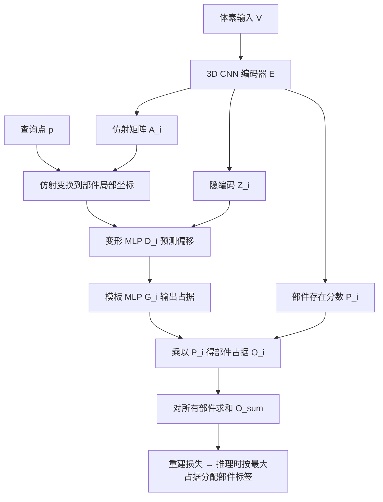

## 一句话总结

提出无监督的变形自编码器 DAE-Net，从同类 3D 形状集合中学习一组可变形的部件模板，通过"选择部件 → 仿射变换 → 局部变形"来重建每个形状，从而得到细粒度、紧凑且跨形状一致的部件协同分割。

## 研究背景

协同分析（co-analysis）是对具有共性的数据集合做无监督学习的经典范式，而 3D 形状集合协同分析的核心问题是协同分割（co-segmentation）：学习一套对集合中所有形状都一致的分割。一致的部件分割能诱导出跨形状的部件对应关系，支撑属性与知识迁移、按部件控制的形状编辑、以及形状结构的生成建模等下游任务。

最大的挑战来自集合内部显著的结构与几何差异。若坚持用单一（甚至层级化的）模板来组织部件，会带来过强的结构刚性，学到的模板只能是粗糙的，才能满足整个集合的一致性要求；反之，基于长方体、超二次曲面等预定义基元的抽象方法，又对部件几何施加了刚性，常导致过分割和碎片化、对应关系不明确。

作者的出发点是"形式追随功能"（form follows function）：不同形状中相互对应的部件应具有近似相同的形状。方法在技术上受变形自编码器（Transforming Auto-encoders, TAE，胶囊网络的第一层）启发——用一组学到的部件模板经仿射变换来组装形状，但仿射变换的表达力不足以忠实表示几何差异大的部件，因此引入受约束的逐部件变形来弥补。

## 方法

### 整体框架

DAE-Net 是一个 $N$ 分支的自编码器，$N$ 是该类别部件数量的上界。3D CNN 编码器以 $64\times64\times64$ 的占据体素为输入，为每个部件 $i$ 输出仿射变换矩阵 $A_i$、隐编码 $Z_i$ 和部件存在分数 $P_i$。解码端每个部件配有一个模板 MLP $G_i$（神经隐式表示部件模板）和一个变形 MLP $D_i$。训练仅用形状重建损失与若干正则项，不需要任何部件标注。

### 关键设计

对部件 $i$，查询点 $p$ 先补齐为齐次坐标 $p'$，经仿射变换进入部件局部坐标系 $p^{local}_i=A_i p'$；再由条件于隐编码 $Z_i$ 的变形网络预测偏移 $\Delta p^{local}_i=D_i(p^{local}_i, Z_i)$，得到变形后坐标 $\hat p_i=p^{local}_i+\Delta p^{local}_i$；最后送入模板 MLP 得到占据，并乘以存在分数：

$$O_i(p)=P_i\cdot G_i(\hat p_i).$$

整形状占据由各部件求和 $O_{sum}(p)=\sum_i O_i(p)$；由于理想情况下各部件不重叠、占据应为 one-hot，作者还用辅助占据 $O_{max}(p)=\max_i O_i(p)$ 参与重建损失。

损失函数包含四项。主重建损失与鼓励部件不重叠的次重建损失：

$$L^{sum}_{recon}=\mathbb{E}_p\left(O_{sum}(p)-V[p]\right)^2,\qquad L^{max}_{recon}=\mathbb{E}_p\left(O_{max}(p)-V[p]\right)^2.$$

约束变形幅度、使变形只做局部微调而不把部件"改造"成另一个部件的 $L_2$ 变形损失：

$$L_{deform}=\mathbb{E}_p\mathbb{E}_i\lVert \Delta p^{local}_i\rVert_2^2.$$

控制分割稀疏度（惩罚存在分数）的损失，让罕见部件消失：

$$L_{sparse}=-\mathbb{E}_i\left(1-\mathbb{E}_{V\in S}P^V_i\right)^2,$$

其中 $\mathbb{E}_{V\in S}P^V_i$ 表示 mini-batch 中含有部件 $i$ 的形状比例。总损失为 $L=L^{sum}_{recon}+\alpha L^{max}_{recon}+\beta L_{deform}+\gamma L_{sparse}$，取 $\alpha=0.1$、$\beta=100$，而 $\gamma$ 按所需分割粒度在 $0.02, 0.01, 0.002, 0.001$ 中依次尝试。

针对无监督重建协同分割是病态问题、易陷入"一个预测部件覆盖多个真值部件"或反之的局部极小，作者设计了一套训练策略：把训练分成 $K$ 个 era、每个 era 含 $M$ 次迭代；定义 $\text{revive}(i)$ 操作，重新初始化 $D_i$、$G_i$ 以及编码器最后一层中影响 $A_i,Z_i,P_i$ 的部分。每个 era 结束时，若某部件在训练集中出现比例低于阈值（10%）则视为"死亡"并复活；同时复活最老的分支，让它有机会拆分或合并。为防止复活把模型带入更差的极小，还比较当前 era 与上一 era 的重建 IoU，若变差则回退到上一 era 的权重。正因为 DAE-Net 用不同网络表示不同部件，复活分支非常容易，这是 BAE-Net、RIM-Net 等共享 MLP 或需复杂层级训练的方法难以采用的。

## 实验结果

在 ShapeNet Part 数据集 15 个类别（排除分割为非体积部件的汽车类）上，用逐部件平均 IOU 与同为无监督协同分割的 BAE-Net、RIM-Net 对比。推理时查询点标签取占据最大的分支标签，并用穷举搜索为各分支自动指派使平均 IOU 最大的语义标签。DAE-Net 在多数类别上大幅领先，少数落后的类别通常也不到 2% 之差。部分类别结果如下（平均逐部件 IOU）：

| 方法 | Mean | plane | chair | guitar | knife | laptop | pistol |
| --- | --- | --- | --- | --- | --- | --- | --- |
| BAE-Net | 56.2 | 59.8 | 54.1 | 51.0 | 32.5 | 27.1 | 29.0 |
| RIM-Net | 53.6 | 52.7 | 79.2 | 25.7 | 29.5 | 33.2 | 36.2 |
| Ours | 76.9 | 78.0 | 85.5 | 88.4 | 85.8 | 95.0 | 74.6 |

消融实验（15 类平均 IOU）表明：训练策略 R 起关键作用，未用 R 的模型易困在局部极小；仿射变换加训练策略（TR）已有不错效果，再加受约束变形网络后完整模型（TDFR）最优，平均 IOU 达 76.9。作者还在 DFAUST 人体与 Objaverse 四足动物子集上给出定性结果，并利用分割结果搭建骨架；此外用存在分数做形状聚类实现"少样本"分类，并结合 DECOR-GAN 实现按部件控制风格的形状细节化应用。定量结果忠实转录自原文，作者也强调 ShapeNet Part 真值分割较粗（如椅子只分背、座、腿、扶手四部件），IOU 无法完全反映 DAE-Net 更细粒度分割的优势。

## 亮点与局限

亮点：首次证明 TAE 框架能产出高质量、跨形状一致的细粒度 3D 协同分割；用"仿射变换 + 受约束局部变形"兼顾结构灵活性与部件保真度，避免了单一模板过粗或基元过分割两难；用独立网络表示各部件，使"复活分支"这类打破局部极小的训练策略变得可行；全流程端到端可微、无需任何部件监督，也不依赖预训练视觉语言模型。

局限：采用体积（体素占据）表示，无法分割纯表面部件（如汽车的引擎盖、车顶）；没有真正的语义理解，某些语义部件（如耳机连接件、滑板轮子、火箭头部）分割不出来；严重依赖训练数据质量，内部中空的形状会被错误分割并可能拖累其他形状；重建不好（欠拟合或部件过小）的部件也无法正确分割；粒度需靠手动调节 $\gamma$。

## 延伸思考

作者指出的两个方向都很自然：一是像 RIM-Net 那样在形状表示中引入层级结构以获得更好的粒度控制，把"选择—变换—变形"扩展为可递归细分的部件树；二是与开放词表语义分割结合，为分割注入语义，从而实现跨类别、有意义且一致的协同分割。此外，方法当前对每个类别单独训练并手工调 $\gamma$，若能让稀疏度权重与粒度自适应、或统一到一个跨类别模型，会更实用；而体素表示的表面部件盲区，或许可通过引入表面/符号距离场等混合表示来缓解。
