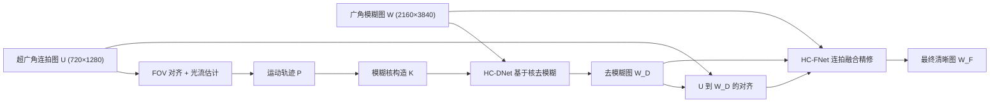

## 一句话总结

利用智能手机上广角与超广角双摄组成混合相机系统，同时拍摄一张长曝光广角图与一串短曝光超广角连拍图，用连拍图提取的运动信息与细节来去除广角图的运动模糊，得到 SIGGRAPH 会场级别的清晰 4K 结果。

## 研究背景

手机相机受限于小尺寸传感器与镜头，在弱光环境下需要更长曝光时间，容易因手抖或物体运动产生运动模糊。传统盲反卷积方法与基于学习的单图去模糊方法（如 NAFNet）在大模糊时仍难以恢复清晰细节。已有的参考图去模糊方法额外引入一张短曝光参考图，但在严重模糊下难以把模糊图与参考图精确对齐；事件相机引导的方法需要专门的事件相机，普通手机并不具备。

作者观察到现代手机普遍配备多摄系统，于是把广角相机（主摄）与超广角相机（副摄）当作混合相机系统：广角相机以慢快门拍摄，超广角相机以更高帧率与更短快门同时拍摄一串低分辨率连拍图。连拍图提供了曝光期间逐像素的相机与物体运动信息（这是单图难以获得的），同时还带有可补充模糊图中丢失的高频细节。混合相机去模糊的思路最早由 Ben-Ezra 与 Nayar 提出，但早期工作依赖经典模糊模型与优化方法，性能受限；本文提出面向真实手机场景的学习式框架 HCDeblur。

## 方法

### 整体框架

HCDeblur 输入一张长曝光广角图 $W$ 和一串短曝光超广角连拍图 $U=\lbrace U_1,\cdots,U_N\rbrace$，输出去模糊结果。流程为：先做视场（FOV）对齐并估计逐像素运动轨迹 $P$，再由 HC-DNet 用运动轨迹构造的模糊核做基于核的去模糊得到 $W_D$，最后由 HC-FNet 把整串连拍图作为参考图对 $W_D$ 做细节精修得到最终结果 $W_F$。

### 关键设计

FOV 对齐与运动估计：广角与超广角相机视场与光心不同，存在几何错位。作者用平面扫描法寻找最优深度 $\hat d$ 得到单应矩阵来对齐 $U$ 到 $W$，目标为

$$\hat d=\arg\min_{d\in D} MSE(W, \mathcal{W}(U_{avg}, H_d))$$

其中 $U_{avg}$ 是连拍图的平均图，用于把 $W$ 的模糊纳入考虑，$H_d=K_u E_d K_w^{-1}$。因为只用一个单应对齐模糊核（模糊核在空间上平滑变化），而非直接从 $U$ 搬运细节，所以对残余错位不敏感。随后在相邻超广角图间估计光流（采用 RAFT），累加得到逐像素运动轨迹 $P$。

模糊核构造：由于连拍长度 $N$ 随曝光时间变化，而 HC-DNet 需要固定通道数输入，作者按时间戳把轨迹重采样为固定长度的核。第 $i$ 张超广角图的相对时间戳为

$$r_i=\frac{(t_{i,s}+t_{i,e})/2 - t^{W}_{s}}{t^{W}_{s}-t^{W}_{e}}$$

再在九个预定义时间点 $t\in\lbrace 0,0.125,\cdots,0.875,1\rbrace$ 上插值得到核

$$K_t=(t-r_i)\cdot\frac{\hat P_{i+1}-\hat P_i}{r_{i+1}-r_i}+\hat P_i$$

拼接后得到通道数为 18 的模糊核 $K$。

HC-DNet：采用以 NAFBlock 组成的 U-Net。核心是核可变形块（KDB），接在编码器每一层前。KDB 先用 NAFBlock 提取 $W$ 与 $K$ 的特征，再用通道注意力从两者特征中筛选，避免使用不准确的核；筛选后的核特征用于预测可变形卷积的偏移与权重，自适应地根据 $K$ 处理 $W$ 的特征。相比直接把核轨迹当固定偏移（如 MotionETR 的 MAB），KDB 学习偏移使其对核误差更鲁棒。

HC-FNet：基于连拍增强网络与 NAFBlock 构建，把去模糊图 $W_D$、原始模糊图 $W$ 以及 FOV 对齐后的连拍图 $\tilde U$ 作为输入。先用 $W_D$ 的 6 倍下采样版与连拍中心帧估计光流做更精确对齐，再逐帧提取并对齐特征，用时空注意力（TSA）把多帧特征融合为单帧，最后经上采样得到精修结果 $W_F$。

数据集：作者构建 HCBlur 数据集。HCBlur-Syn 通过同时拍摄广角与超广角清晰视频、对广角帧做平均合成模糊图（并排除位移大于 36 像素的帧、加入 Poisson-Gaussian 噪声与真实模糊合成流程），共 8568 对，划分为训练 5795、验证 880、测试 1731。HCBlur-Real 提供 471 对真实夜间与室内场景数据，无真值，用无参考指标评测。

## 实验结果

在 HCBlur-Syn（有真值，用 PSNR/SSIM）与 HCBlur-Real（无真值，用 NIQE/BRISQUE/TOPIQ）上与单图、参考图、显式核去模糊方法对比，HCDeblur 全面领先。

| 方法 | PSNR ↑ | SSIM ↑ |
| --- | --- | --- |
| NAFNet-64 | 24.18 | 0.6607 |
| UFPNet | 24.44 | 0.6701 |
| MotionETR | 25.24 | 0.6951 |
| HCDeblur（仅 HC-DNet） | 26.13 | 0.7251 |
| HCDeblur | 26.76 | 0.7373 |

消融实验显示：去掉 HC-DNet 或换成 NAFNet-32 都显著掉点（分别降到 23.22 与 24.05）；对齐策略中「FOV + RAFT」最佳；融合策略中 TSA 优于平均与转置注意力。对比不同利用模糊核的方案，KDB 取得最高 PSNR/SSIM（26.13 / 0.7251），优于简单拼接、KGC、KAM、MAB。轻量版 HCDeblur$_{small}$（用小版 RAFT）仍超过所有对比方法。

## 亮点与局限

亮点：把手机上现成的广角+超广角双摄创造性地当作混合相机系统，用超广角连拍图同时提供运动（构造模糊核）与细节（连拍融合）两类信息；KDB 通过学习可变形卷积偏移，对不准确模糊核更鲁棒；FOV 对齐只用于对齐核而非直接搬运细节，降低了对错位的敏感度；并配套发布了合成与真实的 HCBlur 数据集。

局限：使用较大的光流网络 RAFT 且需在连拍图间反复计算光流，推理约需四秒，难以直接作为手机端应用；方法依赖光流，在极噪或缺纹理场景中光流失败时性能会下降。

## 延伸思考

该工作展示了「多摄硬件协同 + 学习式融合」这一路线在计算摄影中的潜力：与其单纯堆单图网络，不如利用手机已有的多传感器在拍摄时刻捕获额外物理线索（此处是逐像素运动）。后续可探索用更轻量的光流或运动估计模块替换 RAFT 以实现端上实时，或把混合相机思路推广到去噪、超分、HDR 等其他弱光成像任务；如何在光流失效时提供回退机制，也是走向落地的关键。
