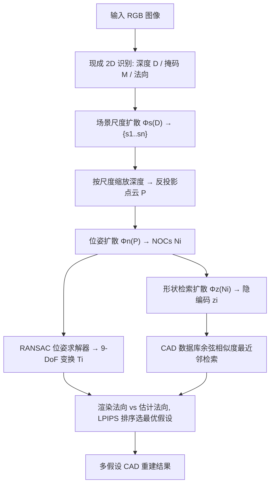

## 一句话总结

DiffCAD 把「从单张 RGB 图检索并对齐 CAD 模型」重构成概率生成任务，用三个解耦的扩散模型分别建模场景尺度、物体位姿（NOCs）与物体形状隐编码；它只在合成数据上训练即可零样本迁移到真实图像，通过采样多个假设覆盖深度-尺度歧义与形状不精确匹配，仅需 8 个假设就在 Scan2CAD 上超过全监督 SOTA 5.9%。

## 研究背景

从 2D 图像感知 3D 结构是计算机图形学的基础问题，对 VR、交互式游戏、数字内容创作都很关键。用 CAD 模型作为 3D 物体的表示有明显优势：它自带强几何先验，输出干净、紧凑的网格，能直接接入现代渲染管线，比体素、点云、神经场等重建结果更适合下游图形任务（后者往往过度网格化、局部有噪声或丢失细结构）。

但已有的 CAD 检索与对齐方法有两大痛点。其一是**监督依赖昂贵且不精确的真实标注**：把 CAD 模型关联到真实图像需要训练有素的标注员，而且 CAD 库无法覆盖真实物体的分布，标注给不出真正精确的形状与位姿匹配（论文举例：一把椅子的脚凳被错标成桌子）。其二是**任务本身具有内在歧义却被确定性方法忽略**：单目感知存在深度-尺度歧义，同一张图对应多种可能的物体平移与缩放；物体的对称性和部分可见（遮挡）也会让同一观测对应多个合理位姿；数据库里往往没有与真实物体精确匹配的形状。

作者的核心洞见是：要在弱监督下解决这个问题，**必须用概率模型**。这样才能同时刻画合成到真实的域迁移歧义，以及单目感知固有的深度-尺度歧义和形状歧义。于是他们采用「合成到真实」的域适应策略，只在合成数据上训练，提出 DiffCAD——首个无需真实世界监督的、面向单张 RGB 图的概率化 CAD 检索与对齐方法。

## 核心方法

DiffCAD 把单视图 3D 感知中的多种歧义**解耦**成三个独立的条件生成任务，各用一个扩散模型建模：场景尺度 $$\Phi_s$$、物体位姿 $$\Phi_n$$、物体形状 $$\Phi_z$$。为缩小域间差距，推理时不直接用合成 RGB（照片级合成渲染昂贵且困难），而是用现成 2D 识别模型从真实 RGB 生成深度图、实例掩码和法向图作为中间表示，让模型在这些「机器估计的几何量」上工作。

整体是一个**级联的多假设采样**流程：先从场景层面推理尺度，再采样显式物体表示（NOCs）求位姿，最后采样隐式物体表示（形状隐编码）做检索。三者都遵循 DDPM 的加噪-去噪框架。

## 技术细节

三个扩散模型都基于 DDPM 前向加噪、反向去噪的经典公式。前向过程按方差调度 $$\beta_t$$ 逐步注入高斯噪声：

$$q(x_t|x_{t-1}) = \mathcal{N}\left(x_t;\sqrt{1-\beta_t}\,x_{t-1},\ \beta_t \mathbf{I}\right)$$

去噪网络学习反向过程 $$p_\Phi(x_{t-1}|x_t)$$ 以恢复 $$x_0$$。尺度与位姿模型用 $$\epsilon$$-预测形式，形状模型直接预测去噪后的 $$z_0$$。

**场景尺度扩散 $$\Phi_s$$。** 单目深度对合成与真实数据都存在系统偏差，作者认为建模「预测深度与真值深度之间的尺度因子分布」比直接建模深度更跨域鲁棒。目标尺度定义为掩码区域内预测深度与参考深度的逐像素比值均值：

$$s_{gt} = \mathrm{avg}\left(\frac{D \odot M}{D_{gt} \odot M}\right)$$

其中 $$M$$ 是目标物体掩码，$$\odot$$ 为 Hadamard 积。由于尺度是各向同性标量，作者把它扩展成与深度特征图同尺寸、每个元素都等于 $$s_{gt}$$ 的向量 $$S$$，与 ResNet-50-FCN 提取的深度特征拼接后送入扩散 U-Net。训练目标（L1）：

$$\mathcal{L}_s = \mathbb{E}_{\epsilon\sim\mathcal{N}(0,I),\,t}\left[\lVert\epsilon-\epsilon_{\Phi_s}(t)\rVert_1\right]$$

推理时从标准正态去噪采样出 $$S$$，取 $$s=\mathrm{avg}(S)$$，重缩放深度得到多个可能的公制场景，为物体平移与缩放提供多种假设。

**CAD 对齐扩散 $$\Phi_n$$。** 9-DoF 变换 $$T=[R|t|s]$$ 含旋转、平移、各向异性缩放，直接建模需处理不同空间。作者转而预测**归一化物体坐标（NOCs）** $$N$$——观测物体与其规范坐标系之间的几何对应，便于跨形状泛化并求解 $$T$$。因为 NOCs 与反投影点云 $$P$$ 几何结构相似，就以 $$P$$ 为条件（用 3DGC 骨干提取逐点特征 $$P_f$$）。训练目标同样是 L1 噪声匹配：

$$\mathcal{L}_n = \mathbb{E}_{\epsilon\sim\mathcal{N}(0,I),\,t}\left[\lVert\epsilon-\epsilon_{\Phi_n}(t)\rVert_1\right]$$

概率化建模天然处理了 NOC 的多假设问题：物体对称或部分观测会让同一观测对应多个可行对齐。推理时从噪声采样 NOC 候选，再用 RANSAC 位姿求解器（类似 CaTGrasp）从 NOC 与点云 $$P$$ 求出 9-DoF 变换。

**CAD 检索扩散 $$\Phi_z$$。** 显式 3D 形状表示维度太高，作者用隐编码 $$z\in\mathbb{R}^d$$。先用类 ConvONet 的自编码器 $$\Phi_o$$（在瓶颈处加一层 MLP 把 triplane 特征融合成全局向量）把 CAD 模型压成隐编码并预训练；$$\Phi_z$$ 学习从这些隐编码分布中采样。它以 NOC 估计 $$N$$ 为条件（通过位置特征嵌入把 $$\mathbb{R}^3$$ 映射到 $$\mathbb{R}^C$$ 再经单层 MLP），直接优化去噪后的原始隐向量：

$$\mathcal{L}_z = \lVert\Phi_n(z_t) - z_0\rVert_1$$

推理时采样 $$z$$，在 CAD 数据库中按余弦相似度做最近邻检索。**在规范空间（而非相机空间）学习形状嵌入**对检索精度提升显著。

**合成数据增强。** 只用 3D-FRONT 训练易过拟合（目标类别仅 1334 个独特物体）。作者从 3D-FUTURE 与 ShapeNet 汇集 18229 个物体，用同类别未使用的 CAD 随机替换场景中的家具，扩增出约 30 万张图像、覆盖 6 个目标类别，显著提升物体形状与布局多样性。

**多假设采样与排序。** 级联采样生成 $$n\times m$$ 个候选（$$n$$ 个尺度、每个尺度 $$m$$ 个形状）。对每个尺度 $$s_i$$，用求解出的位姿渲染 CAD 法向图，与从 RGB 估计的法向图算 LPIPS 相似度，选 LPIPS 误差最低者作为该尺度的最优假设。

**训练开销。** $$\Phi_s$$ 在单张 RTX A6000 上训 2 天；$$\Phi_n$$ 用 1024 点点云、单卡 A6000 每类别约 3 天；$$\Phi_o$$ 在单张 A100 上训 3 天；$$\Phi_z$$ 单卡 A6000 每类别 3 天。

## 实验结果

在真实数据集 ScanNet（配 Scan2CAD 的 ShapeNet 标注）和 ARKit 上验证。因单视图任务存在歧义，作者提出**概率化评估协议**：对能出多假设的方法，评估「真值到任一假设的最小误差」，即 top-n 评估。对齐正确标准沿用前人阈值：类别正确、平移误差 ≤20cm、旋转误差 ≤20°、尺度比 ≤20%。检索相似度用检索网格与真值间的 L1 Chamfer Distance。

**对齐精度（ScanNet，类平均）。** 与全监督的 ROCA、SPARC 相比：

| 方法 | 域内监督 | #假设 | 平均↑ |
| --- | --- | --- | --- |
| ROCA | ✓ | - | 14.8 |
| SPARC | ✓ | 8 | 30.3 |
| SPARC | ✓ | 20 | 32.8 |
| DiffCAD (Ours) | ✗ | 1 | 11.3 |
| DiffCAD (Ours) | ✗ | 8 | 32.1 |
| DiffCAD (Ours) | ✗ | 20 | 39.4 |

单假设时略逊于全监督方法（因合成-真实域差带来的尺度偏差），但 8 个假设即超过全监督 SPARC，20 假设后有轻微饱和。相比之下 SPARC 增加假设几乎不提升。

**位姿度量误差（8 假设）。** DiffCAD 在平移（27.5cm）和旋转（18.6°）上明显优于 ROCA（43.5cm / 27.9°）和 SPARC（35.1cm / 19.5°），尺度误差三者持平（0.19）。

**检索相似度（L1 Chamfer Distance，越低越好）。** ROCA/SPARC 用相同确定性检索为 0.106；DiffCAD 单假设 0.116 与之持平，8 假设降至 0.075，20 假设 0.063。即便按「平均 Chamfer Distance」这一更严苛指标，DiffCAD 8 假设的 0.088 也优于确定性基线的 0.106（以及随机取 ROCA 的 8 个邻居得到的 0.093）。

**消融要点：**
- 概率建模的价值：把扩散换成同架构 U-Net（10.1）或 PointTransformer-V3（6.9）等确定性基线，都因域差大幅落后于 DiffCAD 单假设（11.3）。
- NOC 代理优于直接回归 $$T$$：直接预测 9-DoF 值（16.3）或只预测尺度（19.9）都不如用 NOC + 求解器（32.1）。
- 规范空间检索优于相机空间（0.075 vs 0.111）。
- 数据增强有效：去掉增强，$$\Phi_n$$ 从 32.1 降到 25.8，$$\Phi_z$$ 从 0.075 降到 0.082。
- 学到的尺度分布比参数化的「智能随机采样」采样效率高得多。

## 贡献与局限

**贡献：**
- 提出首个面向单张 RGB 图的概率化 CAD 检索与对齐方法，显式刻画深度-尺度歧义与数据库缺乏精确匹配带来的形状歧义。
- 用扩散过程建模场景尺度、物体位姿、物体形状三个解耦分布，配合级联采样高效生成多个合理的 CAD 重建假设。
- 借助机器估计的深度与 2D 掩码作为域不变中间表示，仅用合成数据训练即可鲁棒泛化到真实图像，无需任何真实世界标注。

**局限：**
- CAD 表示紧凑，但对需要精确重建的应用，数据库缺乏精确几何匹配会成为瓶颈；未来可对检索到的 CAD 做形变以更好贴合观测。
- 方法未显式建模物体间关系，而室内场景常有连贯的全局结构，缺乏场景上下文可能限制性能。作者认为结合场景上下文与物体形变是更精确 3D 感知的有希望方向。

## 延伸思考

DiffCAD 最值得借鉴的是「**把单视图感知的固有歧义显式当作分布来学，而不是强行回归一个确定答案**」这一范式转变。深度-尺度歧义、对称/遮挡导致的位姿多解、数据库形状不精确匹配——这些在确定性方法里都是误差来源，在这里却被扩散模型转化为可采样的多假设，再用一个轻量的 LPIPS 法向排序把最合理的挑出来。这种「生成多个 + 廉价重排」的思路与其它概率化 3D 任务（人体运动、多模态检索）一脉相承。

另一个巧妙点是**解耦 + 中间几何表示**的组合拳：把尺度、位姿、形状拆成三个独立扩散模型，各自条件于机器估计的深度/点云/NOCs，而不是端到端吞进 RGB。这既让每个子问题更可学，又用「深度、掩码、法向」这些跨域相对稳定的几何量作为桥梁，绕开了合成 RGB 与真实 RGB 之间巨大的外观域差——这正是它能「只训合成、直接上真实」的关键。用 NOCs 作为位姿代理而非直接回归 9-DoF，也再次印证稠密对应比稀疏参数回归更利于跨域泛化。对想做「无真实标注的 3D 感知」的工作，这套配方很有参考价值。
