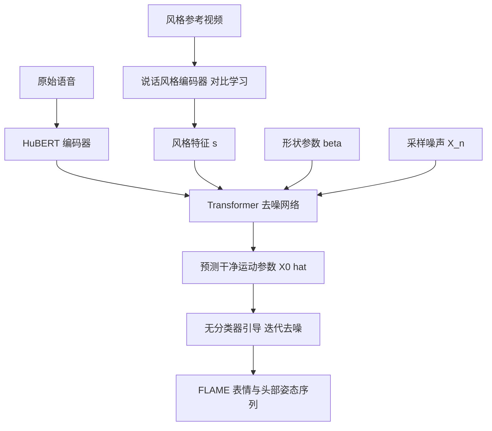

## 一句话总结

用扩散模型加一个对比学习训练的说话风格编码器，从任意参考视频中提取风格特征，由语音联合生成多样、贴合个人风格的 3D 面部表情与头部姿态动画。

## 研究背景

语音驱动的 3D 面部动画要从任意语音信号生成口型同步的面部表情，广泛应用于教育、娱乐与虚拟现实。它本质上是语音到面部运动的跨模态多对多映射：同一段语音可以对应多种自然合理的表情与头动。

现有方法有两大局限。其一，多数方法采用确定性回归模型，难以刻画这种多对多关系，容易陷入「回归到均值」问题，产出过度平滑的面部运动，在大规模数据集上尤为明显。其二，它们通常用 one-hot 编码表示说话风格，只能覆盖训练集中预定义的身份标签，无法适配新个体、也难以捕捉细粒度风格。

扩散模型能够拟合多样的分布，天然适合多对多映射，但已有的音频驱动人体运动扩散方法不能直接迁移到面部动画上，原因有三：口型运动对语音的时间对齐要求远比手势严格；唇动包含比手势更丰富的音素级语义，需要更强的语音编码器；人的说话风格多样，需要能从任意参考片段提取风格表示的编码器。DiffPoseTalk 针对这三点重新设计，并额外联合生成头部姿态，同时通过重建自「野外」音视频数据的 3DMM 参数来缓解 3D 扫描说话人脸数据稀缺的问题。

## 方法

整体框架：输入一段语音特征、模板脸的 3DMM 形状参数 $$\beta$$、以及一个说话风格向量 $$s$$，输出由 FLAME 表情与姿态参数构成的运动序列 $$X_{0:T}$$。语音用 HuBERT 编码；风格向量由说话风格编码器从一段简短参考视频中提取；核心是一个基于 Transformer 的去噪网络，在无分类器引导下完成条件生成。

关键设计：

- 人脸表示用 3DMM（FLAME，$$N=5023$$ 顶点、$$K=4$$ 关节），参数为形状 $$\beta\in\mathbb{R}^{100}$$、表情 $$\psi\in\mathbb{R}^{50}$$、头姿 $$\theta\in\mathbb{R}^{3K+3}$$。模型预测表情以及姿态中的下颌与全局旋转，把 $$\psi$$ 与 $$\theta$$ 合成运动参数 $$x$$。选 3DMM 而非网格顶点，是因为低维参数在扩散模型下计算更快、2D 音视频数据更易采集且覆盖更广、blendshape 先验有助于泛化，并便于对接下游头像驱动。
- 语音表示用自监督预训练的 HuBERT（时序卷积特征提取加多层 Transformer），并加一个重采样层把音频特征对齐到面部运动的采样率。HuBERT 的 Transformer 部分设为可训练，让其直接从语音捕捉运动信息。
- 去噪网络预测「干净样本」$$X_0$$ 而非噪声，从而可以叠加几何损失以更精确约束面部运动。编码器与解码器之间设对齐掩码，使位置 $$t$$ 的运动特征只关注对应的语音特征 $$a_t$$，保证语音与运动模态对齐。对任意长度输入采用滑窗策略，每个窗口把上一窗口末尾 $$T_p$$ 帧的语音与运动作为条件以保证过渡平滑：
$$\hat X^{0}_{-T_p:T_w}=D\left(X^{n}_{0:T_w},X^{0}_{-T_p:0},A_{-T_p:T_w},s,\beta,n\right)$$
- 损失：基础重建损失 $$L_{simple}=\lVert \hat X^{0}-X^{0}\rVert^2$$；将参数转为「零头姿」网格序列后施加顶点损失 $$L_{vert}$$、速度损失 $$L_{vel}$$ 与惩罚大加速度的平滑损失 $$L_{smooth}$$，并对头部运动施加类似的几何损失 $$L_{head}$$，合成
$$L=L_{simple}+\lambda_{vert}L_{vert}+\lambda_{vel}L_{vel}+\lambda_{smooth}L_{smooth}+L_{head}$$
- 说话风格编码器：用 Transformer 编码器从运动参数序列 $$X_{0:T}$$ 提取风格，特征经平均池化得风格向量 $$s=SE(X_{0:T})$$。风格难以定量描述，故采用对比学习（NT-Xent 损失）隐式学习，假设「同一个人在相近时间的短时说话风格应当相似」，把一段样本对半切成正样本对，其余为负样本。
- 采样用带增量式方案的无分类器引导，对音频与风格分别设引导尺度 $$w_a$$、$$w_s$$：
$$\hat X_0=D(X_n,\varnothing,\varnothing,\beta,n)+w_a\left(D(X_n,A,\varnothing,\beta,n)-D(X_n,\varnothing,\varnothing,\beta,n)\right)+w_s\left(D(X_n,A,s,\beta,n)-D(X_n,A,\varnothing,\beta,n)\right)$$
训练时以 0.45 概率将风格条件置空、以 0.1 概率将音频与风格同时置空。

数据方面构建了新数据集 TFHP（Talking Face with Head Poses），含 588 位受试者的 1052 段视频、共 26.5 小时（含改造自 HDTF 的 348 段），统一转为 25 fps，用 MICA、SPECTRE、6DRepNet 等重建出约 238.5 万帧 FLAME 参数，并用 Savitzky-Golay 滤波平滑，按说话人划分为 460/64/64 训练/验证/测试。

## 实验结果

用唇部顶点误差 LVE、上脸动态偏差 FDD、嘴部张开差异 MOD、头动节拍对齐 BA，以及表情与头姿的多样性 Div 评估，与 FaceFormer、CodeTalker、FaceDiffuser（无头姿组）及 Yi et al.、SadTalker（有头姿组）对比。

| 方法 | LVE(mm)↓ | FDD(×10⁻⁵m)↓ | MOD(mm)↓ | BA↑ |
| --- | --- | --- | --- | --- |
| FaceFormer | 9.90 | 16.95 | 2.63 | N/A |
| CodeTalker | 12.71 | 12.44 | 2.87 | N/A |
| FaceDiffuser | 12.12 | 15.48 | 3.50 | N/A |
| Ours (no HP) | 8.81 | 10.13 | 1.72 | N/A |
| Yi et al. | 9.99 | 21.50 | 2.42 | 0.26 |
| SadTalker | — | — | — | 0.24 |
| Ours | 8.94 | 9.60 | 1.62 | 0.29 |

本方法在所有指标上领先，取得最佳唇同步与头动节拍对齐；FDD、MOD、BA 显示其最有效地捕捉说话风格；确定性基线几乎无法从相同输入产生多样表情与头姿。26 人用户研究中，本方法在唇同步、风格相似度、自然度三项评分均显著居首（如有头姿组：4.52 / 4.25 / 4.43）。消融显示：去掉风格编码器全指标下降；去掉几何损失无法产出精确动画；去掉对齐掩码导致严重失同步；去掉无分类器引导则改善 LVE 但略损与风格相关的 FDD、MOD（因其在提升单样本质量的同时降低多样性）。

## 亮点与局限

亮点：提出基于扩散模型联合生成面部运动与头部姿态的框架，用无分类器引导实现示例式风格控制；风格编码器以对比学习从任意参考视频提取个性化风格，无需为新个体优化或微调；预测干净样本使几何损失得以引入；构建并公开了涵盖多样身份、风格与头动的 TFHP 音视频数据集。

局限：去噪过程为序列式，推理计算成本较高，可考虑 DPM-Solver++ 等更快求解器；在极高噪声语音下可能产出模糊或过平滑的口型；与现有方法一样只动脸形而忽略口腔内部（牙齿、舌头）；未来需采集覆盖更广身份与风格的真实 3D 说话数据。作者也强调该技术存在深度伪造滥用风险，要求所生成序列均标注为合成数据，并将向伪造检测社区开放代码。

## 延伸思考

这项工作的关键判断，是把「多对多映射」这一任务本质摆在中心：确定性回归天然会被均值吸引，而扩散模型的分布拟合能力正好对症，这也解释了为何它在大规模数据上比 FaceFormer、CodeTalker 更能保住多样性与风格。另一处巧劲是把风格从离散标签解放为连续可提取的嵌入——用对比学习和「同人近时风格相似」的自监督假设，绕开了风格难以量化标注的困境，使得对未见个体的示例式驱动成为可能，这一思路对任何需要「从少量参考迁移个性化风格」的生成任务都有借鉴价值。选择 3DMM 参数而非网格顶点，则是一次务实取舍：牺牲部分几何自由度，换来低维高效、可借「野外」2D 数据扩容、并天然对接 blendshape 头像的工程红利，这也是它能训练在 26.5 小时大数据上的前提。局限同样点明了扩散式方法的通病——序列去噪的推理开销与对口腔内部的忽略，是后续实时化与真实感提升的两个明确切口。
