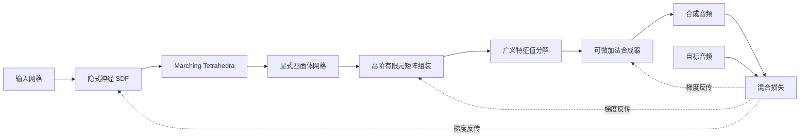

## 一句话总结

DiffSound 提出一个端到端可微的物理模态声音渲染框架，把从三维网格到撞击声的全流程都做成可微分，从而能反向从真实录音中推断物体的材质、体积厚度、几何形状和撞击位置等物理与形状属性。

## 研究背景

从真实世界的声音录音中估计并模拟物体的物理属性，在视觉、图形学与机器人领域有重要价值。可微模拟近年来在图形学与机器学习社区流行起来，其好处在于支持基于梯度的优化，可以嵌入神经网络做端到端学习。但把已有的可微刚体或软体模拟直接用于模态声音合成存在困难：音频采样率很高，先前的可微刚体、软体模拟技术无法直接套用；而已有的音频合成器虽能优化很多音频与物理相关的属性，却无法显式建模杨氏模量、泊松比、物体尺寸形状或撞击位置这些对真实模态声音合成至关重要的底层物理属性。

据作者所述，虽有少量工作尝试从声音推断材质属性，但从纯声音分析中估计物体的厚度、精确几何形状与撞击位置，这是首次尝试。反推这些属性可以支持一系列 Real-to-Sim 应用：从真实录音精确推断材质并重建虚拟物体、设计物体形状与材质以产生目标声音（再借由三维打印迁移回真实物体），以及在视觉分辨率低或光照差时用声音信息补充视觉感知，服务于多感官机器人应用。

## 方法

### 整体框架

DiffSound 建立了一条从三维网格输入到模态声音输出的完全可微流水线，由三大组件构成：

1. 可微四面体网格表示：混合隐式神经表示与显式三维四面体网格。
2. 可微高阶有限元分析模块：支持不同材质与形状参数。
3. 可微加法合成器：配合混合损失策略，让整条管线平滑优化。

设可学习参数为 $\theta$。对输入网格 $m$，可微网格生成器 $G_{\theta_G}$ 输出显式四面体网格 $m_{tet}=G_{\theta_G}(m)$；可微有限元矩阵组装器 $A_{\theta_A}$ 输出质量矩阵与刚度矩阵 $\mathbf{M},\mathbf{K}=A_{\theta_A}(m_{tet})$；广义特征值分解器 $D$ 输出特征值 $\lambda=D(\mathbf{M},\mathbf{K})$；可微加法合成器 $S_{\theta_S}$ 把特征值合成为模态声音 $a_{syn}=S_{\theta_S}(\lambda)$。整条管线合并为 $a_{syn}=F_\theta(m)=S_{\theta_S}(D(A_{\theta_A}(G_{\theta_G}(m))))$，优化目标为：

$$\theta^{*}=\arg\min_{\theta}\left(L(F_\theta(m),a_{gt})\right).$$

不同任务往往只优化其中一个模块的参数，其余模块参数固定。

### 关键设计

可微四面体表示：基于 Deep Marching Tetrahedra，用多层感知机参数化符号距离场（SDF），隐式表示形状并调控重建形状的整体光滑度（光滑度可通过位置编码频率调节）。再用 Marching Tetrahedra 算法把编码后的 SDF 转为显式四面体网格，背景四面体单元顶点可在半格尺寸内形变以增强几何表达；针对内部子区域按旋转对称性归纳出五种配置，复杂子区域进一步细分。为抑制声音优化中的高频噪声，只保留最大连通四面体网格、丢弃小碎片。

可微高阶有限元：线性四面体单元精度有限，作者改用高阶有限元以获得更高精度与通用性。对每个四面体单元用高斯数值积分计算单元质量矩阵与刚度矩阵，再组装成全局稀疏矩阵：

$$\mathbf{M}_e^{ij}=\rho V\sum_{k=1}^{t}N_i(g_k)N_j(g_k)w_k,$$

$$\mathbf{K}_e=\sum_{k=0}^{t}w_k V\,\mathbf{D}(g_k)^{T}\mathbf{B}(E,\nu)\mathbf{D}(g_k).$$

其中 $\mathbf{B}(E,\nu)$ 为线性弹性材料模型的弹性矩阵。矩阵借助 PyTorch 批量计算并自动可微，对密度、杨氏模量、泊松比与几何均可微。

特征值梯度：由于没有支持自动微分的广义特征值分解器，作者从 $\mathbf{K}u_i=\lambda_i\mathbf{M}u_i$ 出发推导特征值对矩阵的梯度关系。利用 $u_i^{T}\mathbf{M}u_i=1$ 与 $(\mathbf{K}-\lambda_i\mathbf{M})u_i=0$，得到：

$$\partial\lambda_i=u_i^{T}\left(\partial\mathbf{K}-\lambda_i\partial\mathbf{M}\right)u_i.$$

可微加法合成器：刚体声音建模为一组阻尼正弦振子。第 $i$ 个模态的频率与信号为：

$$f_i=\frac{\sqrt{\lambda_i-d_i^{2}}}{2\pi},\qquad s_i(n)=A_i e^{-d_i n h}\sin(2\pi f_i n h).$$

阻尼因子与振幅从真实数据学习，振幅可隐式包含声学传递函数。对含噪的真实录音，还叠加经 LTV-FIR 滤波器过滤的噪声，滤波器参数同样可学习。

混合损失策略：采用多尺度频谱损失衡量音频差异，但当初始频率与目标频率相差很大时，频谱几乎不重叠，L1/L2 损失会出现零梯度并陷入局部极小。为此先把频谱每个频率 bin 视作高维点，用最优传输（Wasserstein）距离并借 Sinkhorn 散度高效近似进行优化；当损失下降进入平台期、初始与目标频谱大体对齐后，再切换到频谱损失。这种分阶段策略让模型在训练不同阶段都能受益于合适的损失类型。

## 实验结果

实验中的真实物体数据来自 ObjectFolder Real 数据集（100 个真实家用物体，含高质量三维网格、撞击声录音与视频）。框架用 PyTorch 实现，采用 Adam 优化器。作者定义了材质、几何形状、撞击位置三类推断任务，并先做损失函数消融验证方法有效性。

材质属性推断：在 16 个物体上估计杨氏模量与密度之比 $\hat{E}$ 及泊松比 $\nu$，相对误差为评价指标。与三种基线对比，DiffSound 在所有指标上一致领先。

| 方法 | 有限元阶数 | 可学习 $\nu$ | $\hat{E}$ 误差 | $\nu$ 误差 | 频谱误差 |
| --- | --- | --- | --- | --- | --- |
| 基线 1 | 1 | 否 | 0.51 | 0.68 | 26.43 |
| 基线 2 | 2 | 否 | 0.10 | 0.68 | 11.21 |
| 基线 3 | 1 | 是 | 0.51 | 0.66 | 27.00 |
| DiffSound | 2 | 是 | 0.07 | 0.26 | 7.95 |

体积厚度推断：从实心网格生成不同厚度的空心网格并预测厚度，用平均绝对误差（MAE）衡量。方法对光滑厚网格预测精度高，对复杂表面或较薄网格可能出现误差。

| 物体 | 0.3 | 0.4 | 0.5 | 0.6 | 0.7 | MAE |
| --- | --- | --- | --- | --- | --- | --- |
| Bunny | 0.304 | 0.407 | 0.508 | 0.608 | 0.709 | 0.0073 |
| Armadillo | 0.338 | 0.456 | 0.590 | 0.696 | 0.730 | 0.0623 |
| Bulbasaur | 0.308 | 0.411 | 0.512 | 0.614 | 0.718 | 0.0125 |
| Squirtle | 0.312 | 0.416 | 0.520 | 0.624 | 0.718 | 0.0177 |

几何形状推断在粗体素约束（$16^3$，乃至 $8^3$）下能从撞击声恢复出接近真实的几何细节；形状变形推断能在两物体间的插值序列中找到与目标特征值吻合的形状；撞击事件推断则利用可学习的模态振幅隐式编码撞击位置信息，对一个陶瓷碗的真实录音，用余弦相似度得到的撞击位置概率热图在真实撞击位置附近呈现高似然（碗的旋转对称性使同一圆周上的撞击产生相同声音）。

## 亮点与局限

亮点：把从三维网格到模态声音的整条物理管线做成端到端可微，首次实现从纯声音推断物体厚度、精确几何形状与撞击位置；在可微框架内自研高阶有限元模块，兼顾声音渲染质量与可微性；针对声音优化中频谱不重叠导致的零梯度问题，提出最优传输损失与频谱损失的分阶段混合策略。

局限：难以处理复杂形状，尤其是薄壳结构；对强非线性声音建模能力有限；当物体阻尼系数在低频到高频间波动剧烈时，简单插值得到的阻尼曲线可能无法准确表示真实分布；单物体训练耗时较长（材质推断约 3 小时、厚度推断约 2 小时每物体每目标厚度），距离实时应用尚有差距。

## 延伸思考

DiffSound 把"可微渲染"从视觉领域扩展到声学模态合成，展现了物理可微管线在多感官感知中的潜力：声音携带的材质、几何、撞击信息可以与视觉互补，尤其在视觉退化的场景下对机器人与具身智能颇有价值。将其接入神经网络做端到端联合优化，或与视觉、触觉模态融合构建统一的多感官逆向渲染系统，是自然的延伸方向。此外，如何加速特征值分解与有限元组装以支持实时反演，以及如何建模薄壳与强非线性声音，都是让该框架走向实用的关键难点。
