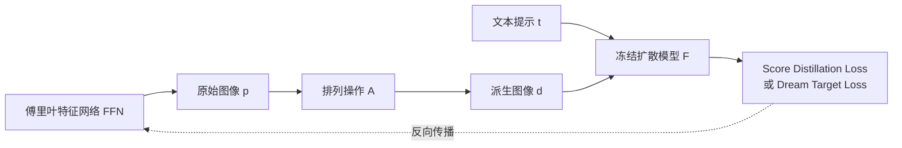

## 一句话总结

借助冻结的文生图扩散模型，通过优化一组可微参数化的"原始图像"，自动生成能在物理世界拼摆或翻转后浮现出新图像的光学错觉。

## 研究背景

光学错觉（如正看是狗、倒看是树懒的图，或四张游乐场图叠在一起显出二维码）长期以来依赖艺术家耗费大量时间与技巧手工创作，缺乏统一的自动化生成框架。已有的计算生成方法（混合图像、多视角线雕等）往往只针对某一类特定错觉，且常需人工对齐或大量筛选。作者希望给出错觉生成问题的形式化定义，并利用近年文生图扩散模型的能力，构建首个通用、可控、且能在真实世界物理制作的错觉生成管线。

## 方法

整体框架：把一组"原始图像"（prime images）用傅里叶特征网络（FFN）参数化表示；这些原始图像经过"排列操作"（arrangement）得到"派生图像"（derived images）；冻结的文生图扩散模型对派生图像提供与用户文本提示对齐的损失信号；梯度反向传播穿过排列操作与原始图像，直到 FFN 参数，但不穿过扩散模型本身。

关键设计：

问题形式化。一个错觉由 $n$ 张原始图像 $\lbrace p_1,\dots,p_n\rbrace$ 与 $m$ 个排列操作 $A=\lbrace a_1,\dots,a_m\rbrace$ 组成，每个 $a_j:P^n\to D$ 把所有原始图像排列成一张派生图像 $d_j$。排列操作须满足三条性质：固定（同输入同输出）、可微、可在真实世界物理复现。

三类错觉。翻转错觉（$n=1,m=2$，正看与倒转 $180^\circ$ 各成一物）；旋转叠加错觉（$n=2,m=4$，两张透光片叠放，旋转片以 $0/90/180/270^\circ$ 旋转，$a_j(p)=p_1\ast\text{rot}(p_2,90j)$）；隐藏叠加错觉（$n=4,m=5$，前四张各自可读 $d_i=p_i$，第五张为四片相乘 $a_5(p)=p_1\ast p_2\ast p_3\ast p_4$）。乘法混合模拟多张透光片透光叠加，结果乘常数后用 tanh 归一化以避免动态范围损失。

原始图像表示。每张原始图像为 $512\times512$ 的 RGB 图，用一个 MLP 傅里叶特征网络将像素坐标映射到 RGB 值，形成隐式表示。相比直接在像素空间优化，FFN 避免了信息被编码到极高频、需要像素级完美对齐的脆弱结果，使错觉在真实打印时更鲁棒。

两阶段损失。第一阶段用 Score Distillation Loss：随机取时间步 $\tau$，向派生图像加噪 $\eta_\tau$ 后经条件去噪网络估计噪声 $\hat\eta_\tau$，以两者差作为对齐信号，

$$\hat\eta_\tau = F_u(d_i+\eta_\tau,\tau,F_t(t_i))$$

$$L^{SD}_i(t_i,d_i)=\lVert \eta_\tau-\hat\eta_\tau\rVert_1$$

第二阶段引入新的 Dream Target Loss：用 SDEdit 周期性地由派生图像生成目标图像 $z_i=G(t_i,d_i)$，再用结构相似度与像素级 MSE 把派生图像拉向目标，

$$L^{DT}_i(z_i,d_i)=L_{SSIM}(z_i,d_i)+L_2(z_i,d_i)$$

总损失按重要性加权 $L^{DT}=\sum w_i L^{DT}_i$，默认 $w_i=1$，隐藏叠加错觉中把隐藏图权重设为 $w_5=3$。该阶段更快且引入更少噪声。文本提示也可替换为具体目标图像（如二维码或文字块），此时用同样的相似度损失度量差异。

物理制作。翻转错觉只需打印机；叠加类错觉将原始图像用彩色激光打印在投影胶片上并覆膜，配合足够强的背光即可复现。

## 实验结果

在隐藏叠加错觉上，以逐条独立生成目标图像的原始 SDXL 为基线，评测四个变体（C 为默认：500 步 Score Distillation + 8 步 Dream Target，权重 $[1,1,1,1,3]$；A 用 SD1.5；B 用等权重；D 用 4000 步 Score Distillation + 1 步）。所有方法在单张 A100 上限时 15 分钟。评价维度包括可控性（CLIP 图文余弦相似度）、多样性（Vendi 分数）、美学（AVA 美学分）与作者新提出的独立性分数（衡量原始图像"藏住"隐藏图的程度）。

| 对比 | 结论 |
| --- | --- |
| 默认方法 C vs 基线 | 除多样性（Vendi）外，可控性、美学、独立性均明显优于基线 |
| 多样性偏低的原因 | 生成错觉的额外约束限制了多样性，属预期现象 |
| 四变体之间 | 可控性与多样性相近；C 在美学上优势明显，C 与 D 独立性较高 |
| 优化时长 | 随优化时间增加，可控性与美学分持续上升 |

作者据此认为：所用提示词的重要性远高于具体实现，且不存在放之四海皆准的最优方法，应按艺术风格与主题择优选择。

## 亮点与局限

亮点：首次为错觉生成给出形式化定义，并给出覆盖单张/多张原始图像、多种排列的通用管线；提出 Dream Target Loss 在速度与噪声上改进纯 Score Distillation；用 FFN 参数化换取真实世界打印的鲁棒性；所有错觉均实际物理制作验证，并提出独立性分数这一面向错觉场景的新指标。

局限：生成推理时间仍偏长；真实打印会引入色偏，影响错觉效果；依赖 SD1.5/SDXL，会继承其在数据分布（偏英语/西方内容）上的偏见。

## 延伸思考

把"排列操作必须固定、可微、可物理复现"抽象出来后，框架天然可扩展到更多错觉类型（异质错觉、透镜/线雕组合等），关键在于为新排列建模一个可微算子。乘法混合模拟透光叠加的思路，也提示可以把更多真实光学/材质过程写成可微前向层，让扩散先验直接服务于可制造的物理成品，而不仅停留在数字图像。独立性分数用 CLIP 图文相似矩阵的双向 softmax 对角线取最小值来度量"各图各归其主"，这种度量思路对多目标、多约束生成任务的评测有一定通用参考价值。
