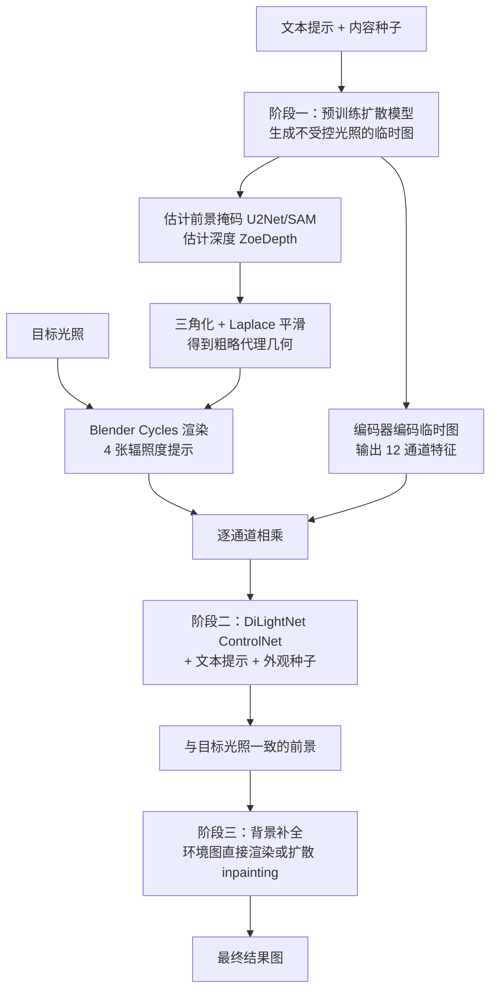

## 一句话总结

DiLightNet 通过向文本到图像扩散模型注入「辐照度提示」（radiance hints，即用规范材质渲染出的粗略光照可视化），实现了在文本驱动生成过程中对前景物体光照的细粒度、独立控制。

## 研究背景

现有文本到图像扩散模型虽然能生成任意光照下的图像，却难以对光照做精确控制，主要有两方面障碍：

- 内容与光照高度耦合。模型采样存在光照偏置，例如生成足球时大多默认使用正面闪光灯照明，生成机器人时光照集中于前左或前右，用户无法把光照和内容独立开来控制。
- 文本本身表达力不足。语言只能给出定性（暖、冷）与粗略方位（左、右、轮廓光）的描述，且当前文本嵌入对细粒度信息编码能力有限；直接把光照方向或环境图作为条件，又受限于耦合与表示能力，无法实现独立可控。

作者主张改用辐照度提示来传递光照条件：用规范同质材质、在目标光照下渲染出的图像。但文本生成场景里前景几何是未知的。核心观察是：既然只是引导扩散采样方向，就无需精确的辐照度提示，粗略近似即可，细节交给扩散模型的生成能力补全。

## 方法

整体框架分三个阶段：先用预训练模型生成一张不受控光照的临时图确定形状与纹理，再用辐照度提示引导 DiLightNet 重新合成与目标光照一致的前景，最后补全与光照一致的背景。

关键设计：

- 辐照度提示生成。从临时图分割前景并估计深度，三角化成网格并做 Laplace 平滑以抑制高频误差（作者发现 ControlNet 对低频着色误差不敏感，但高频误差会产生伪影）。借鉴 NeRF 位置编码思想、并利用 BRDF 对入射光起带通滤波的性质，用 Disney BRDF 渲染 4 张不同频率的提示：1 张纯漫反射，3 张粗糙度分别为 $0.34$、$0.13$、$0.05$ 的高光材质，渲染时包含阴影与间接光。

- 光照条件 ControlNet。ControlNet 需要逐像素控制信号，因此无法直接用环境图或球谐编码。为保留临时图的形状与纹理，又要解耦其中未知的光照，作者用一个仿 Gao 等人延迟神经重光照结构的编码器（减少通道数以省显存）把临时图（alpha 通道置为分割掩码）编码为 12 通道特征，再与 $4\times3$ 通道的辐照度提示逐通道相乘后送入 ControlNet。

- 合成训练数据。从 Objaverse 的 LVIS 类别选取带粗糙度图或法线图的物体，并做材质增强（赋同质高光、引入 INRIA-Highres SVBRDF 空间变化材质），共 25K 个物体。光照涵盖点光、多点光、环境光、单色环境光、面光五类。训练时用带修改着色法线的真值几何来渲染提示，只引入局部着色近似（避免真值法线与测试时深度估计法线之间的域差），并做 RGB 通道随机置换的颜色增强。

## 实验结果

在与训练集无重叠的 50 个 Objaverse 高质量物体测试集上（每个 3 视角、6 种光照，取 4 个外观种子中 LPIPS 最低者）进行消融，验证各组件贡献：

| 变体 | PSNR ↑ | SSIM ↑ | LPIPS ↓ |
| --- | --- | --- | --- |
| 完整网络（本文） | 22.97 | 0.8249 | 0.1165 |
| 直接拼接 ControlNet | 22.82 | 0.8216 | 0.1212 |
| 未编码直接相乘 | 22.40 | 0.8174 | 0.1232 |
| 3 张辐照度提示 | 22.92 | 0.8197 | 0.1188 |
| 5 张辐照度提示 | 22.79 | 0.8200 | 0.1176 |
| 无掩码 | 22.23 | 0.8148 | 0.1184 |
| 无平滑法线增强 | 21.88 | 0.7974 | 0.1314 |
| 无颜色增强 | 22.54 | 0.8161 | 0.1223 |

结果表明：编码后再相乘优于直接拼接或未编码相乘；4 张提示最佳；掩码、平滑法线增强与颜色增强都有正向作用，其中平滑法线增强影响最大（弥合训练完美法线与测试估计法线的域差）。两项用户研究进一步验证：光照相似度评分为 $19.61/19.85/12.25$（本文 / 正基线 / 负基线），外观一致性评分为 $25.75/25.05/11.35$，均与正基线相当。

## 亮点与局限

亮点：

- 首次在文本到图像扩散生成中实现对前景物体光照的细粒度、独立控制，支持从点光到环境光的任意光照类型。
- 用「粗略辐照度提示引导 + 扩散模型补全细节」绕开了文本生成中前景几何未知的难题，无需精确几何。
- 三阶段设计带来额外可控性：外观种子可采样对材质的不同解释，二阶段特化提示可进一步约束材质表现；跳过第一阶段直接输入照片还能做近似单图重光照。

局限：

- 材质控制仅依赖文本提示与外观种子，光材交互未必符合意图，作者建议引入材质感知扩散模型（如 Alchemist）改进。
- 依赖现成的深度与掩码估计，某些误差（如浮雕歧义 bass-relief ambiguity）会导致不理想结果。
- 图像独立生成，固定内容种子改变光照时可能出现轻微结构形变，缺乏跨帧时序一致性。

## 延伸思考

用「规范材质渲染的粗略中间量」作为控制信号，而非精确物理量，是把生成模型的补全能力当作正则化来用的一条实用思路——它把「需要精确几何」的难题转化为「只需指对方向」的弱条件问题，这一范式对其他缺乏精确中间表示的可控生成任务（如材质、法线、阴影控制）都有借鉴价值。将辐照度提示按 BRDF 频率分解为多张漫反射/高光提示的做法，也提示了在扩散条件设计中显式编码物理先验的价值。若能引入材质感知模型与跨帧一致性，方法有望向可控重光照视频与富材质文本到 3D 生成延伸。
