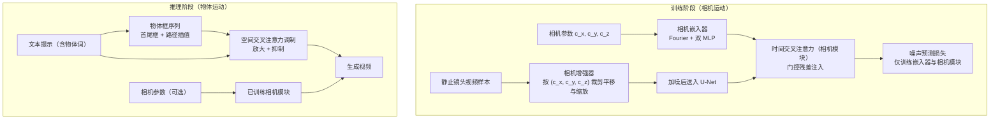

## 一句话总结

Direct-a-Video 用两套正交机制解耦控制文本生成视频中的相机运动与物体运动：相机运动通过新增的时间交叉注意力层以自监督方式学习定量的平移与缩放，物体运动则借助免训练的空间交叉注意力调制由用户画框指定，从而实现二者的独立或联合控制。

## 研究背景

文本生成视频（T2V）扩散模型近年进展显著，但一段视频的整体运动同时由物体自身运动与相机运动构成，二者缺一则运动语义不明确。举例来说，「物体在画面里向右移动」既可能是相机静止而物体右移，也可能是物体静止而相机左移，或二者以不同速度同时运动。现有方法往往缺乏对相机运动与物体运动的解耦、独立控制，限制了可控性与灵活性。

若沿用监督训练路线（如 VideoComposer 那样用带相机与物体运动标注的视频训练条件模型），会遇到两大困难：其一，真实视频中物体运动常与相机运动耦合（主体右移时相机也倾向右摇以保持主体居中），使模型难以区分二者；其二，大规模、逐帧的物体跟踪与相机位姿标注代价高昂，且训练开销大。作者因此提出用两条互补路径绕开标注：相机运动走轻量自监督训练，物体运动走推理期免训练调制。

## 方法

整体框架：以预训练 Zeroscope T2V 模型为基座并冻结其权重。相机运动在训练阶段学习——对静止镜头视频做数据增强模拟平移/缩放，把相机参数注入新增的可训练时间交叉注意力层；物体运动在推理阶段实现——依据用户给出的物体词与框序列，调制空间交叉注意力图，不需任何额外优化。二者相互独立，可分别或同时启用。

关键设计：

- 相机运动参数化。用三元组 $$\mathbf{c}_{cam}=[c_x, c_y, c_z]$$ 表示水平平移比、垂直平移比与缩放比。$c_x$ 定义为首帧到末帧画面中心的水平位移占画面宽度之比（$c_x>0$ 向右），$c_y$ 同理（$c_y>0$ 向下），$c_z$ 为末帧相对首帧的缩放比（$c_z>1$ 为放大）。取值范围 $c_x, c_y\in[-1,1]$、$c_z\in[0.5,2]$。

- 自监督相机增强。从存在物体运动但相机静止的视频（MovieShot 子集）出发，按 $\mathbf{c}_{cam}$ 对裁剪窗做平移与缩放来模拟相机运动，作为自监督训练样本，从而免去昂贵的相机运动标注。

- 相机嵌入与相机模块。用 Fourier 嵌入配两个 MLP 分别编码平移 $[c_x,c_y]$ 与缩放 $c_z$（分开编码有助于区分两类运动），拼接得相机嵌入。在每个 U-Net 块的时间自注意力之后追加可训练的时间交叉注意力层（相机模块），以门控残差注入相机信息：

$$\mathbf{F} = \mathbf{F} + \tanh(\alpha)\cdot \mathrm{TempCrossAttn}(\mathbf{F}, \mathbf{e}_{cam})$$

其中查询来自视觉帧特征，键值分别由平移与缩放嵌入映射，$\alpha$ 初始化为 $0$，保证相机运动从预训练状态渐进学习。

- 物体运动的空间交叉注意力调制。以边界框为控制信号（比稠密草图省事、比稀疏关键点更能表达尺寸）。在交叉注意力图上加调制项 $\mathbf{S}$：

$$\mathrm{CrossAttnModulate}(\mathbf{Q},\mathbf{K},\mathbf{V}) = \mathrm{Softmax}\!\left(\frac{\mathbf{Q}\mathbf{K}^\top + \lambda \mathbf{S}}{\sqrt{d}}\right)\mathbf{V}$$

调制含两部分：注意力放大——在框区域内提升对应物体词的注意力，放大幅度与框面积成反比（框越小提升越大），且只在早期步（$t\ge\tau$）施加，以先定粗布局、后期放松细化形状；注意力抑制——把不匹配的查询-键对（除起止 token 外）注意力压至负无穷，全程施加以防多物体场景下的语义混淆与外溢。第 $n$ 个物体第 $k$ 帧的调制项为：

$$\mathbf{S}_n^k[i,j]=\begin{cases} 1-\dfrac{\lvert \mathbf{B}_n^k\rvert}{\lvert \mathbf{Q}\mathbf{K}^\top\rvert}, & i\in\mathbf{B}_n^k,\ j\in\mathbf{T}_n,\ t\ge\tau \\ 0, & i\in\mathbf{B}_n^k,\ j\in\mathbf{T}_n,\ t<\tau \\ -\infty, & \text{其他} \end{cases}$$

逐帧独立调制即可确定完整的时空轨迹，而预训练时间层负责保证帧间连续性。

## 实验结果

基座为 Zeroscope，推理用 DDIM 采样 $T=50$ 步、无分类器引导尺度 $9$，默认调制权重 $\lambda=25$、截止步 $\tau=0.95T$，输出 $320\times512\times24$。相机控制在 200 条场景提示上评估，物体控制在自建 200 组框-提示对上评估。

相机运动控制（越低越好）：

| 方法 | FVD | FID-vid | Flow error |
| --- | --- | --- | --- |
| AnimateDiff | 1685.40 | 82.57 | - |
| VideoComposer | 1230.57 | 82.14 | 0.74 |
| Direct-a-Video（本文） | 888.91 | 48.96 | 0.46 |

物体运动控制：

| 方法 | FVD ↓ | FID-vid ↓ | CLIP-sim ↑ | mIoU (%) ↑ | AP50 (%) ↑ |
| --- | --- | --- | --- | --- | --- |
| VideoComposer | 1620.83 | 90.57 | 27.35 | 45.24 | 31.01 |
| Peekaboo | 1384.62 | 44.49 | 27.03 | 36.55 | 18.77 |
| Direct-a-Video | 1300.86 | 43.55 | 27.63 | 47.83 | 31.33 |

本文在相机控制的画质（FVD、FID-vid）与精度（Flow error）上均领先；物体控制的定位指标（mIoU、AP50）也占优。消融显示：去掉注意力放大会大幅削弱定位能力（mIoU 从 47.83% 降至 15.35%）；去掉注意力抑制会在多物体场景出现语义混淆（如虎的纹理错误出现在熊身上）；相机嵌入若把平移与缩放联合编码，Flow error 从 0.46 升至 1.68，验证了分开编码的价值。联合控制实验表明，同一框序列配不同相机运动可生成前景-背景运动的多种组合（如静止框既可对应站立、也可对应因相机运动而产生的表观移动）。

## 亮点与局限

亮点：

- 用两套正交机制真正解耦相机运动与物体运动，支持分别或联合控制，缓解了「整体运动语义模糊」的问题。
- 相机运动走自监督相机增强训练，物体运动走免训练注意力调制，均无需昂贵的运动标注或视频 grounding 数据集；训练只更新新增的相机嵌入器与相机模块，保留了基座的先验知识。
- 相机参数可定量控制（平移比、缩放比），交互友好（画框即可指定多物体轨迹），且能泛化到开放域场景。

局限：

- 联合控制时输入可能相互冲突（如要求静止框内静止物体却又左摇相机），会生成不合理结果，需用户合理设定。
- 相机增强目前仅含 2D 平移与缩放，无法生成「绕物体环绕」等复杂 3D 相机运动；作者设想用更复杂的增强算法或渲染引擎合成数据集来突破。
- 物体框重叠（碰撞）时，一个物体的语义仍可能干扰另一个；作者建议改为在自适应自动分割区域而非初始框区域上调制来缓解。

## 延伸思考

这项工作最值得借鉴的是「解耦控制」的思路：把视频运动拆成相机与物体两个正交因子，用两种性质不同的手段分别注入——需要学习新语义的相机运动交给轻量可训练模块，能被预训练先验覆盖的物体布局则交给免训练的注意力调制。这种「按需分配训练成本」的设计既省数据又省算力，也为后续把光照、景深等更多可控因子逐一解耦提供了范式参考。自监督相机增强巧妙地把「无标注静止镜头视频」转化为「带精确相机参数的训练对」，提示我们许多难以标注的控制信号或许都能通过可逆的数据变换来自造监督。局限中提到的 3D 相机运动与碰撞框问题，也正是后续「轨迹驱动」「场景感知」类可控视频生成工作持续推进的方向。
