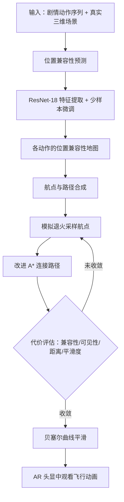

## 一句话总结

面向户外增强现实叙事，本文提出一套自动生成"以用户为中心"飞行生物动画路径的方法：先用少样本学习的位置兼容性预测器判断场景中各处适合角色执行哪种剧情动作，再用模拟退火采样航点、并以改进的 A\* 算法在体素空间里综合可见性、距离与平滑度合成一条让虚拟角色（如飞龙）始终清晰可见的飞行路径。

## 研究背景

增强现实为沉浸式叙事带来机会：让飞龙、独角兽这类想象中的角色自然地在真实世界中活动。但为 AR 制作逼真的动画内容并不容易，AR 叙事不同于传统叙事，必须适配环境语境与用户视角，才能带来兼容、沉浸且愉悦的体验。

已有工作尝试让虚拟角色与真实环境交互，或利用场景语义、场景几何来增强体验，但普遍存在两点不足：一是没有把用户的位置纳入考量，无法针对用户独特的视角定制体验；二是这些方法大多面向室内小场景。随着轻量无线 AR 设备的发展，户外大尺度的角色动画体验成为可能，而现有户外 AR 工作又主要停留在依据地理数据显示信息，缺乏基于场景理解的语境化能力。作者因此聚焦"户外飞行生物动画路径"这一场景，希望生成能同时适配用户与环境的路径，让用户在真实世界中观看虚拟角色的剧情表演时始终保持视觉投入。

具体要解决三个挑战：（一）理解输入场景的语境；（二）确定角色执行各剧情动作的航点位置；（三）在兼顾航点与用户视角的前提下求解最优路径。

## 方法

整体框架：输入是一段角色的剧情动作序列（如 Eat、Swim、Sleep）与用户周边的真实三维场景。方法先在预处理阶段用基于学习的位置兼容性预测器，为场景中各处计算"执行某动作的兼容度"，得到各动作的兼容性地图；随后以航点为决策变量做优化，用模拟退火采样航点、用改进 A\* 连接成路径，综合位置兼容性、可见性、距离与平滑度求解最优解；最后用 De Casteljau 算法拼接多段贝塞尔曲线得到平滑动画路径，供用户戴 AR 头显（如 HoloLens 2）观看。

关键设计：

- 场景表示：把虚拟三维场景表示为带自适应八叉树结构的体素集合 $$V=\{V_i\}$$，体素尺寸随所含空间是否有几何而变化。每个体素编码它对各剧情动作的位置兼容性，以及相对用户（站在特定位置、朝特定方向）的可见性与距离信息。

- 位置兼容性预测：受 SceneGrok 启发，用少样本学习为大尺度户外场景预测五类动作 $$A=\{drink, eat, sit, sleep, swim\}$$ 的兼容概率。用预训练 ResNet-18 作特征提取器，对每类动作的训练图像求均值特征向量
$$\mu=\frac{1}{n}\sum_{i=1}^{n} f_\theta(I_i)$$
把各类均值向量拼接成初始权重 $$M=\{\mu_1,\mu_2,\dots,\mu_{\lvert A\rvert}\}$$，再微调。预测时对输入图像特征 $$F_i$$ 计算相似度并经 sigmoid 得到兼容值 $$Z_a(I_i)=\sigma(M\cdot F_i)$$。训练集含 4036 张位置图像。由于体素尺寸不一，一个大体素内会有多个采样点，体素兼容值取其内部采样点兼容值的平均：
$$Z_a(v)=\frac{1}{\lvert\alpha\rvert}\sum_{I\in\alpha} Z_a(I)$$

- 代价函数：优化解 $$T=\{(W,P)\}$$ 的总代价分为航点代价与路径代价
$$C_{total}(T)=\lambda_{way}C_{way}(W)+\lambda_{path}C_{path}(P)$$
航点代价含位置兼容性与可见性两项 $$C_{way}(W)=\sum_{i=1}^{n}\left(\lambda_l C_l(v_i,a_i)+\lambda_{vw}C_v(v_i)\right)$$；路径代价含可见性、距离与平滑度三项 $$C_{path}(P)=\sum_{v_k\in P}\left(\lambda_{vp}C_v(v_k)+\lambda_d C_d(v_k)+\lambda_s C_s(v_k)\right)$$。其中兼容性代价 $$C_l(v_i,a_i)=1-Z_{a_i}(v_i)$$；可见性通过视锥剔除与遮挡剔除，对体素八角与中心做遮挡测试得到可见值 $$\sigma_{v_i}\in[0,V_{max}]$$（$$V_{max}=16$$，中心可见记 8 分），代价 $$C_v(v_i)=\frac{V_{max}-\sigma_{v_i}}{V_{max}}$$；距离代价 $$C_d(v_k)=\frac{d_{v_k}}{D_{max}}$$（默认 $$D_{max}=250$$）令路径贴近用户；平滑代价 $$C_s(v_k)=\frac{1}{2}\left(1-\cos\theta_{v_k}\right)$$ 惩罚方向骤变。

- 改进 A\* 与优化：A\* 的代价 $$G=\lambda_g C_{path}(P_g)+\lambda_h C_{path}(P_h)$$ 融合可见性、距离与平滑度三项（默认 $$\lambda_g=0.8, \lambda_h=0.2$$），可产出三维路径或沿地面/墙面的 2.5D 路径。外层用模拟退火配合 Metropolis-Hastings 搜索，目标函数为 $$f(T)=e^{\frac{1}{\tau}C_{total}(T)}$$，温度随迭代下降，总代价变化收敛到 3% 以内即终止；提议移动含 90% 概率的局部移动与 10% 概率的全局交换。

## 实验结果

主实验以虚拟飞龙为角色、以校园为环境，设两条剧情（Story A：Sleep-Sit-Swim；Story B：Sit-Eat-Sleep）与三个地点，组合出四种"剧情-地点"场景，验证方法的地点适配性与同地点多剧情能力。结果显示各动作都被放在兼容性高的位置（如飞龙在湖里或虚拟喷泉里"游泳"），且路径从用户位置完全可见。方法还支持视角变化时实时重算路径（平均约 50 ms，用户每移动一米更新一次），以及航点约束（固定某些航点让飞龙穿窗、沿墙飞行）与特殊视角（用户在四楼窗边俯视）。作者以省略单一代价项做消融，说明各代价的作用：

| 配置 | 观察到的效果 |
| --- | --- |
| 全部代价 | 路径清晰可见、贴近用户且平滑 |
| 去可见性代价 | 路径可见性差、被墙体遮挡 |
| 去距离代价 | 路径过长、远离用户 |
| 去平滑度代价 | 起点后出现急剧方向变化 |
| 无代价（传统 A\*） | 退化为最短路径，无以用户为中心的考量 |
| 去位置兼容性代价 | 动作被放在不兼容的地点 |

真实世界用户研究招募 25 名参与者，在三个地点对四种路径（Random-Traditional A\* 基线、Designer-Traditional A\*、ML-Traditional A\*（本文）、ML-Modified A\*（本文））评分。参与者反馈显示本文方法选出的航点最令人愉悦、也最契合环境，并能从参与者视角生成以用户为中心的路径（统计细节见补充材料）。

## 亮点与局限

亮点：把"户外 AR 角色路径生成"这一新问题拆解为语义理解、航点确定与路径优化，并首次显式引入"以用户为中心"的因素——把用户视角下的可见性、与用户的距离都写进代价函数；用少样本学习的位置兼容性预测器，仅凭少量标注图像就能在新的三维场景里推断动作适配区域，避免依赖预定义分区图；体素加改进 A\* 的表示能同时支持三维飞行路径与 2.5D 地面/墙面路径，配合航点约束还能推广到爬行、行走、攀墙等非飞行运动；实时重算（约 50 ms）使其可随用户走动动态更新。

局限：需要先把虚拟世界表示与真实环境精确配准，缺乏快速准确的现实-数字孪生配准会阻碍落地；受限于三维场景表示的分辨率，方法只考虑建筑、湖泊等大尺度实体，忽略长椅、花丛等小物体，也不处理行人、车辆等动态物体；当前假设只有单一用户，而大规模 AR 体验（如 AR 游戏）可能涉及多用户、多视角同时观看同一角色；用户研究还发现角色的合适"亲近度"因人而异，长时间抬头看空中飞行角色可能带来颈部疲劳，需要结合社交距离与 AR 人机工学研究进一步优化。

## 延伸思考

这项工作最有启发的一点，是把"观看者"本身作为一等公民写进内容生成的目标函数。传统寻路只关心从起点到终点的最短或最省代价路径，而这里的路径质量取决于"用户此刻站在哪、看向哪"——可见性、距离都随用户状态动态变化，路径也随之实时重算。这种"以观察者视角为优化目标"的思路，对 AR/VR 中的相机引导、虚拟角色布置、乃至空间叙事编排都有借鉴意义：内容不再是场景的静态属性，而是观察者与环境交互后的产物。

另一方面，用少样本学习把"场景区域—动作语义"的兼容性建模出来，是让系统具备跨场景泛化能力的关键，也提示了一条务实路线：与其为每个新场景手工标注分区图，不如学一个可迁移的兼容性预测器。不过方法目前的语义粒度较粗（只到大尺度地物、五类动作），若要支撑更丰富的叙事，如何在保持实时性的同时引入细粒度物体识别、动态障碍感知与多用户协同，会是把它从演示推向真实产品的核心难题。
