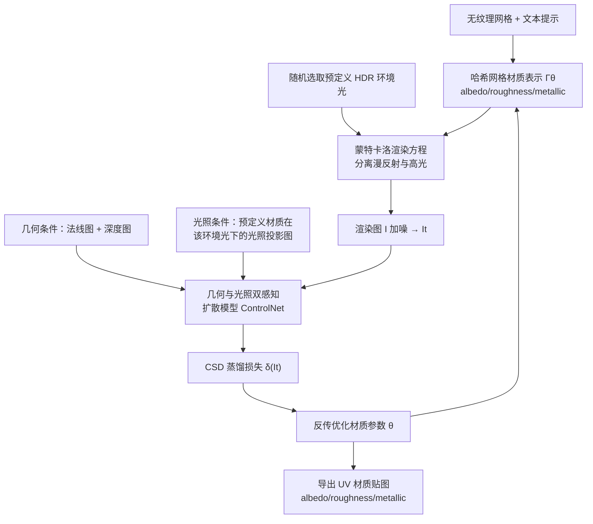

## 一句话总结

DreamMat 通过微调一个「几何与光照双感知」的 2D 扩散模型，并在材质蒸馏时固定已知环境光，从文本描述为无纹理网格生成高质量、无烘焙阴影的 PBR 材质（albedo、roughness、metallic）。

## 研究背景

为无纹理网格创建高质量外观是图形学的重要任务，但即便熟练的美术也需借助复杂商业软件耗费大量时间。近期出现的文本驱动方法用 2D 文生图扩散模型（如 Stable Diffusion）为网格生成 RGB 纹理，虽降低了门槛，却常把高光、阴影等着色效果「烘焙」进纹理，导致在新光照下渲染失真，难以用于游戏、影视等下游任务。

用 PBR 材质替代 RGB 纹理是自然的解决方向，但直接训练材质生成网络受限于高质量已知材质的 3D 资产稀缺。已有工作（如 Fantasia3D）转而在蒸馏 2D 扩散模型的过程中集成材质分解，无需已知材质数据集，但材质分解仍不正确，albedo 里仍残留烘焙着色。

作者对这一病态问题给出分析：扩散模型只被训练生成「最终着色结果」，而在不同蒸馏步骤，其生成图像可能对应不同的环境光，因此无法准确估计一个固定的环境光，进而导致错误材质。Fantasia3D 用单一预定义环境光蒸馏，但扩散模型生成的图像未必与该环境光一致，问题依旧。

## 方法

整体框架是一个基于蒸馏的逆渲染流程：用哈希网格表示存储 SVBRDF 参数并按渲染方程渲染图像，对渲染图加噪后用扩散模型去噪，得到蒸馏损失来优化材质参数。关键有两点：蒸馏时从一组预定义 HDR 环境光中随机选择以固定光照，让模型专注生成材质；同时用一个几何与光照双感知的扩散模型作为蒸馏模型，使生成图像与给定几何、给定环境光一致，从而消除烘焙阴影。

关键设计：

- 材质表示与渲染。用 Instant-NGP 的哈希网格表示简化版 Disney BRDF，在表面点 $p$ 上输出 $(c,\alpha,m)$（albedo、roughness、metallic）。按渲染方程用重要性采样的蒙特卡洛把着色分离为漫反射与高光两项：

$$L(p,\omega_o)=L_{\text{diffuse}}+L_{\text{specular}}$$

其中漫反射项用余弦加权半球采样，高光项按 GGX 分布采样。由于只需生成材质，作者随机选一张已知 HDR 图固定为环境光，使逆渲染问题不那么病态。

- 蒸馏损失。采用 Classifier Score Distillation（CSD）损失替代原始 SDS，收敛更好、过饱和更少、细节更多。其噪声差项综合空、正、负三种提示：

$$\delta(I_t)=\eta_1\epsilon_\phi(I_t;y_{\text{pos}},t)+(\eta_2-\eta_1)\epsilon_\phi(I_t;t)-\eta_2\epsilon_\phi(I_t;y_{\text{neg}},t)$$

负提示包含「过饱和、丑、曝光过度/不足」等词。

- 几何与光照双感知扩散模型。在 Stable Diffusion v2.1 上用 ControlNet 微调，加入两类条件：几何条件为渲染的法线图与深度图；光照条件是给对象赋一组「同为白色 albedo、但金属度与粗糙度各异」的预定义材质，在给定环境光下渲染出的光照投影图。这样生成的图像同时贴合几何与光照，用于计算 CSD 损失。训练数据取自 Objaverse 的 LVIS 子集，用 BLIP 生成字幕，Blender 光线追踪渲染光照条件图，过滤后约 124 万条，8 张 V100 训练 3 个 epoch。

- 材质生成流程。对输入网格预计算 128 个随机视角在 5 种预定义环境光下的光照条件；每步随机选视角与环境光渲染图像、加噪，用双感知模型算 CSD 损失反传优化。另加材质平滑损失 $L_{\text{smooth}}=\lVert\Gamma_\theta(p)-\Gamma_\theta(p+\epsilon)\rVert^2$ 使材质更平滑。最终采样材质表示导出 UV 贴图。

## 实验结果

定量对比在 10 个网格、每个 5 条不同文本提示（共 50 组）上进行，用 CLIP Score 衡量文本一致性、FID 衡量渲染图与 Stable Diffusion 生成图分布的距离，DreamMat 两项均最优：

| 方法 | CLIP Score ↑ | FID ↓ |
| --- | --- | --- |
| TANGO | 76.15 | 165.40 |
| TEXTure | 78.55 | 135.72 |
| Text2Tex | 78.52 | 144.86 |
| Fantasia3D | 77.30 | 131.86 |
| 本文（DreamMat） | 80.28 | 114.97 |

42 份用户反馈的评分（1~5 分）中，本文在整体质量、文本一致性、albedo 质量、粗糙度/金属度质量、光材解耦、渲染质量各项均显著领先（渲染质量 $4.75$ 对基线最高 $3.10$）。消融实验表明：仅加几何条件能让材质贴合几何但 albedo 仍含高光；仅加光照条件会几何不一致；用双感知模型但固定单一环境光会过拟合、albedo 残留高光；只有「双感知模型 + 随机切换环境光」的完整方法能去除着色效果、得到最佳材质。在 RTX 4090 上蒸馏一个复杂网格约 18 分钟（渲染优化约 12 分钟，查询扩散模型约 6 分钟）。

## 亮点与局限

亮点：

- 从病态性根源出发，指出材质分解错误源于扩散模型只生成最终着色、蒸馏各步对应光照不一致，并针对性地用「固定已知环境光 + 光照感知扩散模型」双管齐下。
- 提出几何与光照双感知扩散模型，用预定义材质在环境光下的光照投影作为条件，让生成图像同时贴合几何与光照，无需真值 albedo 数据。
- 生成的 PBR 材质与光照解耦，可直接用于 Blender 等现代引擎在任意新光照下逼真渲染，并支持整体调节粗糙度、金属度、色调进行编辑；对复杂自遮挡、多部件对象及场景（分部件生成再组合）均适用。

局限：

- 因材质分解的病态性，某些情形下金属度与粗糙度仍不准确。
- 所用 BRDF 模型无法刻画透明、强反射、次表面散射等更复杂材质。
- 只考虑环境光的直接光照，未建模对象自身反射的间接光，对强反射物体可能产生错误材质。
- 蒸馏耗时较长（约 20 分钟），不便用于交互式设计；且继承了 Stable Diffusion 的固有局限。

## 延伸思考

这项工作的核心思路是「用已知的物理条件去约束一个本质病态的分解问题」——既然逆向从最终着色分解材质是欠定的，就在蒸馏时把环境光固定为已知量，并训练一个能对该光照做出一致响应的生成模型，把「猜测光照」这一自由度从优化中剥离。这种「用可控条件收窄解空间」的范式，对其他基于蒸馏的生成分解任务（如法线、透明度、次表面参数）具有普适借鉴价值。随机切换预定义环境光以避免过拟合单一光照的技巧，本质上是一种针对逆渲染的数据增强，值得在相关任务中推广。未来若能纳入间接光与更高级的 BRDF/BSDF 模型，并借助更快的扩散模型加速蒸馏，方法有望向支持透明、强反射材质的交互式材质创作延伸。
