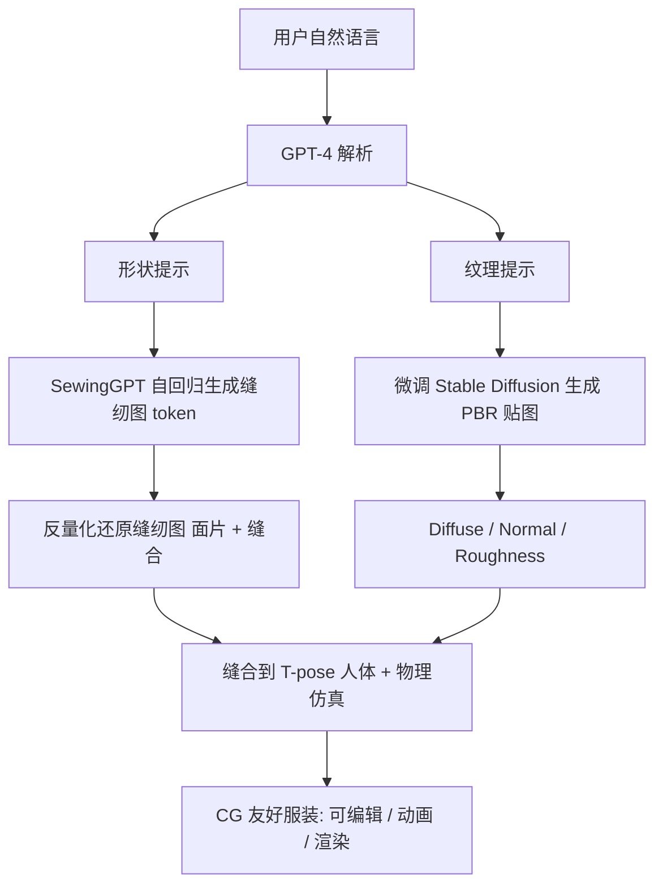

## 一句话总结

DressCode 把服装缝纫图（sewing pattern）离散化成 token 序列，用一个 GPT 式自回归模型（SewingGPT）在文本条件下生成缝纫图，再用微调过的 Stable Diffusion 生成基于物理的（PBR）贴图，最终经大语言模型编排，实现「用自然语言一句话生成可直接进入 CG 管线、可仿真、可动画、可高质量渲染」的 3D 服装。

## 研究背景

服装是数字人外观的关键组成部分，因此服装数字化在数字人创建中越来越重要。近年来文本驱动的资产生成（图像、通用 3D 物体、头发、人脸/身体）进展迅猛，但「服装」这一类别却一直缺位。

直接把通用的 avatar 或 text-to-3D 方法套到服装上并不理想：这些方法生成的是网格或神经场，与数字服装的生产工作流不兼容——难以适配不同体型、难以多层叠穿，贴图也常是低分辨率、模糊、缺乏结构化 UV 映射，拓扑很差，后续 CG 处理困难。

在图形学社区，服装的主流表示是缝纫图：它由若干 2D 面片（panel）加上缝合关系（stitching）构成，天然适合物理仿真与动画，是 CG 友好的表示。已有工作能从点云或图像重建缝纫图，或用领域专用语言（DSL）参数化构造缝纫图，但普遍忽略了通过更自然的语言交互来生成，更没有同时处理纹理与基于物理的材质。DressCode 的目标就是填补这一空白：让不具备专业设计技能的新手，仅用文本提示就能把想法转化为高质量、可生产的服装。

## 核心方法

DressCode 由三部分组成：(1) SewingGPT 从文本生成缝纫图；(2) 微调的 Stable Diffusion 从文本生成 PBR 贴图；(3) 大语言模型作为交互中枢，把用户自然语言拆解成「形状提示」和「纹理提示」并分发给前两者。

### SewingGPT：把缝纫图当语言来生成

服装缝纫图高度对称、结构化，面片与缝线规整，因此可以自然地转成离散「代码」。SewingGPT 借鉴语言模型来生成这种结构。

- 缝纫图表示：一张缝纫图含 $$N_P$$ 个面片 $$\{P_i\}_{i=1}^{N_P}$$ 和缝合信息 $$S$$。每个面片 $$P_i$$ 是一个闭合 2D 多边形，含 $$N_i$$ 条边 $$\{E_{i,j}\}_{j=1}^{N_i}$$。每条边用四个参数 $$(v_x, v_y, c_x, c_y)$$ 表示，其中 $$(v_x, v_y)$$ 是边的起点、$$(c_x, c_y)$$ 是贝塞尔曲线的控制点（因为面片闭合，无需存储终点）。每个面片的 3D 摆放由旋转四元数 $$R_i \in SO(3)$$ 与平移向量 $$T_i \in \mathbb{R}^3$$ 指定。缝合信息用逐边的缝合标签 $$S_{i,j} \in \mathbb{R}^3$$（基于对应边的 3D 位置）和二值缝合标志 $$U_{i,j} \in \{0,1\}$$（该边是否有缝线）表示；还原时用标签之间的欧氏距离作为相似度来匹配连接边。

- 量化：先标准化边向量与控制点（使其落在标准正态分布），并把 3D 摆放归一化到 $$[0,1]$$，再乘以预定义常数 $$C_E, C_R, C_T, C_S$$ 把连续量离散成 token。单个面片的量化写作
$$\mathcal{T}(P_i, S) = C_E\{E_{i,j}\}_{j=1}^{N_i} \oplus C_R R_i \oplus C_T T_i \oplus C_S\{S_{i,j}\}_{j=1}^{N_i} \oplus \{U_{i,j}\}_{j=1}^{N_i}$$
其中 $$\oplus$$ 表示 token 的线性拼接。设定每个面片最大边数 $$K$$，边数不足者用零填充，从而每个面片 token 数固定，无需在面片间插入分隔符。所有面片拼接成一条序列（首尾加 start/end token），总长 $$L_t = (8K+7)N_P$$，整体序列为
$$\mathcal{F}_{seq} = \{\mathcal{T}(P_i, S) + C\}_{i=1}^{N_P}$$
$$C$$ 是保证所有 token 非负的常数。

- 三元嵌入（借鉴 PolyGen）：每个输入 token 有三种嵌入——位置嵌入（标明属于哪个面片）、参数嵌入（区分该 token 是边坐标 / 旋转 / 平移 / 缝合特征）、值嵌入（量化后的数值）。消融实验显示这三者缺一不可。

- 自回归目标：用 decoder-only Transformer 预测下一个 token 的概率分布，最大化训练序列的对数似然
$$\mathcal{L} = -\prod_{i=1}^{L_t} p(f_i \mid f_{<i}; \theta)$$
推理时从 start token 开始逐步采样直到 end token，再反量化还原成缝纫图。

- 文本条件：用预训练 CLIP 编码文本提示，经一个可训练的紧凑 MLP 压缩维度后，作为条件嵌入在 Transformer decoder 中做交叉注意力（cross-attention），从而实现文本引导的条件生成。

### PBR 纹理生成

设计师通常在完成版型后再制作贴图，且偏好可平铺（tile-based）的 PBR 贴图（diffuse、roughness、normal）。DressCode 用渐进式微调把预训练 Stable Diffusion 改造成 PBR 贴图生成器：

- 潜在扩散微调：冻结原始编码器 $$\mathcal{E}$$ 与解码器 $$\mathcal{D}$$，在收集的带字幕 PBR 数据集上只微调 U-Net 去噪器，使其能生成可平铺的 diffuse 贴图。
- VAE 微调：额外微调两个专用解码器 $$\mathcal{D}_n$$ 和 $$\mathcal{D}_r$$，把同一个由文本去噪得到的纹理潜码 $$z$$ 分别解码成 normal 贴图和 roughness 贴图，从而与 diffuse 贴图配套生成完整 PBR 材质。

### 交互与应用

- 自然语言编排：用 GPT-4 做上下文学习，把用户随意的自然语言转成规范的形状提示和纹理提示，再喂给 SewingGPT 和纹理生成器。
- 多件服装叠穿：用 Qualoth 物理仿真器，从里到外逐件缝合仿真（先内层 T 恤，再外层夹克），每次仿真后把已仿真服装与人体合并，再仿真下一件——这是网格/隐式场方法难以做到的分层叠穿。
- 版型补全：借助自回归的概率预测，给定不完整版型（如只给一只袖子），模型可在不同文本提示下补全出合理且多样的完整缝纫图。
- 纹理编辑：由于缝纫图表示天然给出结构化、按面片分离的 UV 映射，用户可在指定位置方便地编辑贴图（如在 T 恤上画 SIGGRAPH 图标、把鸭子融进裤子 diffuse 贴图）。

## 技术细节

- 数据集：使用 Korosteleva 和 Lee 的大规模缝纫图数据集，约 19264 个样本、11 个基础类别（衬衫、连帽衫、夹克、连衣裙、裤子、裙子、连体衣、背心等）。每件含缝纫图文件、贴在 T-pose 人体上的 3D 网格、渲染图。用 GPT-4V 从前/后视图渲染图自动生成字幕：先让它给出常用名称（如 hood、T-shirt、blouse），再要求描述几何特征（如长袖、宽松、深领），二者合并为该服装的字幕。每类约 90% 用于训练、其余验证。
- 训练配置：$$K=14$$，最大 token 长度 1500；decoder-only Transformer 共 24 层，位置/参数/值/文本特征嵌入维度均为 512；常数 $$C_E=50, C_R=1000, C_T=1000, C_S=1000, C=1000$$；CLIP 嵌入维 1024，压缩后特征维 512。Adam 优化器，学习率 $$10^{-4}$$，batch size 4，单张 A6000 训练约 30 小时。

## 实验结果

- 缝纫图生成对比：与 NeuralTailor（点云输入，用 Surf-D 生成的 UDF 网格喂入，记 NeuralTailor*）和 Sewformer（图像输入，用 DALL·E-3 从文本合成图像，记 Sewformer*）定性对比。NeuralTailor 因输入网格多在其训练域外，输出面片扭曲、无法缝合；Sewformer 泛化更好但仍有不规则、扭曲面片和缝合后效果差的问题。DressCode 结果更准确，展现出稳健的文本生成能力。
- text-to-3D 对比：与 Wonder3D（单图，记 Wonder3D*）和 RichDreamer（text-to-3D，含 PBR）对比。Wonder3D 约 4 分钟但细节与保真度差、几何差；RichDreamer 约 4 小时优化，结果更真实但渲染仍模糊，且都是闭合网格、无法适配人体。DressCode 约 1 分钟生成缝纫图、整体约 3 分钟生成仿真服装，可在多种姿态下贴合人体并生成高质量平铺 PBR 贴图。

| 方法 | CLIP score ↑ | 运行时间 ↓ | PBR 贴图 | 纹理编辑 | 可叠穿 |
| --- | --- | --- | --- | --- | --- |
| Wonder3D* | 0.302 | ~4 分钟 | 否 | 否 | 否 |
| RichDreamer | 0.324 | ~4 小时 | 是 | 否 | 否 |
| Ours | **0.327** | ~3 分钟 | 是 | 是 | 是 |

- 消融（三元嵌入）：只用值嵌入时结果高度混乱、面片强烈扭曲、缝合错位；加入参数嵌入后单个面片形状变好但仍扭曲、面片数不足；再加入位置嵌入（完整版）能区分不同面片及面片数量，得到最佳且完整的结果。
- 验证：用训练集外的留出文本提示及 Deep Fashion3D 的野外图像（经 GPT-4V 生成字幕）测试，生成结果与提示/参考图高度吻合。
- 与参数化模板对比：用 GPT-4 控制预定义参数化模板生成（记 Parametric Templates），二者都能生成合理结果，但 SewingGPT 无需选择预定义模板和为 ChatGPT 专门设计提示，更能适配多样类别，并可扩展到模板之外的更复杂缝纫图。
- 用户研究：给定 20 条描述形状与纹理的提示，约 30 名用户在打乱顺序的多方法渲染结果中选最佳（同时考量与文本的一致性和渲染质量）。结果显示 DressCode 在两个维度上都显著领先。

## 贡献与局限

贡献：
- 提出首个文本驱动的服装生成管线，能同时产出高质量缝纫图与基于物理的贴图。
- 提出把缝纫图表示为 token 序列的新生成范式，通过文本引导实现高质量自回归生成（SewingGPT）。
- 定制扩散模型用于生动的服装纹理生成，并展示了生成、补全、编辑等交互友好应用。

局限：
- 数据集限制了多层服装的生成，例如「带口袋的连帽夹克」这类复杂缝合关系难以生成，需扩充数据集。
- 对数据集域外的提示表现不佳：如「one-shoulder dress」仍生成「two-shoulder dress」，因数据集中没有单肩样本；「dress with a hood」因数据集只有连帽夹克而偏向生成宽松连帽夹克。
- 目前仅文本输入，融合图像等多模态输入会更有效，是重要的未来方向；蒸馏基础模型知识（如 SDS）以提升泛化也值得探索。
- 伦理：继承 CLIP、Stable Diffusion 等预训练模型的偏见，且高质量易用的生成能力存在被滥用风险，Stable Diffusion 的使用还涉及潜在版权问题。

## 延伸思考

DressCode 最核心的洞见是「结构即语言」：服装缝纫图规整、对称、由离散面片和缝线组成，这种高度结构化的特性使它可以像文本一样被 tokenize 并用自回归模型生成。这提示我们，图形学中许多结构化、可参数化的表示（CAD 序列、材质图、装配关系、拓扑连接）都可能被重铸为「token 序列 + 自回归/Transformer」的生成问题，从而借力成熟的语言模型范式。

另一个值得回味的点是它对「CG 友好」的坚持：不去追逐通用 text-to-3D 那种直接吐网格/神经场的路线，而是生成缝纫图这种能被现有仿真、动画、渲染管线原生消化的中间表示。这让生成结果天然具备可编辑 UV、可换体型、可叠穿的能力——这是把生成模型真正接入生产工作流的关键差异。后续若能补齐多层复杂缝合的数据、引入图像等多模态条件，并蒸馏基础模型以突破数据域限制，这条「缝纫图作为可生成中间表示」的路线有望成为数字服装生成的主流范式。
