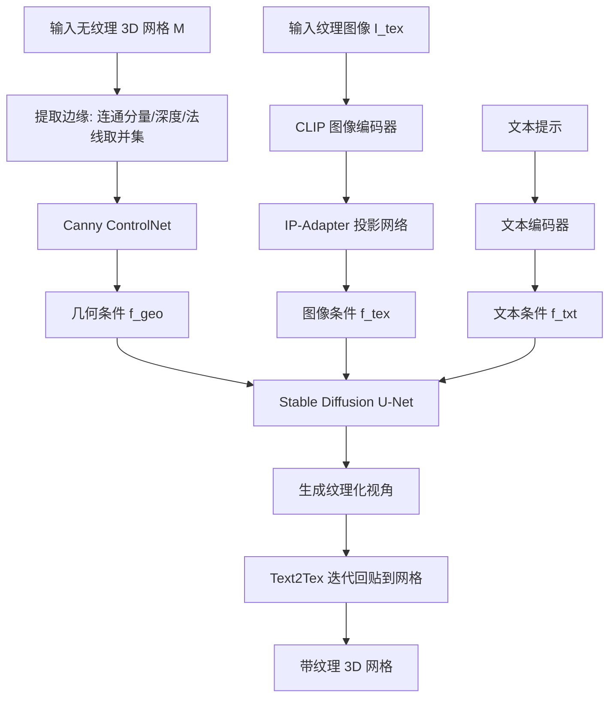

## 一句话总结

EASI-Tex 借助预训练扩散模型，用网格提取的边缘（ControlNet）与单张图像特征（IP-Adapter）作为条件，无需训练或优化即可把一张 RGB 图像的纹理忠实地迁移到给定 3D 网格上，同时尊重网格的几何与语义。

## 研究背景

高质量带纹理 3D 模型的需求随生成式 AI 快速增长。当前主流做法多用文本引导的扩散模型，通过可微渲染优化 NeRF，但结果往往分辨率低、模糊、不保特征，且 NeRF 与高斯泼溅都是渲染基元而非建模基元，难以复用于下游任务；文本提示本身也存在歧义、控制粒度不足的问题。

本文研究"单图网格纹理化"：输入一个无纹理多边形网格 $$M$$ 与一张任意视角拍摄的、可能属于不同物体的纹理图像 $$I_{tex}$$，在不改变 $$M$$ 几何的前提下输出被纹理化的网格。难点在于图像与网格的物体可能跨类别，几何与部件比例差异显著，需要在"纹理迁移"与"纹理生成"之间平衡。

已有的基于扩散模型的纹理化方法（如 TEXTure、Text2Tex）多依赖深度作为空间条件，但深度图平滑、缺乏网格细节，属于弱条件信号，容易生成视觉合理却不尊重几何、甚至改变物体身份的纹理；TEXTure 的图像迁移还需要多视角图像并对每组图像做个性化微调，时间与算力开销大。

## 方法

### 整体框架

EASI-Tex 以预训练 Stable Diffusion v1.5 为基座，向 U-Net 注入三路条件信号：网格边缘（经 Canny ControlNet 得到 $$f_{geo}$$）、输入纹理图像（经 IP-Adapter 得到 $$f_{tex}$$）、描述网格的文本提示（$$f_{txt}$$）。在此基础上用 Text2Tex 的迭代式"生成视角并回贴"策略完成整网纹理化，全程前馈、无需优化。当预训练模型无法忠实捕捉图像细节时，可选启用 Image Inversion 做快速个性化。

### 关键设计

边缘条件（Edge Conditioning）：作者主张用边缘而非深度作为几何条件。边缘从网格的多种几何属性中提取并取并集：对连通分量（CCs）随机上色后渲染 RGB 图并过 Canny 检测，为避免相邻分量撞色导致漏检，用不同随机配色重复多次并合并；对深度图、法线图归一化到 $$[0,255]$$ 后同样过 Canny。最终边缘图 $$I_{edge}$$ 送入单个预训练 Canny ControlNet 产生 $$f_{geo}$$。用单一 ControlNet 而非多个，是为避免"无对应预训练模型、前向变慢、多模型在同一区域竞争降质"三个问题。

图像条件（Image Conditioning）：用 IP-Adapter Plus 直接把单张图像当作提示，通过解耦交叉注意力把图像 token 融入 U-Net：

$$Z_{new} = \text{Attention}(Q, K, V) + \lambda_{ip}\,\text{Attention}(Q, K', V')$$

其中 $$\lambda_{ip}$$ 控制纹理图像对输出的影响，推理时可调（经验区间约 $$[0.2, 1.0]$$），ControlNet 强度 $$\lambda_{cn}$$ 固定为 $$1$$。

Image Inversion（可选个性化）：当 IP-Adapter 漏掉小而非重复的图案细节时，微调 IP-Adapter 的投影网络 $$P_{ip}$$ 与 U-Net，用单张图像快速学习该概念，目标为

$$L_{II} = \mathbb{E}_{z_t, t, \epsilon, p, I_{tex}}\left[\lVert U(z_t, t, f_{txt}, f_{tex}) - \epsilon\rVert_2^2\right]$$

配合随机翻转、缩放、小角度旋转等结构增强防过拟合，最少约 $$100$$ 次迭代即可收敛。

## 实验结果

数据主要来自 Objaverse 等，涵盖有机（宇航员、动物）与人造（手柄、车辆、椅子）物体，含精细网格与单连通分量的简单网格；纹理图像来自互联网与前作。作者指出 CLIP 相似度无法评估语义感知能力（可能身份被破坏却仍得高分），因此改用用户研究评估。43 名计算机背景研究生的偏好统计如下：

| 评价标准 | TEXTure | Ours |
| --- | --- | --- |
| 形状-纹理一致性（%） | 19.53 | 80.47 |
| 纹理保真度（%） | 29.53 | 70.47 |

在学习/编码输入纹理的耗时上：

| 方法 | 耗时 | 相比基线节省 |
| --- | --- | --- |
| TEXTure | 约 18 分钟 | — |
| Ours（含 Image Inversion） | 约 6 分钟 | 约 12 分钟（66%） |
| Ours（不含 Image Inversion） | 小于 100 毫秒 | 约 18 分钟（100%） |

消融显示：增大 $$\lambda_{ip}$$ 会让纹理影响逐步增强，提供运行时可控性；Image Inversion 能显著提升细节保真；由多种几何属性合并得到的边缘比单用深度或法线更能约束几何。

## 亮点与局限

亮点：用"边缘"取代"深度"作为几何条件，更好保留网格的几何与语义身份；默认流程完全前馈、无需训练或优化，迁移单图纹理仅需一张图、耗时极低；提出 Image Inversion 在需要时快速个性化；$$\lambda_{ip}$$ 支持推理时调节迁移强度；支持跨类别迁移（如从超人图像到游戏手柄网格）以及"半重纹理化"等新应用。

局限：纹理化环节沿用 Text2Tex 的优化-free 迭代回贴，可能产生接缝与伪影，若改用优化-based 方法虽能消除但需数小时；方法依赖 SD v1.5 及其配套 ControlNet/IP-Adapter，受基座模型能力约束；图像与网格差异极大时仍需在迁移与生成间权衡；$$\lambda_{ip}$$ 的最优值随图像-网格对变化，需要逐对调节。

## 延伸思考

以边缘作为更强的几何条件这一思路，本质是在"渲染中间量"里选择信息量更高、更能表征语义部件的信号，这对其他需要几何一致性的生成任务（如法线/材质生成、纹理修复）都有借鉴意义。将多种几何属性的边缘取并集、再由单个 ControlNet 统一编码，兼顾了信息丰富度与效率，也提示"多条件竞争"是多 ControlNet 方案的实际痛点。Image Inversion 把 Textual Inversion 的思路迁移到 IP-Adapter 的投影网络与 U-Net 上，说明图像提示适配器同样可被轻量个性化，未来或可探索更少迭代、更强解耦的单图概念注入方式。
