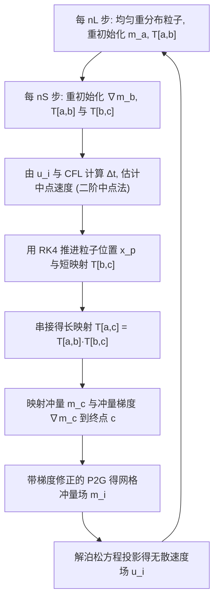

## 一句话总结

论文提出粒子流图（Particle Flow Map, PFM）方法：注意到**前向模拟粒子的轨迹本身就天然是一条完美的双向流图**，于是直接在拉格朗日粒子上前向演化流图相关量、在欧拉网格上求解不可压投影，从而以远低于神经流图（NFM）的计算与内存代价，达到甚至超越 NFM 的涡量保持精度。

## 研究背景

在流体仿真中保持涡结构细节是图形学与计算物理长期关注的难题。近年主要沿三条路线推进：守恒型数值格式（如 APIC）、适配涡量的几何表示（如 covector fluids / Kelvin 环量平流）、以及精确的长程流图（如双向映射 BiMocq）。这三类工作背后共同的思想是构造一条**长程、双向的流图**，用于在不同时间帧之间精确输运涡量相关物理量。

沿此思路，最新的神经流图方法（NFM, Deng et al. 2023）把"几何表示 + 守恒格式 + 双向映射"三者集成，通过在线训练一个神经网络压缩 4D 时空速度场，实现时间逆行进的高精度重建，取得了当时最优的涡量保持效果。但 NFM 存在两个代价高昂的瓶颈：

- **虚拟粒子回溯（backtracking）**：为了让流图端点对齐网格节点，NFM 需要从当前步向初始步逆向追踪"虚拟粒子"并沿路径逆向演化雅可比 $$T$$，这需要 $$O(n)$$ 个子步（$$n$$ 为流图长度），且过去时刻的解无法复用。
- **神经缓冲区**：需要一个长历史缓存来记录每一步的速度场，并进行在线网络训练，带来显著的时间与存储开销。

论文的核心洞察是：**真实的前向粒子早已"免费"提供了精确的流图样本**——粒子初始与最终位置本身就是流场生成的双向流图的近乎完美采样。唯一的问题是这些端点没有落在网格节点上。作者由此选择一条与"虚拟粒子"对偶的路线，专门补齐这个"粒子到网格"的环节。

## 核心方法

### 关键观察：粒子轨迹即完美流图

给定速度场 $$\boldsymbol{u}(\boldsymbol{x},t)$$，前向流图 $$\boldsymbol{\phi}$$ 与反向流图 $$\boldsymbol{\psi}$$ 满足

$$\frac{\partial \boldsymbol{\phi}(\boldsymbol{X},t)}{\partial t} = \boldsymbol{u}[\boldsymbol{\phi}(\boldsymbol{X},t),t], \quad \boldsymbol{\phi}(\boldsymbol{X},0)=\boldsymbol{X}$$

其雅可比 $$\mathcal{F}=\partial\boldsymbol{\phi}/\partial\boldsymbol{x}$$、$$\mathcal{T}=\partial\boldsymbol{\psi}/\partial\boldsymbol{x}$$ 沿轨迹演化：

$$\frac{D\mathcal{F}}{Dt}=\nabla\boldsymbol{u}\,\mathcal{F}, \quad \frac{D\mathcal{T}}{Dt}=-\mathcal{T}\,\nabla\boldsymbol{u}$$

作者证明并用数值实验验证：一条粒子轨迹同时刻画了前向与反向映射，天然满足"完美流图"的两条性质——往返映射回到原点（$$\boldsymbol{X}=\boldsymbol{\psi}_t\circ\boldsymbol{\phi}_t(\boldsymbol{X})$$）、以及雅可比互逆（$$\boldsymbol{I}=\mathcal{F}_t\mathcal{T}_t$$，实验中 200 步内误差约 $$10^{-6}$$）。这意味着 PFM 无需像 NFM 那样逆向演化 $$\mathcal{T}$$，而可以**直接在粒子上前向演化 $$\mathcal{T}$$**，两者理论与数值上等价（误差约 $$10^{-5}$$）。

### 冲量（impulse）流体模型

采用规范（gauge）形式的欧拉方程，用冲量 $$\boldsymbol{m}$$ 替代速度作为主输运量：

$$\frac{D\boldsymbol{m}}{Dt}=-(\nabla\boldsymbol{u})^T\boldsymbol{m}, \quad \nabla^2\varphi=\nabla\cdot\boldsymbol{m}, \quad \boldsymbol{u}=\boldsymbol{m}-\nabla\varphi$$

冲量的演化可写成关于反向雅可比的流图形式，冲量及其梯度分别为：

$$\boldsymbol{m}(\boldsymbol{x},t)=\mathcal{T}_t^T(\boldsymbol{x})\,\boldsymbol{m}(\boldsymbol{\psi}(\boldsymbol{x}),0)$$

$$\nabla\boldsymbol{m}(\boldsymbol{x},t)=\mathcal{T}_t^T\,\nabla_{\boldsymbol{\psi}}\boldsymbol{m}(\boldsymbol{\psi}(\boldsymbol{x}),0)\,\mathcal{T}_t+\nabla\mathcal{T}_t^T\,\boldsymbol{m}(\boldsymbol{\psi}(\boldsymbol{x}),0)$$

### 双尺度（长-短）自适应流图

不同物理量对流场畸变的敏感度不同：高阶张量（如梯度）适合短映射，冲量本身适合长映射。作者在单条粒子轨迹上存时间采样点，构造长度可变的流图。实现上采用**单采样点的长-短双层流图**：在 $$a$$ 与 $$c$$ 之间插入靠近终点 $$c$$ 的时刻 $$b$$，存两段反向雅可比 $$\mathcal{T}_{[a,b]}$$ 与 $$\mathcal{T}_{[b,c]}$$，长映射通过串接得到：

$$\mathcal{T}_{[a,c]}=\mathcal{T}_{[a,b]}\mathcal{T}_{[b,c]}$$

长映射（每 $$n_L$$ 步重初始化）输运冲量 $$\boldsymbol{m}$$，短映射（每 $$n_S$$ 步重初始化）输运对畸变敏感的冲量梯度 $$\nabla\boldsymbol{m}$$。重初始化时把 $$\mathcal{T}$$ 重置为单位阵，并从网格插值重建 $$\boldsymbol{m}_a$$、$$\nabla\boldsymbol{m}_b$$；同时**均匀重分布粒子**以避免粒子聚集。

### 冲量的粒子到网格（P2G）传递

这是 PFM 的另一关键设计。区别于只传标量/矢量本身，作者借助流图**同时输运量与其梯度**，用带梯度修正的加权平均把冲量转移到网格面：

$$\boldsymbol{m}_i \leftarrow \frac{\sum_p w_{ip}\big(\boldsymbol{m}_c^p+\nabla\boldsymbol{m}_c^p(\boldsymbol{x}_i-\boldsymbol{x}_p)\big)}{\sum_p w_{ip}}$$

随后在网格上解泊松方程投影得到无散速度场 $$\boldsymbol{u}_i$$。实验表明，引入冲量梯度这一项显著降低了重建速度场与解析场之间的误差。式 (10) 右侧的 Hessian 项因计算开销大且对质量提升不明显而被省略（附录讨论其等价于把 PIC 式传递升级为 APIC 式传递，留作未来更高阶 PFM 的方向）。

### 时间积分流程

## 实验结果

采用 MAC 网格、GPU 实现（NVIDIA RTX 3080/A6000），与 CF、CF+BiMocq、NFM、APIC 以及作者构造的 impulse-modified APIC（把 $$n_L=n_S=1$$ 使 PFM 退化为冲量版 APIC）对比。

- **2D leapfrog 涡环保持时长**（越长越好）：APIC 7.9s、IM APIC 92.0s、CF 50.1s、CF+BiMocq 45.0s、NFM 234.0s，**PFM 达到 408.5s**（含 Hessian 版本 317.5s），显著超越 NFM。
- **3D leapfrog**：APIC/IM APIC/CF/CF+BiMocq 仅能维持到第 3 次交错，NFM 与 PFM 均可维持到第 5 次。
- **多涡碰撞**（四涡、八涡）：只有 PFM 能在碰壁反射后完整恢复六涡结构并保持系统对称性，CF+BiMocq/NFM 能维持涡管但破坏对称，APIC/IM APIC/CF 则过度耗散。
- **速度与内存**：相比 NFM，PFM 在 2D leapfrog、3D leapfrog、3D 四涡、3D 八涡场景分别加速约 **49.1×、10.9×、12.0×、24.6×**，内存分别节省 **29.5%、38.4%、38.4%、41.7%**；相比 APIC/IM APIC 则时间与内存相当，但仿真质量明显更优。例如 3D leapfrog 每步 NFM 52.05s / 13.33GB，PFM 仅 4.75s / 8.21GB。
- **消融**：均匀粒子重分布优于随机/不重分布；$$n_S$$ 需明显小于 $$n_L$$（双尺度必要性），过大过小的 $$n_L$$ 都不佳；对烟雾密度也演化并传递 $$\nabla\rho_s$$ 能显著抑制模糊。
- **复杂算例**：Taylor 涡分离、无黏卡门涡街、斜向/对撞涡环、trefoil 纽结重连、拍翼小鸟、游鱼、旋转螺旋桨、三角翼/平直翼飞机的"涡升力"与凝结尾迹等，均与真实物理实验现象吻合。

## 贡献与局限

**贡献**：

1. 提出用拉格朗日粒子作为长程双向流图的表示——精确的流图在前向模拟中"免费"获得，避免了 NFM 的回溯子步与神经缓冲训练。
2. 在单条粒子轨迹上定义**两尺度（长-短）流图**，分别匹配冲量与其梯度对畸变的不同敏感度与重初始化需求。
3. 设计带梯度修正的**冲量 P2G 传递格式**，把流图同时用于输运量及其梯度，显著提升速度重建精度。
4. 构建基于冲量模型的完整欧拉-拉格朗日求解器，在低内存、高速度下达到最先进的涡量保持能力。

**局限（作者原文）**：

- 目前仅针对无黏欧拉方程，黏性与多样外力的引入仍是流图框架的开放问题。
- 冲量形式难以处理界面现象（自由表面、气液两相），会在泊松方程中引入额外项造成数值不稳定；解决后可望模拟环状气泡等新涡现象。
- 固体耦合仅采用运动学（单向）条件，PFM 框架下的动态双向耦合仍是未来挑战。

## 延伸思考

PFM 与 NFM 在构造上是"对偶"的：虚拟（反向）粒子把精确流图配上有损的 grid-to-particle 插值（初始点不对齐网格），真实（前向）粒子把精确流图配上有损的 particle-to-grid 传递（终点不对齐网格）——二者精度等价，但真实粒子的流图是模拟副产物，几乎不增加额外开销，因此在效率上具有压倒性优势。这一"用前向演化替代逆向回溯"的思路，本质上把高维时空速度场的压缩问题，转化为在拉格朗日轨迹上就地累积雅可比的问题，值得在其他需要长程映射的物理量输运（如涡量、密度、界面追踪）中借鉴。后续的 "Fluid Simulation on Vortex Particle Flow Maps"（arXiv 2505.21946）正是沿此方向把涡量直接搬到粒子流图上的延伸。
