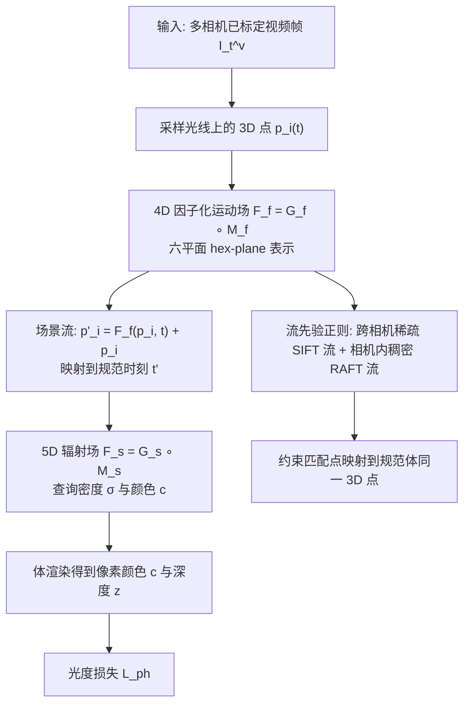

## 一句话总结

面向稀疏多视图输入下的快速动态视图合成，本文提出 RF-DeRF：用一个可快速优化的因子化 4D 场景流（运动）场加上一个规范时刻的 5D 辐射场，把动态场景显式解耦为"规范场景 + 运动"，并用"跨相机稀疏光流 + 相机内稠密光流"这组可靠先验正则化运动场，从而在极少视点下取得又快又好的重建。

## 研究背景

给定不同视点的图像或视频合成新视角，在元宇宙、体育、远程探索等场景有广泛应用。K-Planes 等因子化 4D 表示大幅降低了动态辐射场的训练与渲染开销，但需要密集的输入视点才能得到照片级质量。本文聚焦稀疏多视图设定：每个视点各有一段视频，但相机数量很少。

稀疏输入下优化动态辐射场是高度欠约束的，通常需要引入额外先验来正则化。静态稀疏辐射场常用深度、可见性、自然图像等先验，而动态场景的物体运动则促使人们研究"运动先验"。问题在于：K-Planes 这类方法直接用 4D 体表示、没有显式运动模型，模型隐式学到的运动无法被运动先验约束。因此需要设计一个带显式运动场、可被运动监督约束的动态辐射场。

已有带运动场的方法（如 TiNeuVox、SWAGS）多用深度神经网络建模运动，导致训练与渲染昂贵；把体素栅格朴素扩展到 4D 又会让显存随分辨率四次方增长。由于运动场在时间上稠密且具有很强的时空相关性，本文选择用因子化体来利用这种相关性。

## 方法

### 整体框架

模型把动态辐射场拆成两部分：一个建模规范时刻 $t'$ 场景的 5D 辐射场 $F_s$，以及一个把任意时刻 $t$ 的 3D 点映射到规范时刻 $t'$ 的 4D 场景流（形变）场 $F_f$。两者都用"因子化体 + 微型 MLP"实现以保证快速。由于 $F_f$ 只给出从 $t$ 到 $t'$ 的单向映射，作者通过"让先验匹配到的两个点映射到规范体中同一 3D 点"来施加跨任意时刻、跨任意相机的光流先验。

### 关键设计

因子化运动场。基于 K-Planes 的多分辨率栅格，运动栅格 $G_f$ 在每个分辨率下由六个平面 $\{S_{xy}, S_{yz}, S_{xz}, S_{xt}, S_{yt}, S_{zt}\}$ 构成，前三个建模空间相关性、后三个建模时空相关性。对 4D 点 $(\mathbf{p}, t)$ 投影到六个平面、双线性插值后用 Hadamard 积融合特征：

$$\mathbf{h}_i = G_f(\mathbf{p}) = \prod_{c \in \{xy, yz, xz, xt, yt, zt\}} S_c(\mathbf{p})$$

该特征送入微型 MLP $M_f$ 输出场景流。规范场景栅格 $G_s$ 则用三个空间平面的类似因子化建模。

规范映射与体渲染。对光线上每个采样点 $\mathbf{p}_i$，先算其在规范时刻的对应点：

$$\mathbf{p}'_i = F_f(\mathbf{p}_i, t) + \mathbf{p}_i$$

再查询 $G_s$ 得到密度 $\sigma_i$ 与隐特征 $\mathbf{h}'_i$，并由 $M_s$（额外以时间与视角方向为条件，以刻画阴影等时变色彩和高光等视角相关色彩）输出颜色：

$$\mathbf{c}_i = M_s\!\left(\mathbf{h}'_i, \gamma(\mathbf{v}), \gamma(t)\right)$$

随后体渲染：

$$w_i = \left(\prod_{j=1}^{i-1} \exp(-\delta_j \sigma_j)\right)\left(1 - \exp(-\delta_i \sigma_i)\right)$$

$$\mathbf{c} = \sum_{i=1}^{N_p} w_i \mathbf{c}_i, \qquad z = \sum_{i=1}^{N_p} w_i z_i$$

其中 $\delta_i = z_i - z_{i-1}$。两个场都由光度损失 $L_{ph} = \lVert \mathbf{c} - \hat{\mathbf{c}} \rVert^2$ 训练。

可靠光流先验。理想先验是跨相机、跨时刻的稠密光流，但不同相机在内参、色彩平衡、曝光、对焦上的差异使得基于亮度一致性的稠密匹配（如 RAFT）在跨相机时不可靠。作者改用两种互补先验：跨相机用鲁棒的 SIFT 关键点匹配得到稀疏但可靠的流先验 $P_{sf}$（借助 Colmap 提取匹配），相机内用 RAFT 得到稠密流先验 $P_{df}$（同相机、近时刻的参数变化小因而更可靠）。

流约束的施加方式。因 $F_f$ 只给出到 $t'$ 的单向流，作者用先验匹配的像素对约束其在规范体中重合。设像素 $\mathbf{q}^v_t$ 到时刻 $s$、视点 $u$ 的流为 $\mathbf{f}^{v \to u}_{t \to s}$，则匹配像素 $\mathbf{q}^{us} = \mathbf{q}^v_t + \mathbf{f}^{v \to u}_{t \to s}$，稀疏流损失为：

$$L_{sf} = \left\lVert \sum_{i=0}^{N_p - 1} w_i(t, v)\, \mathbf{p}'_i(t, v) - \sum_{i=0}^{N_p - 1} w_i(s, u)\, \mathbf{p}'_i(s, u) \right\rVert^2$$

这里先用 $F_f$ 求出规范点 $\mathbf{p}'_i$ 再按权重 $w_i$ 加权平均（而非反之），从而对每个 $\mathbf{p}_i$ 都提供丰富监督；且不对 $w_i$ 做 stop-gradient，使先验还能帮助去除浮点等错误质量。相机内稠密流以类似的 $L_{df}$ 施加，主要减少静态区域伪影。总损失为：

$$L = L_{ph} + \lambda_{sf} L_{sf} + \lambda_{df} L_{df}$$

## 实验结果

在 N3DV 与 InterDigital 两个多视图动态数据集上，用 2 / 3 / 4 个输入视点评估，指标为 PSNR、SSIM、LPIPS 与渲染深度的 MAE。所有模型在单张 RTX 2080 上训练 30k 次迭代，$\lambda_{sf} = \lambda_{df} = 1$。

主结果（部分，越少视点差距越明显）：

| 数据集 | 视点数 | 模型 | PSNR ↑ | SSIM ↑ | LPIPS ↓ | Depth MAE ↓ |
|--------|--------|------|--------|--------|---------|-------------|
| N3DV | 2 | K-Planes | 17.95 | 0.62 | 0.43 | 0.59 |
| N3DV | 2 | RF-DeRF | 20.35 | 0.71 | 0.33 | 0.41 |
| N3DV | 3 | K-Planes | 23.65 | 0.83 | 0.25 | 0.34 |
| N3DV | 3 | RF-DeRF | 25.07 | 0.88 | 0.21 | 0.16 |
| InterDigital | 2 | K-Planes | 16.51 | 0.51 | 0.40 | 0.35 |
| InterDigital | 2 | RF-DeRF | 19.08 | 0.66 | 0.31 | 0.23 |
| InterDigital | 3 | K-Planes | 18.75 | 0.66 | 0.30 | 0.22 |
| InterDigital | 3 | RF-DeRF | 20.41 | 0.74 | 0.25 | 0.12 |

消融（N3DV，3 视点）显示稀疏流先验 $P_{sf}$ 是最关键组件：仅加 $P_{sf}$ 时 PSNR 从无先验的 22.61 提升到 24.79，加上 $P_{df}$ 后达 25.07，且深度 MAE 从 0.39 降到 0.16。对照实验表明，直接施加跨相机稠密流先验反而使性能大幅下降（深度 MAE 升到 0.49），验证了"跨相机用稀疏、相机内用稠密"这一组合的合理性。与稀疏深度先验相比，稀疏流先验带来更明显的提升。在稠密输入下，无先验的 DeRF 与 K-Planes 表现相当。RF-DeRF 训练单场景约 1.5 小时、约 5GB 显存，单帧渲染约 6 秒，模型约 280MB。

## 亮点与局限

亮点：

- 把动态辐射场显式解耦为"规范辐射场 + 因子化运动场"，运动场用 hex-plane 因子化利用时空相关性，兼顾速度、紧凑与可正则化。
- 巧妙解决了单向运动场难以施加双向流先验的问题：约束匹配点在规范体中重合，从而可跨任意时刻、任意相机施加先验。
- 提出"跨相机稀疏 SIFT 流 + 相机内稠密 RAFT 流"的互补先验，规避了跨相机稠密流不可靠的痛点。
- 在极稀疏视点下显著超越 K-Planes、HexPlane，且随视点增多逐渐逼近密集输入水平。

局限：

- 把每个时刻都映射到单一规范体，意味着只能渲染规范体中存在的物体，难以处理长时段中进出场景的物体（作者建议用多段短视频各训一个模型）。
- 依赖 Colmap 生成稀疏流先验，单场景约需 45 分钟，较慢。
- 要求相机预先标定且时间同步，尚未做联合优化。

## 延伸思考

本文的核心洞见是"运动场在时间上稠密且高度相关，因此适合因子化体而非稀疏化表示"，并据此把静态场景稀疏重建里成熟的先验思想迁移到动态设定——但关键改造在于选对了先验的可靠来源（跨相机用稀疏、相机内用稠密）。这提示我们：在多视图不一致、光照与相机参数存在差异的真实采集条件下，"可靠但稀疏"往往优于"稠密但含噪"。沿此思路，若能用更快更鲁棒的跨相机匹配（如可学习特征匹配）替代 Colmap，并把相机标定、时间同步与场景一起联合优化，有望进一步降低对预处理的依赖、拓展到更自由的采集设置。此外，这种"规范体 + 显式因子化运动"的解耦框架也可迁移到 3DGS 等更快的表示上。
