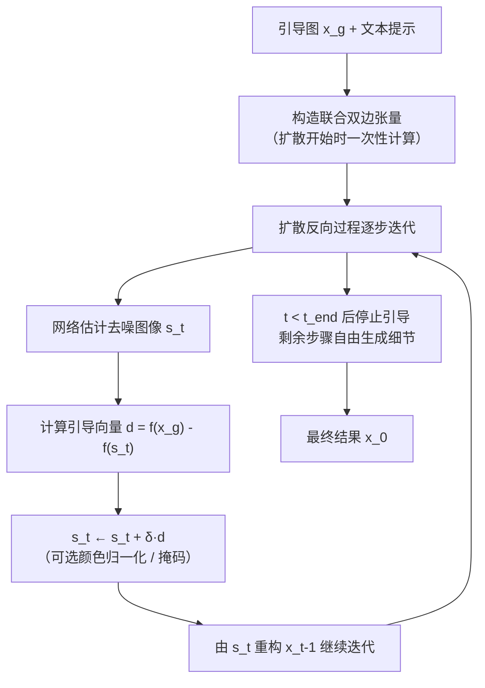

## 一句话总结

FGD（Filter-Guided Diffusion）在扩散过程每一步之间插入一个快速的（联合双边）滤波步骤，无需训练、不依赖网络内部特征，就能以引导图的结构约束生成结果，并对引导的强度与频率提供连续可控。

## 研究背景

近年来文本条件扩散模型成为图像到图像翻译（I2I）任务的主流方案，但当前最优的零样本方法大多是「白盒」思路：它们依赖对引导图做代价高昂的 DDIM 反演，再替换或注入网络特定的注意力特征。这类方法虽然效果好，却有两大局限：

- 运行时与显存开销大，反演与特征保存耗时明显。
- 多依赖确定性采样（DDIM），导致生成结果多样性受限，同一引导下难以产生变化。

作者主张回到「黑盒」路线——不依赖任何特定网络架构、不访问内部特征。核心观察是：只要在扩散每一步对估计出的去噪图像做选择性滤波，就能让扩散过程有选择地保留引导图的某些信息（尤其是边缘等粗尺度结构）。由此把经典图像处理中的双边滤波、拉普拉斯融合等工具重新引入扩散引导，得到一个又快又灵活的替代方案。

## 方法

整体框架：在标准扩散反向过程的每一步，先得到网络对去噪图像的估计，再用一个由引导图构造的线性滤波器把结果朝「满足引导约束」的方向推一小步，如此逐步、温和地施加引导，避免一次性替换把过程推离训练分布。

关键设计：

- 引导目标与温和引导。把引导形式化为让最终图像满足 $$f(\hat{x}_0) \approx f(x_g)$$，其中滤波器 $f$ 决定「引导什么属性」，$f(x_g)$ 给出「取什么值」。作者不一次性替换，而是定义引导向量 $$\vec{d}_g(x) = f(x_g) - f(x)$$，在每步以强度 $\delta$ 累加：$$\hat{x}_{t-1} = \hat{x}'_{t-1} + \delta\,\vec{d}_g(\hat{x}'_{t-1})$$。$\delta$ 提供对引导强度的连续控制。

- 在去噪估计 $s_t$ 上滤波，而非噪声中间量 $\hat{x}_t$。直接替换含噪中间量的信息会整体降噪，把过程推离训练时的方差调度，产生过度平滑伪影。改为对每步估计出的去噪图像 $s_t$ 施加引导，因引导图分布更接近 $s_t$，能在保留结构的同时补出更多细节（如牛排的烤纹）。

- 联合双边张量。双边滤波通常代价高昂，源于核对自身输入的非线性依赖。但一旦固定引导图，每个输出值就成为输入值的固定线性组合，可把滤波展开成与向量化输入相乘的单个方阵张量。扩散网络通常工作在低分辨率隐空间（约 $64\times64$），该张量可轻松放入显存，一次预计算即可反复使用，几乎不增加开销。双边核有两个参数：空间标准差 $\sigma_s$ 控制模糊尺度（越大允许越粗尺度的变化），值标准差 $\sigma_v$ 控制边缘保留（越小越保边）。

- 颜色分布归一化（可选）。低通引导会同时约束形状与颜色，当引导图颜色与提示不匹配时不理想。可在每步把 $f(x_g)$ 重归一化到它所替换的 $f(s'_t)$ 的均值与标准差，从而在尊重边缘的同时让整体颜色随提示自由漂移。

- 引导时段与掩码。经验上从头开始引导、在最后约 $20\%\sim30\%$ 步（记为 $t_{end}$）停止引导效果好，因粗结构多在早期形成。黑盒特性还便于做局部编辑：将每步的 $s'_t$ 按掩码组合为「施加 FGD 引导 / 完全自由 / 固定像素」三层，实现精确局部编辑。

作者进一步指出 FGD 与既有黑盒方法的联系：取 $f=I$ 即退化为 SDEdit；取下采样滤波并令引导强度恒为 $1$ 则接近 ILVR，但 FGD 支持保边滤波、连续强度控制、在 $s_t$ 上滤波免去重新注噪，并通过归一化让颜色适配提示。

## 实验结果

在 CelebA、AFHQ、Landscape 三个 I2I 常用数据集（共 1935 对文本-图像）上，用 CLIP 分数（越高越贴合提示）与 Structure Dist（DINO，越低越保结构）评估，FGD 在同等 CLIP 下取得更低 DINO，或同等 DINO 下更高 CLIP，表现严格占优；FID 上 ILVR 平均为 FGD 的约 $3.19$ 倍。计算成本对比（NVIDIA A5000，AFHQ 子集平均）如下：

| 方法 | 额外开销时间（秒） | 采样时间（秒） | 总时间（秒） | 总显存（MB） |
| --- | --- | --- | --- | --- |
| SDEdit | 4.44 | 5.61 | 10.05 | 5314.41 |
| PnP | 241.25 | 9.14 | 250.39 | 14857.41 |
| P2P0 | 18.19 | 36.00 | 54.19 | 18104.60 |
| FGD（本文） | 12.92 | 7.21 | 20.13 | 5381.85 |

FGD 相比最轻量的 SDEdit 仅多约 $67$ MB 显存（约为 PnP/P2P0 的 $1/3$），仅多约 $10$ 秒，比 PnP 快 $10$ 倍以上、比 P2P0 快约 $2$ 倍。因此在一次 PnP 运行的时间预算内，FGD 可跑至少 $10$ 次，通过在多个种子或滤波参数上「扫参」再选优，用更少时间得到更优结果。消融显示：增大 $\delta$ 提升结构一致性但过强会牺牲 CLIP；延长引导步数（增大 $t_{end}$）也增强对结构的贴合；Dog2Cat 数据集最优设置为 $t_{end}=10$、$\delta=1$、$\sigma_s=3$、$\sigma_v=0.3$，且该集上不加归一化更好。

## 亮点与局限

亮点：

- 训练无关、架构无关的黑盒方法，不需源提示、不需反演、不需网络注意力特征，显著节省时间与显存。
- 把经典双边滤波/拉普拉斯融合与扩散引导统一起来，用「联合双边张量」把昂贵的双边滤波线性化为一次张量乘法，几乎零额外开销。
- 对引导的强度、频率（$\delta$、$\sigma_s$、$\sigma_v$、$t_{end}$）提供连续可控；兼容非确定性采样，因而支持多种子多样化生成，扫参选优在 PnP 单次时间内即可完成。

局限：

- 黑盒方法长期看有本质上限：当「给定引导结构的图像分布」与「满足文本提示的分布」差异很大时，访问内部特征与梯度能提供白盒方法所具备的有用信息，而 FGD 无法利用。
- 温和引导依赖扩散的迭代本质。若未来采样器/网络通过大幅减少迭代步数来加速，可能干扰 FGD 的逐步引导（作者在补充材料中验证了对 DDPM 以外采样器的一定鲁棒性，但仍是潜在限制）。

## 延伸思考

FGD 的核心价值在于揭示了一个被忽视的杠杆：扩散每一步都会显式估计一张去噪图像 $s_t$，在这一「干净图像空间」而非含噪空间上做经典信号处理，代价极低却能稳定地注入结构先验。这提示我们，许多昂贵的白盒可控生成或许存在等价的轻量滤波近似——把可控性问题重新表述为「在中间估计上施加线性约束」，可能是通用而高效的一类范式。联合双边张量利用「隐空间分辨率低、引导图固定」把非线性滤波降为一次矩阵乘法的技巧，也值得推广到其他需要重复施加同一空间自适应算子的场景。未来若探索双边族之外的滤波器，或将 FGD 作为插件叠加到其他方法之上，可能进一步拓宽可控生成的设计空间。
