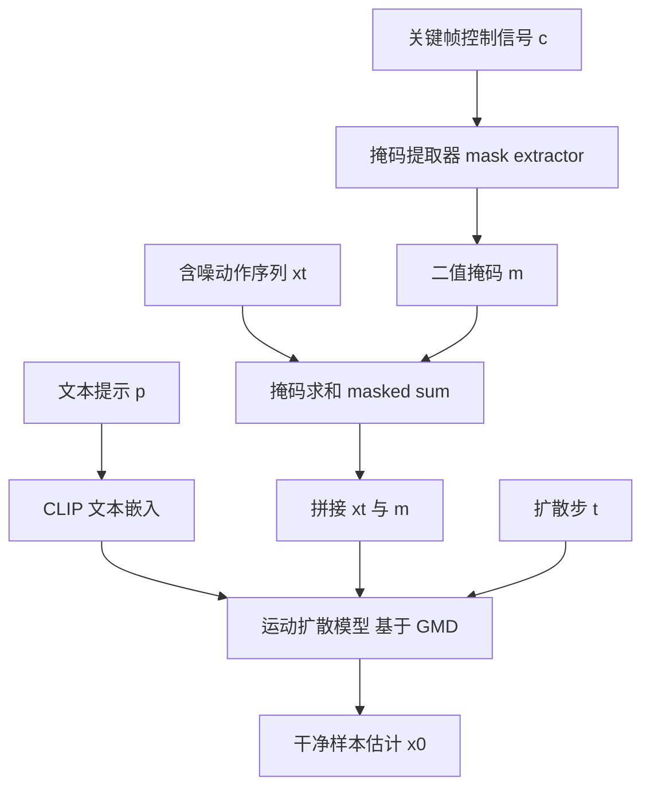

## 一句话总结

CondMDI 用一个带掩码的条件运动扩散模型统一处理关键帧补间，训练时随机采样帧与关节并配以观测掩码，从而在推理阶段灵活支持任意稀疏或稠密、时间稀疏与关节稀疏的关键帧以及文本提示，生成既贴合约束又多样自然的人体动作。

## 研究背景

关键帧补间（motion in-betweening）是角色动画的核心环节：给定用户提供的若干关键帧，生成能够合理插值这些约束的完整动作序列。这一过程长期以来被视为费时费力的手工劳动。近年基于深度学习的方法取得进展，循环神经网络（RNN）被用于关键帧补全，但难以建模长程依赖；Transformer 与生成式方法虽能一次预测整条轨迹，却普遍受限于固定的关键帧模式。

扩散模型在生成多样且逼真的人体动作方面表现突出，且天然适合把约束融入生成过程。但如何把关键帧这类空间约束标准地整合进运动生成，仍无统一方案。已有扩散方法各有短板：MDM 等采用相对上一帧的根关节表示，无法处理全局或时间稀疏约束，且直接对完整关节轨迹做修补会产生严重的脚步滑动与不自然运动；PriorMDM 需要针对目标轨迹微调；GMD 支持时间稀疏关键帧却只能指定盆骨位置、本质上是到达目标任务；与本文最接近的 OmniControl 面向关节控制，需要额外的嵌入模块与反复施加引导，推理开销较大。作者因此提出一个简单、统一、灵活的补间方法。

## 方法

整体框架：把条件反向后验 $$p_\theta(x_{t-1}\lvert x_t, p, c)$$ 建模为显式条件扩散模型，输入含噪动作 $$x_t$$、扩散步 $$t$$、文本提示 $$p$$ 与关键帧控制信号 $$c$$。关键帧信息通过「在观测到的帧与关节处，用关键帧值替换含噪样本」注入，并把替换后的样本与二值观测掩码拼接后送入扩散网络，让模型知道哪些特征是被观测的。训练时用随机采样的部分关键帧，从而在推理时获得对关键帧数量、时间位置乃至关节子集的灵活性。

关键设计：

- 全局根关节表示：常见运动表示把序列分为相对根关节的局部姿态与相对上一帧的全局平移旋转。这种相对表示使时间稀疏约束难以施加，因此作者把根关节的相对朝向转换为全局坐标，对数据集逐帧累加根关节平移与旋转，得到便于施加全局关键帧的全局根表示。

- 掩码条件注入：给定观测掩码 $$m\in\mathbb{R}^{N\times J\times D}$$（观测处为 1、其余为 0），在每个观测帧与关节处做替换
$$x_t = m\odot c + (1-m)\odot x_t$$
再与掩码拼接 $$x_t=\langle x_t, m\rangle$$ 作为网络输入，其中 $$\odot$$ 为逐元素乘、$$\langle\cdot\rangle$$ 为拼接。

- 随机掩码训练：训练目标沿用直接预测干净样本的参数化
$$L := \mathbb{E}_{(x_0,p),\,t}\left[\lVert x_0 - G_\theta(x_t,t,p)\rVert^2\right]$$
掩码由随机掩码生成器给出：先在序列长度内采样关键帧数量 $$k$$，再从所有帧中随机挑出这 $$k$$ 帧；进一步扩展到随机采样观测关节数 $$j$$ 并随机挑关节，从而支持部分姿态（如仅根关节或仅手腕）条件。训练中以 10% 概率把文本 $$p$$ 置空（分类器自由引导），以 10% 概率把关键帧 $$c$$ 置空（无条件生成），使模型兼顾无条件生成能力。

- 采样与骨干：推理时结合分类器自由引导
$$\hat x_0 = G_\theta(x_t,t,\varnothing) + w\left(G_\theta(x_t,t,p) - G_\theta(x_t,t,\varnothing)\right)$$
骨干采用 GMD 的运动扩散模型（UNet 加 AdaGN），采用 DDPM 的样本估计参数化，训练与推理均用 $$T=1000$$ 步。该条件方法可套用到任意文本条件运动扩散骨干上，改动极小。

## 实验结果

在 HumanML3D 数据集（14646 条带文本标注动作序列，20 fps、定长 196 帧、263 维特征）上评测，指标包括 FID、R-precision、Diversity、脚步滑动比例（Foot skating ratio）与关键帧误差（Keyframe error）。在根关节轨迹控制任务上，CondMDI 以更简单的架构与更快的推理速度达到与 SOTA 的 OmniControl 相当的表现。

| 方法 | FID↓ | R-precision(Top-3)↑ | Diversity→ | 脚步滑动↓ | 关键帧误差↓ |
| --- | --- | --- | --- | --- | --- |
| Real | 0.002 | 0.797 | 9.503 | 0.000 | 0.000 |
| MDM | 0.698 | 0.602 | 9.197 | 0.1019 | 0.5959 |
| PriorMDM | 0.475 | 0.583 | 9.156 | 0.0897 | 0.4417 |
| GMD | 0.576 | 0.665 | 9.206 | 0.1009 | 0.1439 |
| OmniControl(on all) | 0.322 | 0.691 | 9.545 | 0.0571 | 0.0367 |
| Ours | 0.2474 | 0.6752 | 9.4106 | 0.0854 | 0.0525 |

不同关键帧方案下，随着随机放置的关键帧从 1 增到 20，关键帧误差因约束更密而下降，但 FID 略微变差，说明过密约束可能过度限制模型。消融显示：纯修补（每步替换，IMP C=0）关键帧误差极小但 FID 高达 8.62、动作在关键帧前后剧烈跳变，即扩散模型完全忽略修补；在第 1 步停止替换的修补（IMP）FID 接近 SOTA 却几乎不遵守关键帧；加入重建引导（IMP+RecG）能兼顾质量与约束但仍有抖动；而 CondMDI 在这些推理期条件方法中综合表现最佳（FID 0.1731、脚步滑动 0.0850）。此外，仅用随机整帧训练的变体在整帧任务上误差更低，但难以泛化到部分关键帧，凸显用部分关键帧训练的重要性。

## 亮点与局限

亮点：以「随机掩码训练 + 掩码拼接注入」把关键帧补间的所有场景统一进单一模型，推理时可任意配置关键帧的数量、时间位置与关节子集，还能兼顾文本条件；转为全局根表示解决了相对表示难以施加时间稀疏约束的老问题；方法与骨干解耦，可直接嫁接到任意文本条件运动扩散模型并享受其后续改进；相比依赖反复引导与额外嵌入模块的 OmniControl，架构更简单、推理更快，且能支持从稀疏 VR 头显信号（头部与双腕）重建全身动作等应用。

局限：高动态动作仍有轻微脚步滑动与抖动，或需引入脚步、平滑损失或物理仿真跟踪来缓解，也可清理数据集中滑冰、游泳等异常动作；训练中的关键帧选择完全随机，尚未贴合实际常用组合；模型沿用 HumanML3D 的冗余数据表示，导致部分关键帧仅对应少量特征时，模型可能把这些稀疏观测值当作噪声处理，表示不均衡问题有待进一步解决。

## 延伸思考

这项工作最值得借鉴的是「训练时遍历约束空间」的思路：与其为每种关键帧模式单独设计或依赖脆弱的推理期修补，不如在训练阶段就随机采样所有可能的观测掩码，让模型学会在任意约束下补全。这把「灵活可控」从推理技巧变成了模型自身的能力，也解释了为何纯修补会被扩散模型忽略——没有在训练分布里见过的条件，推理时强行注入自然失效。这种以掩码统一表达异构约束、并让约束成为训练信号的范式，对轨迹补全、部分观测重建等一大类条件生成任务都有参考价值。同时，作者刻意保持方法与骨干解耦，也提示了一种务实的研究策略：把可复用的条件机制与快速迭代的主干模型分离，从而持续搭上基础模型进步的顺风车。
