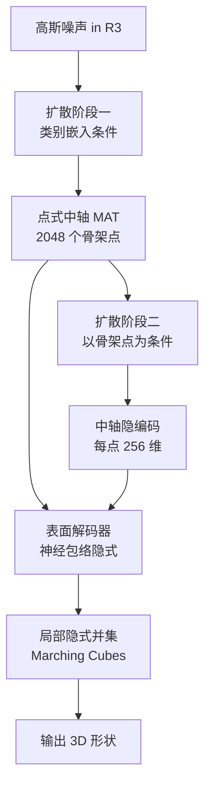

## 一句话总结

GEM3D 是一个"骨架先行"的拓扑感知 3D 形状生成模型：先用扩散模型生成基于中轴变换（MAT）的点式骨架抽象，再用骨架驱动的神经隐式表示解码出表面，从而生成拓扑和几何都更忠实、且可由用户骨架直接控制的 3D 形状。

## 研究背景

自动或半自动的 3D 形状生成是几何建模中的重要课题，广泛应用于计算机辅助设计、制造、建筑、艺术与娱乐。近年基于深度网络的 3D 生成方法虽能产出宏观上合理的体素、点云、网格或隐式场，却很少显式建模形状结构与拓扑，主要依赖网络本身的表达力去"猜"出看起来合理的形状。由于 3D 相比 2D 多一个维度带来的资源开销，这类方法常难以刻画细节和连通性。

同时，这些方法往往像"黑箱"，缺乏灵活、精确的可控性：无结构建模的方法无法指定特定拓扑（例如椅背特定的镂空样式），而显式建模部件结构的方法又只能处理由少量粗基元组装的简单拓扑，无法表达复杂镂空或装饰。

作者基于三点洞察构建方法：其一，拓扑细节常可由中轴变换得到的"骨架抽象"捕获，即使缺乏有意义的部件分解也适用；其二，这类抽象可由生成方法合成、从稀疏点云预测、或由艺术家手工绘制，且因是中间表示而无需完美；其三，每个抽象都可由另一个训练好的模型解码为逼真表面。

## 方法

### 整体框架

方法核心是一个两阶段扩散生成模型加一个表面解码器。第一阶段从高斯噪声出发，在形状类别嵌入的条件下生成点式的中轴（骨架）表示；第二阶段在骨架点位置的条件下生成每个中轴点对应的隐编码；最后表面解码器把中轴点与隐编码解码成局部神经隐式表面并聚合成完整 3D 形状。两阶段解耦使得同一骨架结构可对应多种表面变体，也支持用户自定义骨架。

### 关键设计

神经包络（Neural Envelope）。方法在 Guo 等人的"广义包络基元"基础上扩展出可学习的神经包络：用 MLP 近似一个半径函数，把中轴表示"加厚"成表面。给定查询点 $x$，隐式函数定义为

$$F(x;\theta) = \min_{i}\left( \lVert x - s_i \rVert - r(d_i, x, z_i; \theta) \right)$$

其中 $s = \{s_i\}_{i=1}^{N}$ 是生成的中轴点位置，$z = \{z_i\}_{i=1}^{N}$ 是对应的隐编码，$d_i = (x - s_i)/\lVert x - s_i \rVert$ 是从中轴点指向查询点的单位方向。半径函数不仅依赖方向，还依赖编码了周围表面信息的中轴隐编码。一个关键发现是：相比取"欧氏距离最近的中轴元素"，取"包络面最近的中轴元素"能得到明显更准确的表面重建。为加速，对每个中轴点采样约 1000 个方向，取最大半径构成包围球，只对包围球覆盖查询点的中轴元素求 $\min$。

表面损失。解码器仅需表面采样点即可训练（无需在全空间采点避免平凡解），最小化预测表面点与真实表面点的 $L_1$ 误差：

$$L_{surf}(\theta) = \frac{1}{N}\sum_{i=1}^{N}\frac{1}{\lvert D(i) \rvert}\sum_{d \in D(i)} \lVert \hat{x}_{i,d} - x_{i,d} \rVert_1$$

其中 $x_{i,d} = s_i + d_i \cdot r(d_i, z_i; \theta)$，$D(i)$ 是从中轴点 $i$ 沿多个方向投射射线得到的表面点集合。

两阶段扩散。骨架点生成阶段通过求解概率流 ODE 迭代去噪，去噪网络输入含噪骨架点、噪声水平和类别嵌入，网络由自注意力与交叉注意力块堆叠而成，训练用 $L_2$ 去噪损失。隐编码生成阶段类似，但去噪网络额外以中轴点位置为条件，并对每个中轴点加入基于频率的位置嵌入 $h'^{(l)}_i = h^{l}_i + g(s_i)$，使每个隐编码"感知"到自身所在中轴位置，显著改善重建。训练隐编码所需的参考编码由一个自编码器以无监督方式估计（编码器融合稠密表面采样点与中轴点，解码器即上述表面解码器，配合 KL 正则）。骨架的参考数据由作者提出的一种基于距离场的快速骨架化算法自动生成，全程无需逐类别或逐场景的人工调参。

## 实验结果

在 ShapeNet 最大的 10 个类别上做类别条件生成，GEM3D 在保真度、覆盖率、精度/召回及 FID/KID 上全面优于自回归的 3DILG 与潜在扩散的 3DS2VS：

| 指标 | 3DILG | 3DS2VS | GEM3D |
| --- | --- | --- | --- |
| MMD-CD ↓ | 9.64 | 9.34 | 8.64 |
| MMD-EMD ↓ | 11.0 | 10.9 | 10.1 |
| COV-CD ↑ | 54.8 | 50.6 | 58.5 |
| precision % ↑ | 73.1 | 72.4 | 80.6 |
| recall % ↑ | 79.4 | 80.3 | 89.2 |
| PointBert-FID ↓ | 1.46 | 1.62 | 1.25 |

在点云表面重建（自编码设定）中，ShapeNet 上 CD 与 F1 一致领先、IoU 相当；在完全未训练过的 Thingi10K 上做分布外测试，随着形状亏格（genus）升高优势越发明显：

| Thingi10K（CD ↓） | 3DILG | 3DS2VS | GEM3D |
| --- | --- | --- | --- |
| 全部 | 2.12 | 1.74 | 1.68 |
| genus ≥ 10 | 2.88 | 2.30 | 1.98 |
| genus ≥ 20 | 3.67 | 2.91 | 2.32 |

此外，方法支持骨架驱动生成：用户可从第一阶段挑选满意的骨架结构，再用第二阶段生成多样表面；甚至可让艺术家用 B 样条曲线与曲面手绘完全虚构的骨架，方法仍能生成符合这些分布外骨架的多样表面。单个形状生成约需 30 秒（NVidia RTX A6000）。

## 亮点与局限

亮点：把中轴抽象作为结构感知的中间表示，兼顾了骨架的高效拓扑编码与可解释性，以及数据驱动神经场的细节表达；两阶段扩散解耦让"同结构、多外观"和用户可控成为自然能力；在拓扑复杂、含薄壁与管状部件、高亏格的场景中重建与生成的忠实度显著优于同类。

局限：依赖固定分辨率的点式骨架这一简化形式，表达力有限；尽管拓扑改善明显，方法并不保证特定拓扑属性，生成表面仍可能与目标拓扑（如特定亏格）不符或含噪声碎片；尚未支持交互式骨架编辑与实时探索。

## 延伸思考

用中轴/骨架作为生成的可控中介，本质上是在"语义部件"与"纯隐式黑箱"之间找到一个几何上更普适的结构先验——它不要求形状有清晰的部件语义，却仍能承载拓扑信息，这对镂空、装饰、管状等难以部件化的几何尤其有价值。若能把点式骨架升级为更富表达力的骨架图（如带半径与连接的骨架单纯形），并引入交互式编辑与拓扑约束，或许能把这套框架推向真正可用于设计迭代的生成工具。另外，骨架化算法作为无监督数据生成器的角色也值得关注：它决定了整个生成质量的上界。
