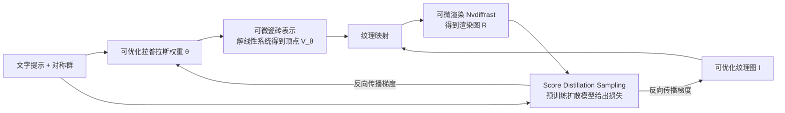

## 一句话总结

给定一句文字描述和一个平面对称群，本文自动生成一块非方形、可无缝无重叠平铺整个平面的带纹理二维网格，做出类似埃舍尔（M.C. Escher）风格、仅由重复的同一个物体构成的镶嵌图案。

## 研究背景

对称与重复是人类审美的核心，广泛应用于织物设计、建筑、室内设计与插画。制作完美重复的周期性图案是一项兼具人类感知与欧氏几何约束的高难度艺术任务：几何上，图案必须严格遵循指定布局、与自身无缝衔接、无限重复；感知上，图案又要看起来像目标物体且具有视觉美感。埃舍尔作品的魅力正在于在这些苛刻约束下仍能画出复杂且逼真的物体。

已有方法难以直接解决该任务：直接用生成模型产生一张方形无缝纹理，虽然容易匹配文字，却无法保证图案只由单一前景物体构成、也无法适配所有对称群（如六重旋转对称）。埃舍尔化（Escherization）等方法只能把已有形状拟合成瓷砖多边形，且无法阻止边界自交。核心困难在于：在文字引导的优化中不断改变网格形状时，必须始终保持其"可平铺性"——网格自身不能自交、三角形不能翻转、相邻副本之间不能重叠，而所有合法瓷砖构成的空间是高度非凸的，难以直接用基于梯度的方法优化。

## 方法

### 整体框架

方法把瓷砖 $$T$$ 表示为一块带顶点 $$V$$ 和三角形 $$T$$ 的二维三角网格，每个顶点带固定的 UV 坐标，用一张可优化的纹理图 $$I$$ 上色。核心思路是同时优化瓷砖的几何（顶点位置）与颜色（纹理），从而促使结果只包含前景物体、几乎没有背景。整条流水线端到端可微：

优化结束后，取这块瓷砖的多个副本，按对称群的等距变换摆放并染上不同颜色，即可拼出最终的无限镶嵌图（仅用于可视化，不参与优化）。

### 关键设计

可平铺的充要条件。给定对称群 $$G$$（平面共有 17 个"壁纸群"），网格能平铺的充要条件有两条：其一，所有边界顶点满足边界对应条件——每个边界顶点 $$v^\partial_i$$ 经某个等距变换 $$g$$ 后与另一个边界顶点对齐：

$$g\left(v^\partial_i\right) = v^\partial_j$$

其二，网格不自交（既包括边界不自交，也包括内部三角形不翻转）。仅满足边界条件很容易得到自交的无意义网格，因此无自交约束至关重要。

可微瓷砖表示（核心贡献）。作者希望用一组参数 $$\theta$$ 把顶点位置写成 $$V_\theta$$，并要求满足三条性质：合法性（任意 $$\theta$$ 都对应合法瓷砖，即无约束优化）、完备性（任意合法瓷砖都能被某个 $$\theta$$ 表达）、可微性。方法建立在 Orbifold Tutte 嵌入之上：原方法通过求解一个固定线性系统（要求嵌入相对拉普拉斯矩阵 $$L$$ 是离散调和的）产生无自交瓷砖，但无法控制瓷砖形状。本文的关键观察是把拉普拉斯矩阵的边权当作可微、可优化参数：给每条边 $$(i,j)$$ 赋一个标量 $$\theta_{ij}$$，用双射 $$f:\mathbb{R}\leftrightarrow\mathbb{R}^+$$ 构造参数化拉普拉斯 $$L_\theta$$：

$$L^\theta_{ij} = \begin{cases} -f\left(\theta_{ij}\right) & \text{边 }(i,j)\text{ 存在} \\ \sum_k f\left(\theta_{ik}\right) & i=j \\ 0 & \text{其它} \end{cases}$$

顶点位置 $$V_\theta$$ 定义为相对 $$L_\theta$$ 求解边界条件与离散调和方程所得的解，于是 $$\theta\to V_\theta$$ 天然可微。

理论保证。作者证明了定理：顶点摆放 $$V^*$$ 是合法瓷砖，当且仅当存在参数 $$\theta$$ 使 $$V^*$$ 满足相对 $$L_\theta$$ 的边界条件与调和方程。正向证明利用了无重叠网格中每个顶点都落在其邻居凸包内、可用正的重心坐标表示这一事实（令 $$f(\theta_{ij})$$ 等于重心坐标即可）。这样就把高度非凸的约束瓷砖空间转化为无约束、可微、且恰好覆盖全部合法瓷砖的表示。此外还引入一个全局旋转角 $$\phi$$ 作为优化变量。

文字引导优化。渲染用 Nvdiffrast 可微渲染器，损失用 Score Distillation Sampling（SDS，基于 Stable Diffusion）；SDS 被当作黑盒，可替换为任意可微损失。为避免退化成"方形图 + 背景色"的平凡解，采用三条策略：随机化渲染背景色、一半迭代步只渲染无纹理形状、几何学习率高于纹理学习率（让形状先成型）。因高引导强度会导致颜色过饱和，论文主要使用灰度纹理（方法也支持 RGB）。实现上用 $$40\times40$$ 规则三角网格初始化，批量 8，几何学习率 0.1、纹理 0.01，优化 6000 步，单张 A100 约 30 分钟。

## 实验结果

论文以定性结果为主，在全部 17 个壁纸群上评测了大量提示词，方法始终能产出无重叠可平铺的瓷砖，且瓷砖几乎只含目标物体。17 个群中 13 个是"有趣"的（瓷砖形状不固定），其余 4 个由纯反射生成、边界固定为凸多边形，故实验集中在这 13 个群上。

与三种替代方案的忠实对比如下：

| 方案 | 做法 | 主要问题 |
| --- | --- | --- |
| 本文方法 | 联合优化几何 + 纹理的可微瓷砖 | 瓷砖几乎只含前景物体，支持所有壁纸群 |
| OTE + SDS | 用 Orbifold Tutte 嵌入得到固定瓷砖，只优化纹理 | 无法改形状，大量区域被背景色占据 |
| Tiled Image SDS | 优化方形像素图并按 $$5\times5$$ 复制、喂随机裁剪给 SDS | 边界无缝但背景像素多，无法覆盖所有对称群 |
| Prompt + Diffusion | 直接调提示词让扩散模型生成镶嵌 | 远非完美重复，大量区域无前景物体 |

对比结果验证了优化几何的必要性：仅靠固定边界无法在非 $$90^\circ$$ 旋转对称等情形下得到合理镶嵌。消融实验表明：不随机化背景色会让优化只用背景色"涂掉"多余区域而不改几何；使用 RGB 纹理则更易产生背景像素并损失合理性。方法还能扩展到多瓷砖（一块网格切成 $$k$$ 个子瓷砖配 $$k$$ 个提示词）、内部对称瓷砖，以及从照片出发（结合 DreamBooth）生成瓷砖，并可 3D 打印实体瓷砖完美拼合。

## 亮点与局限

亮点。首个面向任意欧氏对称群、仅含前景物体的全自动文字引导非方形镶嵌生成方法；把拉普拉斯矩阵当作可微参数，将非凸的可平铺约束空间转化为无约束可微表示，并给出恰好覆盖全部合法瓷砖的简洁理论证明；在苛刻几何约束下仍能生成高度非凸、细长、复杂的瓷砖形状。

局限。仅适用于由对称群商结构生成的一类镶嵌，不支持非周期（如彭罗斯）瓷砖；平铺约束通常使含多个物体或非常具体描述的提示词难以成功；依赖 SDS，继承其运行慢、颜色过饱和、缺乏细粒度控制等缺点；三维体积瓷砖的扩展因 Tutte 嵌入在体网格上无法保证无重叠而不太可行。

## 延伸思考

把拉普拉斯边权作为可微参数来控制嵌入，是一个通用性很强的思路：作者指出它可用于优化两块球拓扑网格之间的无缝双射，或由神经网络在数据驱动设定下预测这一映射；结合双曲平面上的 Orbifold Tutte 嵌入（其可能镶嵌为无穷多），还能表达更大类的嵌入与映射。由于 SDS 只作为可插拔的损失黑盒，一旦出现更好的文字引导图像方法，本框架可无缝替换，从而缓解当前颜色过饱和与速度慢的问题。这类"把几何合法性约束参数化为无约束可微层"的做法，对更广的可微几何优化任务也具有借鉴意义。
