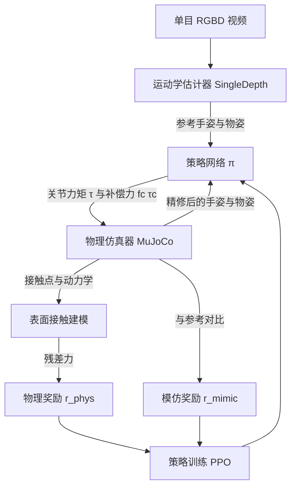

## 一句话总结

HOIC 用一套深度强化学习控制器，把单目 RGBD 视觉估计得到的粗糙手物交互动作放进物理仿真器里模仿并精修，通过「物体补偿力」与「表面接触模型」两项设计，在不引入任何启发式物理规则的前提下重建出既准确又物理合理的手部操控物体运动。

## 研究背景

手操控物体是日常活动中最重要的交互动作之一，其精确、实时的重建能服务于虚拟现实、人机交互与机器人学习。从单目 RGB 或深度输入联合重建手姿与物体运动本身是一个高度病态的问题：交互时手与物体互相遮挡严重，纯视觉方法常出现抖动、穿插、接触点缺失、非物理滑动等瑕疵。

已有引入物理先验的工作各有短板。基于优化与轨迹优化的方法要么离线、要么耗时，不适合实时应用；此前能实时运行的方法（Hu 等 2022）用物体动力学与简化摩擦接触模型来修正手姿，但它假设接触只发生在指尖，无法处理一般的手物交互场景。

另一条思路是模仿学习：在强化学习框架下训练策略网络，输入参考的非物理动作、输出控制信号来生成物理合理的运动，已在人体动作合成与捕捉中被验证有效。但把它用到手物交互重建仍有两大难点。其一，物体只能通过手施加的接触力被间接控制，控制器不仅要模仿参考手部动作，还要生成准确的接触点与接触力去驱动物体跟随参考轨迹，学习难度大。其二，现代物理仿真器里的接触机制与真实世界差异显著——真实的手有软组织会形变并产生接触面，而仿真器普遍用接触点近似，导致许多真实交互动作无法在仿真中被复现。

## 方法

整体框架：系统输入单目 RGBD 视频流，先用现成的运动学估计器（SingleDepth）得到手姿 $$\tilde{\boldsymbol{q}}_t$$ 与物体姿态 $$\tilde{\boldsymbol{o}}_t$$ 的粗估计，作为参考动作；再执行一个模仿过程精修。每个时间步，策略 $$\pi$$ 以当前精修结果 $$\lbrace\boldsymbol{q}_t,\boldsymbol{o}_t\rbrace$$ 及若干未来帧的运动学结果为输入，输出控制信号——不仅有手部关节力矩 $$\boldsymbol{\tau}_t$$，还有直接作用于物体的补偿力 $$\boldsymbol{f}^c_t$$ 与补偿力矩 $$\boldsymbol{\tau}^c_t$$，全部送入物理仿真器得到下一帧。训练用两类奖励：模仿奖励 $$r^{mimic}_t$$ 与物理奖励 $$r^{phys}_t$$。

关键设计：

- 物体补偿控制（object compensation control）：物理上物体只由手驱动、补偿力并不真实存在，但在强化学习框架里，用定义在物体上的奖励去训练手关节的策略非常困难，因为控制过于间接。作者为动作空间额外引入直接施加在物体上的补偿力与力矩，使训练更稳定，让策略能追踪更大范围的交互动作。最终动作定义为 $$\boldsymbol{a}_t=\lbrace\boldsymbol{\tau}_t,\boldsymbol{f}^c_t,\boldsymbol{\tau}^c_t\rbrace$$。手部力矩通过 PD 控制器由目标手姿求解：
$$\boldsymbol{\tau}_t=\boldsymbol{k}_p\circ(\hat{\boldsymbol{q}}_t-\boldsymbol{q}_t)-\boldsymbol{k}_d\circ\dot{\boldsymbol{q}}_t$$

- 相乘式奖励：奖励由模仿奖励与物理奖励相乘构成 $$r_t=r^{mimic}_t\cdot r^{phys}_t$$，而模仿奖励又进一步拆为手部与物体两项相乘 $$r^{mimic}_t=r^{hand}_t\cdot r^{object}_t$$。相乘的设计强制策略必须同时把手、物体都模仿准确、且以物理合理的方式使用补偿力，任何一项差都会拉低总奖励。手部奖励综合手姿、关节位置、骨骼朝向与速度四项：
$$r^{hand}_t=w_{pose}r^{pose}_t+w_{joint}r^{joint}_t+w_{orient}r^{orient}_t+w_{vel}r^{vel}_t$$

- 表面接触模型（surface contact model）：补偿力若不加约束，可能被策略滥用来违背物理地刷高模仿奖励。作者的洞察是——仿真器用的点接触模型高效但不物理正确，补偿力恰好可以用来弥补这种不正确，因此不必强制为零。方法把每个接触点沿四个切向各扩展出四个相距 2.5 毫米的附加点，从而在其围成的矩形上等价表示任意分布的表面接触力。再用库仑摩擦模型（以四棱锥近似摩擦锥）在这些扩展接触点上优化一组「净接触力」去匹配物体动力学，优化目标含力、力矩与相对滑动三项约束：
$$E(\boldsymbol{\lambda}_i)=E_{force}+E_{torque}+E_{rel}\quad\text{s.t.}\ \boldsymbol{\lambda}_i\ge 0$$

- 残差力与物理奖励：补偿力中能被净接触力表示的部分即视作对表面接触的合理建模，无法被表示的部分称为残差力 $$\boldsymbol{f}^{res},\boldsymbol{\tau}^{res}$$。当补偿力被正确使用、物体运动与手物接触状态一致时残差力趋于零，此时交互物理上合理。物理奖励即惩罚残差：
$$r^{phys}=\exp\left(-k_{phys}\left(\lVert\boldsymbol{f}^{res}\rVert+w_{torque}\lVert\boldsymbol{\tau}^{res}\rVert\right)\right)$$

## 实验结果

用 MuJoCo 仿真，物理手模型 26 自由度；数据集含 box、bottle、banana 三类物体，每类约 40 分钟（72K 帧），每类单独训练一个策略。系统全流程可 25FPS 运行、约 300ms 延迟，策略推理 8ms/帧。评测指标含追踪精度（APE 平均像素误差、物体 IoU）与物理合理性（Phys. 物理合理帧比例、Pen. 穿插深度、手/物平滑度）。与纯视觉方法（Zhang 等 2021）及启发式物理修正方法（Hu 等 2022）在三段序列上对比：

| 物体 | 方法 | APE ↓ | Obj IoU ↑ | Phys. ↑ | Pen. ↓ |
| --- | --- | --- | --- | --- | --- |
| Box | Zhang 2021 | 12.75 | 76.25 | 59.56 | 2.25 |
| Box | Hu 2022 | 13.02 | 74.93 | 75.66 | 2.33 |
| Box | Ours | 13.09 | 78.14 | 91.06 | 1.57 |
| Bottle | Zhang 2021 | 12.18 | 80.94 | 73.12 | 1.97 |
| Bottle | Hu 2022 | 13.50 | 80.19 | 95.72 | 1.83 |
| Bottle | Ours | 11.88 | 81.12 | 98.74 | 0.225 |
| Banana | Zhang 2021 | 10.53 | 70.01 | 85.86 | 1.39 |
| Banana | Hu 2022 | 11.34 | 73.26 | 91.50 | 1.63 |
| Banana | Ours | 10.27 | 73.53 | 95.30 | 0.870 |

结果表明本方法在保持与运动学估计器相当追踪精度的同时，物理合理性显著优于两个对比方法，且运动更平滑、穿插更少。消融实验显示：去掉补偿控制后策略只能模仿静态抓握等极简单动作；把表面接触模型替换为「无接触模型」或「点接触模型」时，物理合理帧比例从 91.06 分别降到 73.37 与 90.16，说明表面接触模型更贴近真实手物交互。

## 亮点与局限

亮点：这是首个让深度强化学习去学习复杂手物交互物理规律的工作。核心巧思在于「物体补偿控制」——用一个物理上并不真实存在的补偿力直接操控物体，把原本极难学习的间接控制问题变得稳定可训；更妙的是，这个补偿力又被表面接触模型重新解释，恰好弥合了仿真器点接触与真实表面接触之间的差距，从而无需在前向物理模型里显式建模复杂耗时的手部软组织形变。相乘式奖励与残差力惩罚共同保证了补偿力被物理合理地使用。

局限：泛化能力有限，系统只能在各自训练过的物体上工作，作者认为这源于手物交互动作的复杂性与仿真器本身的不精确，当前强化学习框架难以学到通用物理规律；追踪精度相比运动学估计器提升不大（因后者已在这些指标上直接优化到很高水平），方法的主要收益体现在物理合理性；此外仅在形状简单的刚体上验证，处理更复杂物体形状与运动仍是开放问题。

## 延伸思考

这项工作最值得回味的，是它对「不完美物理仿真器」的务实态度：与其耗费代价去精确建模软组织表面接触，不如引入一个可学习的补偿力，既充当训练稳定器，又充当点接触与表面接触之间的桥梁，再用残差最小化把它约束在物理合理范围内。这种「用可学习的修正量吸收模型误差、再用物理判据约束修正量」的范式，对其他物理仿真受限的重建与控制任务颇具启发。顺此方向，若能突破逐物体训练的瓶颈——例如引入物体几何与物性的条件化表示、或结合更细粒度的可微接触建模，让单一策略泛化到未见物体与柔性、关节体，手物交互的物理重建才可能真正走向通用。
