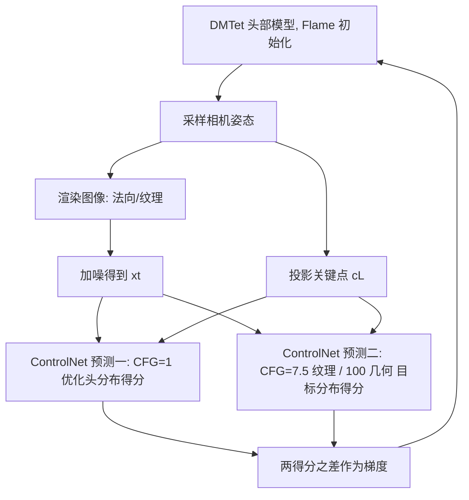

## 一句话总结

HeadArtist 提出自评分蒸馏（Self Score Distillation, SSD），用一个冻结的关键点引导 ControlNet 对自身预测做两次不同 CFG 权重的噪声估计，二者之差作为优化方向，从文本生成几何合理、纹理逼真且无多面 Janus 伪影的三维头部。

## 研究背景

文本驱动的三维头部生成在 AR、VR、游戏角色、实时交互等领域有重要应用价值，但面临若干困难。一类方法用文本图像配对数据集训练三维生成模型（扩散模型或 GAN），依赖高精度数据集且生成多样性不足。另一类方法借助预训练文本到图像扩散模型，通过评分蒸馏采样（Score Distillation Sampling, SDS）优化三维参数，摆脱了数据集约束、多样性更好，但无法回避 SDS 固有的过饱和与过平滑问题，且需要很大的 CFG 权重（如 100）才能稳定训练。

变分评分蒸馏（Variational Score Distillation, VSD）把三维参数视为随机变量，用常规 CFG 权重（如 7.5）缓解了纹理问题，但对头部几何优化效果不佳，因为其中没有引入头部的几何结构先验；同时 VSD 仍需借助 SDS 优化几何，且 LoRA 训练不稳定、收敛慢。此外，SDS 与 VSD 都容易出现多面 Janus 伪影，破坏生成结果的真实性。头部相比一般物体有两个特点：不同视角差异明显（更易出现多面 Janus），以及面部含有高度结构化的语义部件（眼、鼻、嘴），因而姿态与面部部件是重要的引导先验。

## 方法

### 整体框架

HeadArtist 沿用 Fantasia3D 的思路，将生成解耦为几何流与纹理流两条路径，先生成几何再固定几何生成纹理。三维头部用 DMTet 网格表示，并以 Flame 模型初始化。给定采样相机姿态，从头部模型渲染图像（几何流为法向图，纹理流为纹理图）并投影得到对应关键点，向渲染图像加入一定噪声，再把带噪图像、关键点与文本条件送入冻结的 ControlNet 两次做噪声预测，用两次预测之差驱动三维参数优化，整个流程由 SSD 完成。

### 关键设计

自评分蒸馏 SSD 的目标是最小化优化头部的渲染图像分布与目标真实图像分布之间的 KL 散度：

$$\mathcal{L}_{\mathrm{SSD}}=\min_{\mu_{h}}D_{\mathrm{KL}}\left(q^{\mu_{h}}\left(x \mid y, c\right) \,\|\, p\left(x \mid y, c\right)\right).$$

该目标被展开为一系列按时间 $t$ 索引的边缘扩散分布上的优化问题。VSD 需要用 LoRA 来表示当前渲染图像分布 $q^{\mu_{h}}_t$，但 LoRA 训练不稳定，且它与 ControlNet 分别采用常规相机参数和关键点作为头部姿态，二者失配会引发多面 Janus 伪影。作者观察到 ControlNet 本身是在精确对齐的「面部关键点、文本、人脸图像」数据集上训练的，因此可以直接用它来同时表示两个分布并采样 $x_t$。SSD 的梯度写作：

$$\nabla_\theta \mathcal{L}_{\mathrm{SSD}}(R(\theta))=\mathbb{E}_{t, \epsilon}\left[\omega(t)\left(\epsilon_\pi(x_t; y, t, c_L)-\hat{\epsilon}_{\pi}(x_t; y, t, c_L)\right)\frac{\partial x}{\partial \theta}\right],$$

其中 $c_L$ 为关键点，$\epsilon_\pi$ 与 $\hat{\epsilon}_{\pi}$ 是两个参数完全相同的冻结 ControlNet。实践中对 $\hat{\epsilon}_{\pi}$ 取 CFG=1，估计当前优化头部分布的得分；对 $\epsilon_\pi$ 取不同 CFG 权重估计目标真实图像分布的得分。SSD 的两点优势：两个得分来自同一扩散模型、由相同关键点引导，从而空间对齐、抑制多面 Janus；关键点天然携带面部语义先验，为头部生成引入结构信息。

几何生成：DMTet 用 MLP 网络 $\psi_g$ 参数化，对可变形四面体网格每个顶点预测 SDF 值与偏移，先用 Flame 的 SDF 做初始化损失，再渲染法向图，用 SSD 优化。由于法向图与训练 ControlNet 的真实图像存在域差异，几何阶段将 $\epsilon_\pi$ 的 CFG 设为 100 以稳定训练。

纹理生成：固定几何，用 MLP 网络 $\psi_{tex}$ 构建神经颜色场（follow Magic3D）预测每个顶点的 RGB，渲染成纹理后加噪，送入 SSD 优化。纹理阶段 $\epsilon_\pi$ 的 CFG 设为 7.5，并可直接使用负面提示词（把 CFG 中的空提示替换为「worst quality, low quality, semi-realistic」）进一步提升质量。

头部编辑：几何变形时固定 SDF 值、只学习每个顶点的偏移 $\Delta v_i$；随后固定修改后的几何，继续更新已在生成阶段预训练好的 $\psi_{tex}$。由于建立了固定 SDF 的规范空间且编辑纹理继承自先前生成，编辑能较好保持原角色身份。

## 实验结果

实现基于 threestudio 与 Stable Diffusion 2-1-base 的 ControlNet，法向与纹理分辨率 512×512，几何优化 15000 次、纹理训练 20000 次迭代，单张 NVIDIA RTX A6000 训练约 3 小时。与 DreamFusion、LatentNerf、Fantasia3D、ProlificDreamer、HeadSculpt 五种方法比较，采用 CLIP 分数与用户研究（10 条文本提示、10 名有计算机视觉背景的参与者，1 到 6 分，越高越好）评估。

| 方法 | CLIP-Score ↑ | User Study ↑ |
| --- | --- | --- |
| DreamFusion | 0.2609 | 2.06 |
| ProlificDreamer | 0.2640 | 2.45 |
| LatentNerf | 0.2618 | 2.72 |
| Fantasia3D | 0.2708 | 3.47 |
| HeadSculpt | 0.2801 | 4.56 |
| Ours | 0.3002 | 5.67 |

消融实验表明：用二维扩散模型加 LoRA 替换两个 ControlNet（类似 VSD）会出现多面 Janus 与几何纹理不一致；仅把目标分布换成三维头感知模型（LoRA 或 SDS 式噪声）虽有改善，但 LoRA 存在噪声空间失配、SDS 式大 CFG 带来过饱和过平滑；完整模型在几何（能生成脏辫等复杂结构）与纹理上均更优。去掉负面提示会出现轻微过曝与伪影（如人脸上出现文字），加入后质量提升。

## 亮点与局限

亮点：核心创新是让同一个冻结 ControlNet 对自身预测做两次不同 CFG 的噪声估计并取差，既避免了 LoRA 训练不稳定，又通过相同关键点引导实现空间对齐、有效抑制多面 Janus；关键点天然引入面部语义先验，几何与纹理解耦分别用合适 CFG（几何 100、纹理 7.5）；同一套流程还支持几何与纹理编辑并保持身份一致，训练成本仅单卡约 3 小时。

局限：方法依赖在面部关键点数据集上训练的关键点引导 ControlNet，主要面向人类头部这一特定域，泛化到一般物体的能力受限；负面提示词为手工设定；量化评估以用户研究与 CLIP 分数为主，用户研究规模较小（10 提示、10 人）。

## 延伸思考

「自蒸馏」思路的普适性值得关注：当存在一个在精确对齐条件（此处为关键点、文本、图像）上训练的强条件生成先验时，用它对自身预测做不同引导强度的差分，可能比额外训练 LoRA 更稳定、更能保证空间对齐。作者也指出可把 ControlNet 换成 Zero123 等三维感知扩散模型，将 SSD 推广到图像到三维生成，这为条件先验的选择与 SSD 的适用边界留下了探索空间。
