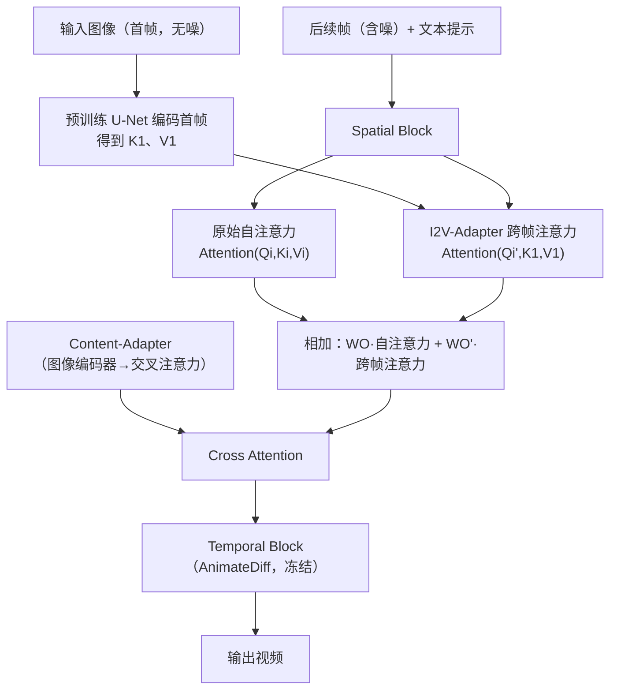

## 一句话总结

I2V-Adapter 是一个轻量、即插即用的图像到视频适配器：它把无噪的输入图像与后续含噪帧并行送入预训练文生视频模型，通过跨帧注意力把首帧身份信息传播到各帧，全程不改动任何预训练时空模块，仅引入极少可训练参数（最低约 $24\text{M}$）即可保持身份一致并兼容社区个性化模型与控制工具。

## 研究背景

随着文生图（T2I）扩散模型的成功，文生视频（T2V）方法（如在 Stable Diffusion 上叠加时序模块的 AnimateDiff）取得显著进展。但纯文本提示难以精确描述期望内容，往往需要复杂的提示工程，因此图像到视频（I2V）成为更直观的替代路线：以一张参考图加文本提示为输入，让图像提供直接的视觉参照。

I2V 的难点在于既要保持输入图像的身份与细粒度细节，又要生成连贯的运动。现有方法主要有两类，各有明显缺陷：

- 通道拼接：把参考图与含噪输入沿通道维拼接后送入 U-Net。这会改变模型输入空间、必须重训整个 U-Net，容易破坏预训练先验、导致灾难性遗忘，且难以复用个性化 T2I 模型与 ControlNet 等控制工具。
- 图像编码器加交叉注意力：用 CLIP／DINO 等预训练编码器提取特征注入交叉注意力。这类编码器只捕获高层语义，难以保留输入图像的低层细节与身份。

作者主张回到「适配器」思路：像 NLP 中的 Adapter、扩散领域的 ControlNet／IP-Adapter 那样，在不扰动原始权重的前提下插入少量任务专用模块，从而在低成本下完成 T2V 到 I2V 的迁移。

## 方法

整体框架：沿用 LAMP 提出的「首帧条件」管线——训练与推理时始终把第一帧设为无噪的输入图像，其余帧为含噪帧，一起送入 U-Net。这样保持 U-Net 输入／输出空间不变，从而冻结 Stable Diffusion 空间模块与 AnimateDiff 时序模块的全部权重，只训练新增的少量参数。作者认为预训练运动模块可视为通用运动表示，无需微调即可迁移到 I2V。

关键设计：

- 跨帧注意力适配器。观察到自注意力主导生成结果的布局、物体形状与细粒度纹理，作者在原自注意力旁并联一个跨帧注意力层，直接查询由预训练 U-Net 编码的首帧上下文。对第 $i$ 帧，用首帧的键值 $K_1$、$V_1$ 计算 $$\text{Attention}((Q_i)',K_1,V_1)=\text{softmax}\left(\frac{(Q_i)'(K_1)^{T}}{\sqrt{d}}\right)V_1,$$ 其中 $(Q_i)'=X_iW'_Q$。再把它加到原自注意力输出上：$$X^{i}_{out}=\text{Attention}(Q_i,K_i,V_i)W_O+\text{Attention}((Q_i)',K_1,V_1)W'_O.$$

- 极简可训练参数与安全初始化。整个适配器只有两个可训练矩阵：新查询投影 $W'_Q$（由原 $W_Q$ 初始化）与输出投影 $W'_O$。仿照 ControlNet 将 $W'_O$ 零初始化，使模型起始时等价于「未做任何修改」，从而不破坏原有 T2I／T2V 能力。原自注意力保持不变。

- Content-Adapter 补全全局语义。首帧条件本身较弱，作者再集成一个预训练的 IP-Adapter 风格 Content-Adapter，把图像编码器特征注入交叉注意力，提供全局信息引导，与跨帧注意力提供的低层细节互补。

- 帧相似度先验（Frame Similarity Prior）。I2V 是不适定问题，模型偶尔产生不稳定、扭曲结果。作者假设在较低噪声水平下，加噪首帧与加噪后续帧的边缘分布足够接近。受 SDEdit 启发，不从纯噪声 $x_T$ 出发，而从中间时刻 $t_0$ 起始，对每帧采样 $$x^{i}_{t_0}\sim\mathcal{N}(\alpha_{t_0}D(x^{1}_{0});\sigma^{2}_{t_0}I),$$ 其中退化算子为带掩码的高斯模糊 $$D(x)=M_p\circ x+(1-M_p)\circ\text{GaussianBlur}(x).$$ 掩码保留概率 $p$ 越小保留原图信息越多、视频越静态；$p$ 越大运动越强。$t_0$ 与 $p$ 共同在运动幅度与稳定性之间取得平衡。

## 实验结果

在 MJHQ-30K 上与商用及开源 I2V 模型对比（DoverVQA 越高越好、CLIPTemp 越高越好、FlowScore 越高表示运动越大、WarpingError 越低越稳）。I2V-Adapter 以极少的可训练参数取得最高美学分与最高参考图一致性，同时兼容个性化模型与控制工具：

| 方法 | 可训练参数 | DoverVQA ↑ | CLIPTemp ↑ | FlowScore ↑ | WarpingError ↓ |
| --- | --- | --- | --- | --- | --- |
| DynamiCrafter | 1.10B | 0.0848 | 0.9275 | 0.4185 | 14.3825 |
| I2VGen-XL | 3.40B | 0.0459 | 0.6904 | 0.6111 | 12.6566 |
| SVD | 1.52B | 0.0847 | 0.9365 | 0.6883 | 20.8362 |
| I2V-Adapter（SD1.5） | 24M | 0.0873 | 0.9379 | 0.7069 | 9.8967 |
| I2V-Adapter（SDXL） | 204M | 0.0887 | 0.9389 | 0.7124 | 11.8388 |

消融显示：去掉 I2V-Adapter 会丢失细节、后续帧颜色与细节明显漂移，说明其对身份一致性至关重要；去掉 Content-Adapter 则底层信息虽与首帧一致却出现不稳定，说明其提供全局引导；两者都去掉时细节与稳定性均差。帧相似度先验的参数实验表明：增大 $p$ 使 FlowScore 上升（运动更大）、WarpingError 下降（更稳定），增大 $t_0$ 有类似效果，从而可有效权衡运动幅度与稳定性。此外，结合 ControlNet 可用姿态序列驱动生成，并能适配与训练分辨率不同的非方形分辨率；结合 Blue Pencil-XL、Anime Art XL 等个性化 T2I 模型也能正常工作。

## 亮点与局限

亮点：

- 真正的即插即用与开源生态兼容：不训练任何预训练时空模块，仅新增 $W'_Q$、$W'_O$ 两个矩阵，可训练参数最低约 $24\text{M}$，约为主流模型的 $1\%$，训练成本低。
- 通过跨帧注意力直接查询首帧的丰富上下文来保身份，避免通道拼接对输入空间与权重的破坏，也弥补图像编码器只保留高层语义的不足。
- 无缝叠加 DreamBooth／LoRA 个性化模型与 ControlNet 控制工具，支持个性化与可控视频生成。
- 帧相似度先验用一个直观假设提供两个可调系数，在运动幅度与稳定性间连续权衡，对较弱基座（如 SD1.5）尤为关键。

局限：

- I2V 本身不适定，即便借助强大时空先验，模型仍偶发不稳定与扭曲，需要帧相似度先验来兜底。
- 依赖预训练 T2V（AnimateDiff）运动模块作为「通用运动表示」并将其冻结，运动质量与多样性因此受限于基座能力。
- 帧相似度先验需要手工调节 $t_0$ 与 $p$ 来匹配不同场景的期望运动强度，缺乏自适应机制。

## 延伸思考

I2V-Adapter 的核心启示是：与其改动输入空间、重训主干，不如在自注意力这一「掌控布局与细节」的位置并联一条查询首帧的跨帧注意力支路，用零初始化保证起点无损。这种「以注意力为接口、以少量投影矩阵为可训练量」的适配范式，把身份保持问题转化为「让后续帧去查询首帧的键值」，既轻量又天然兼容开源生态，值得推广到更一般的条件视频生成（多参考帧、视频编辑、可控插帧等）。帧相似度先验则提示：I2V 的采样不必从纯噪声出发，利用视频帧间高相似性从退化首帧起步，可在更少步数下稳定结果——这与图像编辑中的 SDEdit 思路一脉相承，若能让退化强度随内容自适应，或将进一步统一「稳定性—运动幅度」的权衡。长远看，当基座运动模块本身更强时，这类冻结主干、只训适配器的方法有望以更低成本持续受益于社区生态的演进。
