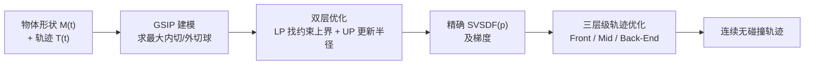

## 一句话总结

本文提出把**扫掠体符号距离场（Swept Volume SDF, SVSDF）**的计算建模为**广义半无限规划（Generalized Semi-Infinite Programming, GSIP）**问题，在查询点处**隐式**地求出精确 SVSDF（含扫掠体内部），无需显式重建扫掠体表面；再以此为核心构建三层级轨迹优化管线，为**任意形状**（刚体与可变形体）的物体生成**连续无碰撞（Continuous Collision Avoidance, CCA）**运动轨迹，既不简化形状、不牺牲可行空间，也不受离散采样的"隧道效应"困扰。

## 研究背景

为任意形状物体生成连续无碰撞的运动轨迹，在动画制作、CAD、制造和机器人导航中都极具价值。但现实物体与环境往往是复杂的非凸几何，处理连续运动中的碰撞非常困难。已有方法主要有两类缺陷：

- **简化形状**：把物体/环境近似成凸包或简单几何，牺牲了可行空间，在狭窄复杂环境里生成不出正确轨迹。
- **离散采样**：只在轨迹上若干离散时刻做碰撞检测，理论上会漏检碰撞——快速运动物体可能"穿过"薄墙，这就是 [Ericson 2004] 所说的**隧道效应（tunnel effect）**。

作者的核心洞察是：物体连续运动产生的**扫掠体（Swept Volume, SV）**恰好描述了运动全过程所需的最小安全空间。只要扫掠体内部没有障碍物，就理论上保证了整段连续运动无碰撞，而且这个判据不需要任何形状简化。

在扫掠体表示方面，已有工作大多聚焦于**重建扫掠体表面**（包络理论、微分方程、运动学、精确布尔运算等），但表面重建本身极难，且只有表面并不能给出可微的优化目标。[Sellán et al. 2021] 用时空连续隐式函数的零水平集来表示扫掠体表面，其隐式函数是扫掠体的**保守 SDF（conservative SDF）**——只在扫掠体**外部**取精确值，**内部**只是上界。而轨迹生成恰恰更关心扫掠体**内部**的 SDF（用来把扫掠体推离障碍）。[Marschner et al. 2023] 首次用神经网络实现扫掠体精确 SDF，但需数小时训练、难以编码不同轨迹与形状、且缺乏理论保证。本文要提供一个**数值、精确、有理论保证、通用**的替代方案。

## 核心方法

方法分两大部分：先隐式求解精确 SVSDF，再用它驱动三层级轨迹优化。

### 把 SVSDF 建模为 GSIP

扫掠体定义为物体沿轨迹经过的所有点的并集：

$$\mathrm{SV} = \bigcup_{t\in[t_{start},t_{end}]} \mathcal{T}(t)\,M(t)$$

其中 $\mathcal{T}(t)$ 是齐次刚体变换矩阵，$M(t)$ 是（可能随时间变化的）形状。计算 SVSDF 本质是求查询点 $\boldsymbol{p}$ 到扫掠体边界 $Fr(\mathrm{SV})$ 的最短符号距离。关键几何直觉：以 $\boldsymbol{p}$ 为中心、与边界相切的最小球半径 $r$ 就是 $|SVSDF(\boldsymbol{p})|$。于是问题写成"求最大的、与边界相切的球"：

$$\text{maximize}\ r,\quad \text{s.t.}\ B_{\boldsymbol{p}}(r)\cap Fr(\mathrm{SV}) = \varnothing$$

两个无限集不相交的约束很难处理，但可以借助一个度量函数 $g$ 把它重写为无限多个不等式约束，从而转化为标准 GSIP。作者选取的 $g$ 正是 [Sellán et al. 2021] 的保守 SDF：

$$g(\boldsymbol{p}) \triangleq \min_{t\in[t_{start},t_{end}]} \mathrm{SDF}_{M(t)}\!\left(\mathcal{T}^{-1}(t)\,\boldsymbol{p}\right)$$

即把查询点变换回物体各时刻的局部坐标系，取所有时刻中形状 SDF 的最小值。这个选择有两个好处：当 $\boldsymbol{p}$ 在扫掠体外时 $g$ 直接就是精确 SVSDF（因此只需专注解内部情形）；且保守 SDF 的性质有助于优化变量快速收敛。

### 双层优化求解 GSIP

利用 GSIP 的双层结构：先用**下层问题（LP）**在球内找出约束的上界（即在球内搜索 $g$ 最大的点），再用**上层问题（UP）**在有限约束下更新半径。作者把球内采样点用球坐标 $\boldsymbol{s}=\{\theta,\phi,\alpha\}$ 参数化（$\alpha$ 是半径缩放因子），下层非凸问题用**离散化 + 梯度下降**求解，上层则是线性问题、有**解析解**：

$$r_{k+1} \leftarrow r_k - g\big(\boldsymbol{q}(\boldsymbol{s}^*_k)\big)$$

算法从一个初始半径出发，反复"在球内采样求最大违反 $g^*$ → 把半径缩小 $g^*$"，直到收敛。当 $g(\boldsymbol{p})>0$（点在外部）时直接返回 $g(\boldsymbol{p})$；否则迭代逼近内部的精确负距离。理论上该方法能算出**精确 SVSDF 并收敛到任意数值精度**（收敛证明见补充材料 §C）。这样就在查询点处**隐式**得到了 SVSDF，全程无需显式重建扫掠体表面。

### 三层级轨迹优化管线

得到 SVSDF 后，作者以多旋翼在 SE(3) 空间的动力学为例构建三层级优化（方法同样适用于 R²、SE(2)、R³ 等）：

1. **前端（Front-End）**：用改进的**非对称 A\***在工作空间快速搜出可行路径。位置维按标准 A\* 扩展，姿态维只从最接近父节点的姿态开始评估，使搜索复杂度与 3D 普通 A\* 相当；碰撞检测用预存的多姿态形状栅格 $M_{map}(\gamma,\beta,\alpha)$ 与环境图做布尔卷积，速度很快。前端不必过分精细或严格无碰撞，因为最终由 SVSDF 优化收尾。
2. **中端（Mid-End）**：把前端离散的位姿序列拟合成连续轨迹，为后端提供良好初值。轨迹采用 [Wang et al. 2022] 的 **MINCO**（最小控制代价多项式，每段 5 次多项式），优化目标含平滑度、总时长、位置残差 $\mathcal{G}_p$、姿态残差 $\mathcal{G}_R$，其中姿态残差用 $\lVert R(t)^{-1}R_i(t)-I\rVert_F^2$ 度量。
3. **后端（Back-End）**：用精确 SVSDF 构建碰撞代价，把扫掠体推离障碍：

$$\mathcal{G}_o = \sum_{i=1}^{N_{obs}} \mathcal{L}_\mu\!\big[J_o(\boldsymbol{x}^i_{ob})\big],\qquad J_o(\boldsymbol{x}_{ob}) = \begin{cases} 0, & SVSDF(\boldsymbol{x}_{ob}) > s_{thr}\\ s_{thr}-SVSDF(\boldsymbol{x}_{ob}), & SVSDF(\boldsymbol{x}_{ob}) \le s_{thr}\end{cases}$$

后端总代价还包含平滑度 $J_m$、总时长 $J_t$ 和动力学惩罚 $\mathcal{G}_d$，用 L-BFGS 求解。

## 技术细节

- **为什么 SVSDF 梯度方向"最对"**：传统离散采样方法（Geng、Hauser、Wang 等）在离散时刻按物体"固定帧状态"算梯度，把连续运动割裂成孤立时刻，忽略了运动的整体连续性。[Zhang et al. 2023] 虽用了扫掠体梯度，但其内部 SDF 是相对固有形状的**保守值**，导致内部梯度方向错误、优化振荡。本文的 GSIP 解为任意障碍点给出其到扫掠体的最近投影点与**精确梯度方向**，尤其在障碍落入扫掠体内部时依然正确，这正是把扫掠体推离障碍的最佳方向。
- **度量函数 g 的全局优化**：$g$ 要求的是 $d=\mathrm{SDF}_{M(t)}(\mathcal{T}^{-1}(t)\boldsymbol{p})$ 关于时间的**全局最小**。作者先用包围球 $B$ 得到解析的 $d'$，利用 $0<d-d'<2r$ 的夹带关系快速圈定全局最小可能所在的时间区间，再在这些区间细分做梯度下降，避免陷入局部最小。
- **利用空间连续性加速内部计算**：SVSDF 幅值在空间上连续，可用邻近点的结果 $r^{neighbor}_{SVSDF}+d_{neighbor}$ 作为 GSIP 迭代初始半径，靠近最优解，实测提速 **4~5 倍**。
- **容差与隧道效应**：GSIP 的数值精度容差 $\epsilon$ 与物体形状无关，实验中取碰撞安全阈值 $s_{thr}$ 的一半，不会引发隧道效应。

## 实验结果

实现基于 C++，轨迹优化用 L-BFGS 求解器。

- **SVSDF 精度（Fig. 7、8）**：与 [Sellán et al. 2021] 的伪 SDF 相比，本方法在扫掠体**内部**也能算出精确的符号距离与梯度（如 3D 圆饼形的内部 SDF 正确，而保守 SDF 错误），这对轨迹优化至关重要。
- **对比学习方法（Fig. 9）**：与 [Marschner et al. 2023] 神经网络方法相比，后者虽能并行处理多查询，但需预训练，且轨迹每次迭代都在变形、需重新训练，导致整体轨迹生成时间**长得无法接受**；本文数值方法在单次轨迹任务的总耗时上显著更优。
- **基准与统计（Fig. 10）**：在 2D/3D 的密集随机障碍与狭窄缝隙环境中，对每种形状做 500 次随机起终点试验，统计 **CCA 成功率**与**障碍到扫掠体的平均最小符号距离**。本方法在与 Geng、Hauser、Zhang 等方法的对比中取得**最高的 CCA 成功率**和最小的碰撞约束违反。原因在于 SVSDF 在碰撞检测上的连续性，以及内外符号距离与梯度的准确性。
- **静态形状实验**：TIE 战机（用原始网格、未简化）穿越小行星带（Fig. 14）、固定翼飞机穿越极窄峡谷（Fig. 15）、汽车在密集停车场自动泊车（Fig. 13），以及 "SIGGRAPH" 字样与 logo 穿过与自身形状几乎一致的墙洞（Fig. 16，展示零可行空间牺牲）。
- **可变形形状实验（Fig. 11）**：只要形变 $M(t)$ 可微即可适用。演示了在新月/环形之间变形的磁流体机器人搬运颗粒，以及顶点可独立全向运动的"变形生物"机器人（把各顶点轨迹作为优化对象）。

需强调：文中展示的扫掠体仅用于可视化，方法本身**不需要显式重建扫掠体表面**（扫掠体生成沿用 [Sellán et al. 2021]）。

## 贡献与局限

**贡献**：
- 提出基于 GSIP 的方法，**首个非深度学习**地计算任意形状**精确 SVSDF**（含内部）的算法，有理论收敛保证，且只需形状本身的 SDF、适配不同轨迹与形状。
- 构建以层级优化为核心的轨迹生成框架，为任意形状机器人实现连续碰撞安全，做到**不简化形状、不牺牲可行空间、无隧道效应**——作者称这是首个同时达成这些目标的方法。
- 在多种 2D/3D 场景（汽车、飞机、船、可变形蠕虫与磁流体机器人）中展现 SOTA 的 CCA 性能与广泛通用性。
- 承诺开源，打通图形学（扫掠体计算）与机器人学（轨迹优化）两个领域。

**局限**：
- 轨迹优化强非凸，精确 SVSDF 约束虽能显著提升 CCA 指标，但**不保证 100% CCA**。
- 3D 环境下 SVSDF 需大量评估计算，导致**非实时**；作者正探索时空连续技术加速。
- 当前用采样点表示障碍，未来可扩展为直接在 SE(3) 空间计算物体到最近障碍的距离。
- **不擅长处理动态障碍**：现在只能把动态障碍的扫掠体当静态障碍，未来考虑用物体与障碍轨迹之差得到"相对运动扫掠体"。

## 延伸思考

这项工作最巧妙之处在于把一个几何问题（点到扫掠体的符号距离）转译成优化领域成熟的 GSIP 框架，用"最大内切球"的直觉配合双层优化的解析上层更新，绕开了扫掠体表面重建这个老大难。相比 [Sellán et al. 2021] 只给外部精确、内部保守的 SDF，本文补上了内部精确值这块关键拼图——而这恰是轨迹优化梯度是否正确的分水岭。它也体现了 SDF 作为可微碰撞表示在运动生成中的价值：连续、可提供梯度、天然规避隧道效应。局限也很实在：非实时与动态障碍处理不足，说明该框架目前更适合离线规划或准静态环境；其提出的"相对运动扫掠体"思路，若能落地，将是把该方法推向动态场景的关键一步。
