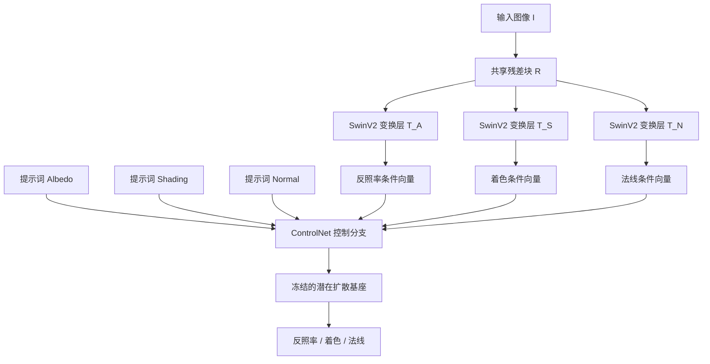

## 一句话总结

通过在预训练文生图潜在扩散模型上引入一个联合条件分支，从单张图像同时预测反照率、着色和表面法线三种本征层，借助基础模型隐含的先验实现对野外图像的强泛化本征分解。

## 研究背景

本征图像分解旨在把一张图像 $$I$$ 拆解为反照率层 $$A$$（表面反射率）、着色层 $$S$$（光照与表面的相互作用）和表面法线层 $$N$$（底层几何），是图像编辑、重打光、重贴纹理与合成的基础任务。这是一个高度病态的问题：同一张图像可以由多组本征层组合而成。

已有方法有两条路线：优化类方法依赖人工设计的先验（如平滑着色、灰度着色、反照率稀疏），学习类方法则从数据中学习先验。但真实场景的本征标注很难获取，现有场景级数据集要么是合成的、要么只有稀疏标注，导致这些方法难以泛化到野外测试样本。

作者的关键观察是：在海量视觉数据上训练的大规模文生图扩散模型，隐含地学到了场景的本征属性（例如给同一个房间不同光照提示词，模型能生成符合不同光照的图像）。因此核心问题变成"如何有效地把预训练基础生成模型重新利用到本征分解任务上"。直接微调面临本征标注数据量比文生图训练数据小几个数量级的困难，作者受 ControlNet 启发解决这一矛盾。

## 方法

### 整体框架

给定输入图像 $$I \in \mathbb{R}^{W\times H\times 3}$$，模型输出反照率 $$A$$、彩色着色 $$S$$ 和表面法线 $$N$$。核心思路是冻结预训练潜在扩散模型作为基座，训练一个联合的 ControlNet 控制分支：先用共享的条件图像编码器提取密集特征，再用模态专属的变换层把特征投影为各模态的条件向量，配合模态专属的文本提示词，让同一个控制分支通过切换提示词生成不同的本征模态。

### 关键设计

条件图像编码器：原始 ControlNet 用八层卷积把图像条件转成特征向量，会丢失本征信息导致输入与预测的颜色不一致。作者借鉴 VQ-GAN，用八层共享残差块 $$R(\cdot)$$ 把 $$I$$ 映射到 $$\mathbb{R}^{\frac{W}{8}\times\frac{H}{8}\times 320}$$，再接模态专属的 SwinV2 变换层 $$T_*(\cdot)$$。残差块权重在各模态间共享，变换层各模态独立，最终条件为 $$c_I^* = T_*(R(I))$$。

多模态联合学习：以潜在扩散模型为冻结基座，训练时把不同模态的数据混合到同一批次并平衡各模态的样本数，用模态名称（如 "Albedo"）作为固定提示词经 CLIP 编码。这样残差块、三个变换层与 ControlNet 可联合优化。这个设计的重要好处是允许混合只标注了部分模态的数据集（例如 DIODE 只有法线标注），并让一个模态的预测帮助改善其它模态。训练损失为

$$L = \mathbb{E}_{z_0^*,P^*,\boldsymbol{\epsilon}\sim\mathcal{N},t,c_I^*}\left[\lVert \boldsymbol{\epsilon}-\boldsymbol{\epsilon}_{\boldsymbol{\theta}}(z_t^*,t,P^*,c_I^*)\rVert_2^2\right]$$

零信噪比与速度预测：训练时强制零信噪比（zero-SNR）采样噪声，提升训练与推理的一致性，让模型生成更贴合原始数据分布的结果。配合零 SNR 调度器采用 v-prediction 与 v-loss 策略，预测速度 $$v_t = \sqrt{\alpha_t}\boldsymbol{\epsilon} - \sqrt{1-\alpha_t}z_0^*$$。

着色归一化：着色值范围很广且呈长尾分布，而基座生成范围为 $$[0,1]$$，作者用 $$S' = 1 - \frac{1}{1+S}$$ 做单调映射，保持原本亮的区域仍然亮。

推理：每个模态从随机高斯噪声出发，用对应的条件向量与提示词嵌入引导反向过程，最后用基座的 VQ-VAE 解码。为降低初始噪声随机性，对四个随机种子分别扩散并对各模态输出取平均。

## 实验结果

模型在 8 张 A100 上训练约 65 小时（batch 32，32 万次迭代），训练数据混合了 InteriorVerse、Hypersim（含反照率、法线、HDR 着色）以及只有法线标注的真实数据集 DIODE。

在 IIW（WHDR，越低越好）与 SAW（AP(c)，越高越好）基准上的反照率与着色评测：

| 方法 | WHDR 10% ↓ | WHDR 20% ↓ | AP(c) ↑ |
| --- | --- | --- | --- |
| PIE-Net | 33.3 | 23.5 | 82.8 |
| Ordinal Shading | 24.8 | 19.2 | 95.5 |
| NIID-Net | 23.5 | 17.0 | 98.4 |
| CRefNet | 12.8 | 10.8 | 98.3 |
| 本文 | 17.9 | 13.3 | 98.3 |

在合成 ARAP 基准上的反照率与着色（尺度不变指标，越低越好，选取部分）：

| 方法 | 反照率 MSE ↓ | 反照率 LMSE ↓ | 着色 MSE ↓ | 着色 LMSE ↓ |
| --- | --- | --- | --- | --- |
| PIE-Net | 0.042851 | 0.028001 | 0.010657 | 0.005434 |
| Ordinal Shading | 0.036650 | 0.023871 | 0.011423 | 0.005094 |
| CRefNet | 0.027791 | 0.016687 | 0.010027 | 0.004971 |
| 本文 | 0.023577 | 0.014083 | 0.007678 | 0.004153 |

本文在 ARAP 上七项指标中取得五项最优，反照率纹理细节与颜色一致性明显更好，并在野外互联网图像上展现出更强的泛化能力。消融实验显示：联合学习多模态（尤其加入真实法线数据 DIODE）能提升反照率与着色质量；作者的图像编码器比原始卷积编码器更好地对齐输入与预测的颜色；零 SNR 策略对齐颜色分布、避免重建退化。CRefNet 虽在 WHDR 上更低，但依赖强反照率扁平化先验，牺牲了细节，且用了 IIW 训练集，而本文未用。

## 亮点与局限

亮点：把本征分解重新表述为基于预训练基础文生图模型的条件生成问题，充分利用海量数据学到的隐式先验；提出联合预测多模态的 ControlNet 结构，达到当前最优；联合学习框架能混合仅标注部分模态的异质数据集，一个模态的预测能帮助其它模态；预测彩色 HDR 着色，在过曝区域仍有较宽的动态范围，支持忠实的亮度调节等编辑应用。

局限：作为数据驱动方法，遇到分布外场景（例如深度褶皱的织物）时性能下降，源于训练与测试的域差；训练中未显式监督从本征层重建输入图像，因此重建误差也会受影响。

## 延伸思考

这项工作体现了"把生成基础模型当作先验库"的范式：不再从零构造针对特定任务的先验，而是通过条件机制"抽取"基础模型里已有的知识。其多模态混合训练思路对本征分解这类标注稀缺的任务尤其有价值——用只有法线的真实数据去补强反照率与着色，本质上是在用几何信号约束外观分解的歧义。值得进一步探索的是：如何显式引入重建一致性约束以缓解分布外退化，以及能否把该联合条件框架扩展到更多本征模态（如粗糙度、金属度、光照环境）从而支持完整的重光照与材质编辑管线。
