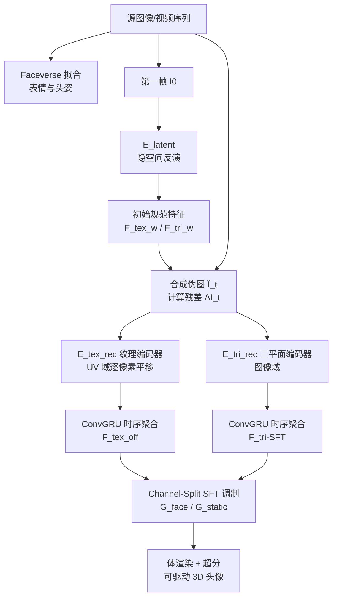

## 一句话总结

提出「增量式 3D GAN 反演（Incremental 3D GAN Inversion）」框架，用一张或多张源图像在一秒内前馈重建可驱动的高保真 3D 头像，并且重建质量随输入帧数增加而稳定提升。

## 研究背景

数字头像的创建长期以来追求两个核心目标：高保真（保留输入细节、补全遮挡区域、准确建模表情并保持身份一致）与高效率（无需在推理阶段对新身份做额外优化）。现有方法存在明显短板：

- 2D 生成模型结合 3DMM 能获得照片级真实感，但缺乏几何约束，在大幅度运动下会出现形状扭曲。
- 借助 3D GAN 先验、在隐空间解耦运动与外观的方法，由于运动和外观在 3D GAN 中天然纠缠，导致表情不准确、身份闪烁。
- 直接从 2D 图像集合学习可控 3D GAN 并做单图反演（one-shot inversion）的方法效率高，但受限于单张源图像。单图往往因遮挡和有限视角无法完整表达对象，且这类方法在结构上无法聚合多帧的局部观测来重建更个性化的细节。

本文正是针对「存在多张输入图像时如何提升重建质量」这一问题，提出无需推理期额外优化、可融合单目视频序列多帧信息的增量重建框架。

## 方法

### 整体框架

方法建立在可驱动 3D 生成模型（Next3D）先验之上，采用两阶段「由粗到细」的反演流水线，并用循环网络做时序聚合：

- 粗阶段（隐空间反演）：用 $E_{latent}$ 将第一帧投影到 GAN 先验的 $W+$ 隐空间，得到初始头像的规范化特征 $F_{tex}^{w}$ 与 $F_{tri}^{w}$。
- 细阶段（规范特征空间反演）：在两个解耦的规范空间内预测特征偏移量，弥补隐空间反演的信息损失。
- 增量融合：将细阶段编码器替换为带循环解码器的时序聚合网络 $E_{tex\_rec}$ 与 $E_{tri\_rec}$，以 seq2one 方式融合多帧信息，逐帧增量精修高保真头像。

### 关键设计

紧凑且富表达力的可驱动 3D GAN。基于 Next3D 做两点改进：其一，将 Next3D 用于补全口腔内部的两个 UNet 替换为单个生成器 $G_{face}$，通过多尺度栅格化神经纹理特征图作为条件，让口腔内部特征在多层卷积中逐步生成，从而降低显存开销、支持更大的神经渲染分辨率（$128^2$）；其二，改用表情基更丰富的 Faceverse 参数模型来精确拟合 2D 图像中的细微表情，缓解条件 3DMM 与图像表情之间的错位，并在训练时给判别器补充跟踪得到的关键点图以增强合成图像与条件网格的一致性。

神经纹理编码器（Neural Texture Encoder）。得益于神经纹理架构，人脸外观在纹理特征空间中显式定义于 UV 参数化之上。因此设计 U-Net 编码器 $E_{tex}$ 在 UV 域将观测平移到规范纹理特征空间，其输入包含投影到 UV 平面的源图像 $I$、残差图 $\Delta I = I - \hat{I}$ 以及可见性掩码，输出多分辨率特征偏移 $F_{tex}^{off}$ 补偿粗阶段纹理特征。这种逐像素的图到图平移消除了在观测空间与规范空间之间学习对应关系的负担，使网络专注于恢复精细细节。对静态三平面特征，则用图到平面编码器 $E_{tri}$ 预测多尺度特征，经 Channel-Split SFT 层对 $G_{static}$ 做由粗到细的空间调制。

增量式 GAN 反演与循环聚合。用带循环解码器的 ConvGRU 在每个尺度聚合时序信息，逐帧把当前帧特征 $f_t$ 融合进隐藏状态：

$$z_t, r_t = \sigma(Conv(f_t, h_{t-1}))$$

$$o_t = tanh(Conv(f_t, r_t * h_{t-1}))$$

$$h_t = z_t * h_{t-1} + (1 - z_t) * o_t$$

初始隐藏状态 $h_0$ 为全零张量，依次输入所有帧后，最终更新的隐藏状态作为输出。与简单将多帧前馈作为辅助输入的做法不同，循环机制支持可变数量的输入，并能自主学习从流式数据中保留或丢弃哪些信息，从而摆脱固定窗口和定间隔更新的限制。

## 实验结果

可驱动 3D GAN 先验对比：以约一半参数量达到与 Next3D 相近的合成质量，同时显著提升驱动准确性。

| 方法 | FID↓ | AKD↓ | CSIM↑ | 参数量 |
| --- | --- | --- | --- | --- |
| Ours | 4.1 | 0.057 | 0.853 | 84.21M |
| Next3D | 3.9 | 0.248 | 0.841 | 164.81M |

单图重建与驱动（HDTF 同身份自重演）：在保真与身份保持上优于各基线。

| 方法 | PSNR↑ | L1↓ | LPIPS↓ | CSIM↑ | AKD↓ |
| --- | --- | --- | --- | --- | --- |
| Ours | 23.27 | 0.029 | 0.111 | 0.873 | 0.018 |
| OTAvatar | 22.85 | 0.035 | 0.133 | 0.794 | 0.136 |
| Next3D-PTI | 22.05 | 0.038 | 0.128 | 0.850 | 0.312 |
| StyleHEAT | 22.32 | 0.036 | 0.130 | 0.827 | 0.109 |
| ROME | 22.91 | 0.034 | 0.127 | 0.832 | 0.120 |

多源图像少样本重建（VFHQ-Test）：质量随帧数提升，且推理时间仅小幅增长，远快于需长时间优化的基线。

| 方法 | 帧数 | PSNR↑ | LPIPS↓ | AKD↓ | CSIM↑ | 时间(s) |
| --- | --- | --- | --- | --- | --- | --- |
| Ours | 2 | 23.39 | 0.170 | 0.024 | 0.867 | 0.20 |
| Ours | 4 | 23.58 | 0.162 | 0.022 | 0.873 | 0.32 |
| OTAvatar | 4 | 17.76 | 0.276 | 0.614 | 0.721 | 100 |
| Next3D-PTI | 4 | 20.74 | 0.1771 | 0.287 | 0.845 | 150 |

消融（CelebA-HQ 肖像重建）：去掉第二阶段两个编码器后无法恢复身份；直接预测三平面偏移不如预测 SFT 参数；UV 域的神经纹理编码器对忠实的面部细节恢复至关重要。

| 配置 | LPIPS↓ | PSNR↑ | CSIM↑ | FID↓ |
| --- | --- | --- | --- | --- |
| Ours | 0.180 | 25.34 | 0.933 | 23.25 |
| 去掉两个编码器 | 0.393 | 17.67 | 0.809 | 26.42 |
| 去掉神经纹理编码器 | 0.201 | 24.35 | 0.910 | 28.23 |
| $E_{tri}$ 直接预测偏移 | 0.244 | 21.97 | 0.889 | 34.36 |

## 亮点与局限

亮点：

- 提出增量式 3D GAN 反演新范式，支持一到多张源图像输入，重建质量随帧数增长而稳定收敛，且在一秒内完成前馈重建，无需推理期优化。
- UV 域的神经纹理编码器以逐像素图到图平移替代对应关系学习，显著改善精细细节（发丝、耳环、瞳色、牙齿）恢复。
- ConvGRU 循环聚合机制支持可变帧数，能自主取舍流式信息，摆脱固定窗口限制；对比固定窗口的「ConvFusion」平均策略，后者在帧数超过窗口后误差反而上升并产生模糊结果。

局限：

- 依赖参数化模型控制表情，因而对跟踪误差敏感，且难以应对超出模型能力的极端表情（如皱眉、伸舌）。
- 合成稳定清晰的动态下排牙齿仍具挑战。
- 具备单图快速重建逼真头像的能力，存在被用于制作「深度伪造」的潜在社会风险，部署前需谨慎对待。

## 延伸思考

- 增量融合的核心在于用循环网络在规范特征空间里做「有选择的记忆」，这与朴素的多帧特征平均形成鲜明对比。它启发了一个更一般的思路：在前馈重建里，与其一次性喂入固定数量观测，不如用可学习的状态机制处理任意长度的流式数据，这对在线场景（视频会议、AR/VR 实时化身）尤为契合。
- 将外观显式绑定到 UV 参数化、从而把「反演」转化为 UV 域的图到图平移，是回避观测空间到规范空间对应关系学习的巧妙做法；这一思路对其他具备明确参数化模板的对象（如人手、人体）可能同样适用。
- 方法的表达上限受制于底层参数化人脸模型（Faceverse）的表情空间，未来若引入更鲁棒、覆盖更极端表情的可驱动先验，或将进一步释放该反演框架的潜力。
