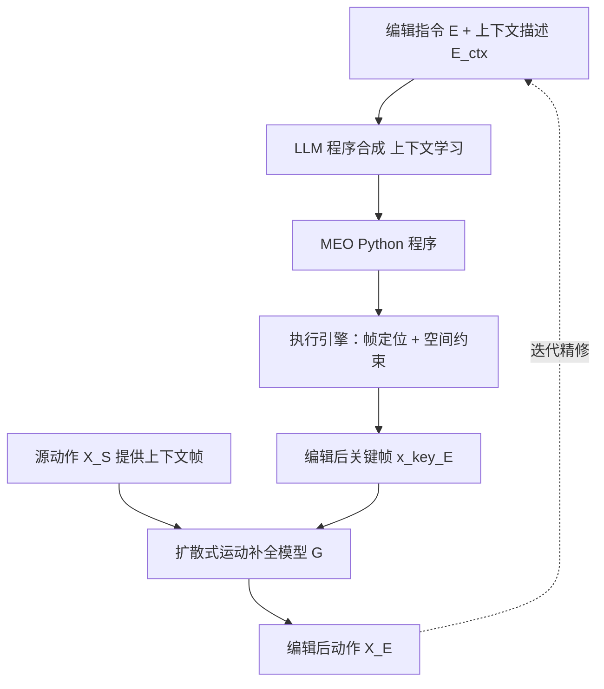

## 一句话总结

本文提出用自然语言对已有角色动画做迭代式局部编辑的方法，核心是用一组语义清晰、可预测的运动编辑算子（MEO）作为中间表示，借助大语言模型把文本指令翻译成调用 MEO 的 Python 程序，再把 MEO 转成关键帧约束并用扩散式运动补全模型生成既忠实指令、又尽量保留原动作、还保持真实的结果。

## 研究背景

在角色动画流程中，编辑已有动作序列以贴合创作意图是常见任务。传统做法要靠繁琐的逐关节打关键帧；而新兴的文本到运动生成系统虽然只需改提示词（如把「侧踢」改成「高侧踢」），却难以预测系统如何理解提示，也无法保证编辑后的动作与原动作保持对应关系。另一些生成模型提供有限的编辑能力，但需要稠密的目标关节轨迹或编辑掩码等多模态输入，而非简单的文本接口。

作者希望兼得两者优点：精确的编辑控制，通过易用的文本接口交付。设计上遵循「可预测性」这一有效创作工具的原则——动画师应能对系统在给定输入下的行为建立心智模型。系统输入包括起始动作 $$X_S$$、对该动作的文字描述 $$E_{ctx}$$、以及文字编辑指令 $$E$$，目标是生成满足三条准则的编辑动作 $$X_E$$：高编辑保真（体现意图）、非破坏性（尽量不改动不该受影响的部分）、真实（全局协调、可信）。这三条目标之间可能相互冲突，例如为让踢腿更高又保持真实，可能不得不加入额外过渡动作，从而牺牲一部分非破坏性。

## 方法

整体框架：把运动编辑拆成两步。第一步用大语言模型（采用 ChatGPT-4），通过上下文学习把自然语言编辑指令翻译成一段由 MEO 组成的可执行 Python 程序；第二步由执行引擎把 MEO 落地为关键帧约束，再用基于扩散的运动补全模型生成新动作。系统可迭代运行，把上一步的 $$X_E$$ 当作新的 $$X_S$$ 继续编辑。

关键设计：

- 运动编辑算子（MEO）：这是一组抽象层级高于关键帧、但语义足够简单可预测的算子。多数 MEO 像关键帧一样指定「要修改的关节 + 空间约束（旋转／平移）+ 生效的时间区间」，目标关节聚焦于末端执行器、膝、肘、头、肩、髋、胸、腰等。与关键帧不同的是，MEO 的空间与时间约束可相对于源动作的属性来表达：空间上可相对关节当前姿态（如把右手抬更高、外展左髋）或相对另一关节（如把右手移到右肩之上）；时间上既支持显式帧索引 `at_frame`，也支持隐式引用 `when_joint`（如「腰最高时」）来把程序锚定到 $$X_S$$。为降低从自然语言精确生成的难度，平移／旋转方向被限制在一小组离散方向（更高／更低、上方／下方、外展／内收等）而非具体数值，这也符合人描述动作时的粗粒度习惯。此外还支持加速／减速片段等非关键帧型算子。MEO 以 Python API 形式实现。

- 从自然语言生成 MEO：为解决「接地」问题（例如「踢更高」到底改哪条腿，需要 $$X_S$$ 的上下文），除编辑指令 $$E$$ 外还需一段运动上下文串 $$E_{ctx}$$（可由用户提供、自动描述生成、或源自原始生成提示）。提示词中通过 import 语句告知可用算子与时间查询函数，并把合法参数（关节、方向等）以字符串列表置于文件顶部，再附上若干「编辑提示—MEO 程序」的上下文学习示例。推理时把 $$E$$ 与 $$E_{ctx}$$ 作为代码注释交给 LLM「补全代码」，并要求它写注释来解释所选算子与参数（自反思以提升质量）。若生成程序非法，系统把报错信息回传给 LLM 重试。

- 迭代编辑与撤销栈：编辑本质是迭代过程，「再高点」「现在以下蹲收尾」这类指令单看是模糊的，需靠历史获得上下文。系统把整段会话的历史指令与 MEO 程序输出都放进每步提示，让 LLM 能引用先前对话、纠正误解、在已有编辑上继续。运行时维护一个动作缓存，用 `load_motion` / `save_motion` 访问，由 LLM 判断某条指令该作用于哪个历史动作（如「不，另一只手」应作用于原始动作而非上一步结果）。

- 执行引擎：先做帧定位，显式引用无需处理、隐式引用则分析 $$X_S$$ 的关节轨迹用启发式定位（如极值帧）；再直接用正／逆运动学施加旋转／平移空间约束得到编辑帧 $$x^{key}_E$$，编辑幅度是程序化的（如旋转取当前角到关节极限的一定比例），变速用基于样条的时间扭曲实现。

- 扩散式生成插值：把编辑帧 $$x^{key}_E$$ 融回 $$X_S$$ 建模为运动补全问题。采用输出去噪后动作的扩散变体，去噪网络 $$G$$ 的训练目标为
$$L = \mathbb{E}_{X,t}\left[\lVert X - G(X_t, C, t)\rVert_2^2\right]$$
条件 $$C$$ 由源动作的上下文帧 $$X^{ctx}_S$$ 与编辑关键帧 $$x^{key}_E$$ 组成，关键帧邻域窗口（长度 $$W$$）被置零以待补全。架构基于 Transformer 解码器并加一条条件分支，用二值掩码 $$M$$ 区分需补全的属性，且把上下文信息喂入原始输入分支而非纯噪声：
$$G\left(\text{input}=M \odot X + (1-M)\odot q(X_t \lvert X),\ \text{cond}=M\odot X,\ t\right)$$
推理时对非根关节编辑，用样条插值解 $$X_{spline}$$ 作为初值引导去噪，每步以单调递减插值系数 $$\lambda_t$$ 把 $$X_{spline}$$ 的补全区域与 $$X_t$$ 做空间混合——前期由样条引导、后期由扩散补细节。针对根关节编辑（如跳、蹲）另训一个回归模型先补根轨迹，再让 $$G$$ 补其余自由度；两个模型都在 AMASS 数据集上训练。推理时还会自动检测 $$X_S$$ 中的重要帧（含显著极值或曾被编辑）并纳入 $$C$$ 加以保留。

## 实验结果

评测用 ChatGPT-4 作为 LLM，扩散模型在 AMASS 上训练，所有动作表示为 60 帧（2.5 秒）片段。与两个当前主流文本到运动模型 MDM 与 MoMask 对比：MDM 无法接收源动作输入，故用拼接提示词并固定种子重跑得到 MDM-Edit；MoMask 支持掩码编辑但无法自行推断掩码帧，故借助本文的 LLM 解析器确定帧索引再重跑得到 MoMask-Edit。

用户研究（19 名参与者，1—5 分，越高越好）在结构相似度（StrucSim）、编辑保真度（Fidelity）、动作质量（Qual）三项打分：

| 方法 | StrucSim↑ | Fidelity↑ | Qual↑ |
| --- | --- | --- | --- |
| MDM-Edit | 2.77 | 1.56 | 3.79 |
| Ours（对比 MDM） | 4.33 | 4.48 | 4.07 |
| MoMask-Edit | 3.59 | 1.72 | 3.88 |
| Ours（对比 MoMask） | 4.25 | 4.52 | 3.77 |

本文方法在保真度上远超两个基线，结构相似度也更好；基线常常无法同时兼顾结构相似与编辑保真，而本文方法在两个维度上都高。自动指标（结构相似用 G-MPJPE，保真用二元保真测试通过率 Fidelity-Auto）也呈现相同趋势：

| 指标 | MDM-Edit | Ours | MoMask-Edit | Ours |
| --- | --- | --- | --- | --- |
| Fidelity↑ | 0.588 | 0.82 | 0.6 | 0.882 |
| G-MPJPE↓ | 0.247 | 0.08 | 0.181 | 0.063 |

差异经 Wilcoxon 符号秩检验具统计显著性。执行引擎消融用 100 段 AMASS 真实动作，以几何特征空间的 $$FID_g$$ 衡量质量（编辑后应贴近源动作而非改善它）：AMASS 源为 4.33，本文完整引擎 ENG 仅微升到 4.95；去掉两阶段（ENG-SS）升到 5.25；用样条插值替代 $$G$$（ENG-Interp）最不像人、$$FID_g$$ 达 8.05，验证了两阶段设计与扩散补全的作用。

## 亮点与局限

亮点：用 MEO 这一「编辑专用中间表示」在高层编辑意图与低层关节操作之间搭桥，既保留关键帧级的细粒度控制，又提高抽象层级、让约束可相对源动作表达，从而具备可预测性；借助 LLM 的程序合成能力把模糊的自然语言翻译成可执行程序，并原生支持多轮对话式迭代编辑与撤销栈；执行端用扩散先验保证真实性，两阶段（先根轨迹后其余自由度）与样条引导去噪进一步提升根关节编辑与整体质量。

局限：MEO 仅限运动学约束，像「更用力地跳」这类物理相关编辑无法处理；源动作上下文与关键帧只是扩散模型的软条件而非硬时空约束，关节位置编辑可能带来额外位移、进而需要更多过渡时间以避免速度不一致；当前帧定位主要依赖关节极值，较为受限，更复杂的运动理解方法有望让其更灵活。

## 延伸思考

这项工作真正巧妙的地方，是把「可预测性」当成设计的第一性原则，并用一个精心裁剪的算子集合去约束 LLM 的自由度。相比让语言模型或生成模型端到端地「猜」用户想要什么，本文先把编辑空间收敛到一组语义清晰、效果可控的 MEO，再让 LLM 只负责它最擅长的「把自然语言映射到 API 调用」的程序合成——这既发挥了 LLM 的常识推理，又把不可控的生成风险挡在了中间表示之外。这种「用领域特定 API 给 LLM 划定边界」的范式，本质上是把可控性与灵活性解耦：算子保证下界（结果不会失控），语言模型拓展上界（表达任意组合意图）。顺着这条思路，未来若能引入物理约束型算子、更强的运动语义理解来做帧定位、或把硬约束更好地嵌入扩散采样，或许能把可编辑范围从纯运动学扩展到风格化与物理驱动，让文本驱动的动画编辑真正逼近专业工具的表达力。
