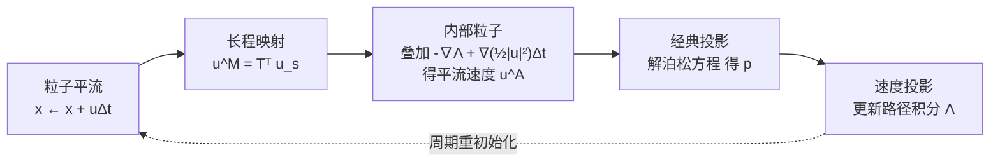

## 一句话总结

提出首个能处理自由表面的协向量（covector）流体求解器：以拉格朗日粒子轨迹建立长程流映射，利用流映射理论中的路径积分恒等式把"长程映射"与"短程投影"解耦，从而将带积分边界的长程投影问题转化为具有标准边界条件（自由表面零 Dirichlet、固体零 Neumann）的经典泊松问题。

## 研究背景

流映射（flow map）方法近年在计算物理与图形学中受到关注，因为它通过长程映射能出色地保持涡结构、抑制数值耗散。基于脉冲（impulse）／协向量与基于涡量的求解器都属于这一类。构建流映射方法的关键，是建立一个把任意点从初始帧映射到当前帧（必要时还需反向映射）的高效精确表示。

但脉冲／协向量流体模型在流映射实现下面临一个核心难题：无法处理自由表面边界。在建立于速度空间的标准自由表面求解器里，不可压缩性通过求解泊松方程来施加，自由表面用零 Dirichlet 条件（假设空气压强为零），固体边界用相应的 Neumann 条件。而协向量流映射模型的自由表面条件要困难得多，因为它需要在整个流映射区间上计算自由边界处的动能积分。在典型液体仿真里，流体表面随时间发生剧烈的几何与拓扑变化：一个粒子某时刻在表面，之后可能又并入流体内部，难以持续追踪其"是否在表面"的状态。而边界条件的正确性又依赖于当前所有表面粒子在整个流映射周期上的路径积分。正因如此，此前协向量／脉冲框架及其流映射实现只能求解无自由表面的流体，仅能生成烟雾动画。本文迈出了解决协向量流映射自由表面难题的第一步。

## 方法

整体框架：把每个流映射样本视为一条拉格朗日粒子轨迹，从拉格朗日视角重写协向量流体。基于流映射理论的路径积分恒等式，作者设计了一个解耦机制，把负责涡结构表达力的长程映射与负责不可压缩性的压力投影分离开来，再逐步把边界条件从"跨越所有时间步的长程积分"降为"单个时间步内的短程积分"，最终归结为可直接套用现有泊松求解器的标准零 Dirichlet 边界。

不可压缩欧拉方程（假设无粘、密度为一）及其协向量形式为：

$$\frac{\partial \mathbf{u}}{\partial t} + (\mathbf{u}\cdot\nabla)\mathbf{u} + \nabla p = 0, \quad \nabla\cdot\mathbf{u}=0$$

$$\left(\frac{\partial}{\partial t} + \mathcal{L}_{\mathbf{u}}\right)\mathbf{u}^{\flat} + d\left(p - \tfrac{1}{2}\lvert\mathbf{u}\rvert^{2}\right) := \left(\frac{\partial}{\partial t} + \mathcal{L}_{\mathbf{u}}\right)\mathbf{u}^{\flat} + d\lambda = 0$$

其中 $\lambda = p - \tfrac{1}{2}\lvert\mathbf{u}\rvert^{2}$ 定义为拉格朗日压力，$\mathcal{L}_{\mathbf{u}}$ 为李导数。沿粒子轨迹从时间 $s$ 积分到 $r$，速度可写成"映射 + 投影"两步的路径积分形式：

$$\mathbf{u}_{r,q} = \underbrace{\mathbf{T}^{s\,T}_{r,q}\,\mathbf{u}_{s,q}}_{\text{mapping}} - \underbrace{\nabla\Lambda^{r}_{s,q}}_{\text{projection}}, \qquad \Lambda^{r}_{s,q} = \int_{s}^{r}\lambda\,d\tau$$

即：先由长程流映射的雅可比 $\mathbf{T}$ 把初始速度拉回得到映射速度 $\mathbf{u}^{M}_{s\to r,q}$，再减去拉格朗日压力路径积分的梯度以去除无旋分量。

关键设计一：长程映射与投影的时间区间解耦。若直接用"长程映射 + 长程投影"（LMLP），需要在自由表面上建立跨越整段流映射的非零 Dirichlet 条件（要求粒子全程保持在表面），因拓扑变化几乎无法满足；且长程积分的散度分量大，泊松求解迭代成本高。若退化为"短程映射 + 短程投影"（SMSP），边界条件虽可鲁棒计算、投影收敛快，却丢失了长程流映射保持涡量的优势。作者观察到一个连接长短程映射的恒等式：

$$\mathbf{u}^{M}_{s'\to r,q} = \mathbf{u}^{M}_{s\to r,q} - \nabla\Lambda^{s'}_{s,q}$$

它允许在长程映射结果上加一个压力积分梯度即得短程映射，从而组合出"长程映射 + 短程投影"（LMSP）。作者证明：由于 $\nabla\Lambda^{s'}_{s}$ 是梯度场，只影响散度分量，$\Lambda^{s'}_{s}$ 中累积的数值误差会进入无旋部分并在投影时被移除，因此长程映射的保涡能力不受累积误差影响。

关键设计二：适配经典平流-投影（LMCP）。为避免表面粒子邻居不足导致雅可比 $\mathbf{T}$ 近似不准而引发失稳，作者进一步用一个恒等式把映射速度转成传统的被动平流速度：

$$\mathbf{u}^{A}_{s'\to r,q} = \mathbf{u}^{M}_{s'\to r,q} + \Delta t\,\nabla\!\left(\tfrac{1}{2}\lvert\mathbf{u}_{s',q}\rvert^{2}\right)$$

于是内部粒子用长程映射计算平流速度，近表面粒子直接用被动平流速度，然后在全域求解带标准边界的经典泊松方程 $\nabla\cdot\nabla p = \nabla\cdot\mathbf{u}^{A}_{s'\to r}$（自由表面 $p=0$，固体 $\mathbf{u}_r=\mathbf{u}_b$），最后分别对内部与近表面做投影并更新 $\Lambda^{r}_{s,q}=\Lambda^{s'}_{s,q}+\Delta t(p_q - \tfrac{1}{2}\lvert\mathbf{u}_{s',q}\rvert^{2})$。整个流程每 20 个子步做一次重初始化，用近表面 3 层粒子判定边界粒子。

关键设计三：Voronoi 粒子离散。每个时间步为所有运动粒子生成 Voronoi 图，每个粒子对应一个 Voronoi 胞。基于胞体积对粒子位置的变化率构造矩阵形式的散度算子 $D$ 与梯度算子 $G=-D^{T}$，拉普拉斯算子 $L=DV^{-1}G$ 对称半正定，泊松方程 $-Lp=-D\mathbf{u}^{*}$ 用共轭梯度法求解。固体用固体粒子表示，自由表面附近用 ghost 粒子采样空气粒子，用于裁剪 Voronoi 图并设定边界条件；重力沿轨迹积分后加到映射速度上；每步结束把粒子移到其 Voronoi 胞质心以保持分布均匀。

## 实验结果

作者用 Taichi 实现，实验在 Tesla V100 GPU 上运行，最多使用约 20 万粒子表示流体、空气与固体，Voronoi 图由 Scipy 与 Qhull 在 CPU 上生成。与 power particle 方法（PPM）对比，本方法在 leapfrog、Taylor 涡、Taylor-Green 涡等基准上表现出更慢的能量耗散、更少的涡量噪声与更好的涡结构保持；3D dam break 验证了固体边界与自由表面处理。消融实验显示，去掉自由表面处理会因 $\mathbf{T}$ 近似不准在表面产生异常形状，而减去累积压力梯度能显著加速泊松求解收敛。

各场景每子步平均耗时（括号内为 Voronoi 构建耗时）如下。

| 场景 | 粒子数 | 每子步耗时（Voronoi） |
| --- | --- | --- |
| 2D Leapfrog | 480k | 12.5s (8.8s) |
| 2D Taylor Vortices | 360k | 9.8s (6.4s) |
| 2D Taylor-Green Vortices | 156k | 5.96s (2.7s) |
| 3D Dam Break | 211k | 20.9s (18.12s) |
| 2D Kármán Vortex Street | 381k | 9.56s (6.74s) |
| 2D Moving and Rotating Board | 150k | 5.92s (2.66s) |
| 3D Sink | 180k | 29s (25.7s) |
| 3D Rotating Board | 150k | 5.9s (2.6s) |
| 3D Wave Generator | 403k | 35s (32.84s) |

定性上，方法还展示了 Kármán 涡街、2D 移动旋转板、3D 单／双漏斗（表面出现螺旋纹）、3D 旋转板（剧烈自由表面变化与运动固体）、3D 造波（波浪撞击多个柱体）等场景。

## 亮点与局限

亮点：首个能处理自由表面的协向量流体求解器；核心的解耦机制把带积分边界的长程投影转化为标准边界的经典泊松问题，既保留长程流映射的保涡能力，又能鲁棒处理自由边界；纯粒子方法中在动态涡结构仿真上达到领先水平；用统一的拉格朗日路径积分视角避免了来回映射与额外速度缓存。

局限：仅处理无粘流，粘性流与其他界面现象尚待解决；仿真速度受限于单线程 Qhull 生成 Voronoi 胞；由于 Voronoi 粒子约束，所有例子的 CFL 数只能设为 1，更大的 CFL 会因粒子邻居剧变而失稳（网格方法无此问题）。

## 延伸思考

这项工作的价值在于把流映射理论中的路径积分恒等式用作"手术刀"，将保涡所需的长程映射与不可压缩性所需的投影在时间区间上干净分离，从而绕开了协向量模型自由表面边界那个几乎无法直接计算的长程动能积分。这种"解耦长程与短程"的思路本身颇具启发性，作者也指出可推广到 levelset、粒子-网格等其他自由表面方法。顺着未来工作方向，把该框架引入弱可压缩体系有望增强 SPH 等无网格拉格朗日方法；而当前 Voronoi 构建的 CPU 瓶颈与 CFL=1 的限制，则提示需要更高效的粒子不可压缩求解方案，才能让这套优雅的数学框架真正跑得快、跑得稳。
