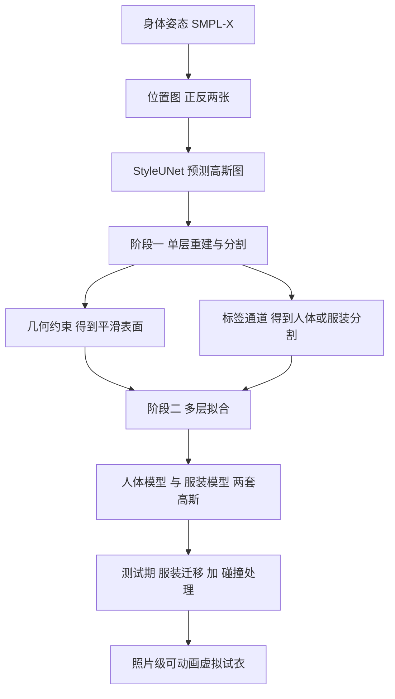

## 一句话总结

LayGA 把人体与服装建模为两个独立的高斯图层，通过「单层重建与分割」加「多层拟合」两阶段训练，在保留高保真外观的同时获得平滑几何与准确的服装边界追踪，从而实现跨身份的可动画照片级虚拟试衣与服装迁移。

## 研究背景

照片级人体化身近年因渲染技术进步而备受关注，从 NeRF 到 3D Gaussian Splatting（3DGS）不断提升渲染质量与效率。但大多数方法把人体与服装当作统一的单层来建模：这种耦合表示虽然对常见场景足够，却难以刻画不同衣物层之间的滑动运动，也无法支持把一个角色的衣服迁移到另一个身体上的虚拟试衣等应用。

相比之下，分层建模能更准确地追踪衣物边界的滑动，并解锁服装迁移这类新应用。然而支持多层建模的 NeRF/3DGS 工作寥寥。已有的 SCARF、DELTA 把 NeRF 服装与网格人体结合，虽支持服装迁移，但受限于 NeRF 对薄层衣物的表达能力，渲染质量与衣物动态都不尽如人意；同期的 D3GA 用高斯建模分层人体，却因 MLP 表示能力有限而结果模糊，且不支持服装迁移。

作者由此提出 LayGA：以高斯图（Gaussian map）化身为骨架，把人体和服装拆成两层高斯来建模。难点在于，无约束地直接优化两组高斯会得到散布在真实表面附近、缺乏平滑显式曲面的结果，既无法为不同体型适配衣物，也难以处理人体与衣物间的碰撞。为此他们设计了带几何约束的两阶段训练来同时兼顾几何、分割、追踪与渲染。

## 方法

整体框架：给定一个身体姿态（SMPL-X 关节角），先把它渲染成正反两张位置图作为条件，送入基于 StyleUNet 的网络预测姿态相关的高斯图；这些高斯从 SMPL-X 模板在规范空间非刚性形变而来，经线性混合蒙皮（LBS）摆姿后由 3DGS 渲染成图像。训练分两阶段：先做单层重建与分割，再做多层拟合。

关键设计：

- 服装感知的化身表示：在 Animatable Gaussians 基础上，每个高斯除颜色、位置偏移、不透明度、协方差外，额外预测归属人体或服装的概率 $$p^{body}_i$$、$$p^{cloth}_i$$。规范空间的高斯均值与协方差为
$$\bar x_i=\bar x^{smpl}_i+\Delta\bar x_i,\quad x_i=R_i(\theta)\bar x_i+t_i(\theta),\quad \Sigma_i=R_i(\theta)\bar\Sigma_i R_i(\theta)^T$$

- 单层几何约束：因为高斯对应 2D 图上均匀排布的像素，可用像素邻域约束底层几何。核心是基于图像法向的监督——用像素及其邻居构成的三角形算出法向，与从图像估计的法向做 $$L_1$$ 损失以破解形状-辐射歧义；再配合缝合损失 $$L_{stitch}$$（正反图边界一致）、偏移正则 $$L_{off}$$、全变差 $$L_{TV}$$ 与边长正则 $$L_{edge}$$，几何损失合为
$$L_{geom}=\lambda_{normal}L_{normal}+\lambda_{stitch}L_{stitch}+L_{reg}$$

- 服装分割：把人体/服装概率作为额外通道渲染成分割图，与由 SCHP 掩码和数据集抠图掩码融合得到的真值做交叉熵损失 $$L_{label}$$，并叠加标签的 TV 与缝合损失。分割结果用于后续把高斯划分为服装子集。

- 几何层与渲染层分离：几何约束虽让高斯收敛到平滑表面，却会损害渲染质量。作者在第一偏移 $$\Delta\bar x_i$$ 之外再加第二偏移 $$\Delta\bar y_i$$，得到渲染层
$$y_i=R_i(\theta)(\bar x^{smpl}_i+\Delta\bar x_i+\Delta\bar y_i)+t_i(\theta)$$
几何层（仅第一偏移）平滑且有法向，用于碰撞处理；渲染层用于最终成像。用碰撞损失 $$L_{coll}$$ 把人体几何层压在服装几何层之下，并用 $$L_{layer}$$ 约束渲染层贴近几何层，二者共同拉开两个渲染层避免穿插。

- 几何监督与追踪：把第一阶段分割出的逐帧服装点云作为 3D 代理，用倒角距离 $$L_{cd}$$ 直接监督服装几何层的运动，解决仅靠图像难以追踪衣物边界滑动的问题。第二阶段总损失为
$$L=L_{render}+L_{geom}+\lambda_{label}L_{label}+\lambda_{coll}L_{coll}+\lambda_{layer}L_{layer}+\lambda_{cd}L_{cd}$$

- 服装迁移与碰撞处理：测试期用 A 的服装模型加 B 的人体模型组合成混合化身。先按相对位移把 A 的服装形变到 B 的体型作无碰撞初值，再解一个保持图拉普拉斯坐标不变、同时贴近初值的最小二乘系统；随后沿 B 人体法向把服装点逐步推离（迭代五次），得到无穿插的服装几何层，再加回渲染层偏移完成最终渲染。

## 实验结果

在 AvatarRex 一段与 ActorsHQ 三段（A02、A05、A08）序列及自采的白衬衫舞蹈序列上训练。由于目前没有开源的从多视角视频建模分层可动画化身的工作，主要与基线 Animatable Gaussians 对比渲染质量（该基线把人体服装作为整体建模，且不做几何重建）。

| 主体 | 方法 | PSNR↑ | SSIM↑ | LPIPS↓ | FID↓ |
| --- | --- | --- | --- | --- | --- |
| A02 | Li et al. 2024b | 28.26 | 0.9603 | 0.0396 | 25.39 |
| A02 | Ours | 28.57 | 0.9630 | 0.0380 | 26.18 |
| A05 | Li et al. 2024b | 28.80 | 0.9595 | 0.0430 | 33.50 |
| A05 | Ours | 27.36 | 0.9478 | 0.0503 | 39.38 |
| A08 | Li et al. 2024b | 29.09 | 0.9565 | 0.0377 | 22.05 |
| A08 | Ours | 29.29 | 0.9583 | 0.0367 | 21.49 |

渲染质量与仅建模单层的基线整体相当（在 A02、A08 上略优，A05 略逊），说明分层建模并未明显牺牲成像质量。几何方面，把高斯当作带法向的点云可视化时，基线在腿部出现杂乱着色，表明其高斯未落在真实表面上；而 LayGA 得到干净的点云重建，验证了几何约束的有效性。此外方法能把同一件上衣穿到不同身份、不同体型的角色上，生成照片级的可动画虚拟试衣。

## 亮点与局限

亮点：这是首个基于 3DGS 的分层人体化身表示，把 SOTA 的高斯化身与服装迁移能力打通；通过在 2D 高斯图上施加基于像素邻域的几何约束，同时得到平滑表面重建与人体/服装分割，为碰撞处理提供了显式几何；用第一阶段分割出的重建点云作 3D 监督显著提升衣物边界追踪；几何层与渲染层分离的巧思，既保住碰撞所需的平滑几何又不牺牲渲染保真度。作为副产品，其带几何约束的高斯渲染方案也可独立用于多视角人体几何重建。

局限：当源服装偏紧而目标体型偏大时碰撞处理可能失败；把短袖迁移到穿长袖的目标身体上时，因训练中手臂被遮挡、缺乏迫使其呈现皮肤色的监督，手臂部分渲染不正确；方法本身不模拟服装迁移中的真实物理，在体型差异很大的迁移中结果可能不符合物理规律。

## 延伸思考

LayGA 最值得借鉴的一点，是用「先重建再分层」的两阶段策略把纯图像监督无法解决的追踪难题，转化为可用几何代理直接监督的问题：第一阶段以几何约束把散乱高斯逼到平滑表面并顺带分割，第二阶段就能把分割点云当作真值来锚定衣物运动。这种「让第一阶段产出下一阶段所需的显式几何监督」的思路，对缺乏真值的动态建模任务颇具启发。几何层与渲染层解耦的设计也点出一个普遍张力：几何正则与外观拟合常常互相拉扯，与其在单一表示里折中，不如显式拆成两套受不同损失约束的量。后续若能引入物理模拟或对遮挡区域做外观补全，分层高斯化身有望在更大体型差异与更极端姿态下也保持稳健，真正走向可用的照片级数字试衣。
